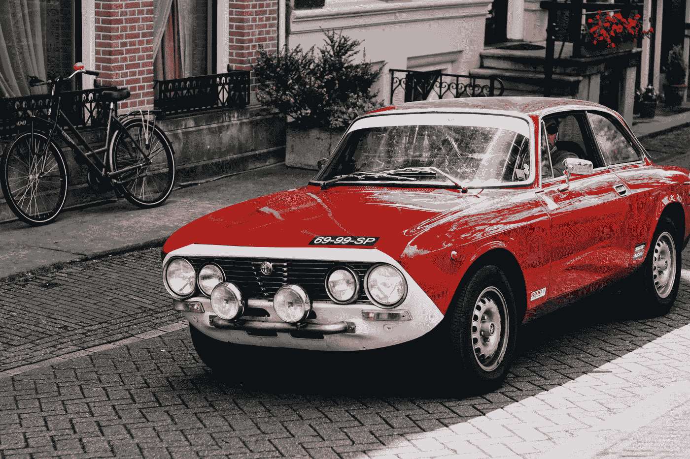

# 无人驾驶汽车，错误的方向

> 原文：<https://medium.datadriveninvestor.com/driverless-cars-wrong-direction-7c2b43c224d5?source=collection_archive---------26----------------------->

Photo by [Severin](https://unsplash.com/@sdmk?utm_source=medium&utm_medium=referral) on [Unsplash](https://unsplash.com?utm_source=medium&utm_medium=referral)

根据不同的估计——这些统计数据没有定期报告——全球每年投入 300 亿美元左右，用于帮助无人驾驶汽车。无人驾驶汽车市场由汽车制造商、风险投资公司和数百家初创公司推动。对我来说，这可能是现代创新史上最大的集体失败。是的，很糟糕。

这里有一个预测。你的孩子仍然会开车。这是另一个预测。你的孙子也会开车。自动驾驶技术肯定会有助于更好地驾驶和减少事故数量，但驾驶带来的问题太多了，人工智能至少需要一两代人才能解决这些问题，或者真正重要的问题。这还不包括全球规模、驾驶员教育、道路基础设施、公众舆论和法规遵从性等挑战。

但这不是坏消息。

与此同时，道路上大约有 10 亿辆汽车，而且数量还在快速增长。汽车制造商每年向市场投放 7000 多万辆新车，而且这个数字还在稳步增长。仅中国国内消费一项[就增长到每年 2500 万辆](https://www.statista.com/statistics/257660/passenger-car-sales-in-selected-countries/)，在不到十年的时间里翻了一番。

预计到 2020 年，T4 的汽车销量将突破每年 1 亿辆大关。到 2040 年，在用汽车数量将翻一番[突破 20 亿辆大关。我们肯定会陷入全球停滞，至少在大都市地区是如此。](https://www.weforum.org/agenda/2016/04/the-number-of-cars-worldwide-is-set-to-double-by-2040)

这是个可怕的消息。

汽车给我们的星球带来了两个无处可去的问题。密度和气体排放。这些问题不会由自动驾驶的汽车来解决。简单的逻辑会指出另外两个方向是最有效和最迫切需要的:替代(和干净！)能源开发和让汽车不再上路，而不是专注于让汽车更容易驾驶。

然而，出于一些无法解释的原因，许多聪明人认为让汽车无人驾驶实际上会减少周围行驶的汽车数量。事实上，这种思路已经变得如此主导，传统公司如毕马威会计师事务所实际上预测到 2030 年汽车销量将下降超过 50%。

没错。让汽车更容易驾驶，让汽车能够在我们工作或购物时找到自己的停车位或在街区周围盘旋，让汽车在酒精的影响下仍然可以使用，让你不需要驾驶执照就可以驾驶，这些汽车的出现实际上**会减少路上的汽车数量。**

是的，这听起来很傻。

如今，每 7 个人中就有一个人拥有汽车。巨大的增长潜力。让我们先检查一下另外 6 个。

30%的世界人口在 18 岁以下。无人驾驶汽车将赋予他们驾驶的能力。15%的世界人口超过 65 岁，其中一些人已经放弃拥有汽车。有了无人驾驶汽车，他们将在自己的车里安全快乐。日益增加的密度意味着人们将在拥堵的道路上花费数小时，但现在他们可以将目光从道路上转移到手机上。由于不断提高的操纵能力，汽车在事故中会更加安全。是的，对他们来说，拥有一辆买得起的小型车更有意义。

但如果你问硅谷的投资者，他们中的许多人都相信自动驾驶会减少汽车数量。

从简单的逻辑来看，这个结论是如此荒谬，这其中一定隐藏着某种智慧。

确实有一个。只不过这不是真正的智慧，而是一种幻想。显然，路上的汽车数量将会减少，因为**今天的孩子们不再关心拥有一辆汽车。**

或者至少成年人是这么说的。我自己的孩子？他们迫不及待地想要开车，并且已经开始幻想他们的第一辆车。换个思路？试着让他们分享他们的手机。

事情是这样的。孩子们长大后仍然想拥有自己的汽车，就像人们一直做的那样。车辆会更便宜，更实惠。年纪大的肯定会选择拥有自己的车，不去合租。随着自动驾驶解决了现代驾驶的两个主要头痛问题:寻找停车位和交通堵塞，即使像我这样的汽车爱好者也会在放弃自己的汽车之前三思而行，因为他们完全依赖云计算机来决定何时去接孩子参加足球训练。

是的，无人驾驶汽车将对道路上的汽车数量产生巨大影响。**会增加它**。幸运的是，我们离这成为现实太远了。

拥堵和化石燃料这两个最大的问题仍然存在，需要迫切关注，尤其是第二个问题。

如果汽车销量以每年 2%的速度增长，替代能源将需要以每年 10%的速度增长，才能在 2050 年左右赶上。如果汽车销量继续以每年 4%的速度增长，如果替代能源以每年 5%的速度取代化石燃料，这比今天的速度更快，我们将看到一个或两个世纪的时间跨度达到一个可能的临界点。到那时，路上的汽车数量将会增加三倍或四倍。到那时，我们的星球预计将平均变暖 2-3 度。这绝对是一场灾难。

是时候让我们重新关注真正重要的事情了。不在于谁开车，而在于如何开发替代方案，让根本不需要汽车变得容易得多。当我们确实需要一个时，我们如何确保它能够起飞并消耗能量，而不会杀死我们的星球和未来。在目前的情况下，我们的白日梦会让我们的汽车陷入困境，让我们的星球陷入困境。

有趣的阅读:

[https://singularityhub . com/2018/02/14/why-the-rise-of-self-driving-vehicles-actually-increase-increase-car-ownership/# sm . 0000 p 014 xvga 5 dhe QJ 915 phw 51 jye](https://singularityhub.com/2018/02/14/why-the-rise-of-self-driving-vehicles-will-actually-increase-car-ownership/#sm.0000p014xvga5dheqj915phw51jye)

[https://blog . car vana . com/2017/06/自动驾驶汽车——什么时候会变得司空见惯/](https://blog.carvana.com/2017/06/self-driving-cars-when-will-this-become-commonplace/)

 [## 当可再生能源取代化石燃料

### 我们所能做的最好的事情就是明确我们的假设，描绘出它们的后果，并询问它们是否可行。

worldview.stratfor.com](https://worldview.stratfor.com/article/when-renewables-replace-fossil-fuels) 