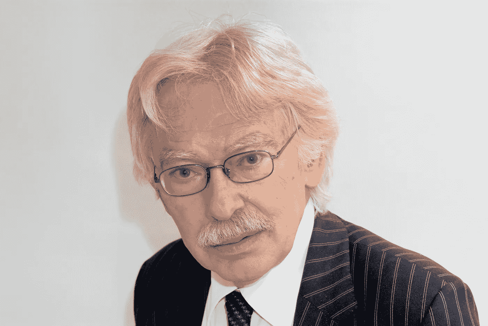

# 将精神赶出人文学科

> 原文：<https://medium.datadriveninvestor.com/driving-the-spirit-out-of-the-humanities-ff93c3c3b762?source=collection_archive---------7----------------------->

## 计算机、大脑和凯特勒

> 近年来，我开始认为自己只是一个对事物的真实性非常感兴趣的哲学家，而不是一个反思的哲学家。(基特勒在阿米蒂奇，2006 年，第 17-38 页)

已故的弗里德里希·基特勒(1943-2011)引用了一句有趣的话，他是一位有影响力的德国媒体研究学者。他的重要工作围绕“话语网络”的概念，这是他使用的德语术语的一个相当糟糕的翻译，即“Aufschreibesysteme”，更好地翻译为“符号系统”，即我们记录数据的方式，无论是蜡和泥板、纸莎草卷轴、手稿(抄本)、印刷书籍、唱片、电影还是数字文件。换句话说，我们在使用技术时如何交流。

Friedrich Kittler (Source: [Alamy](https://www.alamy.com))

除了纯粹的技术方面，基特勒将话语网络定义为*“允许给定文化选择、存储和处理相关数据的技术和机构的网络”* (Winthrop-Young，2011)。所以“话语网络”这个术语也包含了这些方面，所以这个英文翻译还不错。

在他的重要作品中，他细致地描述了这些系统背后的技术及其文化影响。我们学习代码、语言代码、莫尔斯电码、二进制代码、调幅和调频、信息传递的香农-韦弗模型，然而对基特勒来说够奇怪的是，水桶停在生物感觉器官的前门。

从光的模式通过眼睛进入大脑，声音振动通过耳朵，或者触摸(压力)，味觉和嗅觉(化学信息)到达大脑的那一刻起，关于所有这些兴奋发生了什么的辩论对基特勒来说就结束了，被归入一个称为意识，精神或灵魂的黑匣子。然而，这恰恰是大脑的模拟和并行处理能力，随后是一系列行动，这是生物信息处理能力中最重要、最令人兴奋的部分。即使这种描述也过于简单，因为正如 Spivey (2007)所说，

> 行动随着时间的推移而发生，它们不断地改变刺激环境，刺激环境又不断地改变心理活动，心理活动不断地表达和修正其行动倾向。

因此，这是一个连续的循环，数据输入不断地修改输出动作，而输出动作又反过来改变接收数据的内容和方式以及处理数据的方式，从而改变输出。

回到基特勒的题词，他宣称他对事物的真实性感兴趣，而不是像哲学家那样(只)反思。我们明白他的意思。但是，哲学家对表象的任何反思不也是现实吗？嵌入在神经递质的汤中，在不同的回路中不断交换信息的数十亿兴奋的神经元，即大脑的“芯片”是什么？通过锥体神经元系统触发肌肉系统的动作，使我们天赋异禀的哲学家翻页、接电话、做笔记、拍拍狗、编码和重新编码从书中收集的意思？我们的哲学家和他的思想就像基特勒的晶体管或基于芯片的代码、恩尼格玛机或他最喜欢的 V2 火箭一样真实。

闪耀的是臭名昭著的德国、脱离实体的黑格尔精神，在这种精神中，头脑中发生的事情与大脑无关，只能通过天主教的忏悔或后来的弗洛伊德或拉康精神分析来理解。基特勒偶尔会对上面潮湿的地方发生的事情嗤之以鼻。例如，在温伯格的采访(2012)中，他说，“当人文学科的人大肆渲染一些神经生理学发现时，我总是对美国的这种做法感到震惊，这种做法风靡了半年。”或者再往下他说，*“把正在进行的使用人脑的尝试作为构建世界的出发点。对我来说，那是胡说八道。我相信人类的大脑只存在于语言之中。”*

他是在降低大脑对语言的功能吗？

今天，我们对这些机制有了更多的了解。“大脑”这个词本身就有局限性。大脑只是复杂神经系统的一部分，该系统具有分布在人体各处的多个节点，组织在可定义的子网络中，由内分泌系统支持，调节其活动。语言只是中枢神经系统输出的极小一部分。幸运的是，人脑中的大部分信息处理都是无意识发生的。否则，一个钢琴演奏者将很难在正确的时间“有意识地”按下正确的键。

因此，尽管基特勒没有回避涉足计算机代码以更好地理解数字技术，但他未能对“湿”计算装置、我们的大脑和中枢神经系统做同样的事情。

我认为，尽管他试图将这种精神赶出人文学科(Weinberger，2012)，但他没有那么成功。然而，它并没有通过指出一些关键问题来削弱基特勒的作用和重要性。

在媒体文化中呈现的技术/生物和传播方面之间的差距仍然需要探索。认知科学和神经科学、传播研究、媒体生态学、进化心理学、复杂系统理论、控制论、批判理论、语言学和符号学，当然还有哲学本身的最新见解表明，尽管存在各种复杂性和分歧，但传播和意识的统一理论是可能的，至少在特定的文化和神经科学界限内是可能的。

参考

阿米蒂奇，J. (2006 年)。从话语网络到文化数学:弗里德里希. a .基特勒访谈。理论、文化与社会 23(7–8):17–38。从[http://tcs.sagepub.com/content/23/7-8/17](http://tcs.sagepub.com/content/23/7-8/17)取回

m . spivey(2007 年)。思想的连续性。纽约:牛津大学出版社。

温伯格(2012 年)。结构的冷模型:弗里德里希& # 183；基特勒与克里斯托弗& # 183；温伯格的访谈。文化政治，8，3–375-384。DOI:10.1215/17432197–1722109

温思罗普-杨(2011 年)。基特勒和媒体。英国剑桥:政治出版社。