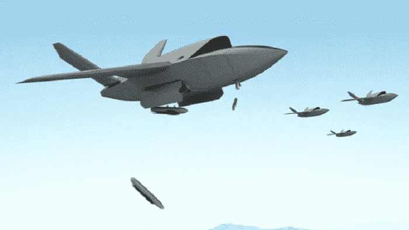

# 多亏了克瑞托斯国防和安全解决方案公司，无人机技术很快进入了军事领域。

> 原文：<https://medium.datadriveninvestor.com/drone-technology-goes-military-soon-thanks-to-kratos-defense-and-security-solutions-inc-6e01195421f?source=collection_archive---------19----------------------->

# 多亏了克瑞托斯国防和安全解决方案公司，无人机技术很快进入了军事领域。

从《壮志凌云》开始，我们已经走过了漫长的道路。

话虽如此，请记住续集确实即将上映——而且它恰好是关于[当今广泛行业出现的最新无人机技术](https://vigyaa.com/@pierre/7-reasons-why-drone-technology-trends-today-0f274e4b/)!由于最近的这条新闻，我们现在可以把军队放在那个名单上。

# 公平地说，无人机技术对军方来说并不陌生

美国空军多年来一直使用无人机技术。然而，这个特殊的项目是前所未有的，以 200-300 万美元的资金作为无人驾驶的“忠诚僚机”战斗机*与传统的海军飞行员如 Maverick 和 Iceman 一起使用*。

有意思……我认为这是飞越的原因。

准确地说，克瑞托斯国防和安全解决方案公司不一定仅仅是为美国军方服务，因为该公司是严格意义上的私有企业，但是军方肯定是他们最大的客户。该公司开发的是一款名为*瓦尔基里*的无人机，预计将于明年首飞。鉴于技术的飞跃，这种无人机一旦准备好部署和购买，成本将高达 800 万美元甚至 1000 万美元，鉴于它的航程比波音公司计划的 2000 万海里更长，它非常值得这笔钱。

> [DDI 编辑推荐— UAS(无人机)远程飞行员考试第 107 部分考试准备](http://go.datadriveninvestor.com/droneoperation/matf)

但是要明白:目的不是为了更多的火力，而是更多的射程。这完全是关于能力和可负担性，虽然成本可能仍然很高，但与 F-15 战斗机的费用相比，这是微不足道的。

# 那么我们还能从无人机技术中期待什么呢？很多。

鉴于我们现在将看到这些婴儿与我们的飞行员一起飞行，我会说天空是*字面上的*极限——[除非美国宇航局开发某些无人机进入轨道](https://vigyaa.com/@pierre/dynamic-drone-soars-to-new-world-record-and-unprecedented-technol-284a6cc0/)。你有什么关于技术的新闻，特别是*无人机技术*，你想提一下吗？ [**注册一个 VIGYAA 账号，开始写作吧！**](https://vigyaa.com/accounts/login/)

*最初发表于*[*【vigyaa.com】*](https://vigyaa.com/@pierre/drone-technology-goes-military-soon-thanks-to-kratos-defense-and-c3b0e184/)*。*