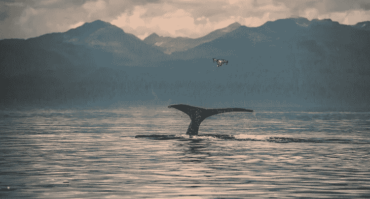
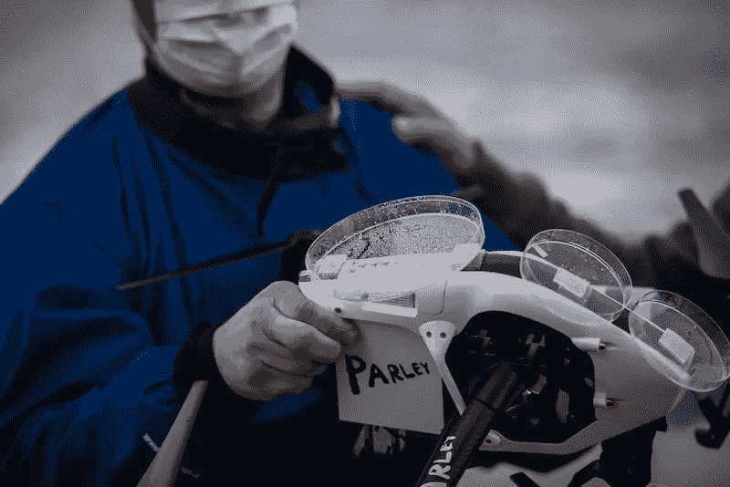
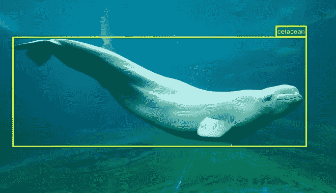

# 无人机和人工智能:它们正在对未来的可持续性产生真正的影响

> 原文：<https://medium.datadriveninvestor.com/drones-and-artificial-intelligence-they-are-making-a-real-impact-on-future-sustainability-1c4062db9710?source=collection_archive---------9----------------------->

受 Vault Analytics 的播客 Data Crunch 的一集的启发，主题是:**“无人机和人工智能”**，我想到了无人机现在是如何被使用的，不仅作为一种爱好，也用于商业目的。无人机在社区和不同行业如电影和摄影中越来越受欢迎。《权力的游戏》电视剧花大价钱拍出惊艳镜头！相比传统相机，你可以使用无人机拍摄更多有趣的照片。想象一下无人机独特的视角，它们绝对能拍出令人印象深刻和难以置信的照片。

但是，当你结合使用无人机和人工智能的优势时，会发生什么？

无人机正在整合一种名为计算机视觉的新技术，用于物体检测和分类，从而实现更有意义的用途。一些例子是:

*   农业
*   建筑
*   检查石油和天然气资产
*   监督
*   寻人搜救
*   监控野生动物

由于无人机的能力越来越强，无人机的使用案例甚至更多。这超出了我们的想象，他们可以收集的不同类型的数据的优势是巨大的，但肯定的是，引起我注意的是科学家如何使用无人机监测野生生物。

根据**“海洋联盟:通过研究和教育保护鲸鱼和我们的海洋”**官方网站，海洋联盟一直在探索研究和了解鲸鱼生活的非侵入性方法，不伤害或干扰它们。海洋联盟的最新创新是用于鲸鱼研究项目的*无人机，该项目使用名为 SnotBots 的无人机观察鲸鱼并收集有关它们的数据，而无需让研究人员或船只靠近动物。*

用无人机和人工智能进行科学研究是科学世界的巨大进步。无人机可以在具有挑战性的条件下在困难的环境中收集数据，并更容易在广阔的海洋中跟踪和识别鲸鱼。科学家们正在将培养皿和海绵附着在无人机上，以收集当它们到达表面时通过鲸鱼的喷水孔发出的鲸鱼吹气，以评估其中包含的生物数据，最终目的是评估它们的健康程度。这张照片包含了关于鲸鱼的重要数据:

-DNA，它揭示了动物的性别，并为我们提供了动物的个体生物指纹。

微生物组，有助于抵抗疾病、消化食物和合成维生素；更多地了解鲸鱼的微生物群有助于我们更好地了解这个物种

妊娠激素，对了解生殖周期和动物健康很有价值

-压力荷尔蒙，鼻涕虫可以在不增加动物压力水平的情况下收集这些荷尔蒙(被船追逐会增加压力)

-酮，与新陈代谢有关，可以给我们提供能量学和健康方面的信息。

这些“飞行机器人”正在改善我们做不同工作的方式，我坚信在 5 年后，无人机将能够收集这些重要的数据并实时解决问题。

对于那些想知道无人机如何识别鲸鱼的人，一些无人机使用 YOLO(你只看一次)，这是一种最先进的实时物体检测系统。互联网上有很多资源可以学习如何使用 YOLO 进行物体检测。如果你想进入深度学习的世界，这就是你的功课！

你可以在这里找到更多关于海洋联盟 SnotBot 项目的信息:[https://www.whale.org/](https://www.whale.org/)

