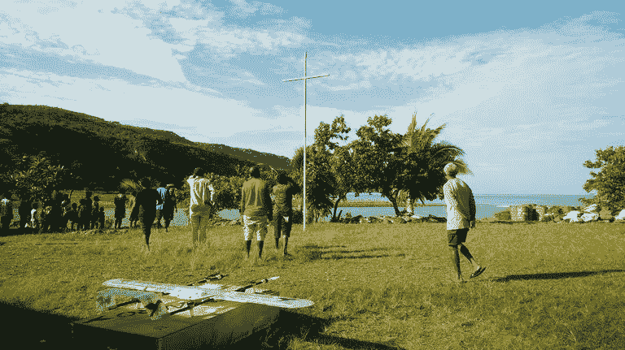
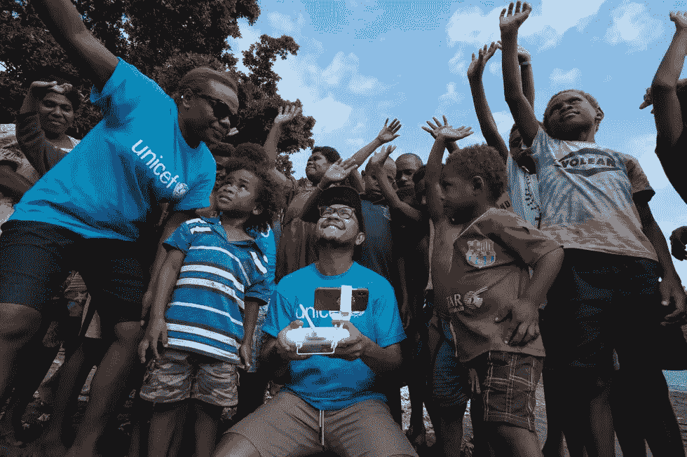

# 无人机比其他任何人都更有助于健康，这就是证据

> 原文：<https://medium.datadriveninvestor.com/drones-do-health-aid-better-than-anybody-else-and-heres-the-proof-888ded7f1014?source=collection_archive---------29----------------------->

小心点。这篇文章可能会让你流泪。

你很容易不会想到一些关于技术的微不足道的小文章——尤其是**无人机**技术——会以这种方式触动你的心。但这就是技术创新的概念。这不仅仅是一些很酷的东西；这都是为了帮助人类。所以继续读下去:一定要准备好你的面巾纸。

我们也没有粉饰太平。事实上，如果没有一架无人驾驶飞机——像一架小直升机一样飞来飞去的机器——乔伊很可能已经病入膏肓，无情地死去。你看，还是在这个时代，疾病是生死攸关的因素。如果不能处理，你就死了。

喜悦就在那一刻。要么全有，要么全无。令人难过的事实是，许多人认为，鉴于她居住在偏远的南太平洋岛国瓦努阿图，这一切都将是徒劳的——离医院或紧急护理中心并不是一步之遥。

但是多亏了无人驾驶飞机技术，乔伊·诺威现在是 T2 第一个用一种有价值的疫苗进行免疫接种的人。通过一家名为**swob Aero**的澳大利亚公司，这个孩子被无人机运输公司接收，在联合国儿童基金会支持资金为无人机提供包裹的努力下，这个孩子设法活了下来。

这还没完——乔伊并不是唯一的一个。在她之后，另外 13 名儿童和 5 名妇女也成功地接受了一名注册护士的疫苗治疗，他们确实得到了保护。如果不是因为能够简单地驾驶无人机携带所需的药物，他们可能需要几天甚至几周才能看到他们需要的治疗。

你会惊讶地发现，小小的*无人驾驶飞机可以飞行惊人的 31 英里到达目的地，仅仅是为了拯救一些生命。考虑到岛上的温度，这也是巨大的，无人机配备了装有冰袋的聚苯乙烯泡沫盒。这里的关键是安全。安全。和迅捷。这都要归功于技术创新。正如我们所说的，瓦努阿图非常热衷于将无人机技术纳入其国家免疫计划。如果你对此没有一点眼泪，你最好相信快乐是，只是有大量的，嗯，快乐。*

准备好欢呼科技创新的胜利了吗？只需注册你自己的免费 VIGYAA 账户，然后开始写作。

*原载于***。**