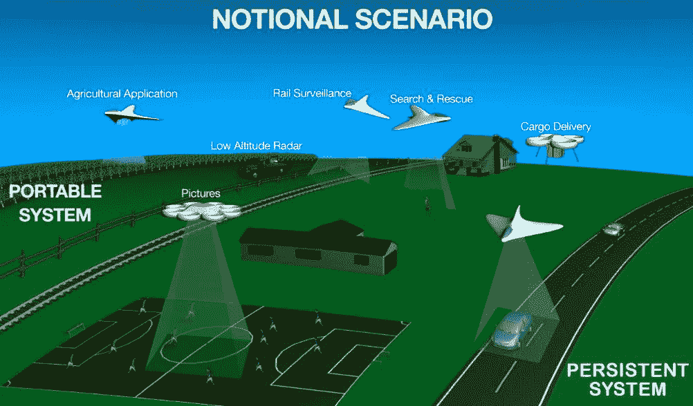
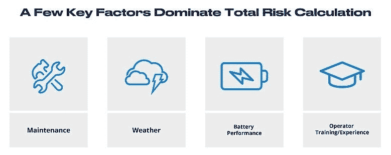
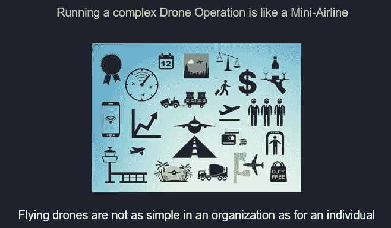
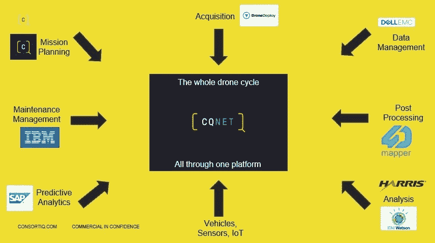

# 无人机:高飞还是无处可飞

> 原文：<https://medium.datadriveninvestor.com/drones-flying-high-or-flying-nowhere-cd0bcc6d757?source=collection_archive---------28----------------------->

Jumping in to give the appearance of “doing something”​ is rarely the wise move

# 在进入下一个大的技术事物之前要考虑的关键领域

就像之前的互联网和 GPS 一样，无人机正在超越其军事起源，成为强大的商业工具。他们已经跃进了消费市场，现在他们正被投入到从消防到农业的商业和民用政府应用中。

然而，当你今天早上通勤去工作或过日常生活时，你看到了多少无人机？我们中的大多数人可能根本没有看到过，这与像 1270 亿美元的[普华永道](https://press.pwc.com/News-releases/global-market-for-commercial-applications-of-drone-technology-valued-at-over--127-bn/s/ac04349e-c40d-4767-9f92-a4d219860cd2)和无人机在天空装满[包裹](https://www.amazon.com/Amazon-Prime-Air/b?ie=UTF8&node=8037720011)递送这样的自我延续的未来主义预测相比，似乎彼此严重不一致

这些预测中的大多数都在很大程度上取决于商界对监管机构的持续压力，以使无人机得到广泛使用。

然而，与大多数新兴行业不同，这些行业通常有空间发展成为新的和未充分利用的市场领域，无人机直接融入了以安全为基础的航空文化，拥有 100 多年的发展历史，每年运送 40 亿乘客。

空客[自己](https://www.utmblueprint.com/risk/what-are-the-biggest-factors-that-contribute-to-risk)承认任何市场进入者都需要解决的关键问题，以最小化完成任何无人机操作的风险。

就连主要的商用无人机供应商 DJI 最近也出现了[电池问题](https://dronelife.com/2018/11/01/dji-battery-warnings-matrice-200-inspire-2/)，这是一个初步发展的迹象，导致航空当局发出安全指令，这本身就引发了无人机社区自己对这种下意识反应的抱怨。

这本身就反映了无人机行业的现状。我们希望使用无人机的组织(其中大多数没有航空背景)承担文件/安全案例/缓解措施的准备工作，即使在航空业内，这些工作通常也只留给非常专业的人员。

# 你从哪里以及如何开始？

大多数公司都在关注无人机，一些公司已经参与其中，而其他公司正在研究如何实现这一目标，无论是外包还是内部解决方案。

做出所有这些正确的决定需要时间，也不可能一蹴而就。简单、便宜、现成的选项提供了所有答案，这种看法表明，寻找廉价市场途径的公司缺乏洞察力。在我与许多希望从无人机开始的组织打交道的 4 年中，在初始投资较低或认为参加无人机课程将为他们的问题提供所有答案后，这些组织停滞不前，这表明需要一种不同的方法来推进。

这概括在我的战略叙述的第一部分——为什么一个人*应该*费心与一个专家打交道(见上文)

虽然一些先驱早期采用者已经实现了安全案例，以实现商业成功和超越常规的操作，但如果外部组织要使无人机在自己的业务中取得成功，就需要利用常规的一点。

# 无人机哪里有好的商业意义？

# 是数据，笨蛋…

鉴于上述所有挑战，显然需要将任何无人机参与战略商业化。但是作为一个组织，你现在就开始这个过程吗，在未来？你如何开始有效地管理这样一个过程？监管机构以及完全自主、数据和在没有人类操作员的情况下进行操作的整个方面都存在问题。

通过监管创造一条简化的路径将有助于打开更多低复杂性用例，并增加其数量。这种增长将推动基础设施发展的增长，以支持更复杂的无人机行动。但还是那句话，什么时候是介入的合适时机，是在塑造未来格局的时候(苹果)，还是一旦合适的条件已经具备，就介入一条已经走过的路(三星)？

我的战略叙述的第二部分讨论了无人机的一些技术优势，让你思考整个领域以及如何利用它。

# 无人机和移动性的未来路线图…

我今年早些时候参观的一家企业对无人机没什么兴趣，直到它的成本和安全水平达到可以广泛使用的水平，没有任何飞行员的参与，可以在远距离自主飞行。无人机技术的广泛常规采用将需要增加可用部署的数量以及可以常规部署无人机的环境，然后无人机才被认为是最近大多数人和上述企业开始参与的常规工具。

当我们看到将乘客放入无人机的挑战性时，这比其他任何地方都更不言而喻。像 [Ehang](http://www.ehang.com/ehang184/specs/) 这样在距离飞行员头部不到 1 米的地方有 8 个高速旋转的叶片，是一种不可思议的安全方法，其目的是比其他任何事情都更能引起头条新闻。

一些企业家，其中许多人没有航空经验，现在正带着为内城区设计飞行吊舱的宏伟愿景进入城市空中交通领域——然而，自 1927 年的科幻电影《大都会》以来，这一想法并没有更接近实现。

事实上，专门研究可持续交通和城市规划的康涅狄格大学工程学教授诺曼·加里克表示，未来交通领域的进步很可能更多地依赖于使用现有车辆的新方式，而不是全新的新型车辆，例如汽车和自行车共享计划以及现在的电动滑板车共享。

同时，它也不是特别雄心勃勃。

打个比喻来说，要真正把船推出去，一个实现长期变革的解决方案需要整合长距离运输人员的能力，而不需要多模式方法。空中客车公司为城市社区提供了它的[弹出式](https://newatlas.com/airbus-audi-pop-up-next-drone/53700/)解决方案——但是任何挑战传统载人航空的想法都还需要几十年的时间

在我上面的战略叙述的第三部分，我提出了一种利用电池技术进步的方法，使人们能够想象城市空中交通与远程飞行的融合，以造福每年旅行的[40 亿](https://www.forbes.com/sites/ericrosen/2018/09/08/over-4-billion-passengers-flew-in-2017-setting-new-travel-record/#12f542d1255b)乘客。它只是需要像埃隆·马斯克这样的人参与进来！

# 还有很长的路要走

不久前，我写了一篇关于 21 世纪自动化与经验主义的文章。然而，无人机行业内的大多数人都只关注克服监管机构的技术和手段，而不是关注无人机的整合，以提供丰富的体验，创造和满足市场需求。

该行业仍处于起步阶段，每天都有新的伙伴关系、合作宣布，资金雄厚的玩家正在破产，这种情况需要与任何考虑无人机的企业沟通，他们提出一个问题，只会被告知，“啊，实际上我们正在努力，但还没有完全实现……”无人机行业有很多风格，但几乎没有实际内容；每个进入者都想拥有自己的份额，设计新的主题、课程、标准，而没有统一推动整个市场前进的情境意识。

能够在非常泥泞的水域中航行，并节省时间、金钱和精力来搞清楚这一切是一种习得的技能，而不仅仅是现有的非无人机公司将自己重新命名为无人机专家或开设无人机部门。

在大客户关注的硬合作项目中，无人机飞行员不一定是无人机专家。

在深入研究无人机的方方面面之前，引用我最喜欢的一部电影中的一句话作为总结，“明智地选择，因为虽然真圣杯会带给你生命，但假圣杯会夺走你的生命。”