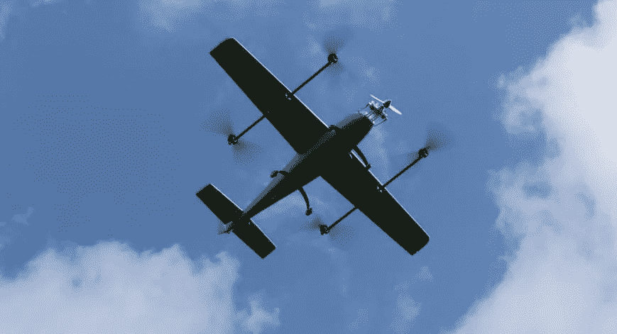

# 埃塞俄比亚制造的无人机运送医疗用品

> 原文：<https://medium.datadriveninvestor.com/drones-made-in-ethiopia-to-deliver-medical-supplies-bdfefedb205d?source=collection_archive---------16----------------------->

进口的携带相机的无人驾驶飞机在埃塞俄比亚很常见，它们被用于各种活动。但是现在埃塞俄比亚人正在设计和制造他们自己的无人机。

去年，我的祖父在参加一个东正教宗教活动时，看到天空中有一个移动的物体。他感到奇怪，以为是某个外国物体在进行情报活动。后来，我告诉他，这只是一架拍摄无人机对地面有人管理的活动进行航拍。

像我祖父看到的那种无人驾驶飞机现在已经很常见了。它们被用于在首都亚的斯亚贝巴和地区城市拍摄音乐会、纪录片、婚礼、电视节目和足球比赛。

此外，投资者也被吸引到埃塞俄比亚投资无人机开发。今年 4 月，肯尼亚公司 Astra Aviation 宣布将与当地一家公司合作成立一家无人机技术公司，提供无人机货物运输服务和无人机技术培训学院。

Astra 最初将拥有三架不同尺寸的货运无人机，用于运输邮件、包裹和提供农业喷洒服务。该公司将在今年年底推出这项服务。

**埃塞俄比亚制造的无人机**

埃塞俄比亚的技术场景正在经历一个时刻，使用本地开发的无人机的倡议就是其中之一。例如，icog-labs(一家以人工智能研究和产品开发闻名的公司)的年轻大学生正在努力制造可以在空中踢足球的无人机。他们的目标是组织一场无人机足球比赛。他们以前组织过机器人足球杯。

然而，主要的推动力来自卫生部，该机构由非洲最年轻的部长之一(他只有 33 岁)领导。阿米尔·阿曼博士是去年 3 月总理阿比·艾哈迈德掌权时就职的新改革派内阁的一员。

今年 8 月，该部宣布计划使用无人机(无人机)向埃塞俄比亚偏远地区运送医疗设备和物资。这将有助于向交通不便且费用昂贵的地区分发药品和血液。

为了实现这一目标，该部正在开展两个单独的项目。一个是埃塞俄比亚科技部，另一个是总部位于加州的无人机初创公司 Zipline，该公司已经在卢旺达做了类似的项目。

与科技部的协议是使用五公斤运载能力的无人机，而 Zipline 使用的无人机最多可以运载两公斤。

因此，中国科技部上周成功发射了首架无人机，运载了 5 公斤重的货物，在 5000 米的高空飞行。几天后，他们还成功测试了 5.6 公里范围的水平飞行。水平飞行是一个具有相同起点和终点的环形路径。下一次测试预计是从 A 点到 b 点的远程 GPS 制导自主飞行。

这些无人机的飞行速度可达每小时 120 公里，该部表示，他们准备在未来 6 个月内再生产 23 架无人机。

该部通过从大学和学校招募不同的人才创建了一个研究和技术项目，并为此项目召集了 100 名创新者。这个团队完成了无人机的全部设计和组装。一些零件和发动机是从中国和美国进口的。

根据与卫生部的协议，一旦试点项目被认为在今年年底完全成功，科技部预计将签署一份合同。

之后，卫生部计划从 2018 年 1 月开始使用 24 架无人机运送医疗用品。亚的斯亚贝巴、Meqele、Hawasa、Jima、Dire Dewa 和 Bahir Dar 六个城市将成为调度中心，无人机将在每个调度中心半径 150 公里的区域内运行。

> “由于即使是卫生中心用电也很少，在合适的环境中储存疫苗是不可持续的。无人机将被用于将疫苗从适当的储存区域运输到偏远的卫生中心，”阿米尔·阿曼博士对当地报纸说。

下周这项服务正式推出时，埃塞俄比亚将加入卢旺达、坦桑尼亚和马里等非洲国家的行列，使用无人机技术运送医疗货物，但它将是第一个使用本国设计和制造的无人机的国家。

## 如果你喜欢这篇文章，就把它拍下来。反馈总是很受欢迎。别忘了你最多可以鼓掌 50 次！❤