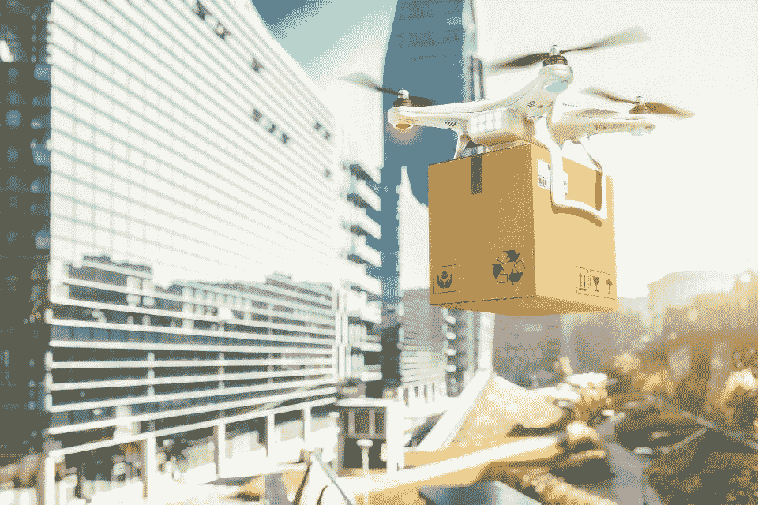

# 无人机需要可靠的飞行数据来保证天空安全

> 原文：<https://medium.datadriveninvestor.com/drones-need-reliable-flight-data-to-keep-skies-safe-5b6c4d515380?source=collection_archive---------13----------------------->

Delivery drones like these could soon be a common sight in our skies, but there is work to do by both companies and regulators to bring drones up to aviation standards. FREEPIK

现在，商业无人机的使用已经不仅仅是无害的玩具，对于用户和监管者来说都是一个紧迫的问题。送货无人机将很快在一些地方占据很大比例的空域:最近，美国联邦航空局(FAA)批准*和 [*亚马逊*](https://www.forbes.com/sites/jilliandonfro/2019/06/05/amazon-new-delivery-drone-remars-warehouse-robots-alexa-prediction/) 作为航空公司运营，并在美国用无人机运送产品*

*除了送货以外，许多公司现在还将无人机用于他们的工作——摄影、基础设施维护、农业——并且没有标准框架来为这些全新的设备提供保险，这导致报价非常昂贵，无人机在没有掩护的情况下飞行。*

* [## 我们为军事人工智能做好准备了吗？数据驱动的投资者

### 今天，算法可能会以迷人的形状出现，例如索菲亚，一个态度可爱、开明的机器人…

www.datadriveninvestor.com](https://www.datadriveninvestor.com/2019/02/21/are-we-ready-for-military-ai/) 

> 无人机使用的增加，以及可用于建立保险单和确保安全操作的有限飞行数据量，要求对无人机的飞行方式有更深入的了解。

反过来，使用可靠的数据和人工智能可以使无人机更安全，更负责任，这样它们就可以在其他飞机中得到信任，不再在监管雷达下飞行。

# **盲打**

无人机公司和监管机构似乎在填补彼此知识和能力的差距，以达成适合所有人的解决方案。

[DJI](https://www.dji.com/uk) ，无人机的市场领导者，拥有约 [*75%的市场份额*](http://thedronegirl.com/2018/09/18/dji-market-share/) ，已经选择 [*从 2020 年*](https://www.dpreview.com/news/2220169282/dji-airsense-will-add-aircraft-detection-to-dji-drones-next-year) 开始在其所有无人机中安装接收器，以显著提高无人机和飞行中其他飞机之间的能见度和通信。

监管机构也对制造商和企业运营商做出了让步，向他们发放了试用许可证，就像向亚马逊和谷歌提供的许可证一样，允许他们进行初步使用，以确定无人机群到底有多安全。去年在伦敦盖特威克机场 发生的类似事件，一架无人机多次飞入机场领空，扰乱了 14 万次航班，证明了为什么适当的监管和负责任的发展不能来得足够快。

无人机与飞机类似，如果没有适当的监督，可能会很危险-“它们基本上是飞行的链锯”， [*红猫*](https://www.redcatpropware.com/) 的创始人兼首席执行官杰夫·汤普森说——所以现在无人机制造商和运营商有责任证明**大规模使用无人机不会在空中和地面造成重大风险**。

> 然而，为了让无人机变得更加安全，我们需要知道它们如何飞行，最常见的问题是什么，以及无人机飞行员对他们的飞机负责。

如今越来越多的情况是，数据可以解决这些问题中的大部分，但目前还没有产生信息。

Red Cat 是几家试图提高无人机数字可见性的公司之一，并确定和标记了可能使无人机不安全的常见特征和问题。“我们在日志文件中识别事件，然后使用人工智能将这些事件与起飞、着陆和偏航等飞行特征进行匹配。从那里，人工智能使用这些信息来识别无人机行业的真正问题，如振荡，”汤普森说。

收集无人机的飞行数据并将这些数据与现实世界的问题联系起来，将有助于设计足够可靠和安全的无人机进行商业飞行，但大规模收集和分析这些信息很难。

这种缺乏可见性使得为无人机投保变得困难，保险公司根本没有框架来为无人机提供保险或足够可靠的数据来帮助他们解决这个问题。

汤普森说:“每个人都在试图找出最好的方法，保险公司洗耳恭听，并愿意与公司合作，但他们将等待(公司)提供这些数据。”

对于目前在没有适当保险的情况下运营无人机的大量公司来说，证明负责任的所有权和操作实践将是一个福音。无论是使用无人机勘测民用基础设施，拍摄婚礼，甚至是 [*调查保险索赔*](https://www2.deloitte.com/us/en/pages/financial-services/articles/infocus-drone-use-by-insurance-industry-flying-higher-farther.html)**商业用户都需要适当的保险，不会让他们破产**。

“如果突然之间[保险公司]有了所有的数据——你可以证明你已经完成了 1000 次飞行，你没有伤害任何人，你已经采取了所有适当的检查和预防措施——他们可以报出每月 200 美元和 3000 美元的责任，而现在没有这种记录的责任是 300 万美元，”汤普森建议道。

# **区块链黑匣子**

为了改善所有参与者的这种情况，Red Cat 还利用区块链技术来确保数据不被篡改，并且飞行记录足够可靠，以满足现有的航空标准。汤普森在解释他们的技术时说，“它基本上复制了商业航班上黑匣子的许多功能，允许你记录飞行的所有信息”——我惊讶地发现，这已经不是无人机的标准功能了。

这种记录可以避免恶意飞行员自己篡改——目前“无人机飞行回放”是。txt 文件，字面上只是纯文本，所以飞行员可以很容易地改变这些数据，”据汤普森说，“我们希望政府相信我们会保护他们的数据，这样如果无人机从天上掉下来，没有人可以访问这些信息。”

> 拥有无人驾驶飞机飞行路线的不可侵犯的记录，其所有的机动动作和与其他飞机的互动将意味着无人驾驶飞机可以凭借其透明度的保证而飞行，并且其他飞机不会受到干扰 [*，这已经被证明是可能的，如果不是可信的*](https://www.theguardian.com/technology/2018/dec/20/how-dangerous-are-drones-to-aircraft) 。

汤普森表示，这对监管机构来说是一个关键问题，监管机构在无人机安全方面采取了与保险公司相同的方法，有效地“告诉行业:‘给我们更好的技术，我们会给你更多的监管’”。

监管机构似乎正在成熟地处理这个问题，并给予无人机应有的重视。美国联邦航空局发布了一套针对商用无人机运营商 的指导方针，将无人机提升到与其他飞机相同的责任和安全标准水平。其他公司也加入了这场冲锋: [*空客已经与其他国际航空机构合作*](https://www.flightglobal.com/news/articles/airbus-partners-easa-and-caas-to-define-drone-regula-450187/) 试图定义一套商业无人机使用的法规，作为他们最终进军无人驾驶送货无人机的一部分。

监管机构和企业合作定义安全标准或许是新兴技术的最佳结果，他们的努力似乎与无人机使用的增长保持同步。考虑到大型跨国公司已经明确表示他们打算尽快以前所未有的规模开始使用无人机，现在定义真正坚实的监管是完全合适的。

# **调节和增殖**

不可阻挡的进步不会放过任何人，无人驾驶飞机也不例外。头顶上嗡嗡作响的包裹，以最小的干扰拍摄城市电影场景，测量财产，桥梁和公用事业系统，管理城市分配，为工业农业地块施肥，以及核实复杂的保险索赔:如果无人机还没有做到这一点，他们很快就会做到。

令人耳目一新的是，监管机构和公司正在合作，以确保商用无人机顺利、安全地融入我们现有的法律和航空系统。

然而，提高无人机的安全性是一个多方面的问题，它并不像建造更好的无人机、创造[*反无人机弹药*](https://www.theguardian.com/society/2018/dec/18/anti-drone-technology-introduced-english-prisons-skyfence) 或 [*使用老鹰从天空中啄食*](https://www.theguardian.com/commentisfree/2016/feb/08/drone-fighting-eagles) 那么简单。无人机的安全发展需要利用我们可以获得的先进技术，并真诚地承诺确保——无论我们喜欢与否，无人机都将变得无处不在——无人机不会对人类或飞机构成任何风险。

DJI、空客和红猫等公司采取的措施将有助于在危机发生前解决危机，监管机构的下一步行动是利用稳定的无人机飞行数据为所有人制定安全和公平的法规。

**更正:**这篇文章的前一个版本错误地引用了发生在蒂华纳的一起飞机坠毁事件，该事件是由一个有故障的鼻锥引起的，而不是所声称的无人机。它还表示，DJI 正在其无人机中实施转发器，而不是接收器。

***因为八月是你们许多人休息的一个月，我将在九月回来。祝暑假愉快。**** 

**原载于*[*https://www.forbes.com*](https://www.forbes.com/sites/charlestowersclark/2019/07/31/drones-need-reliable-flight-data-to-keep-skies-safe/)*。**