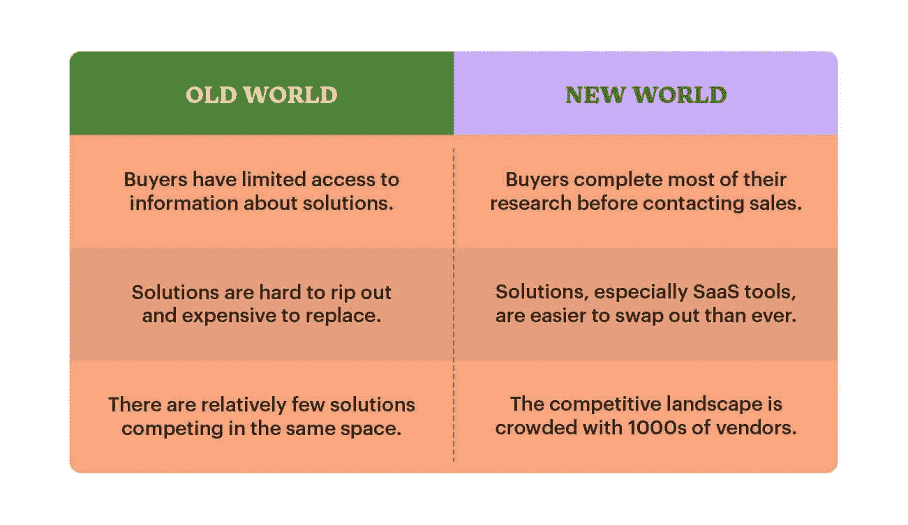
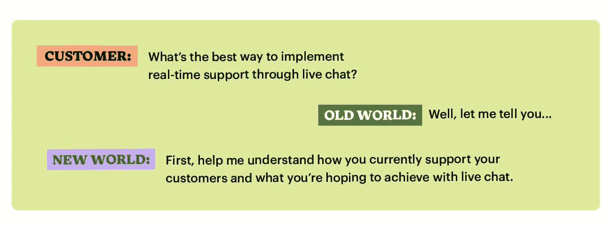

# 放下扑克脸:销售中真实性的重要性

> 原文：<https://medium.datadriveninvestor.com/drop-the-poker-face-the-importance-of-authenticity-in-sales-771ecc65baaa?source=collection_archive---------5----------------------->

Illustration: Hannah Buckman

# 我是个蹩脚的扑克玩家，一直都是。部分原因是我很容易读懂。很长一段时间，我认为我不会虚张声势会妨碍我的销售，但现在我有了不同的看法。

我开始将真实性视为一种销售超能力。透明帮助我与客户建立了更深层次的联系，否则这是不可能的。这让我能够以一种对各方都有利的方式实践销售——解决实际业务问题的采购*和*为公司带来可持续的收入。

 [## 一个企业在肚子上移动:如何照顾直觉|数据驱动的投资者

### 事实证明，直觉不仅仅是一种感觉。科学很清楚:你的直觉比你知道的更多…

www.datadriveninvestor.com](https://www.datadriveninvestor.com/2018/11/09/a-business-moves-on-its-stomach-how-to-make-allowances-for-gut-feelings/) 

在今天的销售环境中，真实性是销售人员可以展示的最重要的美德——即使这意味着比你在扑克游戏中更早地摊牌。

# 旧世界:信息从卖方到买方的单向流动

在过去的买卖关系中，销售人员在很大程度上控制着信息的流动。买家被迫依赖销售人员提供他们做出购买决定所需的细节——从定价到产品规格到[客户证据](https://www.intercom.com/blog/make-customer-enthusiasm-work-for-you/)的一切。

旧的销售世界类似于一个高赌注的牌桌，买家和卖家都戴着墨镜和耳机，以避免泄露秘密。谈判是脱节的，信任度很低，而且这些过程经常导致买方或卖方后悔。

> *“旧的销售世界类似于高赌注的扑克桌”*

如果你在过去的二十年里尝试过购买软件，你可能已经经历过旧的销售世界。作为买家，你可能会收到一条信息，大意如下:

# *“对我们的产品感兴趣吗？请填写此联系表格，销售代表将在接下来的 5 到 10 个工作日内与您联系。”*

这就是现状——人们期望买家交出一份关于他们业务的详细清单，而对一些关键问题却没有任何见解，比如:

*   **该产品对我和我的团队有用吗？**
*   **要花多少时间和精力才能看到价值？**
*   **购买该产品实际会花费我多少钱？**

作为一名专业销售人员，我理解这种信息差异是如何通过增加销售人员在交易中的控制力和杠杆作用而使他们受益的。这和你在扑克游戏中的优势一样，当对手看不到你的牌时，你可以利用这种情况为自己谋利。

> *“虚张声势在扑克中很有趣，但在商业中就没那么有趣了”*

这种单方面的关系一直让我很不舒服。在旧的销售世界里，客户实际上受销售人员的支配，他们会问类似“销售代表告诉我整个故事了吗？”或者“我得到了一笔好交易吗？”无法回答。虚张声势在扑克中很有趣，但在商业中就没那么有趣了。

# 新世界:买卖双方的双向对话

对于像我这样的蹩脚扑克玩家来说，好消息是买卖双方的动态在最近几年发生了巨大的变化。我们已经从购买者和销售者把他们的卡片放在胸前，到双方都把它们放在桌子上。这主要是由于几个因素:

1.  软件购买者的受教育程度比以往任何时候都高。像 [G2](https://www.intercom.com/blog/podcasts/ryan-bonnici-on-selling-to-educated-customers/) 这样的第三方评论网站，像 Gartner 这样的研究公司，以及社交媒体上的讨论，让客户能够直接获得关于产品的数据驱动和轶事信息，使他们能够做出更好的购买决策。
2.  **软件比以往任何时候都更容易更换，尤其是对 SaaS 产品而言。**订阅模式的好处之一是它让供应商对他们提供的服务负责。购买者不会像购买本地解决方案那样受制于长期购买。
3.  软件购买者面临着更多的竞争和更多的选择。近年来，亚马逊网络服务(AWS)等产品和全球工程人才的崛起降低了软件初创公司的准入门槛。这意味着买家有更多的选择，结果是供应商的竞争[加剧](https://www.intercom.com/blog/the-art-of-competitive-selling/)。

买卖双方动态的这三个转变抓住了我认为旧的销售世界和我们今天工作的新世界之间的核心区别:

优秀的销售人员会定期问自己:“我在为我的客户和公司创造价值吗？”在这个全新的销售世界中，我们传递价值的方式发生了巨大的变化。我们不再是买家了解业务问题解决方案以及产品是否适合他们的唯一可靠、便捷的途径。现在，除了产品信息和演示之外，我们还需要提供一些东西来增加我们与竞争对手的区别。

> *“我们需要提供产品信息和演示之外的东西来增加价值”*

根据我的经验，我们必须从真实开始——也就是说，放下扑克脸，露出欢迎的微笑。今天的买家期望坦诚透明的对话，作为销售人员，我们的目标应该是与客户建立互利的合作伙伴关系。作为一名销售人员，变得更加透明一开始可能会不舒服，尤其是如果你被教导要保密，但你从透明和真实中获得的好处是值得这种不舒服的。

# 真实性对销售人员意味着什么

当我第一次开始写这篇文章时，我的妻子玛格丽特问我，“如何让一个人更真实？”她提出了一个很好的观点——你不能走到一屋子的销售代表面前，告诉他们如何更真实地销售。真实性很难衡量，如果不是不可能的话，因为它天生就是主观的。用最高法院大法官波特·斯图尔特的名言来说，“当我看到它的时候，我就知道了。”

> *“用最高法院大法官波特·斯图尔特的名言来说，‘我一看就知道’”*

尽管真实性是主观的，但它是在任何关系中建立信任的关键因素，尤其是在你和你的买家之间。他们对你的信任度的看法决定了他们分享什么信息，他们有多诚实地谈论他们的担忧，以及他们有多愿意为你迈出信任的一大步。如果你正在向一家对你的领域来说是新的公司销售一个变革性的解决方案，那就是购买你的产品的感觉——一个信念的飞跃。

真实销售的最好方法是什么？从承认自己作为销售人员的局限性开始。最近，我和我团队的一名成员与一组经验丰富的客户支持专家进行了交流，他们希望过渡到[实时聊天支持](https://www.intercom.com/blog/live-chat-support/)。在一次会议中，他们的一位高级经理问我关于设置对讲机的建议。虽然我和许多支持团队合作过，也向他们推销过产品，但事实是问这个问题的人比我更有这方面的经验。

我没有立即建议他们团队的理想设置，而是首先承认我的客户是这个主题的领域专家。我要求他们的团队描述他们对客户的承诺以及他们对这个项目的愿景。接下来是一场热烈的讨论，讨论他们希望如何设置对讲机以及实现目标所需的工作流程。通过与他们保持一致，我们能够找到比我假装知道所有答案更好的解决方案。

作为一名销售人员，当你不知道所有答案时，承认这一点可能会感觉违反直觉。毕竟，你花了这么多时间[完善你的推销](https://www.intercom.com/blog/saas-sales-pitch/)来突出你产品的优势。但是当你在个人层面上思考这种动态时，它是有意义的。像其他人一样，买家欣赏真实性——你的自我意识让你变得有人情味和可信。

# 我们如何为销售区带来真实性

在销售上讲一个地道的好谈资很容易。让真实性成为你的销售代表实际销售产品的一部分要困难得多。以下是我们在 Intercom 日常工作中贯彻这一原则的几种方式。

# 拥抱透明的文化，自上而下

如果你想让透明文化在组织的每一个部分都得到体现，那么建立透明文化需要从领导层开始。在 Intercom，[透明是我们如何运营](https://www.intercom.com/blog/keeping-information-flowing-as-you-grow/)的核心。例如，在会议中，人们期望我们会诚实而公开地讨论什么是有效的，什么是无效的，以及我们的策略是什么。没有人是不会犯错的，我们努力从错误中学习，就像我们庆祝胜利一样真诚。

> *“我们努力从错误中吸取教训，就像我们庆祝胜利一样真诚”*

当这种坦诚在整个公司被接受时，它会贯穿到你的客户身上。有了透明的文化，销售代表不再感到有压力来弥补产品差距或隐瞒以前的约定中的失误。承认优势和劣势变得没问题，最终，这有助于每个人，从代表到客户，更快地获得正确的结果。

想象一下这种情况:你正在和一个新的买家合作，而不是小心翼翼地回避困难的问题，你能够提供关于你的解决方案的诚实答案。你回答“我们应该继续合作吗？”这个问题的速度会有多快你能提前取消多少不合适的客户的资格？现在，您的销售代表关注的是正确的客户，他们还会达成多少交易？这就是拥抱透明文化能为你的销售团队带来的好处。

# 首先向你的买家传递价值，然后销售你的产品

在战术层面上，对于销售人员来说，要在这个新的销售世界中提供差异化价值，他们需要遵循一些“正北”来指导他们的工作。

1.  阐明你的产品将带来的商业影响。销售人员不再通过向买家提供功能级信息来增加差异化价值。相反，他们的新任务是发现他们的解决方案将为客户带来的业务影响。例如，虽然知道[回答机器人](https://www.intercom.com/automated-answers)使用机器学习来自动回答常见问题是很有趣的，但让客户了解我们的机器人将为他们的支持团队节省多少时间，以及他们的底线效率将会有什么改善更有意义。我们的工作是围绕已经存在的内容添加有价值的上下文。
2.  **承认你产品的优势和差距。再也没有欺骗买家的手段了。当你与成千上万的其他解决方案竞争时，你需要透明地承认你的产品的优势和差距。事实是，没有一种产品能完美地解决每位顾客的所有问题。正如托德·卡波尼在《透明销售》 [*中指出的，人们不信任只有 5 星评价的产品，你的产品也是如此。你的目标应该是在寻求互利的解决方案时，通过诚实来建立信任和可信度。*](http://www.transparencysale.com/the-book)**
3.  **用买家的术语向他们介绍更广阔的市场。**旨在增加价值的销售人员应该了解的不仅仅是他们自己的产品。他们应该能够谈论竞争对手的产品和该领域更广泛的趋势。更重要的是，他们应该能够将这些概念转化为相关的、有意义的对话。我这么说吧: [*《了不起的盖茨比》*](https://www.arts.gov/national-initiatives/nea-big-read/the-great-gatsby) 近一个世纪以来深受读者喜爱，但如果是用 Wingdings 写的话并没有提供太多。优秀的销售人员会帮助购买者理解以能引起他们共鸣的方式实施解决方案的潜在好处。

# 尽早并经常亮出你的底牌

人们购买的方式发生了巨大的变化，虽然你既可以成为一名优秀的销售代表，也可以成为一名出色的扑克玩家，但这不再是这份工作的要求。相反，对你个人和企业的长期成功至关重要的是真实性和透明度。因此，鼓励你的销售团队以赞美优势的方式拥抱弱点，并以真实的方式进行销售。尽早并经常向客户摊牌，记住:伟大的合作伙伴关系是建立在信任之上的，而不是虚张声势。

*原载于 2019 年 10 月 14 日*[*【https://www.intercom.com】*](https://www.intercom.com/blog/importance-authenticity-sales/)*。*