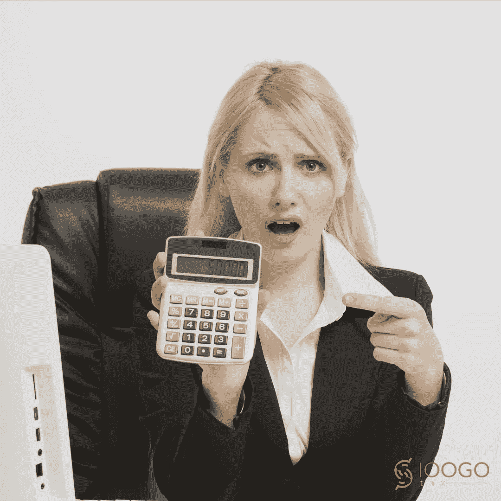

# 放弃你的税收“亲”——为什么你应该自己做。

> 原文：<https://medium.datadriveninvestor.com/drop-your-tax-pro-why-you-should-do-it-yourself-c4c6ee0a5bc9?source=collection_archive---------13----------------------->

你是否从 TurboTax 开始报税，得到退款结果，然后转到 H&R 街区在线，看看你是否能得到更大的退款？也许你去了三个不同的税务局，看看哪一个会给你最好的退款结果？你是否支付了升级费用，以便 TurboTax 或 H&R 布洛克能为你找到那些“隐藏的”税收抵免或神奇的扣除？

首先，我想说，我不讨厌报税人，毕竟，我是税务专业人士。我只是指出，技术如何简化了个人税收，以至于税务专业人士使用的大多数软件都是一步一步的面试，类似于 TurboTax 或 H&R 布洛克。请记住，美国国税局并不要求报税人获得任何特殊教育。就拿我来说吧……我所要做的就是上网去获得一个 PTIN(不需要培训)，我称自己为报税员。虽然培训不是必需的，但我确实通过个人选择进行了广泛的培训，以确保我能够适当地支持我的客户。还有那些黑市税务“专家”,他们去沃尔玛购买 30 份 TurboTax，并非法为他们的客户准备税收，向他们收取每份 200 美元的回报，并将客户的一大部分退款留给自己。

让我告诉你我和大多数报税人是如何报税的:

首先，我把你的信息输入一个系统；诸如您的姓名、社会保险号、出生日期和您的家庭信息(如果您已婚或有孩子)。如果你是有孩子的已婚人士，输入这些信息并检查其准确性大约需要 2 分钟，如果你是单身人士，不到 1 分钟，如果你是常客，不到 30 秒，因为大多数软件应用程序允许我通过简单的点击将你的信息从一年转到另一年。

第二，我根据一些简单的问题来确定你的申请状态。您的申报状态可以是单身、单身带家属、已婚共同申报或已婚单独申报(最少使用)。申请状态将决定你的标准扣除额。如果您认为您的 IRS 合格扣除额超过您的标准扣除额，我将只通过询问您逐项问题的过程。IOOGO Tax 做同样的事情。我们不会浪费你的时间问一个又一个问题，如果你已经知道，作为已婚共同申报，你没有超过 24，000 美元的国税局合格扣除。

第三，我输入你的收入信息，像你的 W-2，1099，现金收入或你收到的任何其他形式。顺便说一句，国税局已经有这个信息了。请记住，如果您在这一年中没有缴纳任何税款或足够的税款，并且您没有受抚养人来为您产生信用，则不要期望退款。

第四，我对你的收入进行调整，如果你有收入的话。调整是少量的“扣除”，减少你的收入和欠税。它们不适用于大多数人，尤其是因为新法取消了一些调整类别。

第五，我们点击是或否来回答一些简单但重要的关于你的信用的问题，比如儿童税收抵免、收入抵免、抚养费用、教育抵免等等。我也做了尽职调查，以确保不会有一笔神奇的退款会让我和你一起蹲监狱。

在每一步中，软件都在处理我输入的信息，并应用当前的 IRS 法律。当我用完您的点数时，我已经知道了您的退款金额，并准备好运行软件提醒。是的，该软件检查数学、法律、逻辑和其他重要方面，但没有软件会确定你是否忘记了表格，报税人也不会，因为他们只能处理你提供的信息。

就这么简单！不耍花招！没有魔法！只有数学。

现在，我们中的一些税务专业人士可以打印你的纳税申报表，一行一行地向你解释，并告诉你这些数字的确切来源——这就是我所说的魔法！

但有很多所谓的税收“专家”甚至无法解释简单的抵免是如何运作的。最糟糕的是，如果你的准备人在你的纳税申报表上犯了错误或欺诈，国税局可能会让你这个纳税人负责。

报税很简单。没有魔法，也没有诡计。自己报税。如果我们可以遵循软件步骤，那么你也可以！