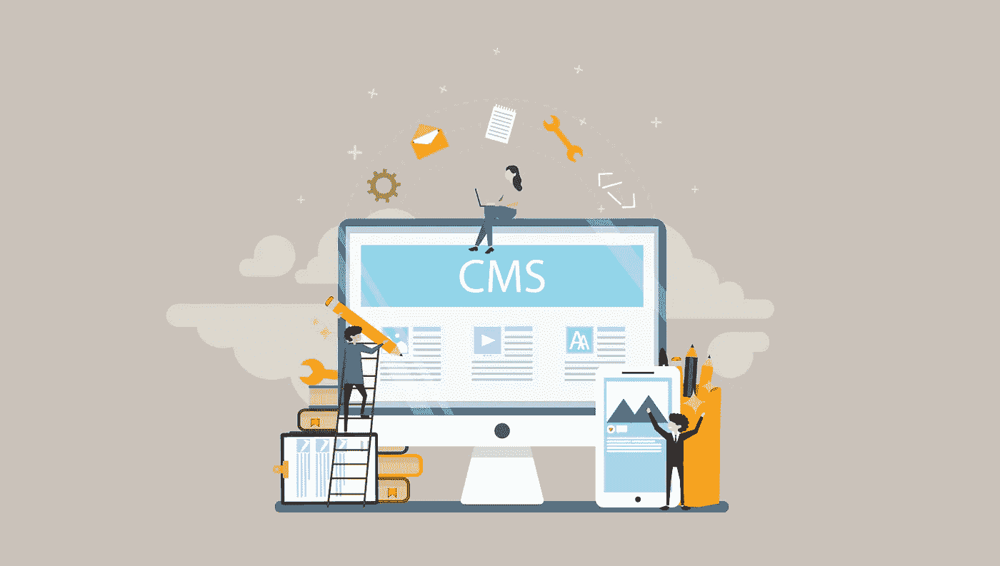

# Drupal vs. WordPress:为你的业务选择正确的 CMS

> 原文：<https://medium.datadriveninvestor.com/drupal-vs-wordpress-choosing-the-right-cms-for-your-business-bc9a60b1aeec?source=collection_archive---------9----------------------->

WordPress 占据了 CMS 市场的主导地位，大约 32%的网站使用它进行内容管理。为了证明 WordPress 有多受欢迎，它的下一个竞争对手 Drupal 只占有 1.9%的市场份额。尽管就使用而言有如此鲜明的对比，这两个 CMS 系统还是有很多共同之处。在本文中，我们将不带偏见地概述每个内容管理系统，以便让您更好地了解为您的业务选择 Drupal 还是 WordPress。

# 为什么你应该选择 WordPress

WordPress 已经存在了 10 多年，并且已经成为市场上最受欢迎的内容管理系统。用户喜欢它，因为它非常容易安装，而且总的来说对用户友好。一旦你安装并运行了 WordPress，维护你的网站是很容易的，因为它提供了一个非常直观的界面，从而允许你以各种方式定制你的网站。WordPress 有各种插件来帮助你管理你的内容，这增加了更多的可用性。对于初学者和行业老手来说，这都是一个很好的选择，因为它很简单，而且它有各种各样的功能，可供高级用户利用。

 [## 2019 年最值得学习的编码语言|数据驱动的投资者

### 在我读大学的那几年，我跳过了很多次夜游去学习 Java，希望有一天它能帮助我在…

www.datadriveninvestor.com](https://www.datadriveninvestor.com/2019/02/21/best-coding-languages-to-learn-in-2019/) 

# 为什么您应该选择 Drupal

Drupal 是免费和开源的，也可以用来创建复杂的网站。习惯所有的分类法可能会很麻烦。出于这个原因，Drupal 非常适合那些能够开发 web 解决方案并有一些编码经验的专业人士。它提供了大量的扩展，但是不像 WordPress 提供的那样容易使用。此外，它需要更长的安装时间，并提供 WordPress 一半的免费主题。尽管如此，可用性仍然是一个重要的因素，考虑到人们使用 WordPress 是多么容易，很明显为什么它是市场上的主导者。

# WordPress 和 Drupal:相似之处

我们提到了 WordPress 和 Drupal 之间的一些区别，现在让我们来看看它们的相似之处:

*   它们都是开源的
*   两者都是用 LAMP (Linux，Apache，MySQL，PHP)构建的
*   使用命令行接口连接 REST API
*   他们有一个活跃的用户社区，定期举办关于每个平台最新发展的活动

虽然他们都有自己的利基和利弊，所以哪一个是最适合你的呢？虽然每个企业都有自己独特的需求和要求，但让我们来看看这些 CMS 平台对您有用的一些情况。

# WP vs. Drupal:选哪个？

你应该像选择居住地一样对待这个决定。选择酒店房间可能很方便，因为一切都已经为您准备好了，但是您能定制您的房间吗？在这方面没有多少回旋的余地。你可以买一栋房子，它会给你各种各样的选择，让它成为你自己的，但是你必须从最基本的开始，比如地基，干墙等等。因此，考虑你的需求和权衡。为了获得你绝对需要的东西，你愿意牺牲什么？您应该在方便和控制之间权衡。

如果你需要一个完全定制的解决方案，WP 会是一个不错的选择。有一些功能是标准的，或者安装一些插件来使你的网站看起来像你希望的那样。还有，如果你需要一些没有技术背景也能快速上手的东西，你也应该选择 WP。这将是在你的网站上创建博客的正确选择，因为它是添加和管理内容的基础。

如果你知道如何编码以获得定制，那么 Drupal 将是一个不错的选择。如果你对你的网站有一个想法，但是用 WordPress 实现它需要大量的扩展，那么 Drupal 是适合你的。更重要的是，它具有强大的安全性。为了让您了解它有多安全，whitehouse.gov 是用 Drupal 构建的。WordPress 也遭受过黑客攻击，它提供的各种扩展也可能成为网络罪犯的入口。

如果你想知道费用，两者都是免费下载的，但是如果你需要雇佣外部人员来开发你的网站，你会产生费用。通常，Drupal 开发人员会更贵，原因很简单，因为他们人数少。话虽如此，Drupal 通过引入 Symfony 使开发变得稍微容易了一点，这是 PHP 开发人员非常熟悉的。

# 结论

一定要确定你的需求，以及为了获得你所寻求的便利，你愿意放弃的控制。如果你没有创建过于复杂的东西，并且你没有一个开发团队来帮助你，那么坚持使用 WordPress 会更好。然而，不要因为 WordPress 新潮就选择它。您应该研究这两种平台，并选择最适合您需求的平台。

*最初发表于*[*sky well . software*](https://skywell.software/blog/drupal-vs-wordpress/)*。*