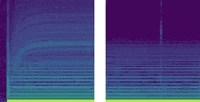
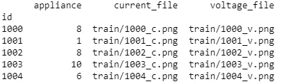
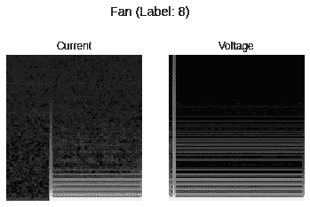
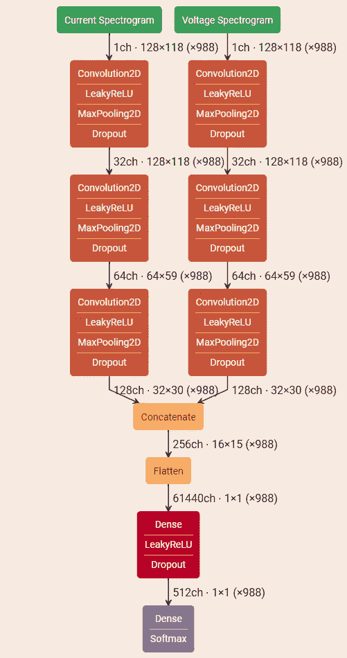

# 带 Keras 的双输入 CNN

> 原文：<https://medium.datadriveninvestor.com/dual-input-cnn-with-keras-1e6d458cd979?source=collection_archive---------0----------------------->

[](http://www.track.datadriveninvestor.com/1B9E)

> 这篇帖子详细介绍了我为[微软人工智能专业计划](https://academy.microsoft.com/en-us/tracks/artificial-intelligence/) [顶点项目](https://www.datasciencecapstone.org/competitions/10/appliances-energy-use/page/31/)提供的解决方案，该项目由 [DrivenData](https://www.drivendata.org/) 主办，是一项数据科学竞赛。

微软人工智能专业计划包括 9 门课程，随后是一个顶点项目。你学习 Python、数学、伦理学、数据分析、Azure 机器学习、计算机视觉、自然语言、处理、语音识别和 [CNTK](https://github.com/Microsoft/CNTK) (微软的认知工具包库)。

课程由 [edX](https://www.edx.org/) 主持，你需要通过每一门课程才能进入顶点项目。通过 edX 课程意味着通过评估(至少 70%的分数)，支付课程费用，并在结束时获得证书。价格为每门课程 99 美元/整个项目 990 美元(查看[项目页面](https://www.edx.org/microsoft-professional-program-artificial-intelligence)，因为价格可能会变化)。第 9 门课程由 3 门选修课组成，所以你必须从计算机视觉、自然语言处理和语音识别中选择(如果可能的话，全部选)。

除了 edX 证书之外，在该项目成功完成时，您还将获得微软颁发的[证书](https://academy.microsoft.com/en-us/certificates/dee552e8-756c-4506-ae70-46f29592fd8b/)。

从 4 月到 10 月，我花了大约 250 个小时来完成整个项目，主要是因为顶点项目只在每个季度开始时可用，而我错过了 7 月的火车。与此同时，我还完成了来自 [DataCamp](https://www.datacamp.com/tracks/data-scientist-with-python) 的[Data Scientist with Python](https://www.datacamp.com/statement-of-accomplishment/track/1d680eca6c10dd9357aab922c6e70c5d03423e06)，因为我觉得我需要更深入地研究一下 Python 的数据科学库，回过头来看，这是补充微软路线的一个很好的方式。

顶点挑战包括使用标准的人工智能工具从电气特征中识别 11 种不同类型的电器，通过电流和电压测量进行量化。

该数据集包含一个普通家庭中 11 种不同类型电器的 30 kHz 电流和电压测量值。对于每个电器，[插头负载](https://en.wikipedia.org/wiki/Plug_load)测量值被后处理，以提取两秒长的电流和电压测量值窗口。对于某些观察，窗口包含瞬时启动状态(打开设备)和稳态操作(设备运行后)。对其他人来说，窗口只包含稳态操作。然后观察结果被转换成两个 [Mel 光谱图](https://en.wikipedia.org/wiki/Mel_scale)，一个是电流，一个是电压。



Current and voltage spectrograms for a Hairdryer

在数据集中，标签值代表以下设备:

*   0:紧凑型荧光灯
*   1:吹风机
*   2:微波炉
*   3:空调
*   4:冰箱
*   5:笔记本电脑
*   6:真空
*   7:白炽灯泡
*   8:风扇
*   9:洗衣机
*   10:加热器

训练集中有 988 个谱图对，测试集中有 659 个谱图对。

有关该问题的更详细描述，请参见竞赛页面[这里](https://www.datasciencecapstone.org/competitions/10/appliances-energy-use/page/31/)。

为了实现，我决定使用带有 [TensorFlow](https://github.com/tensorflow/tensorflow) 的 [Keras](https://keras.io/) 深度学习库作为后端。我还选择了在谷歌合作实验室[内在线运行，这是一个免费的 Jupyter 笔记本环境，不需要设置，并提供 GPU 访问。](https://colab.research.google.com/)

我还想保持简单，并且能够在没有太多麻烦的情况下通过即时更改来进行实验，Jupyter 笔记本非常适合这一点。

**下载并提取数据**

我使用 *wget* 和 *unzip* 下载并提取数据，但是如果你想编码的话，也可以用 Python 来完成。在这种情况下没有必要这样做，我喜欢这种双线方法。

```
!wget [https://mpp0xc0ae45ef.blob.core.windows.net/drivendata-mpp-storage/data/10/public/data-release.zip](https://mpp0xc0ae45ef.blob.core.windows.net/drivendata-mpp-storage/data/10/public/data-release.zip)!unzip -o data-release.zip
```

**导入依赖关系**

我正在使用以下库:

*   [熊猫](https://pandas.pydata.org/pandas-docs/stable/) & [NumPy](http://www.numpy.org/) —用于数据处理
*   [scikit-image](https://scikit-image.org/) —用于读取谱图图像
*   [matplotlib](https://matplotlib.org/) —用于数据可视化
*   [scikit-learn](https://scikit-learn.org/) —用于将数据集分成训练集和测试集
*   [Keras](https://keras.io/) —创建并训练深度神经网络(DNN)，用于根据电流和电压频谱图预测电器

**读取数据**

在这里，我使用 Pandas 的 *read_csv* 函数将 *train_labels.csv* 文件读入 DataFrame *train_df，*中，并且我还创建了两个额外的列，将 *id* 映射到正确的文件中。



**设置**

在继续之前，我需要创建一些辅助值:

*   我试验了 RGB 或灰色图像的光谱图
*   **in _ channels**——输入图像有多少个通道:对于 RGB *skimage* 给我 4 个通道，对于灰色 1 个
*   **img_rows** ， **img_cols** —图像高 128 像素，宽 118 像素
*   我们必须预测电器的数量

**超参数**

接下来的两个变量属于[超参数](https://en.wikipedia.org/wiki/Hyperparameter_(machine_learning))的范畴，因为改变它们的值会影响训练模型所需的时间、内存需求甚至模型的准确性:

*   **batch_size** —定义通过网络传播的样本数量。太低，对梯度的估计就越不准确，太高，就需要更多的存储器来训练网络。这是准确性和速度之间的权衡。
*   **历元** —历元是在训练网络时对整个训练集的一次遍历。

**过程电流和电压文件**

接下来，我们使用 *read_spectrograms* 辅助函数读取并处理图像，并将标签从类别向量(整数)转换为二进制类别矩阵(称为[*one hot encoding*](https://en.wikipedia.org/wiki/One-hot))，以便很好地使用我们的损失函数(见下文)

**助手功能**

该函数从磁盘、灰度或 RGB 读取光谱图图像，将它们转换为 NumPy 数组，然后将像素值(从 0-255)归一化为 0 到 1 之间的值。在返回结果之前，数组也被重新整形以匹配 Keras(以 TensorFlow 作为后端)的预期:

```
(samples, rows, columns, channels)
```

**显示随机器具**

为了检查是否正确加载了所有内容，我将显示来自数据集的随机训练集:



Current and voltage spectrograms for a Fan

**拆分和训练测试批次**

我将数据集分为用于拟合模型的训练样本(70%)和验证样本(30%)。

因为我有 2 个输入(电流和电压)，因此有 2 组训练数据，我需要堆叠它们，所以 *train_test_split* 函数在同一对图像上分割。堆叠发生在第 4 轴上，分割后，I *取消堆叠*结果:

**创建模型**

对于网络设计，我从 VGGNet、ResNet 或 Inception 等已建立的网络中获得了一些灵感，并针对这个挑战获得的小数据集进行了调整。

每个声谱图都有其卷积层来提取特征，然后将这些特征连接起来，并馈入下面完全连接的层。

网络看起来像这样:



对于每个输入，我有 3 个[卷积层](https://en.wikipedia.org/wiki/Convolutional_neural_network)用于从以下部分提取特征

1.  第一个隐藏层是一个卷积层，称为*卷积 2D* 。该层有 32 个滤波器，一个大小为 3×3 的内核和一个 [LeakyReLU](https://ai.stanford.edu/~amaas/papers/relu_hybrid_icml2013_final.pdf) 激活函数(这是整流线性单元 ReLU 的泄漏版本，当该单元不活动时，它允许小的梯度)。这一层是输入层，期望图像具有上面的形状轮廓。
2.  接下来，一个取最大值的池层叫做 *MaxPooling2D* 。它被配置为 2×2 的池大小(它在两个空间维度上将输入减半)。
3.  下一层是正则化层，使用称为 *dropout* 的 Dropout。它被配置为随机排除层中 25%的神经元，以减少过拟合。

以上各层再重复两次，将滤波器尺寸增加到 64 和 128(以适应更复杂的功能)，并将压差增加到 25%和 40%(以防止过拟合)。

两个输入的卷积层的输出经过一个连接层，结果由*展平*层从 2D 矩阵转换为矢量。它允许标准的全连接层处理输出。

接下来，具有 512 个神经元的全连接层、泄漏整流器激活函数，随后是被配置为排除 50%神经元的另一个脱落层随机处理来自平坦层的输出。

最后，输出层有 11 个神经元，用于 11 个设备和一个 [softmax](https://en.wikipedia.org/wiki/Softmax_function) 激活函数，用于输出每个类别的类似概率的预测。

网络图翻译成以下代码(使用 Keras 的功能 API):

对于优化算法，我选择了[亚当](https://machinelearningmastery.com/adam-optimization-algorithm-for-deep-learning/)(自适应矩估计 **)** ，对于损失函数， [*分类 _ 交叉熵*](https://en.wikipedia.org/wiki/Cross_entropy) (我们必须对标签进行热编码的原因)。优化算法最小化损失函数。

…以及创建卷积层的辅助函数:

**训练模型**

为了训练，我使用一个名为 *ModelCheckpoint* 的回调函数来保存最佳权重，然后调用模型对象的 *fit* 函数。

**评估**

理论上，我应该为模型评估留出一些数据，但在这种情况下，有竞争对手的测试数据集。下面的代码加载最佳权重并评估它们的验证集(结果是我们在训练过程中的最佳准确度)。

**预测**

训练完模型后，我将它与我必须首先加载和处理的竞争测试集进行比较:

随后调用模型上的*预测*函数并准备提交文件:

在我设法通过考试并获得 100%的分数后(完成 [25/265](https://www.datasciencecapstone.org/competitions/10/appliances-energy-use/leaderboard/) )，我决定探索 Keras 库并尝试不同的网络架构和不同的超参数值:

*   **批量大小** — 16，32，64
*   纪元:50，100，200，500 年
*   **优化算法**——[亚当，SGD，阿达格拉德，RMSProp，Nadam](http://ruder.io/optimizing-gradient-descent/) ( *亚当 RMSprop 带内斯特罗夫动量*)
*   **学习率** —为此，我使用了 Keras 的 ReduceLROnPlateau 回调函数，一旦学习停滞，就将学习率降低 2-10 倍。
*   **激活功能** — ReLU，eLU，LeakyReLU
*   **全连接层的神经元数量** — 256，512，1024
*   **最后一层的脱落** — 40%，50%，60%。

完整的 Jupyter 笔记本可以在我的 [Github 账户](https://github.com/raduenuca/dat64x-capstone-project)中找到。

在下一篇文章中，我将展示如何使用[超参数优化](https://en.wikipedia.org/wiki/Hyperparameter_optimization)来获得模型的最佳组合。

**结论**
微软人工智能专业计划(Microsoft Professional Program for Artificial Intelligence track)是开始了解人工智能领域的绝佳方式，如果你不想要认证(你可以在 edX 上审核课程)，你可以免费完成。因为篇幅的原因，我决定用认证来保持专注。我也喜欢顶点工程。我建议用其他课程来补充这个项目，以获得全面的知识。认证后我经历的事情的简短列表:

*   他们遵循自上而下的方法来教授概念，杰瑞米·霍华德是一位伟大的老师。这些课程是免费的，没有附加费用，而且有足够的材料让你忙上一阵子。
*   [Andrew 的 Ng](https://www.coursera.org/courses?query=andrew%20ng) (另一位很棒的老师)在 [Coursera](https://coursera.org) 上的课程。如果你不想要证书，它们也是免费的，但是你不能给作业打分。
*   [DataCamp](https://www.datacamp.com/) 和 [DataQuest](http://dataquest.io) —使用 Python 和 r 学习数据科学的绝佳实践选项。它们不是免费的，但会尝试寻找折扣。