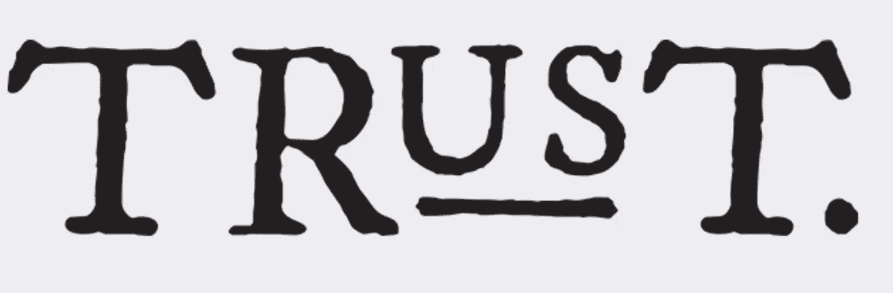

# 与美国人/财产有信托关系的非美国受托人的尽职调查说明

> 原文：<https://medium.datadriveninvestor.com/due-diligence-notes-for-non-us-trustees-with-trusts-connected-to-us-persons-property-54e4a9f051fb?source=collection_archive---------17----------------------->

鉴于家族网络的全球性，受托人应进行彻底的尽职调查，以确定美国与他们管理的信托的关系的性质和范围。

当定期和系统地执行时，此类尽职调查应揭示信托与美国人的明显和不太明显的联系，即:任何美国托管人(建立信托的人)或当前或未来可能的美国受益人，以及信托对位于美国的资产的直接或间接所有权。

对于受托人来说，这些练习是必不可少的，以确保遵守美国税法对这些当事人和受托人施加的各种税收和报告要求。

在这方面，非美国受托人应考虑以下事项:

*:信托的每个委托人和受益人的过去和现在的居住地、住所和国籍，以及委托人或受益人目前的身份是否预计会发生任何变化。*

****放弃:*** 信托的托管人或受益人是否曾经放弃他们的美国公民身份或放弃他们的绿卡。*

****信托的联邦税收地位:*** 信托是否被视为非美国信托，以及在何种情况下可能发生变化。*

****信托作为外国“授权人”信托或外国“非授权人”信托的地位:*** 就美国联邦所得税而言，信托是否被视为外国“授权人”信托和/或“非授权人”信托。*

****谁是信托资产的托管人或所有人:*** 谁在过去和现在都被认为是信托的托管人，谁在过去和现在都被认为是信托资产的所有人，在什么情况下可能会发生变化。*

****联邦和州一级对受托人、财产托管人或受益人有什么报告要求:*** 州和联邦一级的受托人、财产托管人和受益人的报告要求的性质。例如，遵守《外国账户税务合规法案》(FATCA)和应用表格 3520、3520-A、8621、5471、1040、1041、8858、926、706 和 709 以及财政部“FBAR”(表格 114)。*

****托管人和美国受益人的所得税、遗产税和赠与税后果:*** 这些类型的税务后果需要在以下情况下考虑:(I)与信托或信托拥有的实体有关的某些权力或权利，并授予托管人或受益人；(ii)直接或间接向信托转移财产，(iii)信托的直接/间接实际或视为分配或贷款，以及(iv)可能从信托中受益的权利。*

****增加信托的方式:*** 受托人、托管人和受益人应注意这一问题，以尽量减少不利的税务和报告要求。*

****受托人可能的税务责任:*** 受托人应考虑他们在多大程度上有责任缴纳联邦预扣税或联邦和州转让税(例如，遗产税和赠与税)。*

****信托拥有的实体的管理方式:*** 受托人应考虑如何以节税的方式管理信托拥有的实体。例如，如何处理资产增值和留存收益，以及何时进行“复选框选择”。*

****哪些类型的投资应由信托直接或间接持有:*** 受托人应考虑哪些类型的投资结构应由信托直接或通过实体间接持有。*

****需要对信托文件进行的任何修改:*** 受托人应考虑需要对意愿书进行哪些修改；信托契约；和/或信托拥有的任何实体，以确保信托以节税的方式构建。作为受托人需要注意的问题类型的例子:美国人的“一般任命权”；以及在托管人死亡后存在“基础上的升级”。*

*通过按照上述路线进行尽职调查，受托人将处于相对有利的位置，以确定在其信托管理中是否存在任何美国税收和报告问题。*

*这份尽职调查清单只是帮助受托人管理其信托的工具，但鉴于上述问题的复杂性，通常需要合格的美国税务顾问进行进一步分析。他们熟悉这些问题，应咨询他们的意见，以确保受托人在管理其信托时仔细研究了所有相关的美国问题。*