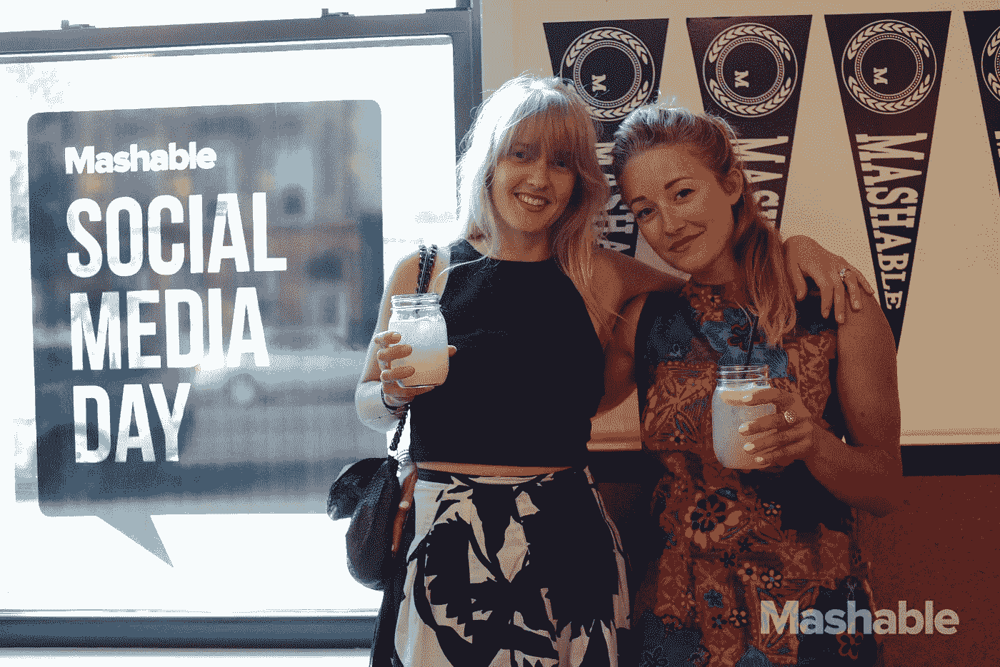
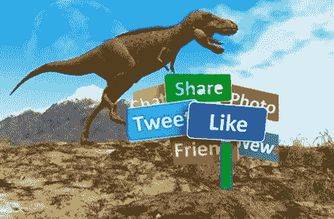
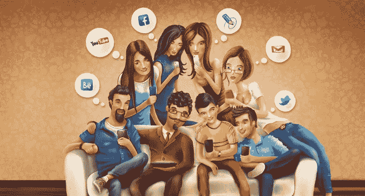

# 2018 年社交媒体日:公司需要知道什么

> 原文：<https://medium.datadriveninvestor.com/dyk-today-is-world-social-media-day-bc37f472ca8e?source=collection_archive---------2----------------------->

[Photo Credit: Casey Kelbaugh](https://mashable.com/smday/) (Mashable celebrates Social Media Day 2017 in New York City)

## 你的企业是数字恐龙吗？

如果你错过了，6 月的最后一天是 2018 年世界社交媒体日的庆祝活动。

然而，信不信由你，一些老派雇主仍然像《侏罗纪公园》中被困的社交媒体恐龙一样四处游荡。你的生意是其中之一吗？

如果是这样的话，下面是每个公司应该已经知道的关于实施智能社交媒体战略的初级读本。但首先，这里有一些关于第九届世界社交媒体日的信息…

Mashable 在 2010 年设立了社交媒体日，作为一种认可和庆祝社交媒体对全球交流影响的方式。如今，社交媒体是全球沟通的核心。”

> **尽管感觉上社交媒体已经存在很久了，但大多数大平台只存在了 15 年左右，有些还不到 10 年。**

也就是:2002 年推出的 Reddit 和 LinkedIn，2004 年推出的脸书，2005 年推出的 YouTube，2006 年推出的 Twitter，2008 年推出的 Pinterest，2010 年推出的 Instagram，2011 年推出的 SnapChat，2015 年推出的 beBee Affinity 社交网络。

[国家日历日](https://nationaldaycalendar.com/social-media-day-june-30/)在 2018 年世界社交媒体日指出:

*   “在其短暂的生命中，社交媒体重新定义了人们与家人、朋友和世界互动、交流和分享的方式。”
*   “社交媒体使我们有可能与生活中重要的人保持联系，并了解他们的信息。”
*   “与同学、以前的同事等重新联系也是社交媒体的一个重要部分。它还让我们有可能与祖先联系，找到你从来不知道存在的亲戚。”

> **你仍然可以通过标签#SocialMediaDay 和#SMDay** 参与或赶上世界社交媒体日

## 数字恐龙

社交媒体的出现和主流化已经成为现代文化不可避免的一面。似乎每个人都在一些社交媒体网站上，这些网站现在是大多数人日常生活中固有的一部分。

> 尽管许多公司已经完全接受了社交媒体，但并不是每个企业都已经接受了，尽管原因不同。

问问你自己:

*   我的雇主对社交媒体有多了解？
*   我的公司是否已经在社交媒体上占据了一席之地，还是更像侏罗纪时代的恐龙？

> **现在，每一家 21 世纪的公司都应该知道，采用智能社交媒体策略具有良好的商业意义。**

战略性地利用社交媒体可以增加利润、品牌忠诚度、消费者信任度，并扩大客户群。由于劳动力人口结构的根本变化，随着越来越多的年轻一代进入劳动力市场，这一点在今天尤为重要。

事实上，皮尤研究中心预测，到 2019 年，千禧一代将超过婴儿潮一代，成为美国最大的一代和最大的劳动力人口(根据美国人口普查局的估计)。

没有一家企业希望在竞争激烈的劳动力市场上从被招聘和保留的员工中流失最优秀的人才。然而，一些求职者不想为一个拥有过时的数字商业实践的雇主工作。

千禧一代和 Z 世代尤其如此，他们出生在数字时代，智能手机是他们名副其实的附属品。

这就是为什么商业头脑意味着根据公司的特定行业和使命，在各种平台上利用社交媒体。

> 在新千年来临之际，没有哪家企业希望被称为社交媒体恐龙。

## **精通社交**

社交媒体(或简称“社交”)已被证明是无数公司的无价资产，无论它们是大型、小型、中型还是“夫妻店”。

> **采用有效的社交媒体策略有很多好处，包括但不限于以下几点:**

*   增加销售额和利润，以及网站流量。
*   加强招聘和雇用最优秀的人才。
*   提高透明度，同时建立更大的消费者基础。
*   改善客户关系、消费者多样性、忠诚度和信任度。
*   提升公司重要的品牌形象和声誉。
*   通过在任何公关火灾变成病毒燃烧之前遏制它们，为有效的危机沟通做出贡献。

> **这些只是增强你的社交媒体形象成为商业要务的众多原因中的一部分。但是有些公司还是不明白。**

作为社交媒体恐龙的雇主无法理解实施精明社交策略的基本前提和好处。遗憾的结果是:错过了潜在的商业机会，这些机会流向了更具社交能力的竞争。

此外，一些已经建立社交网络的公司在积极利用多种平台方面仍然落后，包括非传统平台，甚至是适合其特定业务的平台。

> 社交媒体是扩大消费者基础和在地方、国家、地区和全球层面接触最广泛受众的不可或缺的组成部分，此外还根据行业人口统计和业务细分瞄准利基受众。

## **没有单行道**

同样重要的是要记住，企业不应该为了社交媒体而社交。

相反，任何企业首先需要采用一个智能的社交媒体计划，该计划具有明确的目标和目的，以获得最佳投资回报(ROI)。有各种各样的在线分析工具来准确地衡量和提高社交投资回报率，更不用说一群社交媒体服务和顾问来为你做这项工作了。

认识到社交媒体不是单行道也很重要。社交不仅仅是传播公司的信息。

> 有效的社交媒体战略的真正关键可以归结为一个词:参与！

精通社交就是与顾客互动，以改善他们的整体商业体验，并让他们再次光顾**。你的社交媒体游戏计划应该基于流行的说法:帮助我(企业)帮助你(消费者或目标受众)。**

问:怎么做？

回答:通过战略性地利用社交媒体，以有效和快速的方式征求和回应消费者的问题、顾虑和投诉。这意味着更具对话性和真实性，同时使用更少的套话和法律术语。

> 公司应该确保在前进之前与法律顾问一起审查任何社交媒体计划，因为社交媒体判例法仍处于初级阶段。

## **消费者想要什么**

社交能力对消费者来说很重要，因为他们希望在打开钱包、输入信用卡号码或用智能手机支付时感受到被需要和被重视。

> 顾客渴望在社交媒体上被听到。他们想知道他们的个人观点是有价值的，他们的价值观是由品牌来代表的。

虽然这对于高管来说可能听起来过于简单，但社交能力远比在 Instagram 上发布产品图片或在推特上发布新闻稿或巧妙的流行语更微妙。

所有财富 500 强公司现在都应该有某种类型的社交媒体团队。此外，根据业务的性质和范围，由于在线通信和电子商务的全球化，许多社交媒体团队需要昼夜不停地工作。

## **聆听专家意见**

为了进一步了解任何企业如何最好地利用社交媒体，我与我的社交网络中的一些专家进行了交谈。他们是这样说的:

[约翰·怀特，MBA，](https://medium.com/u/c551842e7d64?source=post_page-----bc37f472ca8e--------------------------------) **社交营销解决方案创始人兼 CMO:**

*   “当谈到社交媒体时，大多数公司的高层管理人员都喜欢呆在幕后。”
*   “最近的研究表明，财富 500 强中的大多数首席执行官仍然没有在社交媒体上露面。”
*   “然而，研究显示，今天的消费者有一种强烈的愿望，希望与他们使用和推广的品牌建立更深层次的联系。”
*   “首席执行官在社交网站上与客户的互动让他们觉得自己很特别，并对品牌产生强烈的情感依恋。”

[特雷西·塞斯蒂莉](https://medium.com/u/e1aed0723381?source=post_page-----bc37f472ca8e--------------------------------)**[**增长营销副总裁**](https://medium.com/u/bc7a2f5f6ad9?source=post_page-----bc37f472ca8e--------------------------------) **:****

*   **“拥抱社交媒体将有助于企业通过私人消息和定制的互动内容，关注实时响应、移动性和个性化，从而变得更加灵活。”**
*   **“企业或任何组织的社会投资回报率都有点模糊。例如，对于 Twitter 广告和 B2B 技术公司来说，0.6%至 1.2%的参与度是平均水平，你应该把目标定在这个水平或更高。”**

> **另外两人推荐通过在线员工宣传，让员工成为亲善社会大使的趋势方法。**

**一些公司可能认为这种策略有问题，因为可能缺乏员工的信任和管理层对在线互动施加严格控制的能力。然而，员工在社交媒体上的倡导值得商界进一步考虑和尝试。**

**这是确定在社交媒体上解放员工，作为他们工作的一部分，是否会提高公司的投资回报率的唯一方法——这转化为更多的销售和利润，以及上文提到的许多其他好处。**

**[**Denise Holt**](https://www.linkedin.com/in/deniseholt1)**，合作智商创始人兼 CEO:****

*   **“社交媒体是人际关系的新营销方式。”**
*   **“员工对他们自己的受众有着强大的影响力，组织已经足够了解，知道他们可以通过员工社交媒体的使用来接触他们的客户，这比传统的营销渠道好得多。”**
*   **“动员员工作为代表品牌的代言人有很多好处，这与员工和公司直接受益息息相关，包括领导力发展、保留和参与，以及将公司定位为行业领导者。”**

**[StephanieFrascoClegg](https://medium.com/u/18f9d6c34fff?source=post_page-----bc37f472ca8e--------------------------------)**，Convert With Content 社交媒体副总裁:****

*   **“员工宣传是吸引你的观众和观众中不同观众的好方法。”**
*   **“由于每个员工都有自己的网络，通过授权他们为你传播消息，你将为自己建立一支迷你军队，可以到达社交网络的更多角落。”**
*   **“如果你想吸引在网上积极参与的优秀人才，你的企业需要积极参与。你是领导。搭建舞台，让社交媒体成为重中之重。”**

****

## **最后的想法**

**如果你是一个没有利用社交媒体的企业主或首席执行官，那你早就该加入这个项目了。**

**大多数年轻人，但不是所有人，都有社交能力。然而，并不是所有的青少年和 20 多岁的人都是社交媒体专家或精通各种主要平台。**

> **这就是为什么公司在做出基于年龄的假设以及将部分或全部社交媒体职责委托给实习生时应该小心谨慎。**

**不要自动假设年轻一代都是社交媒体专家。许多 x 世代的人，像我一样，同样精通社交(并且在社交媒体普及前后有更多的真实世界经验)。**

**你可能想雇佣一家有良好记录的社交媒体营销公司或顾问，或与之签约。**

> ****可能不太熟悉数字通信的老派公司需要记住，社交媒体远不止初看上去那么简单。****

**此外，一旦一个负面的社交媒体帖子像病毒一样传播开来，它可能会给公司造成重大的公关损失。这可能包括——但不限于——践踏消费者信任、盈利能力直线下降和股票估值暴跌。**

**最后，问自己以下问题(请在下面的评论区分享你的宝贵意见):**

1.  ***你的*雇主是否最大限度地利用了社交媒体，还是企业是一只顽固的社交恐龙？**
2.  **雇主应该允许员工使用他们的个人社交网络来支撑品牌吗？这种策略有什么陷阱？**
3.  **你的公司在社交媒体上取得了或未能取得哪些总体或具体的成果？**
4.  **你最喜欢和最不喜欢的社交媒体网站是什么，为什么？**

**无论你总体上喜欢还是讨厌社交媒体，有一件事似乎是肯定的:对全世界数十亿人来说，每天都像是社交媒体日。**

**你怎么想呢?**

*   **[*注:这篇文章的另一个版本*](https://www.bizcatalyst360.com/is-your-company-a-social-media-dinosaur/) *最近出现在*[bizcatalyst 360](https://medium.com/u/4aa3e6a26229?source=post_page-----bc37f472ca8e--------------------------------)(2018 . 6 . 29)**
*   **你也可能喜欢…**

** [## 戴尔·卡内基死后的社交媒体秘密

### 社会成功的老经验…

medium.com](https://medium.com/@DBGrinberg/social-media-secrets-posthumously-from-dale-carnegie-c83e4962bfd4)  [## 社交媒体秘密、技巧和窍门

### https://medium . com/@ DBGrinberg/assessing-mark-zuker bergs-assessing-mea-culpa-to-congress-78675 c5d 2573

medium.com](https://medium.com/series/social-media-secrets-and-solutions-d92f9ebeeb7) 

__________________________________________________________________

**关于作者:**大卫是一名战略传播顾问，代笔人，前联邦政府发言人。他是 beBee 公司的全球品牌大使，也是美国多元化报告的顾问委员会成员。你也可以在[推特](https://twitter.com/DBGrinberg)和 [LinkedIn](https://www.linkedin.com/in/davidgrinberg/) 上找到他。

**注:** *所有观点和意见仅代表作者个人，不代表任何公共部门雇主、私营部门雇主、组织或政治实体的官方声明或认可。***