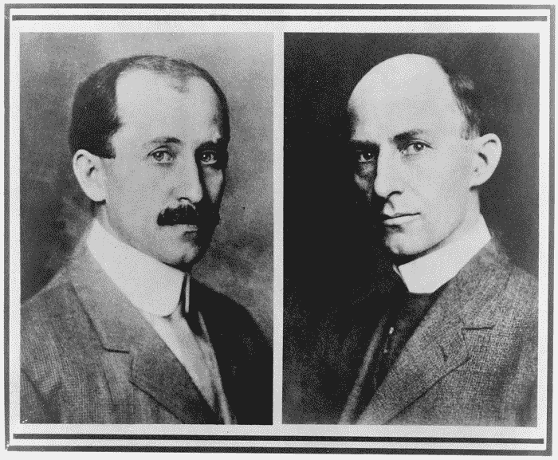
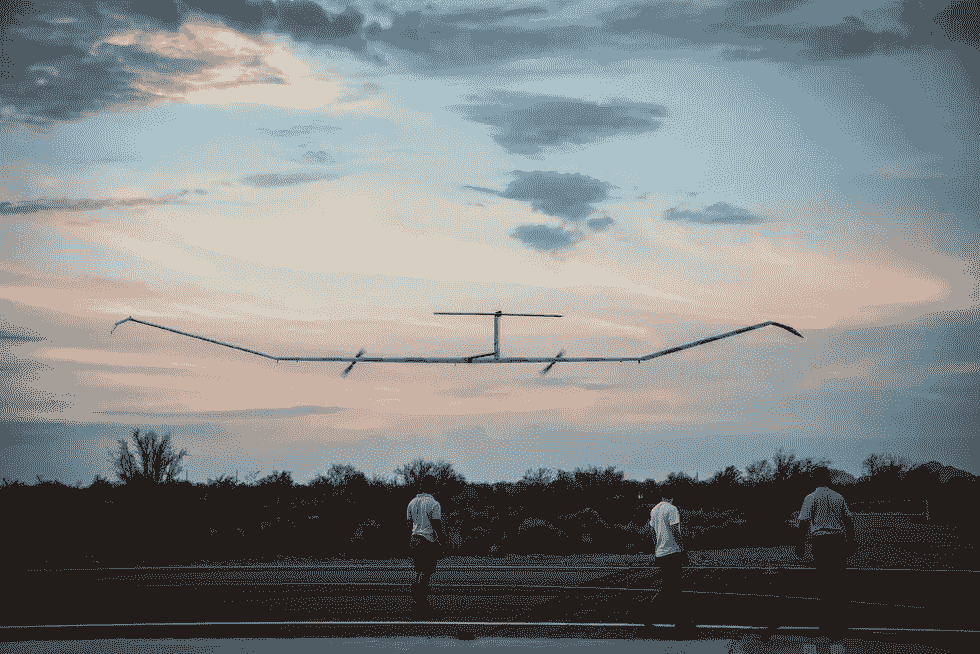

# 动态无人机飙升至新的世界纪录和前所未有的技术飞跃

> 原文：<https://medium.datadriveninvestor.com/dynamic-drone-soars-to-new-world-record-and-unprecedented-technology-leap-3da32cb9a283?source=collection_archive---------20----------------------->

莱特兄弟肯定会感到骄傲。

技术总是关于敢于梦想。从一开始，当我们想到用轮子骑发动机的可能性，到驾驶飞机——从突破音障，甚至在月球上行走——技术推动我们进入下一代。的确，随着无人机技术继续突飞猛进，这并没有什么不同

# 新的世界纪录是官方的——一架无人机几乎达到了飞行 26 天的标记

当然，这一成就的美妙之处在于，如果没有太阳能，这一切都不会发生！

空中客车公司是取得巨大成就的组织。他们现在保持着无人驾驶飞机最长连续飞行的记录。该无人机的名称是*泽法的*，这是一种自 2015 年以来开发的机器，作为一种替代昂贵卫星的方式进行了测试。毫无疑问，他们已经走了很长一段路。

这是一架只有 165 磅重的无人机，很容易*与卫星混淆——它的翼展为 80 英尺，机翼的每个部分都覆盖着太阳能电池板，即使在云层覆盖和额外的空中交通中，也能保持发动机以最佳发电状态运行。这一成就的美妙之处在于，这仅仅是一个开始——随着它的处女航于 7 月 11 日开始，每一次测试任务的持续时间都越来越长，而这是最新的赞誉，可能是未来的一个警示性迹象:*

# *我们将会有一架大功率的无人驾驶飞机，拥有无限的可能性*

**

*例如对影响区和灾害的空中监测、长期环境研究，甚至为困难地区提供无线互联网服务。卫星可能是航空技术的新恐龙，虽然缓慢但肯定会被能力更强的无人机取代。然而，正如我们所说的，空客正在开发第二种更大尺寸的型号，以适应更重的有效载荷。听起来很刺激？这就是莱特兄弟仰望天空时的想法，他们认为自己能做到鸟儿能做到的事情。这是一个科技从未停止想象的例子。*

*你还有其他的梦吗？最好注册一个免费的 VIGYAA 账户，开始写最大的创新吧！*

**原载于*[*vigyaa.com*](https://vigyaa.com/@pierre/dynamic-drone-soars-to-new-world-record-and-unprecedented-technol-284a6cc0/)*。**