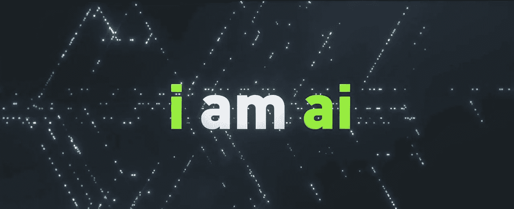
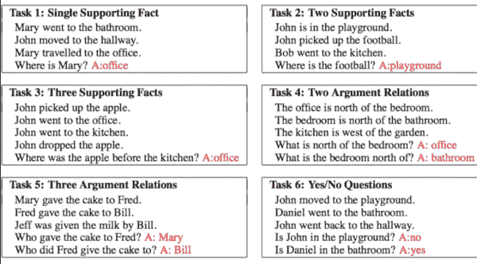
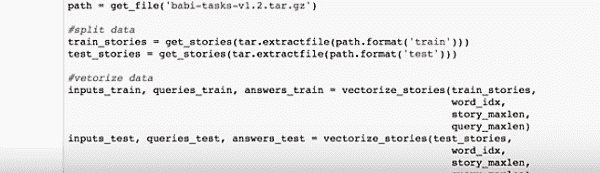
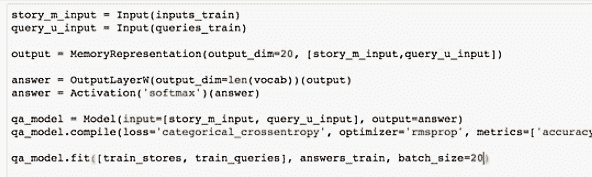
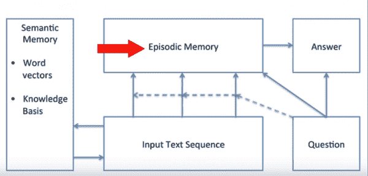
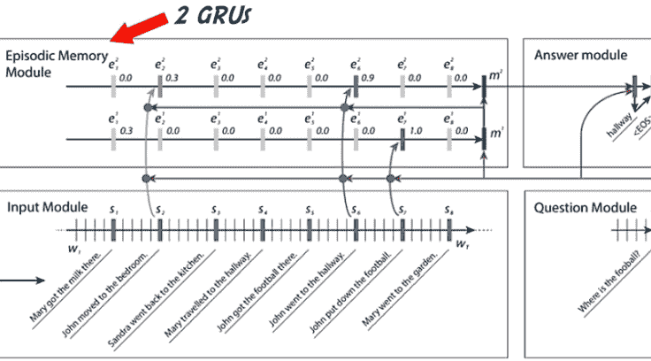
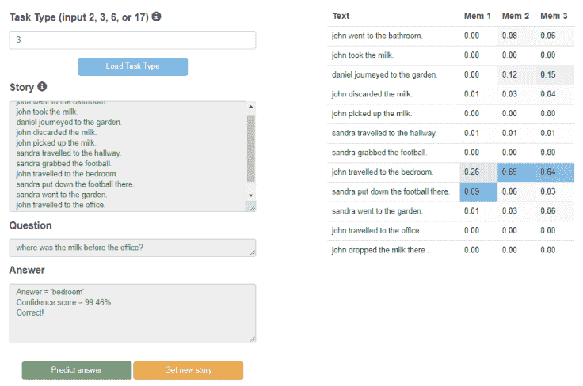

# 动态存储网络

> 原文：<https://medium.datadriveninvestor.com/dynamic-memory-networks-43b68da77481?source=collection_archive---------6----------------------->

机器学习已经使使用 word2vec、seq2seq、lstm、gru 制造 AI 聊天机器人成为可能……但这些动态记忆网络提供了训练和实现聊天机器人的不同视角。

A ***动态记忆网络* (DMN)** 是针对问答(Q & A)问题优化的神经网络架构。这是一种新的自然语言处理方式，NLP。

给定输入序列(知识)和问题的训练集，它可以形成情节记忆，并使用它们来生成相关的答案，我们将利用它来制作聊天机器人。简单来说，我们构建聊天机器人的方式是*提供一系列输入句子，并根据这些句子提出一个问题，然后它会输出答案*。有趣吧！

为了明确起见，请查看以下示例…

输入:有一只猫。猫是黑色的

问题:这只猫是什么颜色的？

输出:黑色

投入:我好开心。我可能会死

查询:有什么感悟？

输出:正数(#从字面上看，我们可以问它任何类似翻译是什么的问题)

现在，你一定对这个有了一个大概的了解……所以，让我们深入探讨一下…

*对于热情的家伙来说，也有一场 kaggle 比赛(*[*https://www.kaggle.com/c/the-allen-ai-science-challenge*](https://www.kaggle.com/c/the-allen-ai-science-challenge)*)。*

首先，我们需要一个数据集。我们可以使用名为 babi([https://research.fb.com/downloads/babi/](https://research.fb.com/downloads/babi/))的脸书研究数据集，它有许多任务，融合了输入、查询和回答。你可以看一下图 1

我们的普通经典编码器-解码器(Seq2Seq)模型可以解决问答问题，但是性能受到小存储器大小的限制。当处理非常长的数据序列时，这种限制变得至关重要，例如书籍/视频，其中突出的事实可能在非常不同的上下文中出现很长时间。

这种限制可以通过存储多个隐藏状态，然后使用一种称为[注意机制](https://blog.heuritech.com/2016/01/20/attention-mechanism/)的策略在它们之间进行选择来解决。这允许网络引用输入序列，而不是像 Seq2Seq 那样强迫它将所有信息编码到一个固定长度的向量中。

有两种类型的记忆模块，一种是语义记忆模块，另一种是情节记忆模块。输入向量是语义记忆。这些是考虑到我们大脑海马体工作背后的想法而发明的，海马体可以检索由一些反应触发的时间状态，如视觉或声音。

情节记忆具有比 LSTM 更好的 GRU 氏(分级递归神经网络)。想要了解 GRU，点击这里。

语义模块由预训练的[手套向量](https://nlp.stanford.edu/projects/glove/)组成，用于从输入句子中创建[单词嵌入序列](https://www.quora.com/What-is-word-embedding-in-deep-learning)。

输入模块处理使用 GRU 实现的输入向量。它使网络能够学习当前考虑的句子是否相关。

问题模块逐字处理问题，并使用相同的 GRU 输出向量。

情节模块接收作为嵌入编码提取的事实和问题向量。

在实践中，我们可以分成训练/测试集，并将数据矢量化为 3 个部分，即。输入、查询和回答。然后我们创建一个情节记忆(输出向量)。此外，我们用作为优化器的 *rmsprop* 来编译我们的模型( *RMSprop 最适合序列数据*)，然后用针对 train_queries 的 train_stories 来拟合它。

您可以在图 2 中看到基本的工作流程

与 LSTM 人相比，GRU 人有能力记住更多隐藏的状态和过去的状态

这里我们需要更多的片段，因为我们的模型应该知道应该注意句子的哪一部分，不应该注意哪一部分。她喜欢芒果。芒果是水果之王。所以，这里更多的焦点应该是芒果而不是爱情。

所以，我们可以自己测试我们的模型，但是一个叫 Ethan Caballero 的有教养的家伙用 facebook 的 babi tasks 做了一个 DMN(动态神经网络)+ web API，我们可以选择我们的输入任务，让聊天机器人预测问题的答案。

有趣不是吗？[检查此处](https://ethancaballero.pythonanywhere.com/)

这里的代码是。(代码归功于 Francois Chollet，我只是创建了一个包装器来理解)。

有用的链接:

[https://www.quora.com/What-are-dynamic-memory-networks](https://www.quora.com/What-are-dynamic-memory-networks)

[https://yerevann . github . io/2016/02/05/implementing-dynamic-memory-networks/](https://yerevann.github.io/2016/02/05/implementing-dynamic-memory-networks/)

[https://github.com/domluna/memn2n](https://github.com/domluna/memn2n)

*原载于 2018 年 10 月 9 日*[*【blog.lipishala.com】*](https://blog.lipishala.com/2018/10/09/dynamic-memory-networks/)*。*