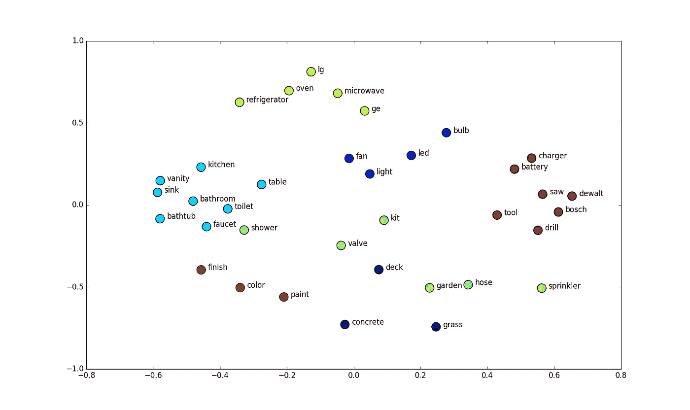

# 动态元嵌入:一种选择正确嵌入的方法

> 原文：<https://medium.datadriveninvestor.com/dynamic-meta-embedding-an-approach-to-select-the-correct-embedding-c0b9dda35d48?source=collection_archive---------3----------------------->

单词嵌入是任何自然语言处理问题的首要步骤。随着深度学习技术的发展，嵌入方法取得了巨大的成功。此外，迁移学习使得单词嵌入过程在没有足够数据来源的情况下变得更加容易。虽然新的嵌入技术越来越多，但有时很难选择正确的嵌入技术。一个人是应该使用预先训练好的 glove、word2vec、fasttext 模型，还是应该从头创建一个模型。因此，为什么不把选择最佳嵌入技术的麻烦放在自然语言模型本身上，而不是由我们自己来决定。在论文“用于改进的句子表示的动态元嵌入”中，作者描述了一种方法，该方法可以为某个领域自动选择最佳的单词嵌入。



Visualizing Word Embedding

## 为什么选择元嵌入:

在处理词汇表之外的单词时，预先训练的嵌入非常糟糕(*尽管像 fast-text 这样的高级模型对于这个问题很健壮*)。此外，大多数嵌入算法很难解释，也就是说，我们无法评估它们对模型整体性能的贡献。如果我们从头开始构建一个模型，它可能无法在不同领域数据集中很好地工作。

## 元嵌入的力量:

元嵌入允许我们创建各种模型的集合，并让我们的 NLP 算法选择给定性能的最佳模型。下图显示了传统单词嵌入技术与元嵌入技术的比较。


Meta Embedding Combines All Model

我们的 NLP 模型将评估我们提出的一系列嵌入算法的性能，并将尝试找到最佳模型并基于它们的性能分配权重。

以下示例显示了使用快速文本和手套嵌入来训练模型。我们还可以添加任意多的嵌入。

```
python train.py --task snli \
--datasets_root data/datasets --embeds_root data/embeddings --savedir checkpoints \
--embeds fasttext,glove --mixmode proj_sum --attnnet no_dep_softmax \
--nonlin relu --rnn_dim 128 --fc_dim 128 \
--optimizer adam --lr 0.0004 --lr_min 0.00008 --batch_sz 64 --emb_dropout 0.2 --clf_dropout 0.2
```

## 元嵌入的成功:

facebook 人工智能研究团队评估了这种技术在各种 NLP 问题中的性能，发现这种方法在大多数任务中，如情感分析、字幕生成等，都比预训练的嵌入模型高出数英里。


上图显示，imagenet 嵌入更适合具体的单词，而 glove 被认为是低频单词的最佳嵌入。

## 结论:

这种方法认为，选择一个合适的单词嵌入应该留给神经网络，而不是选择一个嵌入并坚持下去。此外，这种技术给了我们更好的可解释性，并让网络学会基于不同的数据、不同的域和任务来选择不同的嵌入。要了解更多这方面的内容，请参见 https://arxiv.org/pdf/1804.07983.pdf[的原文](https://arxiv.org/pdf/1804.07983.pdf)。