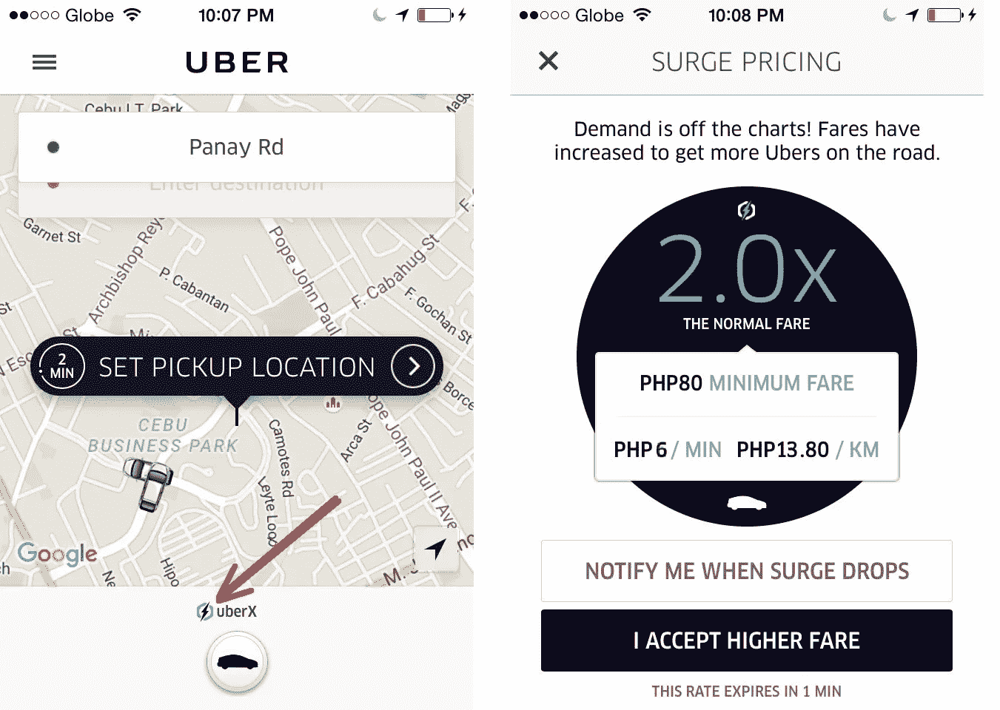
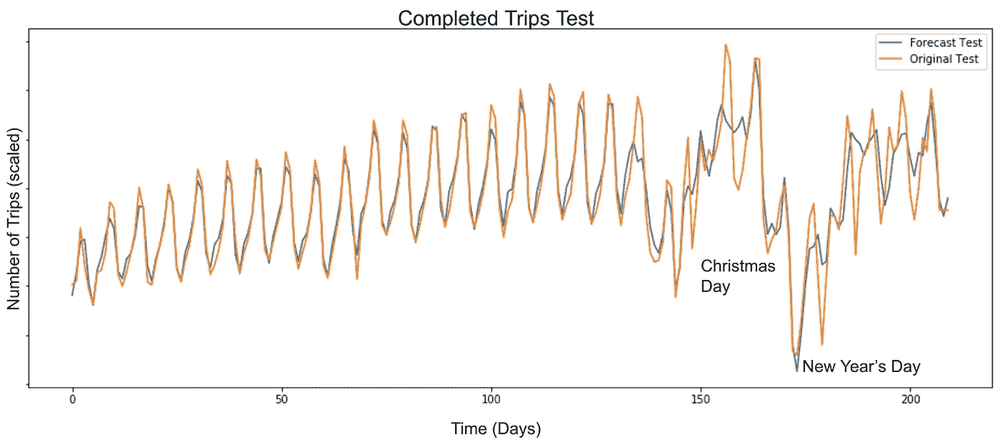
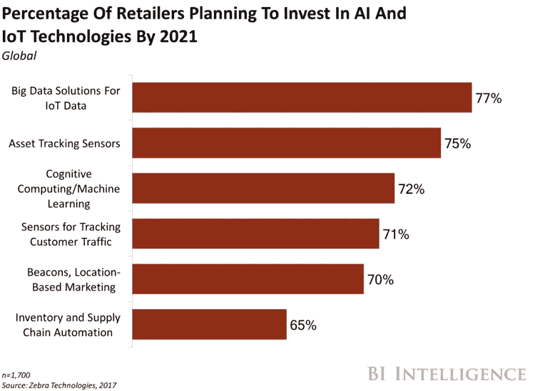
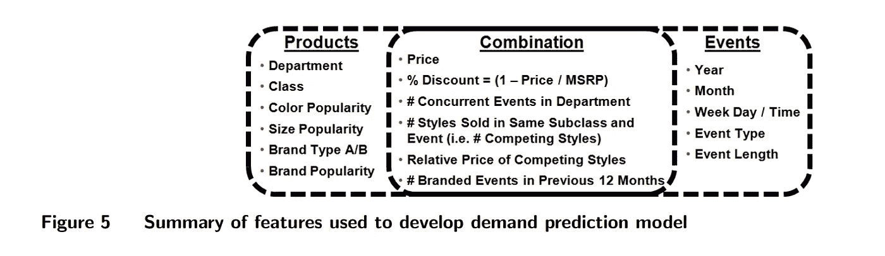
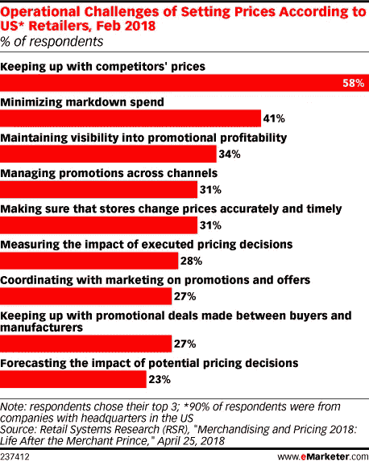

# 解释动态定价:收益管理和定价优化中的机器学习

> 原文：<https://medium.datadriveninvestor.com/dynamic-pricing-explained-machine-learning-in-revenue-management-and-pricing-optimization-4838cca1f228?source=collection_archive---------0----------------------->

想象一下你即将开通城际公交服务。你将如何定价机票，不仅要支付每条路线的费用，而且要达到一定的收入水平，以增长和发展你的业务？你会考虑固定成本、竞争对手的价格，还是两者都考虑？

现实情况是，你需要一个更复杂的定价策略来适应今天高度竞争的市场，并且足够灵活来适应任何变化。在这方面，企业必须解决的两个最大任务是收入管理和价格优化。

我们与来自 Perfect Price、Prisync 的专家以及来自 Tesseract Academy 的数据科学专家进行了交谈，以了解企业如何使用机器学习进行动态定价来实现其收入目标。

 [## 为什么数据将改变投资管理|数据驱动的投资者

### 有人称之为“新石油”虽然它与黑金没有什么相似之处，但它的不断商品化…

www.datadriveninvestor.com](https://www.datadriveninvestor.com/2019/01/25/why-data-will-transform-investment-management/) 

# 动态定价策略 101 和关键方法

动态定价是根据当前市场条件为产品或服务定价的做法。它通常应用于各种行业，例如，旅游和酒店，运输，电子商务，电力公司和娱乐。在快速发展的数字经济中，企业通过动态定价实时调整价格，从大量数据中获益。*[Perfect Price](https://t.sidekickopen05.com/s2t/c/5/f18dQhb0S7lC8dDMPbW2n0x6l2B9nMJW7t5XZs63BqbbN4WJbsqfmSZMW4WYnDM56dvvVf93KmzC02?t=http%3A%2F%2Fwww.perfectprice.com%2F&si=5501814600368128&pi=260a3f68-1fdd-4f26-9b55-42e5717127bc)创始人兼首席执行官 [Alex Shartsis](https://www.linkedin.com/in/thegeneralist/) 说【动态定价利用数据来理解和应对任何数量的变化的市场条件，最大限度地增加收入机会】。*

动态定价可用于各种定价方法。根据 [Prisync](https://prisync.com) 的 [Yigit Kocak](https://www.linkedin.com/in/yigitkocak/) ，最常见的三种方法是*基于成本、*基于竞争对手和*基于需求*。

*   基于成本的定价"*根据业务成本动态调整价格，并将利润率保持在一定水平*
*   基于竞争对手的定价考虑了竞争对手的定价决策。
*   基于需求的定价不言自明:价格随着消费者需求的增长和供应的减少而上涨，反之亦然。

如果执行得当，这些定价策略都会带来各种好处。让我们讨论一下企业如何通过动态定价来提高他们的绩效，以及有哪些陷阱。

# 收获:动态定价的优势

**定价自动化。**实施动态定价的企业可以完全或部分自动进行价格调整，具体取决于他们的需求。定价工具评估大量内部(库存或存货、KPI 等。)和外部因素(竞争对手的价格、需求等。)来生成符合公司定价策略的价格。

**竞争力增强。**无论当前市场状况如何，企业应对当前需求、合理利用库存或存货、或通过特定定价决策发展品牌认知的能力都可以让企业保持活力。例如，一家航空公司可以在需求较低的季节或即将到来的出发日之前，通过打折出售机票来避免销售不佳。

# 警惕什么:动态定价的缺点

**顾客疏远和反弹。**一般来说，人们在预订住宿或航班时会接受价格的升降，但对于零售商和汽车租赁公司来说，情况并非如此。顾客不喜欢感觉他们为同样的产品或服务支付了比其他人更多的钱。这样的定价策略会导致差评、投诉，甚至更糟。客户疏远的一个例子是，当用户将一件商品放入购物篮而没有购买该商品，大约一天后，他们将获得被放弃的购物车商品的折扣代码，”【Kocak 解释道。

一旦老顾客看到卖家给那些在结账前从容不迫的购物者打折，他们可能会生气。这位专家提出了一个顾客必须思考的修辞问题，他问道:“那么，尽管普通顾客为企业带来了更多价值，但为什么他们却受到了不公正的对待？”

例如，数据科学家 Stylianos Kampakis 认为，优步的动态定价可能会在实施过程中引起“一些问题”。专家回顾了一些案例，例如在新年前夕，由于需求极高，客户被收取了荒谬的短途乘车费。

这类案件通常会引起公众的广泛关注——但很少是好消息。例如，一个关于[埃德蒙顿优步顾客](https://www.cbc.ca/news/canada/edmonton/uber-cab-ride-on-new-year-s-eve-pinches-customer-for-1-114-71-1.3387808)马特林赛的故事出现在许多报纸上，他因 20 分钟的长途旅行被收费 1114.71 美元。乘客倾向于在互联网上抱怨他们的糟糕经历，尽管他们通过应用程序获得了激增率的通知或司机的警告(马特的情况)。

**竞相逐底的风险。**价格透明是当今市场的特征之一:消费者只需点击几次，就能找到哪个商家以更低的价格提供了感兴趣的商品或服务。竞争激烈，一些商家轻率地降价以应对竞争对手。那样的话，他们可能会输掉他们发起的价格战。当一家公司故意压低价格，降低利润率时，这种逐底竞争就全面展开了。

应对这些挑战的方法之一是制定数据驱动的定价决策。一些动态定价实现监控和分析关于市场运动、产品需求、可用库存、竞争对手价格、客户的数字足迹以及网站事件(即，最常查看的页面产品/服务、废弃购物车、内容点击次数)的数据，并提出要显示的最合理的价格。此外，这些工具通常允许指定价格限制。

# 动态定价方法:基于规则与机器学习

就软件架构而言，市场上有两种类型的动态定价解决方案。

一个**基于规则的系统**使用一个包含规则的知识库运行——基于领域专家知识的问题事实。这些规则以“if-then”语句的形式表示。当软件检测到数据中的模式时，推理引擎(这种软件的一部分)定义规则和已知事实之间的关系。然后执行适当的规则，软件相应地动作。因此，基于规则的系统仅仅依靠“内置”知识来响应它们工作的环境的当前状态。

基于规则的动态定价解决方案实施为满足特定组织的业务需求而编写的规则。缺乏灵活性意味着基于规则的系统无法根据不断变化的环境调整、添加或删除规则，从而无法应对异常或不可预测的事件。随着新项目的增加或房间或座位数量的增加，这些工具需要越来越多的手动维护。人们必须添加新的规则或修改现有的规则，确保规则不会重复，并且仍然与当前的业务目标保持一致。

数据科学专家 Stylianos Kampakis 指出，基于规则的动态定价存在与基于规则的系统相同的问题:“*尽管它们透明且易于理解，但它们无法达到 ML 系统的性能，除非是非常简单的问题。”*

由**机器学习**支持的软件遵循一种不同的逻辑:它从数据中获得知识([数据挖掘](https://www.altexsoft.com/whitepapers/machine-learning-bridging-between-business-and-data-science/?utm_source=MediumCom&utm_medium=referral))来找到解决问题本身的方法，而不是直接编程。向机器学习系统提供的数据越多，它从中学习的内容就越多，从而提高其性能。换句话说，这种软件不需要在特定情况下做出决策的详细说明。

*Functionality of IBM Dynamic Pricing*

Alex Shartsis 指出，动态定价是一个真正只有人工智能才能解决的问题。这位专家反对基于规则的人工智能系统和基于机器学习的系统，并表示前者由于缺乏灵活性，不是任何动态定价的好解决方案。

根据 Alex 的说法，基于 AI 和 ML 的动态定价解决方案的最佳用例通常涉及大量的日常交易，其中需求波动，消费者愿意支付动态价格。*“大多数人不愿意为他们早上的一杯咖啡支付动态价格，但他们愿意为机票支付动态价格，”这位专家补充道。*

那么，机器学习用于动态定价时会有什么不同呢？AI 和 ML 允许更广泛的数据分析，从而产生更丰富的解决方案功能。内置机器学习定价模型的定价软件具有以下特性和功能:

**通过聚类分析进行细致的客户细分。**这些解决方案可以揭示代表客户特征(包括行为模式)的数据点之间的隐藏关系，并以高准确度确定客户角色群体。

**考虑了大量项目的大量变量。**竞争对手和基于属性的定价是价格建议必须评估的一些影响因素:

*   行业趋势、季节性、天气、位置等外部因素；
*   内部因素，如生产成本和客户相关信息，例如，搜索或/和预订历史，人口特征，收入或设备，以及最终的支付意愿，都是有意义的。

*“我们的软件处理大量数据，包括内部和外部数据。根据不同的用例，我们可能会包含天气、交通、竞争等各种各样的数据。”*夏特西斯说道。

**KPI 驱动的定价。**企业可以设置产品，使定价建议与感兴趣的绩效指标保持一致，例如，利润、营业额或利润最大化、库存优化等。

**无需复杂规则的实时市场数据分析。**可以根据不断变化的需求和市场条件实时自动优化价格，而无需指定复杂的定价规则。

**价格弹性计算。**这些解决方案使用户能够定义价格弹性，以预测客户在做出定价决定之前是否会接受新价格。

这种动态定价解决方案中的业务规则可以用作附加设置。

# 采用动态定价的定价优化和收入管理用例

动态定价本身并不是改变价格。公司的目的是定义一个均衡价格，在这个价格上，需求满足供给，因此双方——服务提供商和客户——都同意一个固定的价格在给定的时间是公平的。在这种情况下，客户的支付意愿是一个参考点。动态定价可用作两种不同定价策略的工具:收益管理和定价优化。最终，这些策略因行业和他们提供的产品而异。

**收入管理**的主要目标是在正确的时间，通过正确的渠道，以合理的价格向感兴趣的客户销售正确的产品，这适用于拥有固定、可预订库存的企业，如航班或酒店房间。(我们之前讨论过酒店的最佳[收入管理实践](https://www.altexsoft.com/blog/business/hotel-revenue-management-solutions-best-practices-revenue-managers-role/?utm_source=MediumCom&utm_medium=referral))。收入管理的实践起源于旅游业，在旅游业中，产品是有限的和易腐烂的，这意味着它们在未来的某个时间会失去价值，但可以提前预订。

在**定价优化**中，企业通过不同渠道预测消费者购买行为(需求)随着产品和/或服务成本的变化而改变的程度。与收入管理不同，它用于衡量客户对价格大体相同的商品的价格变化有多敏感。定价优化主要用于零售业，价格本身成为购买的主要驱动因素之一。

在这一节中，让我们讨论一下交通、酒店和电子商务企业如何实现动态定价。

# 交通:拼车公司的动态价格优化

像优步或 Lyft 这样的交通网络公司成为了各大洲交通部门和出租车公司的强大竞争对手。美国的公共交通公司正在失去乘客，自 2015 年以来显而易见。据肯塔基大学的研究人员称，跨国公司进入一个市场后，每年重型铁路乘客量预计会下降 1.3%，公共汽车乘客量预计会下降 1.7%。使用拼车服务的人越多，这种效应就越强。作者估计八年后乘客数量可能会减少 12.7%。

拼车公司努力从不断增长的骑手和司机群体中获取最大收益。*“动态定价通过提高或降低价格来管理产能限制，以确保需求与供应相匹配，”【Perfect Price 的 Alex 说。*“这方面的一个例子是优步激增定价，它通过定价将一些乘客挤出市场，同时使驾驶对司机更具吸引力，从而确保汽车仍然可用。”**

该公司使用机器学习来预测“优步在任何给定时间将收到的地点、时间和次数”特别注意预测极端情况下的需求，如体育赛事、音乐会、假期或恶劣天气。

当一个社区的客户数量大于可用司机数量时，rideshare giant 会对每笔费用启用乘数(即 1.8 倍或 2.5 倍)。在新年前夕、万圣节、周五或周六晚上，或者在公共活动期间，需求可能会非常高。票价是实时更新的，一个乘数的值取决于免费司机的稀缺程度。乘客会收到涨价通知，并且在找车之前必须同意当前的价格。

*Surge pricing notification in the app.
Source:* [*Uber Cebu Trips*](http://ubercebutips.blogspot.com/2016/03/surge-pricing-ubers-dynamic-pricing.html)

优步还考虑了季节变化对乘数的影响。由于像除夕这样的极端事件每年都会发生一次(是的，我们知道这听起来有多明显，但这不是重点)，研究人员必须处理数据缺乏的问题——数据稀疏。为了解决这个问题，他们使用了一种定制的 LSTM(长短期记忆)模型，这是一种人工[循环神经网络](https://en.wikipedia.org/wiki/Recurrent_neural_network)，具有长时间记忆信息的能力。这些模型使用[时间序列数据](https://www.altexsoft.com/blog/business/time-series-analysis-and-forecasting-novel-business-perspectives/?utm_source=MediumCom&utm_medium=referral)——包含定期观察的数据，显示出良好的预测结果。观察值是数值。

专家们使用了五年的历史数据，这些数据是在圣诞节和元旦等重大节日之前、期间和之后的七天里，每天在美国各地完成的旅行。

此图显示了一个城市在 200 天内预测和实际完成的出行量:

*One of the holidays predicting demand for which was the most difficult is Christmas Day. Source:* [*Uber Engineering*](https://eng.uber.com/neural-networks/)

由于能够评估影响需求的众多变量，优步定义了一个与特定时间的市场状态相对应的价格，以优化其运营。

# 酒店:有效的库存分配和灵活的房价

随着在线分销和透明价格的发展，静态酒店定价在经济上变得低效。2004 年，希尔顿和洲际酒店开始尝试动态定价。一年后，雅高也加入了这个行列，凯悦和喜达屋也为他们的一些企业客户实施了灵活的定价模式。

基于机器学习的定价可以被认为是这种定价技术的下一个发展阶段。

酒店利用机器学习，通过从大量内部和外部数据中提取的见解来支持其定价和库存管理决策。我们花了一整篇文章来讨论在酒店行业中使用[机器学习进行收入管理和动态定价](https://www.altexsoft.com/blog/datascience/machine-learning-redefines-revenue-management-and-dynamic-pricing-in-hotel-industry/?utm_source=MediumCom&utm_medium=referral)，所以如果你想了解更多，请查看一下。

喜达屋酒店(2016 年成为万豪的一部分)使用数据分析来匹配房间价格和当前需求。2014 年，酒店公司[引入了](https://www.cio.com/article/3070384/analytics/starwood-taps-machine-learning-to-dynamically-price-hotel-rooms.html)其收入优化系统(ROS ),投资超过 5000 万美元。

ROS 整合内部和外部数据，并对其进行实时分析，以预测需求和建议最佳费率。内部数据包括过去和当前的预订、取消和入住、预订行为、房间类型和每日价格。预订行为和客户类型(临时旅行者或参加特定活动的大团队中的一个人)会影响定价建议。

收入管理软件还考虑了气候和天气数据、竞争对手的定价、其他来源的预订模式、检查酒店区域是否有音乐会或其他公共活动。

与不断变化的市场条件相对应的房价使连锁酒店能够有效地分配库存，同时实现收入最大化。据现任全球忠诚度高级副总裁的 David Flueck 称，自 2015 年以来，基于 ML 的系统已经帮助希尔顿将需求预测准确率[提高了 20%](https://www.cio.com/article/3070384/starwood-taps-machine-learning-to-dynamically-price-hotel-rooms.html)。

# 电子商务:机器学习驱动的时装零售商定价优化

越来越多的实体零售商和在线商店正逐渐加入其他行业的人工智能和人工智能从业者的行列，以准确应对需求的变化。

*Practical goals that retailers set for investment into AI and IoT technologies.
Source:* [*Business Insider*](https://www.businessinsider.com/ai-ecommerce-report-2017-8)

早在 2013 年，价格情报公司 Profitero 透露，亚马逊每天对[进行超过 250 万次价格变动](https://www.profitero.com/2013/12/profitero-reveals-that-amazon-com-makes-more-than-2-5-million-price-changes-every-day/?utm_source=npr_newsletter&utm_medium=email&utm_content=20190401&utm_campaign=money&utm_term=nprnews)。为了帮助你想象电子商务公司重新定价活动的规模，线下零售商沃尔玛和百思买在当年 11 月分别进行了 54，633 次和 52，956 次每日价格变动。

[商业内幕](https://www.businessinsider.com/ai-ecommerce-report-2017-8)发现，72%的零售商计划到 2021 年投资人工智能和人工智能。

作为一个例子，让我们看看哈佛商学院和麻省理工学院的研究人员克里斯·约翰逊·费雷拉、洪斌·李东旻和大卫·辛奇-李维如何利用机器学习解决一个带有设计师服装和配饰的闪购网站的价格优化问题。

Rue La La 是唯一的在线时尚零售商，组织为期一至四天的同类商品(即款式)折扣活动。在活动期间售出且商家不需要计划后续销售活动的商品被称为首次曝光风格。这些服装的销售额占了零售商收入的绝大部分。这就是为什么管理层需要软件来支持他们的定价决策和预测需求。

*“由于很大比例的首次曝光商品在销售期结束前就销售一空，因此有可能提高这些商品的价格，同时仍然实现高销售率；另一方面，许多首次曝光的商品在销售期结束时销售不到库存的一半，这表明价格可能过高。这些观察推动了定价决策支持工具的开发，使 Rue La La 能够利用现有数据，最大限度地提高首次曝光销售的收入，”*作者解释道。

*Features for a demand prediction problem.
Source:* [*Analytics for an Online Retailer: Demand Forecasting and Price Optimization*](https://www.hbs.edu/faculty/Publication%20Files/kris%20Analytics%20for%20an%20Online%20Retailer_6ef5f3e6-48e7-4923-a2d4-607d3a3d943c.pdf)

研究人员分两个阶段完成了这个项目。首先，他们开发了一个首次曝光项目的需求预测模型。

从 2011 年初到 2013 年年中的销售交易数据(带有特定事件期间项目销售的时间戳)被用于模型训练。*“这些数据包括每件 SKU (dis)的销售数量、价格、活动开始日期/时间、活动持续时间和物品的初始库存，”*专家透露。

零售商还共享产品相关数据，如品牌、颜色、尺寸、MSRP(制造商建议零售价)和等级分类。商品是这样组织的:每个商品(包括所有尺寸)属于一种风格，一组风格形成一个子类，子类是类的一部分，类集合形成部门。这些特征——一种款式的价格、折扣以及竞争款式的相对价格——都与价格有关。对特定款式的需求取决于竞争产品的价格。竞争款式的价格是购物者的参考价格。参考价格代表客户准备(愿意)为商品或服务支付的价格。

其次，科学家使用需求预测数据作为价格优化模型的输入，以实现收入最大化。在考虑参考价格影响的同时解决多产品价格优化问题的最终算法在用于商家日常运营的定价决策支持工具中实现。

*“我们在 Rue La La 进行了一项为期 6 个月的实地实验，包括 6000 种产品，量化了我们的工具对各种价格区间的风格的财务和市场影响，”*大卫·辛奇-列维在 2017 年发表在 [*麻省理工学院斯隆管理评论*](https://sloanreview.mit.edu/article/the-new-frontier-of-price-optimization/) *的文章中说。“最终，决策支持软件为公司带来了 10%的收入增长。收入的增加直接影响了利润和利润率。”*

# 构建基于 ML 的动态定价解决方案:需要考虑的因素

如果现成的产品缺少一些对您的企业来说是必要的功能，请考虑构建您自己的解决方案。当然，产品开发需要大量的资源:一个由领域专家、开发人员、[数据科学专家](https://www.altexsoft.com/data-science-and-machine-learning-consulting/?utm_source=MediumCom&utm_medium=referral)和其他员工组成的团队，足够的时间和预算来完成所有工作。

以下是使用专用解决方案实施动态定价策略时值得考虑的因素。

# 动态定价策略的可行性

Alex Shartsis 建议企业确定对商品或服务的需求是弹性的还是非弹性的:*“要考虑的最重要的因素是动态定价是否适合你的企业。你的客户愿意为商品或服务支付动态价格吗？”*当价格上涨导致需求下降的百分比小于价格上涨的百分比时，价格被认为是无弹性的。

例如，人们将继续使用电或水，尽管每天的价格在白天波动。对汽油的需求也缺乏弹性。题为 [*道路交通需求的收入和价格弹性回顾的元分析的作者 Phil Goodwin、Joyce Dargay 和 Mark Hanly 确定，如果燃料的实际价格上涨并保持 10%，燃料消耗量将在一年内下降约 2.5%，从长远来看，降幅将超过 6%。*](http://citeseerx.ist.psu.edu/viewdoc/download?doi=10.1.1.192.1387&rep=rep1&type=pdf)

相反，当消费者可以很容易地找到变得更贵的产品/服务的替代品时，需求是有弹性的(例如，一条来自 X 品牌的牛仔裤)，所以你可以考虑动态定价。

# 大量高质量的数据

数据是构建任何以机器学习模型为核心的系统的内部组件。结构化和干净的历史数据(关于过去事件的数据)对于训练性能良好的模型是必须的，因为模型输出的准确性取决于数据的质量。您可以在我们的专门文章中找到关于数据集准备的基本技术的更多信息。

模型训练需要向算法“输入”用于分析的训练数据，之后它将输出能够在新数据中找到目标值的模型。在我们的例子中，目标值是数字——最优价格。

数据集应该包含代表尽可能多的变量的数据点:每种服务或产品的历史价格，消费者需求信息，以及我们之前提到的内部和外部影响因素。竞争对手的价格数据对于做出明智的决策也至关重要。事实上，85%参与 2018 年 4 月零售系统研究的零售商[承认](https://www.emarketer.com/content/the-relentless-pressure-to-discount)跟上竞争对手的价格是他们最大的挑战。

*Operational difficulties that US retailers face when setting prices.
Picture source:* [*eMarketer*](https://www.emarketer.com/content/the-relentless-pressure-to-discount)

Stylianos Kampakis 补充说，关于客户价格敏感度的数据可能是一个额外的收获:*“如果一家公司甚至有可能通过价格实验来了解不同产品的价格敏感度，这也将是一个非常有价值的信息来源。”*

# 在模型中设置定价界限

至关重要的是，规定最低价格，以保持期望的利润水平，以及最高价格，以匹配品牌身份与价格。例如，[麦肯锡的专家](https://www.mckinsey.com/industries/retail/our-insights/pricing-in-retail-setting-strategy)建议零售商加入竞争护栏，以避免商品定价远高于竞争对手。对于背景商品(与关键价值商品相反——最能推动价值认知的商品),超过 30%到 50%的价格差距会打消顾客再次光顾商店的动机。

# 跟踪绩效并允许价格调整

该解决方案可以允许用户指定他们需要改变价格的时间间隔。Perfect Price 的创始人指出，该工具可以自动更新价格，根据应用程序的不同，可以每隔几分钟、每周或每月更新一次。

Stylianos Kampakis 认为，避免客户反弹的一个好方法是通过动态定价模型来检查产量。“*为此，最好对一小部分用户进行 A/B 测试，看看用户会有什么反应，”*数据科学家解释道。

监控模型性能和调整特性(在这种情况下是定价因素)也是必要的:*“确保定期更新模型。例如，如果你是一个在线零售商，时尚趋势等因素可能会使你的模式过时。因此，您需要建立一个可以每年或每季度重复的模型更新流程，”【Kampakis 补充道。数据科学家考虑数据过时的速度来计划模型性能测试。*

# 结论

一个有效的定价策略对于经营任何企业的重要性是不可否认的。当消费者可以很容易地比较商品或服务的价格(甚至在计划购物时)并选择满足其需求和购买力的报价时，拥有在线业务的公司正在一个高度竞争的环境中工作。

与此同时，随着计算速度的提高、数据存储量的减少以及用于探索性分析的数据可用性的提高，企业家可以受益于技术进步，从而以合理的价格应对不断变化的市场条件。

动态定价可用于收益管理(库存易腐且数量有限)和定价优化。在这种背景下，机器学习允许企业大规模地实施动态定价，同时考虑数百个甚至数千个定价因素，包括价格弹性，并向具有相应支付意愿的客户群显示具体价格。

*原载于 AltexSoft tech 博客“* [*动态定价讲解:收入管理和定价优化中的机器学习*](https://www.altexsoft.com/blog/datascience/dynamic-pricing-explained-use-in-revenue-management-and-pricing-optimization/?utm_source=MediumCom&utm_medium=referral)