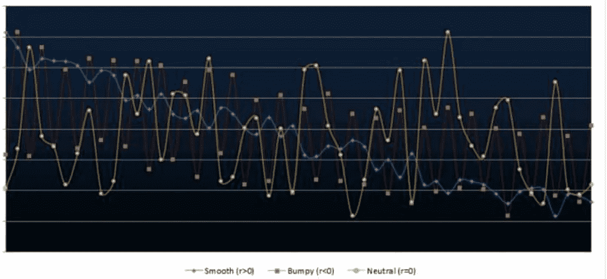
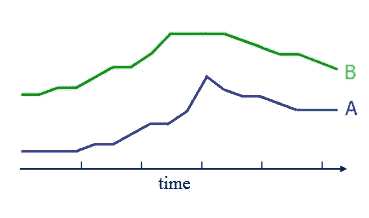
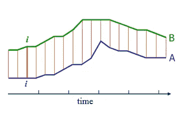
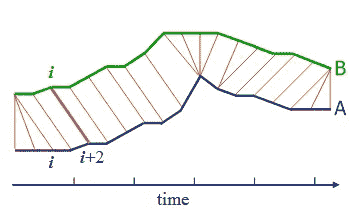
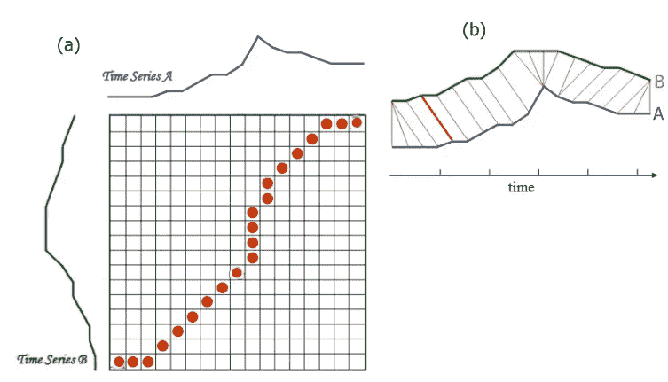
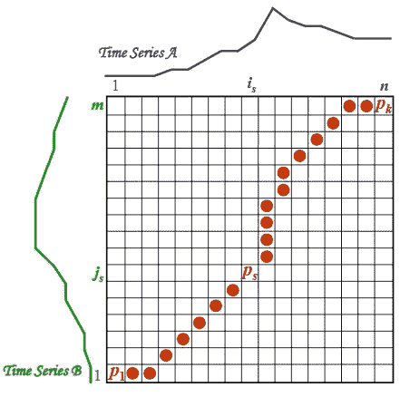
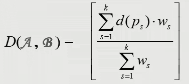
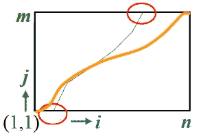
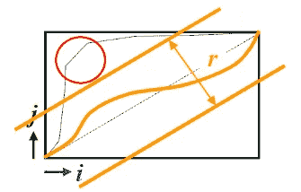
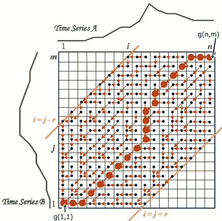

# 动态时间扭曲(DTW)

> 原文：<https://medium.datadriveninvestor.com/dynamic-time-warping-dtw-d51d1a1e4afc?source=collection_archive---------0----------------------->

[](http://www.track.datadriveninvestor.com/1B9E)

## 时间序列分析算法



# 时序数据

**时间序列**是按时间顺序索引的一系列数据点。通常，时间序列是在连续的等间隔时间点取得的序列。



Figure: Example Time Series A & B

# 什么是 DTW？

**动态时间弯曲** ( **DTW** )是衡量两个时态时间序列之间相似性的算法之一，这两个时间序列的速度可能不同。

时间序列比较方法的目标是产生两个输入时间序列之间的距离度量。两个时间序列的相似性或不相似性通常是通过将数据转换为向量并计算向量空间中这些点之间的欧几里德距离来计算的。

[](https://www.datadriveninvestor.com/2019/01/23/which-is-more-promising-data-science-or-software-engineering/) [## 数据科学和软件工程哪个更有前途？—数据驱动的投资者

### 大约一个月前，当我坐在咖啡馆里为一个客户开发网站时，我发现了这个女人…

www.datadriveninvestor.com](https://www.datadriveninvestor.com/2019/01/23/which-is-more-promising-data-science-or-software-engineering/) 

一般来说，DTW 是一种在一定限制下计算两个给定序列之间最佳匹配的方法。简单来说，就是用来衡量两个时间序列之间的距离。

# 为什么用 DTW？



Compare Time Series using Euclidean/Manhattan Distance

两个时间序列之间的任何距离(欧几里德距离、曼哈顿距离……)都可以用于比较。这里，一个时间序列上的第 I 个点与另一个时间序列上的第 I 个点对齐。这将产生一个**差的相似性分数**。



Compare Time Series using DTW

DTW 给出了两个时间序列之间的非线性(弹性)排列。简单地说，它寻找两个时间序列之间的最佳对齐。这产生了一个更直观的相似性度量**，允许相似的形状匹配，即使它们在时间轴上是异相的。**

# DTW 的代表权

让我们看看上面的两个时间序列，时间序列 A，蓝色的，B，绿色的。

DTW 的基础建立在两个时间序列之间的距离/混淆矩阵的计算上。如下图(a)所示。

在图(A)中，时间序列 A 的值绘制在 x 轴上，时间序列 B 的值绘制在 y 轴上。

最佳对准由(b)中的绿线表示。(b)中的红线代表混淆矩阵中的红点。



(a) Distance / Confusion matrix (b) DTW

# 扭曲函数



Calculation of Warping function

为了找到 ***A*** 和 ***B*** 之间的最佳对齐，我们需要找到通过网格的路径。

```
**P = p1,…,ps,…,pk
ps = (is,js)** which minimizes the total distance between them.
```

这里的 **P** 称为**翘曲函数。**

# 时间归一化距离度量

A 和 B 之间的时间归一化距离由下式给出:



```
where**;
d(ps)**: distance between is and js 
**ws > 0**:weighting coefficientBest alignment path between A and B: **Po=arg(p)min(D(A,B))**.
```

# 边界条件

这定义了对齐路径从左下角开始，到右上角结束。

```
 ***i1= 1, ik =n and j1 = 1, jk = m***
```



Boundary Conditions of a DTW (Source:[link](http://www.mathcs.emory.edu/~lxiong/cs730_s13/share/slides/searching_sigkdd2012_DTW.pdf))

边界保证比对不会部分考虑序列之一。

# 翘曲窗

好的对齐路径是偏离对角线太远的路径。

```
***|is–js|≤ r, where r > 0*** is the window length.
```



Warping Window of a DTW (Source:[link](http://www.mathcs.emory.edu/~lxiong/cs730_s13/share/slides/searching_sigkdd2012_DTW.pdf))

扭曲窗口保证了对齐不会试图跳过不同的特征而停留在相似的特征上。

# DTW 算法如何工作

以下步骤详细阐述了 DTW 算法的功能。



Illustration on How DTW Works

> 从 g(1，1) = d(1，1)的计算开始。
> 
> 计算第一行 g(i，1)= g(I–1，1) + d(i，1)。
> 
> 计算第一列 g(1，j) =g(1，j) + d(1，j)。
> 
> 移到第二行 g(i，2) = min(g(i，1)，g(I–1，1)，g(I–1，2)) + d(i，2)。Book 为每个单元格保留该相邻单元格的索引，该索引构成了最低得分(红色箭头)。
> 
> 从左到右和从下到上继续，网格的其余部分 g(i，j) = min(g(i，j–1)，g(I–1，j–1)，g(I–1，j)) + d(i，j)。
> 
> 沿着红色箭头，从 g(n，m)开始并向 g(1，1)移动，回溯穿过网格的最佳路径。

# **复杂度**

计算 DTW 的复杂度为 **O(m * n)** 其中 **m** 和 **n** 代表每个序列的长度。

计算 DTW 的更快技术包括 **PrunedDTW** 、 **SparseDTW** 和 **FastDTW** 。

# DTW 的应用

1.  来发现行走中的相似之处。如果一个人走得比另一个人快，或者在观察过程中有加速和减速。
2.  口语单词识别应用程序。用于将样本语音命令与其他命令进行匹配，即使此人说话比预先录制的样本语音快或慢。
3.  相关功率分析

# 参考

[1][http://web . science . MQ . edu . au/~ Cassidy/comp 449/html/ch11s 02 . html](http://web.science.mq.edu.au/~cassidy/comp449/html/ch11s02.html)

[2][https://databricks . com/blog/2019/04/30/understanding-dynamic-time-warping . html](https://databricks.com/blog/2019/04/30/understanding-dynamic-time-warping.html)

[3][http://www . mathcs . emory . edu/~ lxxiong/cs 730 _ S13/share/slides/searching _ sigkdd 2012 _ DTW . pdf](http://www.mathcs.emory.edu/~lxiong/cs730_s13/share/slides/searching_sigkdd2012_DTW.pdf)

[4][https://riptutorial . com/algorithm/example/24981/introduction-to-dynamic-time-warping](https://riptutorial.com/algorithm/example/24981/introduction-to-dynamic-time-warping)

[5][http://www . speech . zone/exercises/DTW-in-python/the-final-DTW-code/](http://www.speech.zone/exercises/dtw-in-python/the-final-dtw-code/)

希望你通过这篇博文对 DTW 算法有一个清晰的了解。如果你对这篇博文有任何问题或评论，请在下面留下你的评论。

干杯！