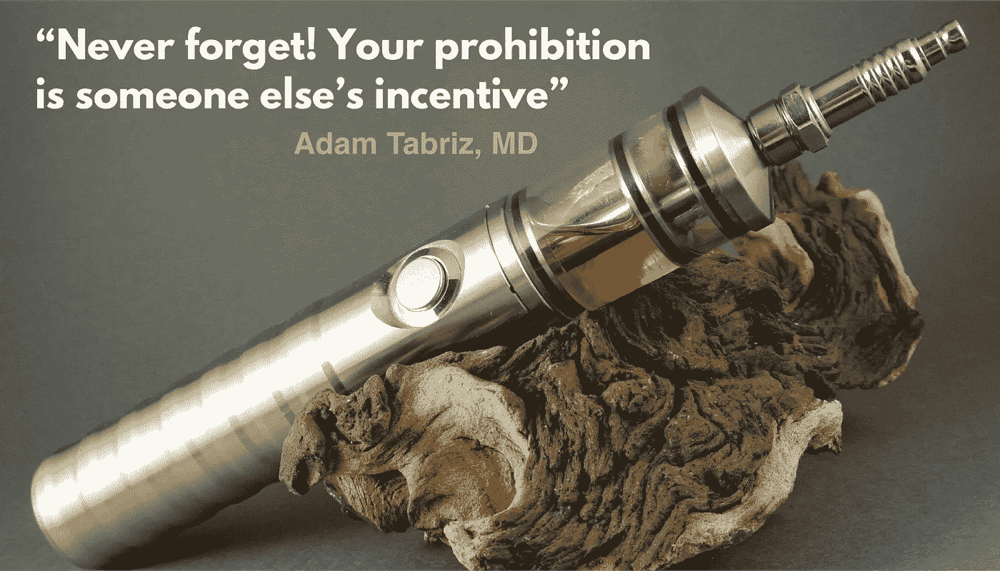

# 电子烟，独特的吸引力，古老的流氓，但新的禁令

> 原文：<https://medium.datadriveninvestor.com/e-cigarette-a-distinct-appeal-age-old-hoodlum-but-a-new-prohibition-b54727f73a14?source=collection_archive---------13----------------------->

e-cigarette

电子烟是当今多层面社会政治话语的主要话题。现代尼古丁阴谋是由菲利普莫里斯美国公司的母公司奥驰亚主持的，约翰米德尔顿公司— —国家的虚伪和大众媒体的宣传。我渴望证明它是这个街区的新流氓，必须与剩下的一帮玩家分享一块馅饼。对于了解历史的人来说，这种混乱是显而易见的，因为这个国家已经通过了烟草、大麻和酒精的禁令及其过去的反弹。今天，我们又一次来到这个研究所，用一个新的主题重温这个百年老问题。

最近的是围绕电子烟和朱尔的丑闻。

根据最近的报道，朱尔一直在宣传“新的电子烟不是针对儿童的”，意图赢得美国人的同情

 [## 医疗保健的未来正在被一场大型技术入侵所塑造|数据驱动型投资者

### 过去十年，全球经济的所有部门都经历了大规模的数字颠覆，而卫生部门现在…

www.datadriveninvestor.com](https://www.datadriveninvestor.com/2018/11/02/the-future-of-healthcare-is-being-shaped-by-a-big-tech-invasion/) 

它强调了试图推翻大众媒体和各州指控的主要回应。尽管如此，Juuls 的要求被州议员否决了。事实上，先前的考验秀并没有太多关于青少年 vaping 被放在节目中，因为它仅仅是关于政治和地盘之争。这似乎似曾相识——回顾历史，我们可以呼应支持这一体系的类似转向和动机。我们可以借自己，在今天的法律贩卖趋势及其垄断的共同性，尼古丁工业综合体无疑已成为其前身的主模板。这是一个通过大公司的游说努力实施的计划，这些大公司无疑是营销、战略、承认即将到来的国家野心和伪装的大师。企业实体深谙从政府缓慢的步伐中牟取暴利之道，它们在被迫分享这块地盘之前，快速而广泛地占领了市场。

**所以——是时候回顾历史了**

**尼古丁和烟草**

1998 年标志着美国四大烟草公司(菲利普·莫里斯公司、R. J .雷诺兹公司、布朗·威廉姆森公司和罗瑞拉德公司，也称为“大公司”)与 46 个州的司法部长达成烟草主和解协议(MSA)的时代。

这项法定解决方案在两党的重大争议中遭遇挫折。一些人称这一安排是对烟草业的宽容。其他人认为，通过创建一个违宪的卡特尔安排，财政承诺是为了平衡国家医疗补助预算，只是有利于政府和大型烟草公司。

**酒精和禁酒令**

[19 世纪的酒精丑闻有其自身的一系列经济、社会和政治挑战。禁酒主义催生了酗酒、家庭暴力和酒吧政治腐败的时代。由虔诚的新教徒领导的运动，通过治愈社会疾病来结束酒精饮料贸易，从而削弱政治反对派。不可避免地，它导致了第 18 修正案的废除；1920 年通过的授权立法(禁酒令法案)取消了执行联邦禁令的规则，并设立了禁酒令。骚乱引发了犯罪团伙的垄断和颠覆，他们能够控制城市和州的啤酒和酒类供应。](https://en.wikipedia.org/wiki/Prohibition_in_the_United_States)

2015 年的一份报告估计，取消禁令在 1934 年至 1937 年间每年产生 4.32 亿美元的净社会帮助，约占国内生产总值的 0.33%，其中 32.5 亿美元的总收益主要包括消费者和生产者过剩、税收收入的增加和犯罪暴力成本的降低。根据哈佛大学历史学家丽莎·麦吉尔的说法；禁酒令导致了联邦政府对各州权力的细化。

**禁酒令垄断中的大麻之战**

[大麻在美国的法律历史](https://en.wikipedia.org/wiki/Legal_history_of_cannabis_in_the_United_States)(法律术语大麻或大麻)主要涉及其在国内的医疗、娱乐和工业用途。1906 年标志着一个时代，越来越多的限制和标签大麻作为一种毒药被发现。禁酒令的扩展始于 20 世纪 20 年代，到 20 世纪 30 年代，各州都进行了大量的监管。美国第一部联邦法规是 1937 年 8 月 2 日实施的《大麻税法》,该法案对大麻销售征税。但今天，经过两个世纪的不断斗争和法律斗争，大麻的使用正在一个州一个州地进入零售市场的货架——尽管根据联邦立法法案，大麻仍然被认为是非法的。如今，经营一家大麻药店每年要花费 20 万至 30 万美元的许可费，外加每盎司大麻花 50 美元的年费和总销售收入的 15 %的税——这对该州的立法者来说并不是一件坏事。

**朱尔是有着新鲜伪魅力的新流氓**

虽然大麻的禁令正在消失，但与禁止性垄断的接力棒一样，朱尔的禁酒主义者正在通过推进新的不法分子在甜蜜的联邦理性下创造新的收入模式来传递。因此，通过切饼谈判的方式，让孩子成为双方赚取数十亿美元的最终筹码。

**Vaping 和电子烟**

手持电池供电装置用于蒸发尼古丁溶液。与烟草相比，蒸汽溶液没有气味。它们的浓度、强度和味道很容易改变，对青少年很有吸引力。

**新闻媒体的现状**

旧金山立法者禁止在该市销售或分销电子烟以及带香味的烟草产品，期望它们获得美国食品药品监督管理局(FDA)的批准。一旦在 2020 年全面生效，旧金山的新法规将禁止该市的烟草商店销售未经食品和药物管理局(FDA)“批准”的电子烟。尽管目前市场上还没有“FDA 授权的电子烟”!

最近，北卡罗莱纳州对朱尔提起诉讼，指控其设计、营销和销售电子烟来吸引年轻人。康涅狄格州总检察长也宣布对朱尔的健康主张和对年轻人的呼吁进行调查。为了回应全国性的指控和 FDA 的反对，朱尔首席执行官凯文·伯恩斯在 3 月份的《华盛顿邮报》上写道:“我们停止了向传统零售店出售调味朱尔豆荚，加强了我们的在线年龄验证流程，加强了我们的零售商合规性，并退出了我们的脸书和 Instagram 账户。”但是，家长和老师们仍在抱怨初中和高中环境中的“流行病”

**困境的实质**

为了全神贯注于《启示录》，我既不使用电子烟也不吸烟草，尽管正在进行的诬陷朱尔的新闻引发了我的好奇心，打算试试朱尔。但是，到目前为止，这种批判性的抑制已经压倒了我的好奇心。虽然，目前限制少数人销售电子烟的立法举措可能不会被视为禁止行为，但其本质毫无疑问指向那个方向，因为它分享了共同的概念；凭借主动抑制——即使范围、策略和最高目标不同。

电子烟是一种有效的尼古丁释放系统，对发烧友和儿童更有吸引力，因此会带来更多的生理和心理不良影响。今天闻起来像烟草或烟，使用指定的区域吸烟是不酷的，因此，Vaping 是 21 世纪的泰然自若的长矛，而且更方便，更时尚。但是，重蹈覆辙可能很难解决问题。酒精和香烟也曾经是他们那个时代的酷产品，然而，禁酒令并没有为人类进步服务。它的消亡一直受到好奇心和冒险主义的束缚，而这种好奇心和冒险主义只适用于任何人，不论其文化或种族。它往往因人而异。它也可能在青少年和儿童身上表现出来，在成年人无意识的无所不包的判断下表现出来。

对于青少年来说，好奇心类似于探索和尝试新事物的渴望，而同龄人的压力则是激发探索行为的加速器。对于一个青少年来说，在“vape-room”(学校的厕所)里尝试流行的东西会很酷。如果被用来推翻对其潜在后果的感性经验，独特性可以成为一个足够强大的工具。

**抑制与禁止**

一个典型的父母对青少年实验的直接的、几乎一致的、仍然有争议的反应是可以理解的禁止。一个动议，最紧迫和短期的影响。禁止是一种个人态度，统称为一种安排，被认为反映在地方、州和联邦政策中，甚至在民主结构中。一旦禁止在立法中以官僚形式出现，就会通过自上而下的影响进一步增强其负面影响，形成禁止、好奇、实验和法律量级的恶性循环。由于青少年尚未形成对抗不健康行为的内在抑制因素，任何好奇心的爆发都可能引发后一个循环。

从逻辑上来说，像任何其他好奇心驱使的行为一样，为了阻止和防止青少年产生幻觉，一个人必须对特定的行为、冲动或欲望进行有意识或无意识的约束，统称为抑制。它有助于必要的社会功能，内部抑制，并减少某些冲动的行为。

取消自由选择会使我们的行动产生事与愿违的结果。明确地说，尊重电子烟的自由选择和自由并不妨碍适当的法规，因为每个社区都需要有一个明确的政策来确保公共安全，特别是儿童的安全。但是全面禁止像销售某些产品这样的政策，不管一开始看起来多么有效，由于侵犯了个人空间，注定会失败。

朱尔通过满足某些消费者需求来销售占据特殊市场的产品。像其他商品一样，它也受到竞争、营销和销售策略的影响。公众的特权是审查朱尔像任何其他潜在的危害，并安装必要的教育计划，以打击其滥用儿童和成人。捷径解决方案，包括禁止营销和广告，并禁止其在零售点的销售，助长了其欺骗性的重要性和非法交易的动机和标签外的使用，如将其作为可食用的物品消费。尼古丁产品最危险的不是它们的直接副作用，而是在没有后备教育计划的情况下，通过过早禁止可能形成的潜在文化或品牌。矛盾的是，计划中的方法会干预建筑抑制对蒸发练习的吸引力。

**问题**

禁令、捷径政策和反禁令的恶性循环是美国及其他国家的系统性问题；除了通常不实行禁令的国家。所述系统性疾病的病因学是破坏自由选择和个体自主原则的隐藏机制。人们必须从经验中吸取教训，酒精、大麻和现在以这样或那样的方式禁止购买电子烟将创造一个黑市，从而产生腐败。赢得与敌人(毒物)的战斗；人们需要支持透明度、明智的监管、问责制和封闭性。这让我想起了《教父》电影(弗朗西斯·福特·科波拉的杰作)中迈克尔·科利昂说的一句名言:

*“亲近你的朋友，亲近你的敌人”*

这句话被普遍归因于《教父》第二部中的这个场景；迈克尔·科利昂和弗兰基·潘坦格利谈，安排和罗萨多兄弟的会面；就在迈克尔差点被暗杀之后。企业行业的合法毒品卡特尔也最好通过透明和参与来处理。然而，主要的问题是，一些国家在历史上制造了不必要的争议，在与企业的每次对话中都设置了一个盲点，反映了比现在更多的乏味争议。

**问题来源**

个人选择和公共安全的最大破坏因素之一是政治。如最初所述；打着不同口号的政治运动已经取得了历史性的成功，在没有能力提供最佳保护的情况下赢得了大规模无记名投票。相反，它们助长了腐败、非法贩毒和垄断。虚伪是一个额外的因素，它暂时但肯定能够说服每个人，禁令将停止药物实验。

出于好奇，青少年和儿童吸食或尝试非法药物的原因是存在的。其中一些包括无聊、抑郁、自卑、体重减轻等。但市场营销不被认为是一个上市。在这个国家和这个时代，青少年经常像成年人一样在刑事法庭上受审，双重标准是假定青少年缺乏理解营销角色的能力。无论是朱尔对青少年的宣传，还是他们对儿童有吸引力的营销方式；是两种不同的纠纷。显而易见，互联网是公开的，儿童可以像广告处方药一样访问互联网。但是人们很难回忆起学校广告牌上的处方药广告。尽管法定饮酒年龄限制是 21 岁，但青少年仍在饮酒。

根据发表在《美国公共卫生杂志》上的一项研究，尽管通过提高法定饮酒年龄和饮酒年龄降低了酒精相关伤害的发生率，但年轻人的饮酒习惯并没有明显减少，尤其是 17 至 20 岁的年轻人。此外，21 岁以后狂饮增多，证实了青少年期待 21 岁生日时饮酒礼仪的好奇心因素。

多年来，大麻被认为是入门毒品。近年来，娱乐用途在一些州已经合法，其他州也纷纷效仿。安全一直是政治上的自我辩护。然而，它可以有效地和替代地迅速实现，而不造成禁止。具有定制的封闭社区标准以及教育的高水平监管是防止建立黑市和颠覆的有害后果的最有效手段。

突然的立法动议本质上主要是经济性的，旨在有助于分得一杯羹。与管制相反，禁止不是一项客观的法令。事实上是官僚主义、主观歧视的催化剂，对公众和对最高个人统治都具有破坏性。