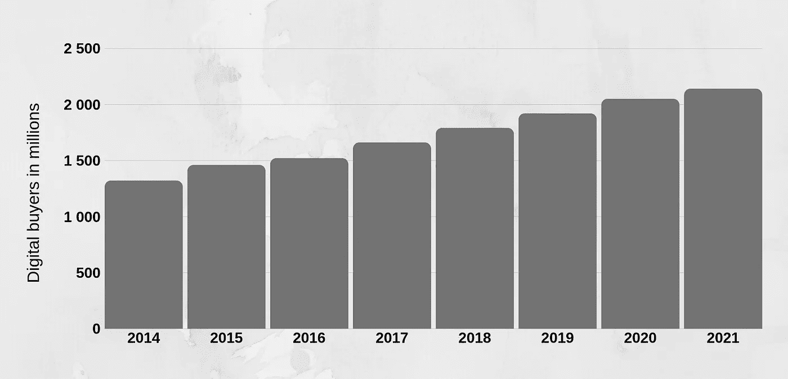
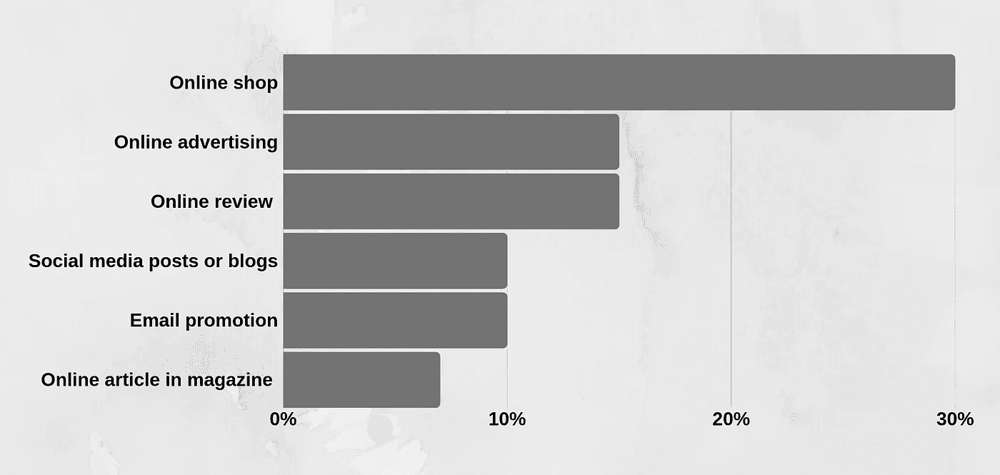
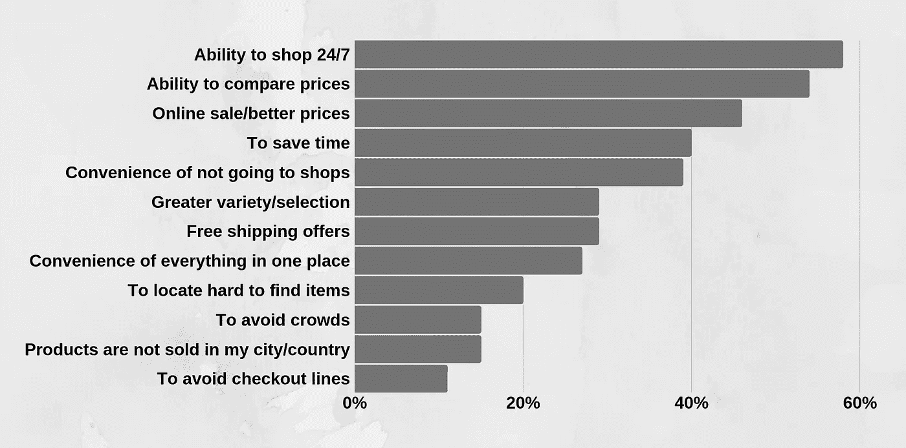

# 无国界电子商务:方法、技巧和趋势

> 原文：<https://medium.datadriveninvestor.com/e-commerce-with-no-borders-approaches-tips-and-trends-5d5b50bc3a07?source=collection_archive---------12----------------------->

© NordWood Themes

你上一次在网上买东西是什么时候？几分钟前还是几天前？这可能发生在不久之前，也许你现在正在阅读这篇文章。没什么特别的，你只是全球近 [**二十亿数字买家**](https://www.statista.com/statistics/251666/number-of-digital-buyers-worldwide/) **中的一员，而且这个数字还在不断增长。**

数字经济正在扩张，占据了我们生活的许多不同方面。有什么比只需点击几下鼠标就能买卖产品和服务更方便的呢？预计未来两年在线销售额将达到 50 亿美元，几乎是 2018 年的两倍。这意味着我们与电子商务世界的接触将会越来越多。**至于智能手机，Forrester 预测到 2022 年销售额将超过 1750 亿美元。令人印象深刻，不是吗？**

[Digital buyers worldwide](https://www.statista.com/statistics/251666/number-of-digital-buyers-worldwide/)

行业在成长，行业在变化，跟着变化也是蛮刺激的。在我的公司 [Forbytes](https://forbytes.com/) 中，我们跟踪电子商务领域发生的一切，并享受在我们的解决方案中实施新想法的创造性过程。越来越多的公司带着数字化转型的需求来到我们这里，他们正在寻找关于电子商务领域业务挑战的技术解决方案的建议和指导，这正是我们准备并愿意提供帮助的地方。

 [## 2019 年值得关注的 20 种数字营销趋势和技术|数据驱动的投资者

### Faisal 在加拿大工作，拥有金融/经济和计算机方面的背景。他一直积极从事外汇交易…

www.datadriveninvestor.com](https://www.datadriveninvestor.com/2019/02/04/20-digital-marketing-trends-techniques-to-watch-out-for-in-2019/) 

有很多关于电子商务行业的神话，例如机器人将在不久的将来做我们所有的工作，我们将能够使用我们的大脑进行支付。**我想谈谈电子商务的真实趋势和当前最流行的决策。**这实际上是在现有市场中构建和使用的，也是我们在项目中使用的。很有可能你会发现这些趋势和实践正在你最喜欢的网上商店中使用，或者，作为一个开发者，你会在你自己的项目中使用它们。

# **没有多通道方法就没有收益**

电子商务不再有国界。如果你想成功，找到一个客户并邀请他们来你的商店是不够的:你的商店需要去你的客户那里。电子商务企业比以往任何时候都更需要一个以上的渠道来使其业务在网上取得成功。

> “如果你想成功，找到一个客户并邀请他们来你的商店是不够的:你的商店需要去你的客户那里。”

[2018 年全渠道购买报告](https://grow.bigcommerce.com/rs/695-JJT-333/images/report-2018-omnichannel-buying.pdf)显示了有趣的统计数据:45%的顾客更喜欢在线上品牌商店购物，65%喜欢实体店。很大一部分在线买家更喜欢亚马逊(78%)、易贝(34%)，甚至脸书(11%)。同一份报告显示，客户在网上花费了 69%的收入，这对我们来说是个好消息，尤其是对电子商务商家来说。

[Online channels where consumers saw the product before purchasing](https://assets.kpmg/content/dam/kpmg/xx/pdf/2017/01/the-truth-about-online-consumers.pdf)

为了扩大你在这个行业的业务，**你的公司需要尽可能多的渠道**，覆盖尽可能多的销售市场。根据我们的经验，至少两种方法的组合会产生好的结果。我们以 Trademax 为例。Trademax 是斯堪的纳维亚最大的在线家具和室内设计零售商。我们已经与他们合作了近七年，并通过使用多渠道方法帮助他们成长。

结果是(现在仍然是)重要的。从一个小小的家族公司，成长为营业额近 1 亿美元，年增长 35%左右的庞大网络零售商。我们为他们创建了**多渠道平台，能够管理不同国家的在线商店:瑞典、挪威、芬兰和丹麦。** Trademax 还在这些国家开设了线下商店，这有助于提升顾客的购买体验，并有助于改善业务成果。

# **关注新的电子商务概念**

让我们来看看帮助电子商务企业推动行业发展并使其参与者更具创造力的新方法和新概念。我们的第一个例子是直运。**直运是一个相当新的重要组成部分，可以让您的业务模式更加方便客户。**其主要目的是确保生产和最终客户之间的供应链更加直接。电子商务企业充当了供应商和买方之间的桥梁。

通过你的电商平台，客户向你购买，产品直接从供应商/生产商发货。根据 [2018 年商家电子商务状况报告](https://www.ecommercefuel.com/ecommerce-report-2018/)，16.4%的网店已经在使用直运。**这帮助他们扩大了 32.7%的收入，并提高了 1.74%的平均转化率。**这种方法有很多优点，尤其是在确保企业不把钱花在储存库存和降低管理费用上。

另一个有趣的电子商务方法的例子来自我们的长期客户合作伙伴 Offerta。Offerta 服务市场既是 B2B 又是 B2C，帮助客户找到可靠的公司，涵盖从清洁到翻新或建造房屋或办公室的广泛服务。他们是第一家在瑞典市场使用这一概念的公司。

由于我们专注于通过使用技术提供商业价值，我们能够为 Offerta 的持续增长和成功做出贡献。**如今，Offerta 是瑞典最大的服务提供商市场。在他们的支持下，140 个行业的 28，000 多家服务公司能够找到他们的客户。**到目前为止，Offerta 已经从公司向客户提供了超过 140 万项服务，甚至激励竞争对手创建类似的业务。

[Reasons consumers shop online instead of in stores](https://assets.kpmg/content/dam/kpmg/xx/pdf/2017/01/the-truth-about-online-consumers.pdf)

# **聚光灯下的移动改编**

所有数字商务目前都在向移动设备转移，更准确地说，是一种移动优先的方式。研究显示，智能手机用户的数量持续增长，用户平均每天花在手机上的时间超过 5 个小时。[超过一半的网上商店客户确认](https://www.brightedge.com/resources/research-reports/brightedge-2018-mid-year-mobile-research-roundup)他们使用移动设备寻找新的品牌和产品，这对任何电子商务企业来说都是一个巨大的潜在受众。谷歌研究显示，现在超过 40%的在线交易是通过智能手机完成的，这意味着移动电子商务应用不仅仅是一种短暂的趋势，而是额外利润的真正来源。

> “谷歌研究显示，现在超过 40%的在线交易是通过智能手机完成的，这意味着移动电子商务应用不仅是一种短暂的趋势，而且是额外利润的真正来源。”

**移动优先方法**是一种软件开发方法，在这种方法中，解决方案的构建考虑到了移动设备，并且是所有进一步开发的基础。这意味着，设计您的解决方案首先要为移动设备工作，然后再为桌面设备工作。我们总是建议我们的电子商务客户采取移动优先的方法来开发电子商务软件解决方案。

例如，我们为 Offerta 进行了研究，发现超过一半的 B2B 客户通过智能手机提供服务。因此，在为移动设备开发时，UI/UX 专业知识至关重要。可用于显示产品或服务信息的屏幕空间有限。展示能带来非凡转化率的信息既是一门艺术，也是一门科学。

# 人工智能、增强现实和语音控制越来越受欢迎

当然，在电子商务趋势中，有令人兴奋的技术的摇滚明星，它们有望极大地改变行业。这些方法中的大部分仍处于早期阶段，在将它们应用到您的业务中之前应该仔细考虑，以确保它们能够带来价值。

例如，我们目前正在测试**语音控制**在我们的一个客户合作伙伴网站上的一些功能。语音控制可能是电子商务业务的一个好机会，因为 Alexa 或 Google Home 设备正在设定购买趋势。到目前为止，超过 20%的搜索请求是通过语音进行的，专家预测到 2020 年这一比例将达到 50%。语音控制需要长尾关键词，因为语音搜索请求通常比键入的搜索更长。因此，我们需要找出这项技术将如何为不同类型的企业服务——在我们的案例中是 Offerta。

**增强现实(AR)** 将保持增长。可以解决电商企业越来越经常面临的困难。通过 AR，客户将能够试穿一件产品，看看它是否适合他们，与产品进行互动，并做出明智的选择。假设你需要买一个新沙发，但不确定你最想要哪一个。你从零售商那里下载应用程序，选择不同的沙发选择，并通过应用程序查看在你的公寓里会是什么样子。这种方法已经在使用了，我们正计划在 Trademax 中使用它。

> “通过 AR，客户将能够试穿产品，看看它是否适合他们，与产品互动，并做出明智的选择。”

又锦上添花，**人工智能**。使用人工智能可以简化业务中涉及分析和大数据的工作。个性化的用户体验、聊天机器人对话、销售分析，甚至可靠的预测都是人工智能可以在你的业务中使用的方面。这是一个不可低估的工具。为了创建一个功能强大的人工智能工具，你需要有一个好的数据库。缺乏相关数据会导致不正确的结论和错误的行动。

我们正在使用人工智能方法来构建更可靠的用户行为分析工具，这将有助于我们在未来改善销售流程。有了人工智能，我们能够帮助人们创建更具体、更具体的服务请求。从而为他们提供更好的客户合作伙伴电子商务服务体验。我们甚至可以分析用户是否会继续使用和使用该平台的概率。考虑到这一点，当电子商务企业开始雇用人工智能专家时，我不会感到惊讶。

…

*发表于 IT ID 杂志 2019 年 6 月 8 日来自* [*利沃夫іт集群*](https://itcluster.lviv.ua/en/)

# 阅读更多信息:

 [## 如何为您的项目成功构建角色和职责

### 任何项目的成功都需要每个团队成员负起责任。与任何公司一样，个人需要…

medium.com](https://medium.com/datadriveninvestor/how-to-structure-roles-and-responsibilities-for-your-project-success-3ab952db3510)  [## 管理良好的项目的 5 个特征

### 为了获得最好的项目结果，你首先需要了解开发过程并澄清问题…

medium.com](https://medium.com/@donlowe/5-characteristics-of-a-well-managed-project-bcccfe9e5b50)  [## 如何使用项目组合管理来控制软件开发

### 在许多情况下，处理软件开发的企业会面临管理问题。的…

medium.com](https://medium.com/@donlowe/how-to-use-portfolio-management-to-control-software-development-91b8efe90775)