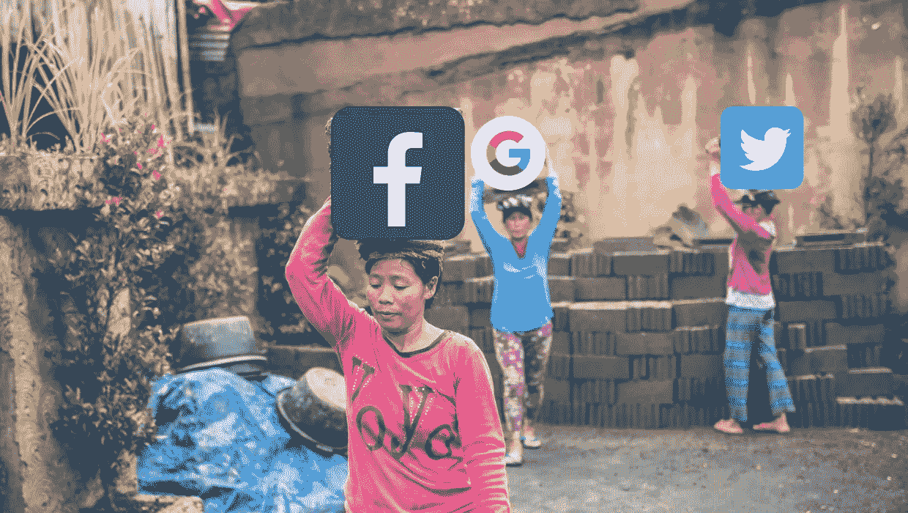

# 电子奴隶:科技经济的基础

> 原文：<https://medium.datadriveninvestor.com/e-slavery-the-foundation-of-the-tech-economy-84d2d4f955f7?source=collection_archive---------16----------------------->

这篇文章最初发表在[www.insopra.com](https://www.insopra.com/2018/09/27/e-slavery-the-foundation-of-the-tech-economy/)

在由所罗门·诺萨普改编的 1853 年奴隶叙事回忆录[为奴十二年](https://www.imdb.com/title/tt2024544/)中，一个出生于纽约州的自由非裔美国人于 1841 年在华盛顿被两个骗子绑架并被卖为奴隶。在被释放之前，诺萨普在路易斯安那州的种植园工作了 12 年。

大多数以奴隶制为主题的真人电影都很老套，但却真实地再现了现有的现象，因为有一个非常富有的地主，他有一个非常大的棉花种植园，数百名奴隶日夜工作，耕种、收割等等。作为在农场所有这些工作和鞭打的回报，奴隶的报酬通常只是一天一顿饭和一个不太舒适的房间。他们最终不得不在每个工作日都尽最大努力，即使他们的工作没有任何经济动力。

我们这一代中的许多人认为奴隶制是 19 世纪的事情，但奴隶制却存在于我们的日常生活中。就像变色龙一样，奴隶制改变了形式和外观，以在当前条件下持续运作，而不考虑时代。随着社交媒体的兴起，另一种形式的奴隶制也出现了，我喜欢称之为电子奴隶制，这种奴隶制非常猖獗，并且正在全面运作，这种奴隶制形式的美妙之处在于，许多直接受到影响的人甚至不知道存在的情况。

# 免费劳动力

奴隶提供的是免费劳动力。主人必须支付的劳动成本就是获得奴隶的成本。在电子奴役的情况下，这种情况下的“劳动”是数据。
想想有多少人一直在网上分享。在像脸书、谷歌、推特这样的平台上。用户与朋友甚至公众分享照片、状态更新、位置，同时标记那些可能没有意识到自己与照片、事件和地点联系在一起的朋友。

所有这些[数据](https://www.gsb.stanford.edu/insights/michal-kosinski-end-privacy)描绘了一幅我们的图画，我们的好恶，情感触发因素等等。机器人，机器，甚至数据科学家，可以用来评估或得出这个人的数字构成。此外，面部识别和机器学习技术也在不断发展。这回避了一个事实，即科技公司比我们更了解或可能更了解我们。这对任何需要定位客户的人来说都是非常有用的。

# 富人

电子奴隶中的有钱人指的是数字或数据公司，这些公司从广告中赚了很多钱，有时并不考虑隐私。他们经营的商品是数据，而且有大量的数据。“普通人每天产生大约 0.77 GB 的数据，”罗杰·海恩尼说，[数据](https://datum.org/)的首席执行官，一个由区块链支持的数据市场平台。

这些都是世界上最富有的公司，价值数十亿美元，有些甚至达到了万亿美元大关，如苹果和最近的亚马逊。截至 2018 年 6 月 6 日，脸书以 5415 亿美元的净资产在[福布斯 100 强数字公司](https://www.forbes.com/top-digital-companies/list/)榜单上排名第 26 位。谷歌的母公司 Alphabet 排名第 51 位，市值 7664 亿美元，Twitter 同期市值 247 亿美元。

这些是尖牙尖牙，科技界的大腕，每年销售价值数十亿美元的广告。【2018 年脸书广告收入超过 130 亿美元，比 2017 年增长 42%。谷歌利润丰厚的广告业务占 Alphabet 本季度收入的 86%，达到 262.4 亿美元。这项利润丰厚的业务得益于它能够从 14 亿用户那里收集大量免费数据(就 facebook 而言)。

# 残羹剩饭

脸书声称该平台是免费的，但作为免费服务的交换，他们会收集你的数据。与 Twitter 一样，谷歌也免费提供大部分服务。例如，通过使用这些免费服务，你可以让谷歌自由访问你储存在平台上的电子邮件、联系人、日历、照片、文档、表格和演示文稿。更糟糕的是，它跟踪你的在线活动:搜索、访问的网站、点击的广告、位置、设备信息等等。当然，谷歌以聚合广告定位机制的形式向其商业客户出售这些信息。

免费服务平台如雨后春笋般涌现，是许多公司的主要商业模式。考虑到这些公司通过出售你的数据赚了多少钱，你得到的免费服务是垃圾。许多人被科技公司这种非常有效的数据收集技术所吸引，甚至对这些碎屑感到满意。

Haenni 估计，每年每个人从我们的数据中获得的价值超过 2000 美元。这可以是偏好、地理位置、与其他人的联系、消费模式等形式。

# 宣称你的价值

宣称自己价值的绝对最佳方式是完全远离社交媒体，但这对很多人来说几乎不切实际。“让我们删除脸书”运动确实看到许多人删除了他们的脸书账户，但与仍在使用该平台的用户相比，损失的账户微不足道，该平台现在的用户数量已接近 15 亿。

像 [Datum](http://datum.org/) 这样的公司提出了一个可以交换数据的公平平台。“该网络旨在为研究人员、公司或个人等实体提供最高效、最顺畅的数据访问，同时尊重数据所有者的条款和条件。”，允许你直接从你的数据中获得收益，而不是像谷歌这样的数据管理者从你所有的辛勤工作中获得收益。

像区块链科技这样的发展中技术可能很快就会使完全在线匿名成为可能，这使得科技公司更难收集用户数据。

# 数据经济

如今这些公司很多都在逐渐从“互联网公司向数据公司”转变。谷歌已经从一家搜索第一的公司转变为一家需要大量数据来完成的人工智能公司。他们开发了像谷歌双工这样的技术，可以像人一样打电话。这些公司明白大数据对他们的商业模式有多重要，他们愿意走捷径来获得大数据。
这些公司中有许多价值超过 1 万亿美元，其他公司有望在本财年结束时达到这一水平。这些收入超过了整个州的收入，是由数据获取和销售推动的。这些公司的数据飞速增长，他们正在做更多的事情来利用这一现代商品。

根据来自 [RS Components](https://uk.rs-online.com/web/) 的研究，谷歌[在人工智能(AI)方面向](https://www.techrepublic.com/article/the-10-tech-companies-that-have-invested-the-most-money-in-ai/)投入了最多的资金。自 1998 年以来，科技巨头已经披露了近 86 亿美元的收购交易。

自 2006 年以来，该公司已在已披露的交易中花费了近 39 亿美元，其中大部分用于 2014 年以 32 亿美元收购 Nest Labs。Nest Labs 的收购是 RS Components 清单上最大的一笔投资，包括 15 家科技巨头的 103 笔收购。其他投资包括亚马逊 8.71 亿美元，苹果 7.86 亿美元，英特尔 7.76 亿美元，微软 6.9 亿美元

从这些数字来看，我们预计电子奴役将继续上升。

## 来自 DDI 的相关故事:

 [## 为什么数据将改变投资管理——数据驱动的投资者

### 有人称之为“新石油”虽然它与黑金没有什么相似之处，但它的不断商品化…

www.datadriveninvestor.com](https://www.datadriveninvestor.com/2019/01/25/why-data-will-transform-investment-management/)  [## 成为数据科学家所需的 8 项技能——数据驱动型投资者

### 数字吓不倒你？没有什么比一张漂亮的 excel 表更令人满意的了？你会说几种语言…

www.datadriveninvestor.com](https://www.datadriveninvestor.com/2019/02/07/8-skills-you-need-to-become-a-data-scientist/)