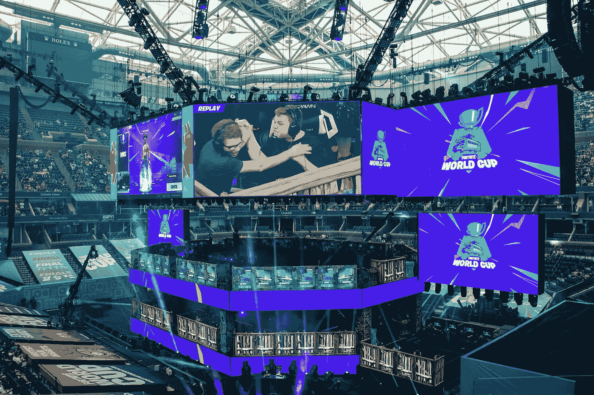
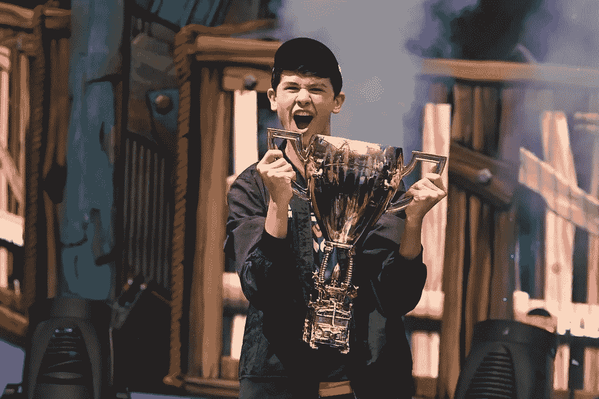
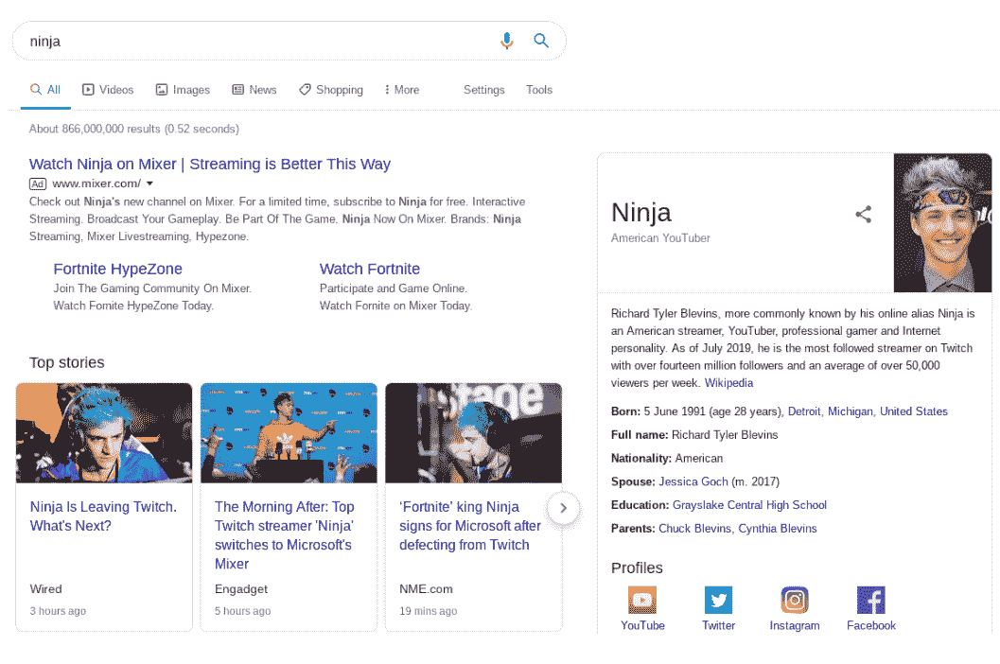
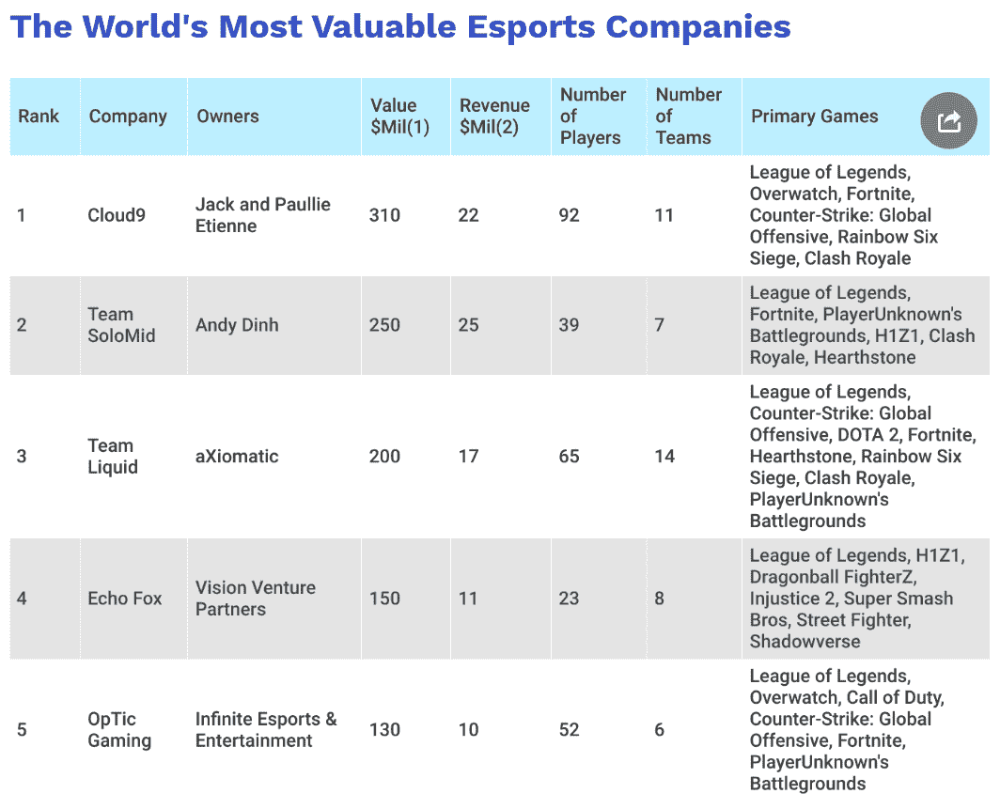
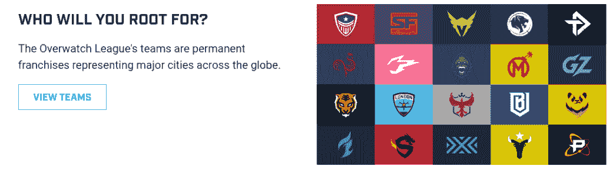
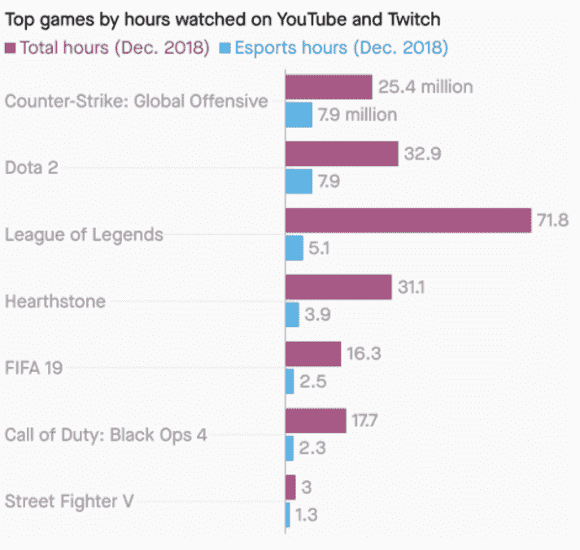
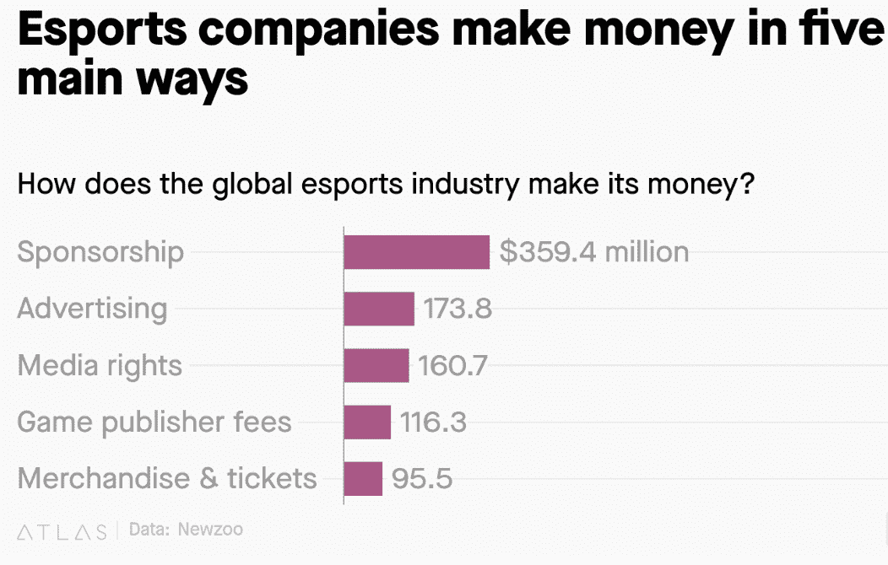
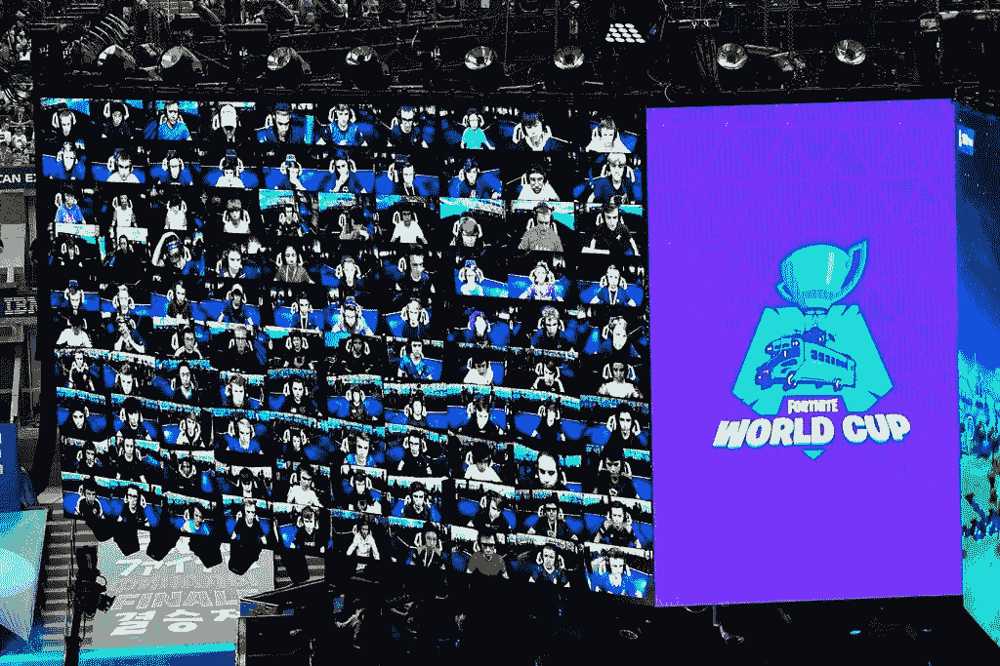

# 你需要知道的。

> 原文：<https://medium.datadriveninvestor.com/e-sports-what-you-need-to-know-d91e7ef554ec?source=collection_archive---------8----------------------->

## 一个泡沫，还是一个真正的网飞对手？

上周末我偶然发现了堡垒之夜世界杯。

 [## 2019 年即将改变世界的技术|数据驱动的投资者

### 很难想象一项技术会像去年的区块链一样受到如此多的关注，但是……

www.datadriveninvestor.com](https://www.datadriveninvestor.com/2019/01/17/the-technologies-poised-to-change-the-world-in-2019/) 

比赛在亚瑟·阿什体育场(纽约皇后区美国网球公开赛的主场)举行，该体育场通过人行道与花旗球场(纽约大都会棒球队的主场)相连。

在去看棒球比赛的路上，我看到了大量宣传这场比赛的海报。我把头探进去看看发生了什么事。

原来，那是堡垒之夜世界杯。

你可能在新闻中看到过:一个 16 岁的孩子赢得了 300 万美元的锦标赛冠军。

这种不对称让我震惊。

一边是古老而悠闲的棒球，另一边是超快的新时代电脑游戏。一个支点。

值得搞清楚所有围绕电竞比赛的大惊小怪是什么。这就是本文的目的，它涵盖了:

*   堡垒之夜世界杯的数据
*   电子竞技世界的结构
*   个体玩家的力量
*   主要投资者

# 堡垒之夜世界杯的数据

如果你和我一周前一样远离这个话题，我想快速浏览一下堡垒之夜。如果你能跟上进度，请随意跳过。

在一次灾难性事件后，100 名玩家被丢到一个岛上，在那里他们必须建造建筑，寻找武器，并互相射击。为了增加一点悬念，竞技场的大小在不断减小，导致了一场生死决战。最后一个人(在电子竞技中，几乎总是男人在玩)获胜。

**在纽约州举行的堡垒之夜锦标赛实际上是一个持续了一个周末的活动，以现场音乐和与比赛相关的小吃摊为特色。**

以下是堡垒之夜事件的规模:

*   4000 万名选手在网上争夺决赛席位。
*   决赛选手分享了 2400 万美元的奖金。
*   获胜者是 16 岁的凯尔·吉尔斯多夫，他赢得了 300 万美元。
*   凯尔说他一天玩 8 小时，一周五天，我相信。早在比赛之前，他就和一家电子竞技管理公司签约了。
*   他甚至不是电子竞技的最大赢家——李书行·塔卡索米从游戏比赛中赚了 420 万美元。
*   2.5 万人支付了 50 至 150 美元在阿瑟·阿什体育场观看比赛。
*   另有 240 万人在线观看了直播。

如果我们想弄清楚这一切的走向，那么“事件”方面尤其具有启发性。

组织者(堡垒之夜开发商 Epic Games)选择美国公开赛是因为体育场周围的容量。

这允许一种“沉浸式体验”,以细致入微的细节再现游戏世界。这些细节，正如迪士尼所熟知的，在试图建立一个持久的品牌时非常重要。

这些游戏也是为了经久耐用而设计的。堡垒之夜于 2017 年发布，可以免费玩，并定期更新新的“赛季”。

# 但是堡垒之夜并不是唯一的游戏

为了评估电子竞技的长期未来，有必要弄清楚这种昔日亚文化的结构。

除了个人痴迷于在空闲的房间里玩游戏，然后去参加奇怪的锦标赛之外，还有很多事情要做。

堡垒之夜可以组队玩，也可以个人玩。个人游戏形式开辟了不同的商业途径(类似于社交媒体“影响者”动态)，像泰勒“忍者”布莱文斯每月从赞助中获得 7 位数的收入。

红牛和 Uber Eats 与 Blevins 有合同，Blevins 从亚马逊旗下的 Twitch 叛逃到微软的 Mixer 平台，成为全球头条新闻。

这些都是“有影响的人”，但他们也在竞争中相互对抗。

这增强了对观众的吸引力，一如既往。然而，大多数其他游戏都是团队进行的。

电子竞技公司雇佣玩家以公司的名义参加比赛，许多公司建立了自己的竞技场来举办比赛，而其他公司则建立了专门的训练设施。球员们一起住在这些训练设施里，可以付费从一个队转到另一个队。

相对于当前收益，以下公司的估值(由《福布斯》进行)非常乐观。

正如《福布斯》同一篇文章后面提到的[，](https://www.forbes.com/sites/mikeozanian/2018/10/23/the-worlds-most-valuable-esports-companies-1/#5f4134ab6a6e)

> “我们 12 家公司的平均企业价值是 2018 年预计销售额的 13 倍。太丰富了。脸书和亚马逊的市盈率分别是今年预期收入的 7.4 倍和 3.8 倍。”

显然，有些人真的相信电子竞技的商业潜力。

# 主要投资者

阿森纳足球俱乐部和洛杉矶公羊队的老板斯坦·克伦克在 2017 年收购了一支名为洛杉矶角斗士的电子竞技队。他支付了 2000 万美元让他的团队加入守望联盟，并在今年 7 月出价 3000 万美元参加英雄联盟冠军赛。

新英格兰爱国者队的老板罗伯特·克拉夫特投资 2000 万美元将一支球队带到波士顿。对大多数人来说，这是一笔不小的数目，但对克伦克和卡夫这样的投资者来说却不是。

或许他们只是在两面下注。作为“传统”运动的主要参与者，他们不想错过下一件大事。

然而，除了纯粹的受欢迎程度，还有一系列因素激发了他们的兴趣。

对于克伦克来说，一个主要的卖点是联赛和锦标赛的新兴结构，这将为他的团队提供一些稳定性。这意味着除了 Twitch 上不可预测的直播领域之外，一个可行的市场在他们的掌控之中。

监视联盟现在包括美国、英国、亚洲和南美洲的球队。全球元素对体育特许经营者很有吸引力。NFL 和 NBA 已经在美国以外安排了一些比赛，但良好的旧地理环境仍然为全球市场设置了障碍。

电子竞技没有这种阻力。

团队有制服，但没有实际用途。纽约的一个团队最近[与一个街头服饰品牌](https://www.adweek.com/agencies/an-esports-team-created-a-fashion-line-for-gamers-to-feel-more-like-traditional-sports-fans/)合作，也创建了一个时尚系列。显然，这不仅仅是让人们看电脑游戏。

在竞技场和训练设施方面，相当大的一笔投资已经投入到该产品中。

只要练习足够多，任何人、任何地方都可以赚到数百万的感觉是电子竞技魅力的一个方面。然而，职业选手需要比普通选手强得多，否则整个比赛就会失败。

监督联盟国家队必须支付球员最低年薪 50，000 美元，这样他们才能专注于比赛。如果球队没有履行这一承诺，他们将被逐出联盟。

再次强调,《守望先锋》只是一个游戏，由一个开发者制作。这只是多样景观的一个组成部分。事实上，它在大计划中甚至没有那么受欢迎。

**我们可以再次缩小来估量更广阔的市场，对于透视:**

*   直播网站 Twitch.tv(被亚马逊以 9.7 亿美元收购)带来的观众比 CNN 还多。任何时候都有超过 100 万人访问该网站。
*   18-25 岁的游戏玩家观看其他人在线玩游戏的时间比观看广播体育节目的时间多 77%。
*   德国的游戏锦标赛 ESL Cologne 为使命召唤比赛出售了一个拥有 5 万个座位的足球场。
*   据估计，今年电子竞技产业的价值超过 10 亿美元——到 2022 年，这一数字将翻一番以上。

> “我们与堡垒之夜的竞争(并输给了它)超过了 HBO。”
> 
> —网飞

# 电竞公司是怎么赚钱的？

堡垒之夜世界杯的与会者表示，与球迷愿意支付的价格相比，门票很便宜。

那些电子竞技现象背后的人今天并不是为了赚快钱，尽管他们知道用他们喜欢的产品吸引观众的好处。

目前，将粉丝与游戏捆绑在一起的纽带很脆弱。最好先加强它们，然后开发商才能放心地承担一些商业风险。

目前的电子竞技赞助往往是怪物能量饮料和耳机公司等，但万事达卡和 SAP 最近也加入了竞争。

再加上克伦克和卡夫这样的投资者的参与，当涉及到榨取体育特许经营权时，存在着知识过剩的问题。

如果他们能在球迷和球队之间产生一种亲切感，新的收入来源将立即打开。

然而，这仍然是一个很大的“如果”。传统体育特许经营结构的应用可能会被证明是一个错误的步骤。

粉丝关注单个玩家。通常，他们会关注他们最喜欢的游戏。到目前为止，他们不跟随团队。除了他们拥有的球员和他们玩的游戏，这些球队没有什么持久的吸引力。

> 将亚文化带入主流总是充满陷阱。

电子竞技可能会毫发无损地实现转型，在未来几十年里提供第一个真正高票房的视频游戏娱乐产品。克伦克、卡夫和他们的亲信可能会带来急需的商业优势，让大企业刮目相看。

另一方面，他们可能会在一个日益缩小的世界里建造自己的建筑，与竞争对手进行殊死的斗争。

至少他们现在开始实习了。

***报名参加高科。简讯，免费接收最新科技趋势的每周更新:***

【https://mailchi.mp/16ff381c064c/hi-tech-signup 