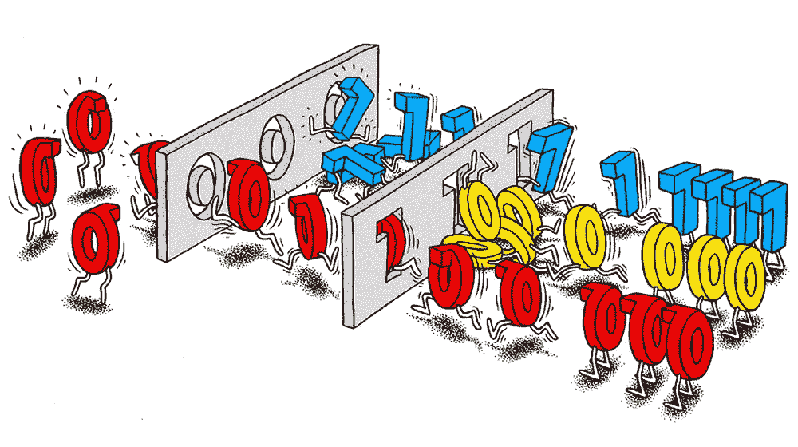
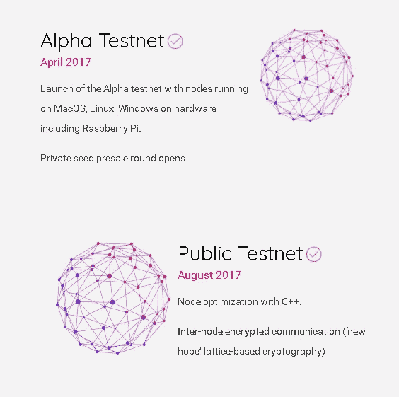
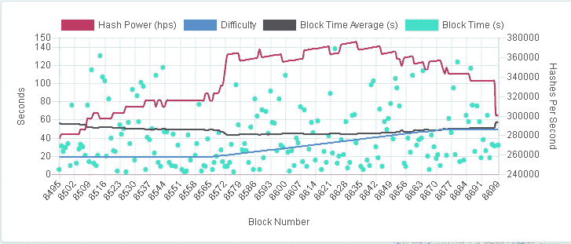
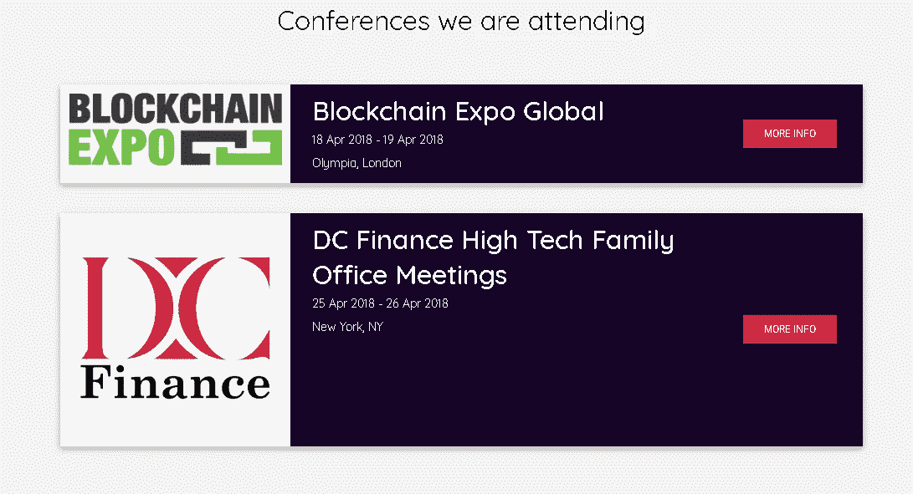

# 早期投资:面向未来的区块链

> 原文：<https://medium.datadriveninvestor.com/early-bird-investing-future-proofing-blockchain-df279b29b92a?source=collection_archive---------1----------------------->

## 抗量子密码术

Source: [Quanta Magazine](https://www.quantamagazine.org/computings-search-for-the-best-quantum-questions-20160602/)

## 什么是抗量子账本？QRL

QRL 使用基于哈希的签名树，称为扩展 Merkle 签名方案或 XMSS。简而言之，它创建了一次性使用的私钥，这使得区块链在不运行在量子计算机上的情况下，对于量子计算肖尔算法是安全的。创建一个“为今天做准备，为明天做准备”的廉价账本

QRL 团队继续指出，他们将利用股权证明，但计划在年底前推出 PoW。这是值得注意的，但真正的优势在于实施一个核心系统，许多区块链可能需要在未来几年适应这一系统。

其中一个还没有准备好，但有望成为同类产品中最强大的，具有 50 量子位的处理能力。相比之下，目前最快的通用量子计算机最大容量为 20 量子位。新的 IBM 原型也使其在量子计算领域处于领先地位，因为它比谷歌仍在研发的 49 量子位机器更快。— [苏珊·塔尔瓦](https://www.dailyo.in/user/13205/sushanttalwar)

这句话应该会吓到你。这些都不是从事这项技术的初创公司。市场上的每一个主要参与者都在进行一场不为公众所知的军备竞赛，以创造更强更快的量子计算机？为什么？

不用深入难以解释的细节，量子计算机是计算机和硅技术的下一波浪潮，有望彻底改变我们所知的世界。与传统的计算方法不同，传统的计算方法依赖于比特，并使用遍历所有可能的解决方案来找到问题的答案，量子计算机使用量子比特，量子比特的操作方式有助于它们从一个角度看迷宫，这有助于它们直接找到解决方案，而不必遍历所有可能的否定答案。”——[SUSHANT TALWAR](https://www.dailyo.in/user/13205/sushanttalwar)

这意味着这些机器不仅能在几毫秒内破解你的 WiFi 密码，还能在几分钟内破解政府数据库。除了比我们见过的任何东西都更快更小。如果蒸汽动力是第一次科技淘金热，那么量子计算就是下一次。

# 为什么是 QRL？比特币就不能实现同样的功能吗？

简短的回答，没有。长的回答，不太可能无效。[更多关于这个。](https://theqrl.org/faq/coinsupdate/)

这些人是认真的，他们比公司领先一大步，将成为未来几年区块链需要具备的能力的缩影。*还是他们？*

即使是银行也不能幸免。如果你还没有完全掌握情况的严重性，国家安全局，美国宇航局和其他许多人都在研究这项技术。这种发展是冷战的现代版本。如果你认为中国没有参与竞争，那你就错了。

类似于这个的区块链团队将是巨大的，因为量子计算的核心思想威胁到了区块链的整体。它们不是齐头并进的，但如果实施得当，是可以做到的。

## 团队:

16 名年轻男性。这个没什么可说的了，他们的网站没有链接他们的 Linkedin。然而，他们的团队主要由工程师和建筑师组成，目前可能不会受到太多关注，尽管是来自早期研究人员的关注。所以我自己做了一些，在我遇到 3-4 个不太好的结果后。

 [## 出版物-莱昂·格鲁特·布鲁因德里克

### “HILA5 Pindakaas”:带纠错的格基加密的 CCA 安全性[IACR ePrint][Code]丹尼尔 J…

leongb.nl](https://leongb.nl/publications/) 

这位先生已经发表了一些关于后量子阻力的文章，并参与了一些项目。他是我期望在一个致力于创造量子证明区块链的团队中找到的人。也许这是一个比人们想象的更简单的解决方案？然而里昂被列为顾问。

我敢肯定，他们在读完这篇文章后有更多值得夸耀的东西。([https://medium.com/the-quantum-resistant-ledger](https://medium.com/the-quantum-resistant-ledger))所以我再一次重申，这是一个专注于**创造解决方案的团队，并将其投入使用**目前还不是一个完全可用的产品。这并不意味着他们不被关注，因为看起来他们在进行一场他们自己的比赛。

## 结论:

很难说你应该把赌注压在这支由梦想家组成的乌合之众团队身上，以防范谷歌或 IBM 等公司正在开发的技术。但我能说的是，当涉及到区块链时，他们那边正在创造的技术将需要一个解决方案和保障。这是一个雄心勃勃的项目，一旦他们巩固了领先地位，就会掀起波澜。这可能是为什么他们还没有发起一场全面的运动来让他们的名字在那里出现的原因。我很兴奋看到这些家伙能做什么，如果我不得不提出一个估计，当你想真正开始害怕这种动态。我会在年底安排一次体检。

他们让你检查的是 QRL 浏览器，看看量子令牌是怎么回事，还有一个钱包。

[https://explorer.theqrl.org](https://explorer.theqrl.org/lastblocks)

