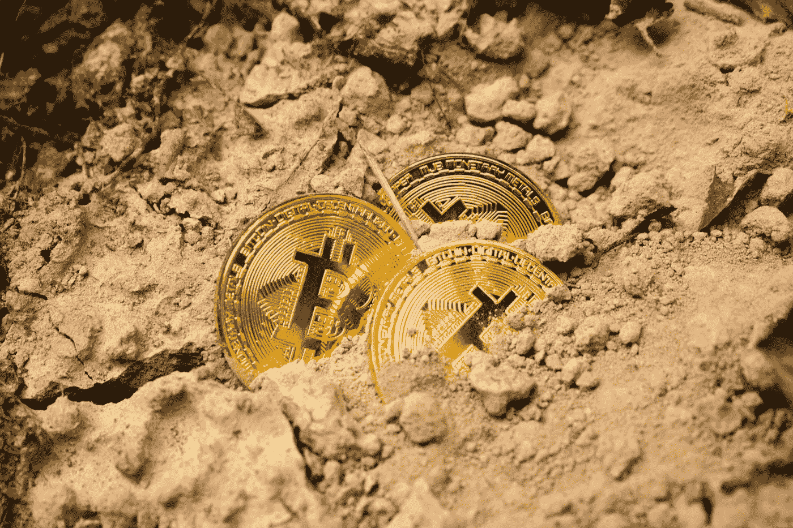
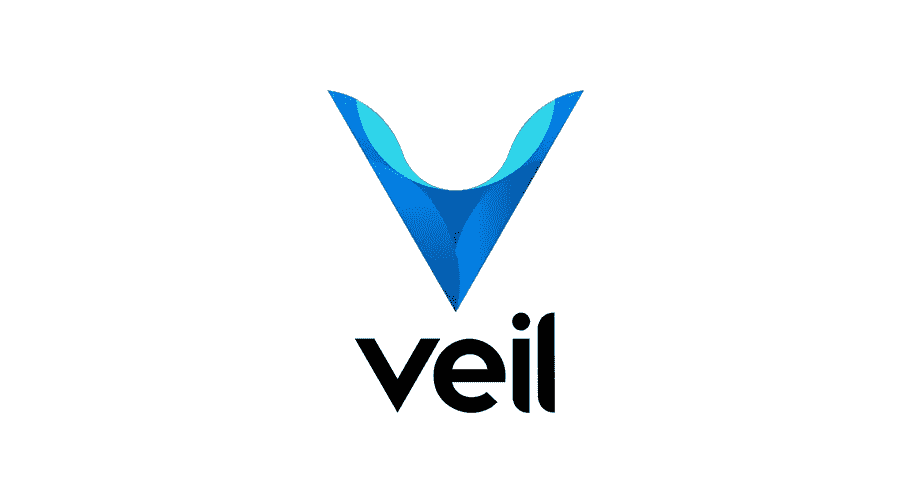
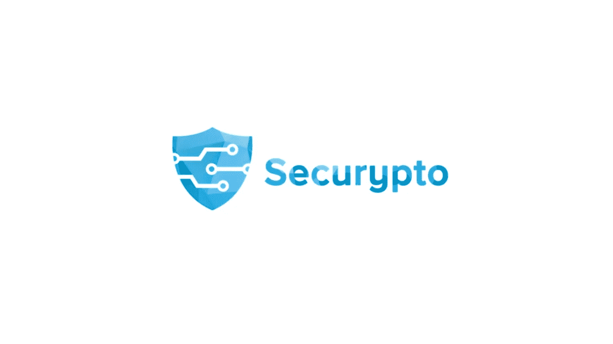
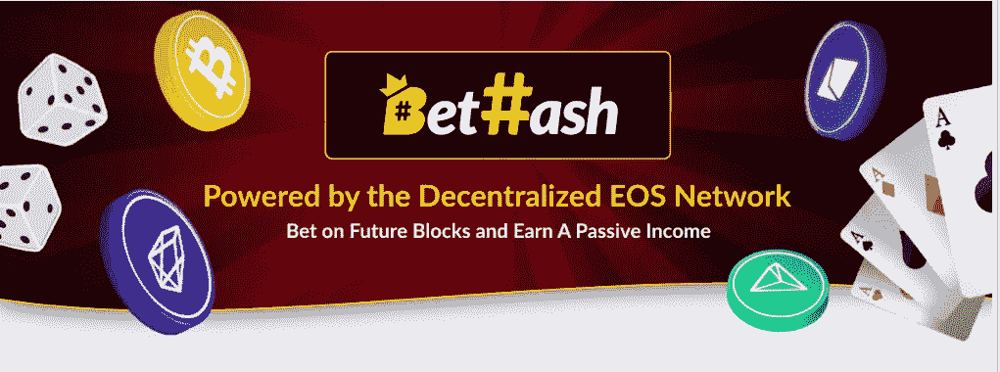

# 通过 PoS、主节点和分红获得被动收入

> 原文：<https://medium.datadriveninvestor.com/earn-passive-income-via-pos-master-nodes-and-dividends-1ab3d695bf07?source=collection_archive---------0----------------------->

Photo by [Dmitry Moraine](https://unsplash.com/@wildbook) — Unsplash

在区块链科技出现之前，人们已经开始在互联网上通过多种方式赚钱。但是技术的发展和加密货币的传播带来了不同的方法。我要讲几个现在还不太为人所知，但是有着令人难以置信的好回报的方法。但是要获得这些回报，你首先要投资这些项目。

你其实可以把它当成一种投资，甚至可以把它当成利息收入。但是，加密货币价值的增加将意味着你的本金和利息收入都将增加。

 [## 正在改变行业的 5 个真实世界区块链应用——数据驱动的投资者

### 除非你一直生活在岩石下，否则我相信你现在已经听说过区块链了。而区块链…

www.datadriveninvestor.com](https://www.datadriveninvestor.com/2019/02/13/5-real-world-blockchain-applications/) 

我为什么要投资这些项目，而不是从任何银行拿利息？

1-您通常不能在到期日之前提取您存入银行的本金。存完本金后的利率也有很多扣税。

2-你不能在周末或 7/24 使用银行。

3-你从区块链科技获得“匿名”收入。这些收入无法追踪，也不为任何人所知。你也不必向任何公司或政府支付额外的税款。

4-加密货币回报，无论利息如何，都是对系统中的区块、交易维护和加密货币保存的认可。换句话说，我可以说，从利益的道德角度来看，你获得了更为可敬的回报。

5-对项目的长期投资，如果你相信区块链科技，你可以提供难以置信的回报。

# 那么这些方法是什么呢？

**1)股权证明**

利害关系证明(POS)是工作证明协议中更环保的兄弟。利害关系的证明利用了这样一个前提，即在一个网络中拥有最多硬币的人在保持网络的维护和硬币的高价值方面有既得利益。

在一个使用利害关系证明的系统中，一个随机过程被用来决定谁将生产下一个区块。用户可以将他们的令牌作为验证者(可以生成块的人)，这意味着他们将令牌锁定一段时间。这样做之后，他们就有资格生产砌块。

决定谁来生产下一个区块的过程需要考虑几个因素，这些因素取决于区块链的设计，但一般来说，拥有最大股份的人有最大的机会生产区块。可以考虑的另一个因素的例子是硬币被下注的时间。

每个项目以不同的方式运行 PoS 系统的奖励机制。但这样一来，PoS 就是一种“抽奖”。但是你手里的硬币越多，你就越有可能赢得这张彩票。你因为确认积木而得到的奖励有时可能会少于或少于必要的，但平均来说你总是得到你应得的奖励。

我想谈谈一个我可以投资的 PoS 系统项目，我上个月见过这个项目:Veil

面纱是第一个基于 Zerocoin 协议的硬币，具有永久隐私。没有用户会意外地进行可追踪的交易。面纱是第一个基于 Zerocoin 协议的硬币，具有永久隐私。没有用户会意外地进行可追踪的交易。

高度审查的隐私协议，具有非常大的匿名集大小。VEIL 使用一个定制版本，带有私有的 staking、预先计算的开销和 Bulletproofs，用于较小的事务大小。

与采矿不同，股权证明项目更容易实施。你所要做的就是打开你的钱包，让你的电脑为你做一切。

[https://veil-project.com/get-started/](https://veil-project.com/get-started/)你可以从其官方网站下载面纱钱包，并开始通过购买大量的面纱硬币兑换赌注来赚钱。

虽然没有最低限额，但为了每天赚取 1 英镑，你必须保留的最低面纱数量是 10.000 面纱。这样你每天可以赚 1 个赌注，相当于 50 个面纱。

关于这个项目，你需要知道的最重要的细节是，它在包括 [Coinmarketcap](https://coinmarketcap.com/currencies/veil/) 在内的许多平台上都有上市，并且拥有非常专业的团队。

**2)设置一个主节点**

主节点提供了投资加密货币的机会，除了获得加密领域和拥有加密货币的巨大潜在价值增长之外，还可以获得保证额外硬币的额外好处。

如果您不打算出售您的节点奖励，那么在特定区块链允许的情况下，肯定应该考虑赌注奖励。无论你是持有它们来建造足够的新节点，还是你只是持有希望市场价格增加赌注可以用来确保这些硬币继续为你工作。通常，您需要做的只是确保您的钱包配置为允许赌注(通常通过钱包设置或配置文件更改来实现)，然后让主机保持开机，连接到互联网，并让钱包保持打开。一旦您的硬币到期(变化不定，但大约 11 小时是常见的)，它们将被押在网络中，然后您将有资格获得奖励。

下注时，确保您的下注硬币不是作为一个组“下注”总是值得的。一旦一组下注的硬币赢得奖励，这些硬币就会变得不成熟，没有资格下注，直到成熟。将硬币分成赌注组是一个判断，但平均来说，我会尝试将硬币分成 1000 个一组，以确保足够的“网络权重”——基本上是你获得分配奖励的机会。分成小组也能给你更多被选中的机会——就像买彩票一样。**(这就是 PoS 和 Masternodes 的区别)

在我们粗略地描述了 masternode 之后，我们必须决定哪个项目将适用于 masternode 收入。因为周围有数百个项目，数百个主节点。

我的第一选择肯定是 TecraCoin，尤其是我喜欢他们的任务。我想先谈谈这个项目:

Tecra 是一家总部位于波兰的技术公司，已经成立并开始运营。该项目特别关注使用石墨烯技术创造的技术。比如用石墨烯技术做的电机头盔，衣服，管子等。

石墨烯技术比被称为最高技术的纳米技术先进 2 倍。使用这种技术制造的每一件产品都可以更坚固、更耐用、更耐热、更有弹性。

Tecra 还希望为新的突破铺平道路，特别是在这项最新技术的框架内。

技术不断改善世界。Tecra 的目标是简化这一不可逆转的过程，并突出它们在文明转型中的作用。Tecra 团队创建了一个互联网平台来筹集资金，这将支持受专利保护的高端技术的商业化。通过使用基于区块链的分布式分类账，他们可以保证投资的透明度。

Tecra 投资基金的运作方式:

-通过购买 TecraCoin 加密货币，您可以投资高科技，主要是准备商业化的专利项目。

- TecraCoin 科学家和商业专家选择最有前途的项目。未来，我们还将要求 Tecra 社区为我们从市场中选择的项目投票。投票将通过 TecraCoin 钱包完成，选定的项目将获得实施资金。

- Tecra 有限公司建立了一个特殊目的的车辆与选定的项目，并将其商业化。

-投资完成后，Tecra 将获得推广项目的终身利润。

-持有 TecraCoins 的投资者可以在交易所出售它们，或者在投资期间持有它们，并获得股息，从 Masternodes 获得被动收入。

如果你想为 Tecracoin 安装 masternode，你必须有 10，000 个 Tecracoin。你的节点已经开始处理后，你的日收益是 1%，月收益是 32%，年收益是 384%。

是它背后的技术，你为科学服务的事实，和银行相比有很大的收入，嗯？

# 一个可以同时使用 Proof Stake 系统和 Masternode 系统的常见项目:Securypto

Securypto 项目不为很多人所知，但却是一个非常罕见的项目。该项目通过了 ICO 流程，因为它获得了足够的投资。这个项目，其中包括高技能的软件开发人员，是一个隐私项目。但是和大家熟知的隐私币有很大的不同。

*部分项目特点:*

1-你无法追踪发送者甚至接收者。你可以匿名交换代币。

2-使用自己的区块链基础设施。

3-能够发送匿名消息，文件，数据和货币化。

4-在一个小手机大小的地方有一个名为“Digisafeguard”的专用硬件设备，由于这个设备，你可以交易比特币、以太坊、SCU(自己的硬币)等。

5-有自己的钱包。你可以在微软，Linux 上使用这个钱包。Android 和 IOS 软件正在开发中。

虽然该项目目前处于 Testnet v2 阶段，但它很快将被传递到其 Mainnet。此外，它还与许多交易所达成了协议。我们只需要再等一会儿，让系统完美运行。证明股份和主节点系统也是活跃的，当最近通过了自己的…

**3)获得分红份额**

一些加密货币提供了比我上面提到的方法更简单的产生被动收入的方法。你所要做的就是不要卖掉你的加密货币，把它们放在你的钱包里。通过这种方式，它保存了加密货币的价值，防止了通货膨胀的发生，并宣布了你对它的信任。这样，你就获得了一笔被动收入。

一些硬币以其他硬币的形式提供红利，仅仅是为了持有原来的硬币。比如 [NEO](https://coinmarketcap.com/currencies/neo/) 产生[气体](https://coinmarketcap.com/currencies/gas/)，而 [Vechain](https://coinmarketcap.com/currencies/vechain/) 会产生 THOR。典型地，原始硬币的每个单位将产生一些预定数量的新硬币。这些新硬币与支付网络费用有关，而最初的硬币更多地被认为是网络中的权益。这些方法的回报率相当低(尼奥气体的回报率约为 3%)，但除了拥有原始硬币之外，它们不需要任何工作，因此这是一种非常被动、低风险的创收方法。

将 Bethash 赌场与其他赌场区分开来的最大亮点之一是红利奖励。这些奖励中最大的是每天的利润和高达 90%的利润分成。这种交易，在证券交易所被称为“股息”，是一种系统，在这种系统中，您将硬币保存在同一家银行的账户中，因此，您每天都可以获得一份利润。作为一种睡在你的床上，而你保持你的硬币在你的手中没有任何努力可以获得利润份额。你手里的硬币越多，你得到的利润就越多。与在同一家银行一样，如果你选择 15 天或更长的天数而不是一天，你得到的利润份额会增加。

*赌博代币不仅有分红，还有大量的兑换:*

1.  **桥币** : BCO 又名桥币，是 [CryptoBridge](https://coinsutra.com/how-to-stake-bco-on-cryptobridge-tutorial/) Dex 的原生货币，这是一个即将到来的去中心化交易所。BCO 不像上面提到的两个那样是 ERC20 令牌。相反，它是一种潜在的加密货币，背后有[工作证明](https://coinsutra.com/proof-of-work-proof-of-stake-pow-pos/)。如果 BCO 持有者按照以下时间表下注硬币，他们将获得 CryptoBridge exchange 高达 50%的收入份额/奖金。

*   1 个月(0%奖金)
*   3 个月(20%奖金)
*   6 个月(50%奖金)
*   12 个月(100%奖金)

2. **COSS:** COSS 是另一种 ERC20 令牌，也是 COSS 交易所的原生货币。

COSS 也是一个类似币安和 KuCoin 的交易所，有着相似的功能。然而，它会把自己变成一把刀。目前，COSS 持有者每周可获得 50%的交易所交易费。人们可以在交易所本身或在类似于 [MyEtherWallet](https://coinsutra.com/myetherwallet-review/) 的 [ERC20](https://coinsutra.com/what-is-erc20-token/) 钱包中持有 COSS 代币来领取奖励。

*   做阅读，[如何在交易所外持有曹仁代币赚取红利？](https://coss.io/coss-token-based-fee-split-allocation-tutorial)

3.Catex 股票交易所区别于其他交易所的最大特点之一是红利奖励。这些奖励中最大的是每天的利润和高达 90%的利润分成。这种交易，在证券交易所被称为“股息”，是一种系统，在这种系统中，你将你的硬币保存在同一家银行的账户中，因为你这样做了，因此，你每天都可以获得一份利润。作为一种睡在你的床上，而你保持你的硬币在你的手中没有任何努力可以获得利润份额。你手里的硬币越多，你得到的利润就越多。与在同一家银行一样，如果你选择 15 天或更长的天数而不是一天，你得到的利润份额会增加。

我想提到的另一个关于股息的问题是为保持 CATT 价格不变所做的工作，它是股票市场的硬币。由于 CATT 令牌的红利份额将持续分享，价格可能会有一些波动；但是 Catex 也想到了解决这个问题的方法，并创建了一个定期回购的猫账户。该账户旨在确保 CATT 的价格定期恢复到不波动的程度。

不会伤害自己。

> **法律免责声明**:本文仅供一般指导，不构成法律投资建议。
> 
> **披露**:我不是任何加密货币或任何项目的一部分。我也没有被这些公司支付或雇佣。投资时所有的风险都是你的责任。

# 来源

1-[https://hacker noon . com/different-区块链-共识-机制-d19ea6c3bcd6](https://hackernoon.com/different-blockchain-consensus-mechanisms-d19ea6c3bcd6)

2-[https://hacker noon . com/what-a-master node-and-why-should-I-have-one-345 DDB 780523](https://hackernoon.com/what-is-a-masternode-and-why-should-i-have-one-345ddb780523)

3-[https://hacker noon . com/how-to-make-passive-income-from-crypto-4 F4 F2 AC 214 c](https://hackernoon.com/how-to-make-passive-income-from-crypto-4f4f2ac214c)

4-[https://bethash.io/](https://bethash.io/)

https://tecracoin.io/

6-[https://veil-project.com/](https://veil-project.com/)

7-[https://coin sutra . com/crypto-exchange-coins-股息-费用-减免/](https://coinsutra.com/crypto-exchange-coins-dividends-fees-reductions/)