# SUMCO Corporation:尽管增长前景强劲，但估值合理

> 原文：<https://medium.datadriveninvestor.com/earnings-growth-is-strong-and-the-semiconductor-industry-remains-healthy-with-strong-demand-and-7dc50095ce26?source=collection_archive---------9----------------------->

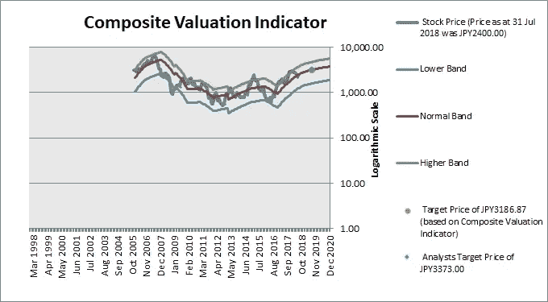

要点:

*   收益增长强劲，半导体行业保持健康，需求和价格强劲
*   尽管增长强劲，但估值颇具吸引力
*   财务状况大为改善
*   提高 ROE

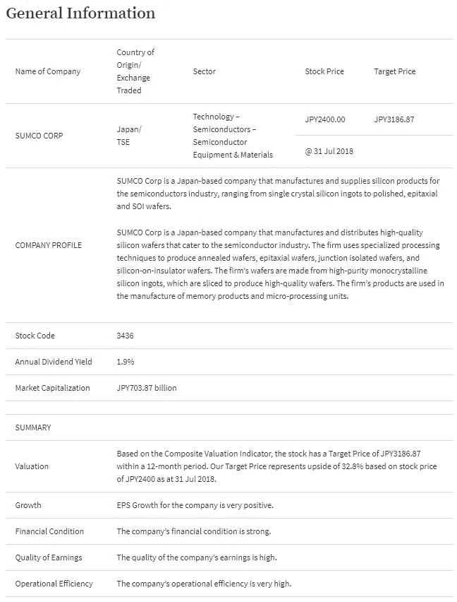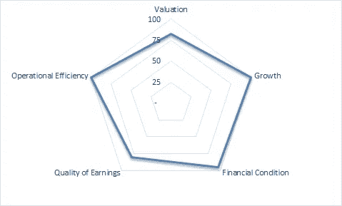

自 2010 年以来，EPS 一直处于上升趋势。未来几年，分析师预计强劲的收益增长将持续下去。

硅的价格在过去几年中显著回升，分析师预计价格将继续上涨。需求预计将来自智能手机、数据中心和电动汽车，包括自动驾驶汽车。在接下来的两年里，硅片公司的产能不会大幅增加，这意味着供应过剩的可能性不大。

自 2012 年经历危机以来，该公司一直致力于成为世界上最好的晶圆技术供应商，这种动力使其赢得了英特尔、台湾半导体和三星电子的供应商奖项。这种对高端晶圆的重视意味着竞争和价格压力较小。

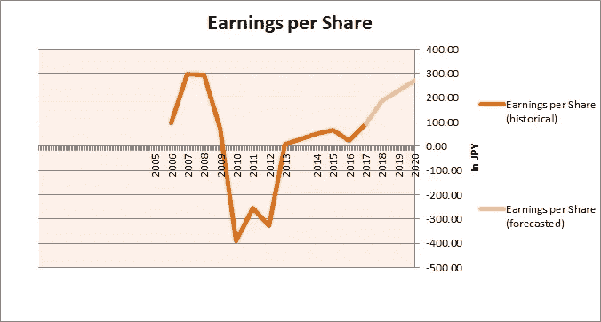

尽管增长强劲，但估值并不高。

# 估价

ProThinker 认为应该综合运用多种估价方法来对股票进行适当的估价。这是因为虽然每种估价方法都有其优点，但也有其缺点。当公司的收益或现金流为负数时，市盈率和现金流比率就没有意义了。价格销售比更稳定，因为销售从来不是负数。然而，这并没有告诉我们该公司是否能够盈利销售。市净率为我们提供了一个指标，表明我们为公司的资产支付了多少，但它与公司的盈利能力没有直接关系。虽然根据多个指标对股票进行估值很重要，但它们有时会导致对估值的不同看法。这就是为什么我们使用我们专有的综合估值指标，它根据不同指标的最佳组合给出一个结论，告诉你一只股票是否被低估或高估。图形格式允许您确定综合估值是否准确地对股票进行了估值，并让您有信心根据决策采取行动。此外，我们追溯到 20 年前(或尽可能多的可用信息),给你一个有意义的“平均”估值，该公司经历了 dot.com 泡沫和全球金融危机的极端时期。没有这么长的一段时间，你不会知道极端的高点和低点，因此也就无法确定正常水平。

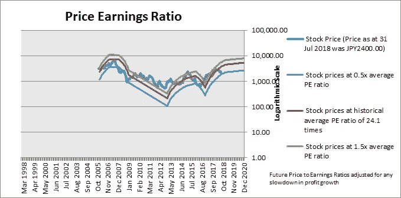

市盈率是股票最常用的估值指标。但是，有时这个比率不能使用，例如，当公司报告亏损或盈利很少，导致市盈率异常高时。或者税后净利润可能不稳定，最好使用息税前利润(EBIT)来评估公司价值。我们使用 PE 波段或市值/EBIT 波段来显示一只股票是否基于其历史估值被高估或低估。截至 2018 年 8 月 1 日，以 2383.00 日元的价格计算，Sumco Corp 的市盈率为 15.2 倍。这比其 24.0 倍的历史平均市盈率低 36.5%。(红线表示基于公司历史平均 PE 的价格。)

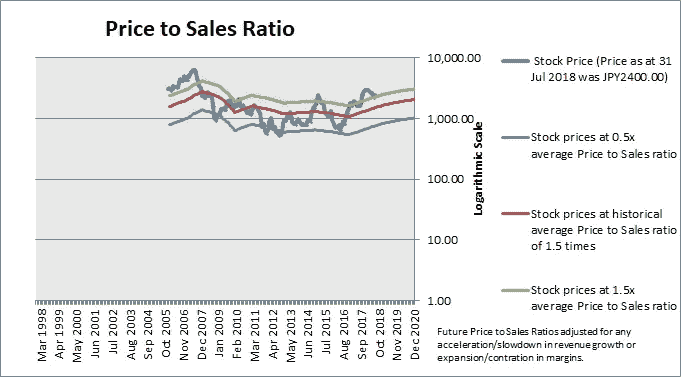

价格销售比是另一个常用的股票估值指标。它克服了市盈率的一些局限性，因为它甚至可以在公司不盈利或盈利很少时使用。然而，它不应该被单独使用，因为一个公司可能正在实现销售而不是利润。截至 2018 年 8 月 1 日，以 2383.00 日元的价格计算，Sumco Corp 的交易价格与销售额之比为过去 12 个月销售额的 2.3 倍。这比其 1.3 倍的历史平均价格销售比溢价 56.0%。

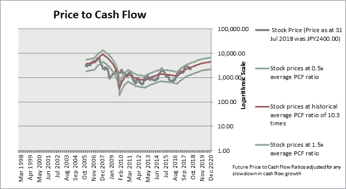

现金流价格是评估股票价值的另一种方法。这是因为会计利润可能受到操纵。因此，一些投资者更喜欢根据公司经营活动产生的现金流来对公司进行估值。它还可以对市盈率和销售价格等估值指标进行现实检验。如果一家公司产生高利润和销售额，但没有经营性现金流，它可能会遇到麻烦，因为是现金支付运营费用。然而，大多数公司的价格与现金流比率是不稳定的，不应该孤立地用来确定股票的估值。截至 2018 年 8 月 1 日，以 2383.00 日元的价格计算，Sumco Corp 的股价与现金流之比为过去 12 个月现金流的 10.7 倍。这比其 10.3 倍的历史平均价格与现金流比率溢价 4.0%。

市盈率、销售价格比和现金流价格比都是根据一家公司的产出(即利润、销售额或现金流)来对其进行估值的。市净率的不同之处在于，它根据公司拥有的资产(即净资产)来对公司进行估值。对于经常重估其资产和负债的金融机构或拥有庞大资产基础的公司(如公用事业公司)，这通常是一个合适的估价指标。以 2018 年 8 月 1 日 2383.00 日元的价格计算，Sumco Corp 的市净率是当前账面价值的 2.5 倍。这比其 1.5 倍的历史平均市净率溢价 65%。

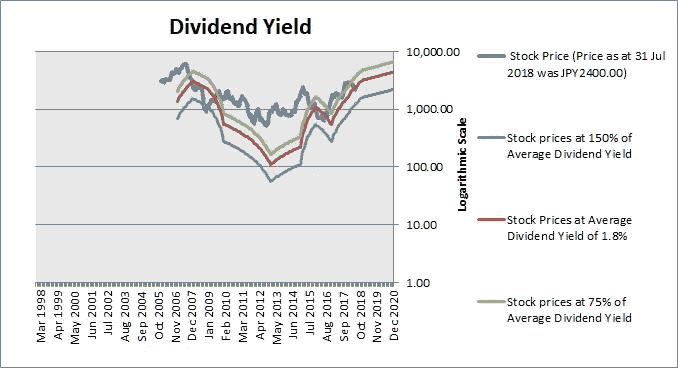

对于有支付有意义股息历史的股票，股价通常取决于公司支付多少股息。截至 2018 年 8 月 1 日，以 2383.00 日元的价格计算，SUMCO Corp 的股息率为 2.0%。这比其 1.8%的历史平均股息收益率低 9.5%。(注:股息率越低/越高，股票越贵/越便宜。)

综合估值指标是使用我们的专有方法得出的，将所有估值指标以一种最能解释股价的方式进行排列。它认识到，只看单一指标是危险和不充分的。它还克服了不同指标给出不同信号的困难，以及如果你没有综合估值就难以采取行动的困难。我们的综合估值指标并不假设估值在平均水平保持不变。如果公司增长放缓，它将下调估值，以反映增长放缓。但是，请注意，综合估值指标并没有考虑到由于预期的收购或其他特殊事件，市场愿意为股票支付更高价格的情况。还有一种可能是，投资者现在认为该股估值较低，因为该股或该行业的长期前景不佳。根据综合估值指标，该股 12 个月内的目标价为 3330.19 日元。基于 2018 年 8 月 1 日的股价 2383 日元，我们的目标价上涨了 39.7%。我们建议投资者在上涨 20%后开始获利了结。目标价考虑了公司的适当估值和分析师对利润、销售、现金流、账面价值、股息等的估计。以及其他因素，如财务状况、收益质量、增长前景和净资产收益率。

# 财务状况

SUMCO 摆脱了财务困境，成为一家财务状况良好的公司。吸取了这个教训后，它现在把即使在经济低迷时期也要抗赤字作为一个愿景声明。从 2012 年开始，该公司见证了有助于财务健康的所有指标的改善。销售额、留存收益、资产回报率、营运资本都有所改善，总负债有所下降。

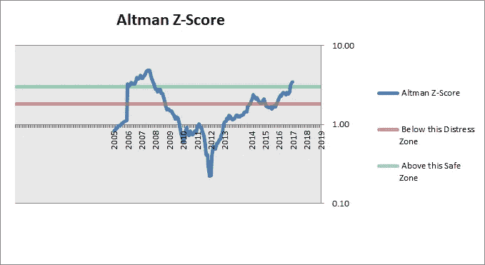

自 2012 年以来，Z-score 一直在改善。其主要原因是:*较高的营运资本*较高的留存收益占总资产的比例*较高的 EBIT 占总资产的比例

*借款水平较低公司截至 2017 年 12 月的最新 Z 值为 3.5，处于安全区。

Z 得分的各个组成部分如下所示:

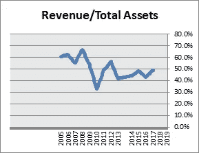

这是收入周转率，它反映了公司通过使用其资产所能产生的收入。难以创收的公司无法产生持续的现金流来支付账单。自 2012 年以来，资产产生的收入一直呈上升趋势。

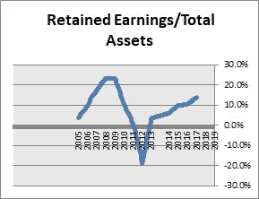

公司留存的利润越多，公司度过困难时期的储备缓冲就越大。
自 2012 年以来，留存收益相对于资产的水平一直呈上升趋势。目前，留存收益占总资产的 13.8%。

这衡量公司从其资产中产生 EBIT(息税前利润)的能力。
自 2010 年以来，EBIT 占资产的比例一直呈上升趋势。目前，EBIT 占总资产的 7.3%。

这表明了公司的借款水平。高水平的借款将影响生存能力，因为它可能没有足够的现金流来满足其债务义务。
自 2012 年以来，公司的借款水平一直在下降。

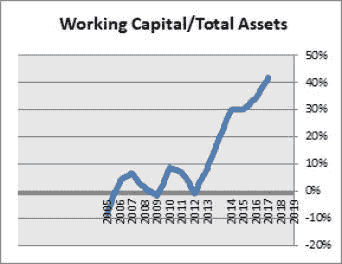

营运资本对公司的运营至关重要，低水平的营运资本可能会导致流动性问题。自 2012 年以来，相对于总资产的营运资本一直呈上升趋势。

# 股本回报率

自 2012 年以来，净资产收益率有了很大提高，并有望继续提高。

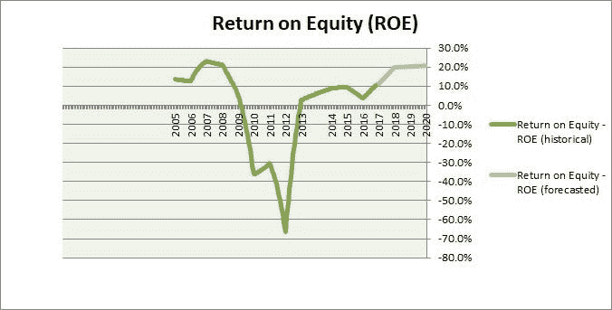

股本回报率(ROE)衡量的是公司用股东投入的资金获得的利润。净资产收益率上升是管理效率提高的标志。这也是一个迹象，表明公司未来通过留存利润而不是作为股息分配的利润增长速度有多快。在分析净资产收益率趋势时，了解净资产收益率上升或下降的原因很重要。ROE 可以通过三种主要方式来提高。1.如果公司能够创造更多的每美元资产销售额(我们称之为资产周转率)2。当公司能够提高其净利润率时

3.当公司借入更多资金时(我们称之为股权乘数)

前两种方法是提高净资产收益率的健康方法，但如果一家公司的财务状况已经很脆弱，那么通过借入更多资金来提高净资产收益率可能是不可取的。这就是为什么除了确定一家公司的净资产收益率是否在提高之外，确定该公司做了什么来提高其净资产收益率是如此重要。如果该公司通过增加借款来提高净资产收益率，那么衡量该公司的财务状况以了解其是否仍然健康就变得非常重要。自 2010 年以来，该公司的股本回报率一直在提高。在此期间，资产周转率为正，权益乘数为负，净利润率为正。

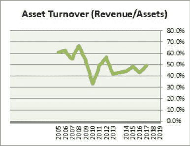

资产周转率衡量公司从其资产中产生的收入。上升趋势/下降趋势表明公司在使用其资产方面变得越来越有效率/越来越没有效率。自 2012 年以来，该公司的资产周转率一直呈上升趋势。截至 2017 年 12 月的财年，该公司的最新净资产收益率为 49.1%。

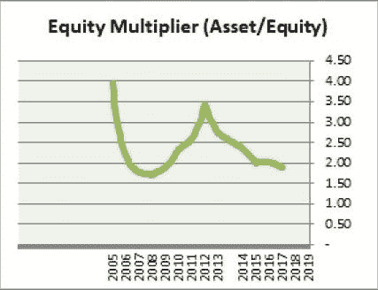

权益乘数衡量公司拥有的借款与其资产的比例。上升趋势/下降趋势表明公司正在增加/减少借款。公司借更多的钱来帮助他们平衡经营，提高净资产收益率。另一方面，公司可能会选择降低杠杆率，降低净资产收益率。
该公司的收益乘数自 2012 年以来一直呈下降趋势，这意味着该公司的借款减少了。

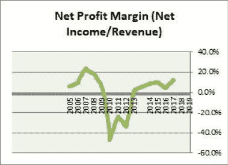

净利润率衡量的是公司扣除所有费用后的收入。上升趋势/下降趋势表明公司的利润增加/减少。
该公司的净利润率自 2010 年以来一直呈上升趋势

# 其他考虑

当然，在决定一只股票是否有吸引力时，不仅仅是决定它的估值和未来的基本面。我们需要考虑股票的其他方面，如增长、财务状况、运营优势、现金流、技术等。
很难找到一只价值有吸引力的股票，而且还能成功通过投资者的每一项标准。有时，我们需要做出某些取舍。要进行全面的定量分析，你可以参考[这篇报道](http://www.datadriveninvestor.com/wp-content/uploads/2018/08/SUMCO-Corp.pdf)。

数据来源:图表来自 **ProThinker** 股票报告。公司描述、历史财务报表数据和价格数据均来自 gurufocus.com。估计来自 gurufocus 和/或 4-traders.com-汤森路透。免责声明:本报告仅供参考，不应被视为买卖任何证券的邀约。ProThinker 或任何其他方均不保证其准确性，也不保证其使用结果。未经 ProThinker 的明确书面同意，禁止再分发。版权所有(c) 2018。保留所有权利。

*原载于 2018 年 8 月 1 日*[*www.datadriveninvestor.com*](http://www.datadriveninvestor.com/2018/08/01/sumco-corporation-reasonable-valuation-despite-strong-growth-prospects/)*。*