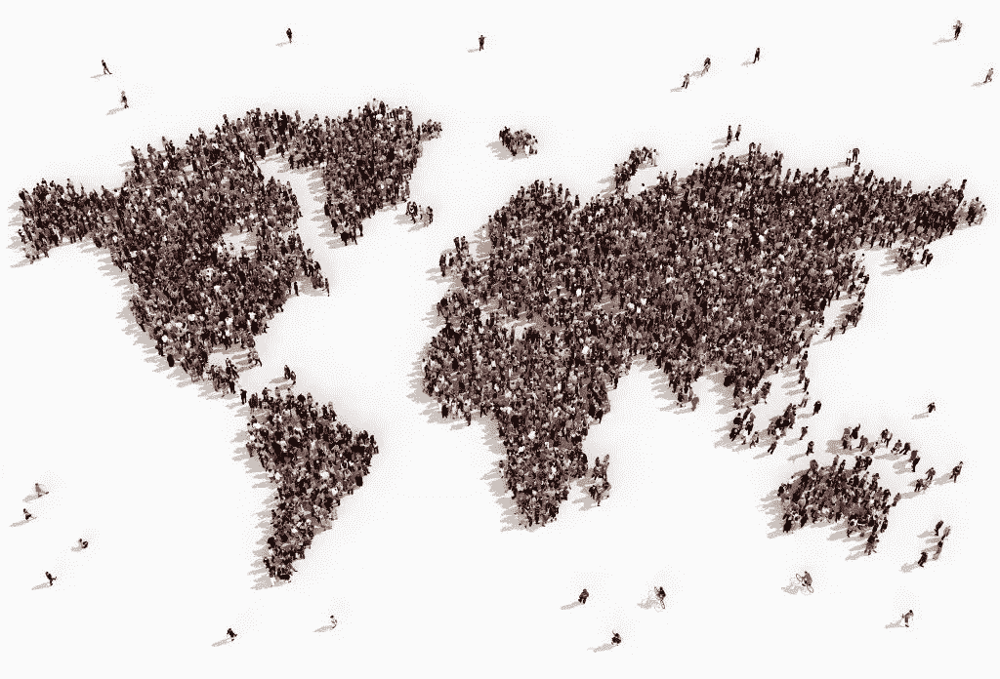
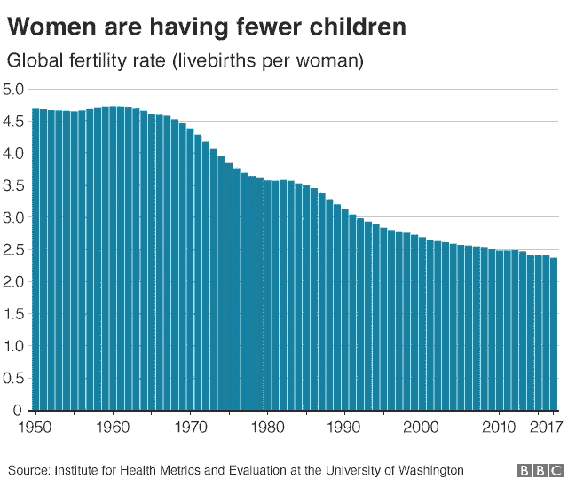

# 地球的人口过剩问题变得越来越严重——或者真的如此？

> 原文：<https://medium.datadriveninvestor.com/earths-overpopulation-issue-going-critical-or-is-it-e0b14d0c61d0?source=collection_archive---------1----------------------->

这个星球上的人太多了，然而我们还在继续制造更多的人。怎么回事？

将给予的是我们的生存能力。

你已经听到了这样的论点:太多的人，使用太多的资源，制造太多的污染，导致气候变化，无情地导致我们作为一个物种的灭绝(以及地球上所有的动物和植物)。

 [## 教科书行业如何最终被颠覆，并将继续改变-数据驱动…

### 就此而言，教科书产业在美国乃至全世界都有着悠久的历史。事实上，他们已经…

www.datadriveninvestor.com](https://www.datadriveninvestor.com/2018/09/25/how-the-textbook-industry-has-finally-been-disrupted-and-will-continue-to-change/) 

别担心，星球本身不会有事的。不管这个星球上是否存在生命，它都会不停地旋转。

我知道这听起来很糟糕。这是一个非常严肃的话题，除了埃隆·马斯克建议我们应该殖民火星和其他星球，以保证我们文明的生存，我还没有听到这个问题的合理解决方案。

坦率地说，似乎大多数人都在回避讨论。

在我看来，也许我们可以通过意识和一些简单的动作来解决这个问题。

**事实**

假设人们不会停止吃肉，地球最大人口[容量约为 100 亿人](https://www.livescience.com/16493-people-planet-earth-support.html)。这个数字是通过了解人类平均消耗多少食物，地球 35 亿亩耕地能产出多少来计算的。现在，我们可以通过更有效地利用我们的耕地在一定程度上扩展这一点，也许可以通过做更多的[垂直农业](https://en.wikipedia.org/wiki/Vertical_farming)。我们可以更有效地将食物端上餐桌。我们也可以少吃肉或者在桶里种植肉来增加我们可耕地的产量。

但即便如此，我们生产食物的能力也是有限的。顺便说一句，如果我们发明了类似于《星际迷航》中的“复制器”的东西，利用太阳能，我们会马上好起来，但是那个发明仍然只存在于我们的想象中。

除了食物问题，我们还必须考虑浪费问题。我们的人口越多，产生的垃圾就越多。我们可以非常聪明地回收废物，科学家们正在努力研究如何回收我们家中产生的固体和液体废物。我在我的书《工程天堂:你准备好了吗？》中讨论了该领域的一些重大进展。 然而，我们仍然在处理从第一次工业革命开始的废物。我们还需要一段时间才能处理好目前垃圾产量的大部分。总的来说，废物减少了可用于生产的土地数量，降低了地球上自然资源的整体质量，从水到土壤到空气。整个星球都是相连的。世界上一个地方的污染会在一年内蔓延到其他地方。没有人能免受污染怪物的伤害！

加重污染问题的是我们正在破坏地球上的野生空间。这些野生动物区对于地球回收我们扔给她的所有废物至关重要。现在[，地球陆地总面积只有 23%仍然是野生的](https://blog.nationalgeographic.org/2016/09/08/catastrophic-declines-in-earths-wilderness-areas-over-the-last-20-years-study-finds/)。这些野生区域将我们在地面产生的大量二氧化碳转化为氧气。当然，发达的农田、公园也有帮助，但没有什么比真正的交易更有效率。此外，许多动物无法在接近人类发展的环境中生存，所以许多完全属于地球循环系统的物种只能在那些未开化的地区生存。如果你希望更好地理解地球上的一切是如何相互联系的，我已经写了另一篇关于[地球应该如何被视为 2018 年一个独特的化学实验的文章](https://medium.com/datadriveninvestor/the-importance-of-seeing-the-world-as-a-chemical-system-9bca0c52587c)。

我不是一个环保主义者，但我是一个务实的人。我认为随着人口即将达到 80 亿，是时候寻找人口过剩问题的真正解决方案了。

**出生率**

在过去的十年里，韩国投入了 700 亿美元来鼓励生育。但是没用。韩国每个妇女的生育率不到 1.1。要维持人口数量，该比率必须至少为 2.0。韩国人是受过高等教育和忙碌的人。因此，他们了解他们周围的世界，大多数人决定少生或不生孩子，不管政府怎么说，也不管不多生孩子会对他们国家的经济造成多大的损害。他们的担忧更多的是地方性的:他们希望过上幸福的生活，希望为他们的孩子提供优质的教育。对大多数人来说，拥有太多孩子对家庭和孩子本身都是一种伤害。

这是事情积极的一面。原来,[研究确实表明,](https://www.ncbi.nlm.nih.gov/pmc/articles/PMC4255510/)在女性受教育程度高、避孕容易获得且有一定富裕程度的人群中，人口往往处于控制之下，或者有减少的风险。如果我们看下面的图表，我们清楚地看到一个全球趋势，即每个妇女生育的孩子越来越少。太好了！

2017 年，全球平均出生率为每名妇女 2.4。因此，如果我们将第三世界国家的出生率(高出生率)与更发达国家的出生率(低出生率)进行平均，我们得到的平均值与我们需要稳定人口的名义值 2.0 相差不远。

**控制出生率**

我不是一个随波逐流的人。我们必须意识到这是一个严重的问题，我们必须采取合理的措施来帮助阻止人口水平的进一步增长。见鬼，我们应该讨论一个计划，让全球人口随着时间的推移下降到一个更合理的数字。

我认为，第一步是各国必须停止鼓励出生率。政府应该找到其他方法来保持经济运转，而不是试图强迫人们多生孩子。生更多的孩子来保持税收流向政府是不合理的。

控制出生率的想法是一个主要问题，因为这是一个不成文的普遍基本权利。虽然一些国家通过政策成功地降低了出生率(例如上世纪的中国和韩国)，但我们不能指望在如何阻止人口增长方面达成国际共识。

我们需要的是一个不涉及限制个人生孩子的自然权利的解决方案。

**找到了！**

如果世界上所有国家都是发达国家的一部分，我们就会有一个良好的平均出生率，而且随着大众可以获得信息，出生率趋势正在下降，因此，解决方案似乎很简单:教育、避孕和较贫穷国家的经济增长。世界各国或许可以通过联合国进行合作，确保所有贫困国家都能加入富裕国家和互联网基础设施国家的行列。

这自然会增强发展中国家妇女的权能，以确保她们能够获得避孕手段、养家糊口的资金和避免意外怀孕的知识。提升女性在所有文化中的权力将会继续我们已经走上的降低全球出生率的道路，在一代人的时间里，我们可以接近人口稳定。

20 年前，全球出生率为 2.7，因此在未来 20 年内达到 2.0 是非常合理的。

用心良苦、见多识广的父母可以通过评估地球上可供自己使用的资源水平，自己决定是否要把孩子带到这个世界上来。互联网连接率现在已经超过了 50%,每个联网的父母都可以根据现有的信息做出自己的决定。

不需要法律。我们不需要在其他星球上建立新的殖民地来捕获地球的人口过剩。我们只需要提升更需要它的国家，我们应该没问题。

然后，随着人工智能和其他技术为人类服务，我们最终可以宣布人类可以自然地控制自己的人口，就像任何其他动物一样。

多酷啊！