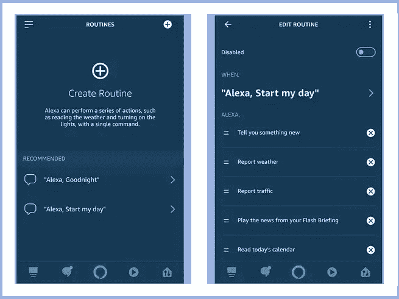
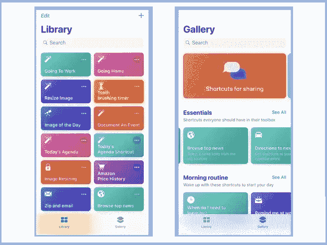

# 通过为谷歌助手、Alexa 和 Siri 创建例程来缓解您的生活。

> 原文：<https://medium.datadriveninvestor.com/ease-your-life-by-creating-routines-for-google-assistant-alexa-and-siri-874ae1a30a00?source=collection_archive---------10----------------------->

Googel Assistant. Google’s personal assistant

如果你是安卓用户，那么拿起你的手机，长按你手机的 home 键，砰！ [Google Assistant](https://assistant.google.com/) (你的手机私人助理)会温柔的问你，‘***你好，有什么可以帮到***？’。就像这样，离开我们的小任务，比如给一个人打电话、发送短信或设置闹钟，日复一日，像谷歌助手、亚马逊的 Alexa 或苹果的 Siri 这样的数字助手正在成为我们生活的一部分。我们每天都在使用大量的技术。而且我们可以把日常生活中的一些职责留给这些 **AI** (人工智能)，让工作做得更快更有效率。

今天，我们将具体讨论如何使用这些助手进行日常工作。他们要做的是，他们将通过语音命令来简化一组动作和任务。让我给你一个例子来说明这个程序是如何工作的。假设你早上刚刚醒来，告诉 Alexa ' ***Alexa，早上好*** '，所有的灯都立即打开，扬声器里开始播放一个早晨激励播放列表。或者在 iPhone 上，你告诉 Siri，' ***Siri，我要回家了。Siri 立即开始给你所有的家庭成员发送短信，在苹果地图上打开导航屏幕，显示你回家的路。制作套路的乐趣在于，你可以定制你的 **AI** (!)作息根据你的日常作息和日常需求。所以，让我们来看看这篇文章，学习如何为谷歌助手、Alexa 或 Siri 制作自己的例行快捷方式。***

# 阿莱夏

*亚马逊 Alexa 应用中的套路。*

起初，为了在 Alexa 上创建一个例程，你需要从谷歌 PlayStore 或 iOS Appstore 下载 Alexa 应用程序。然后你需要输入你的亚马逊凭证。给你。如果你有一台亚马逊驱动的设备，那么你也必须把它连接到互联网上。目前，routine 只兼容亚马逊 Echo、Echo Plus、Echo Show 和 Echo Dot。

现在开始所有的程序，启动应用程序，点击应用程序左上角的菜单，选择“常规”。在那之后，应用程序会带你完成一些演示指令。然后你就可以开始了。首先，点击右上角的“**加**“**+**”图标。出现这种情况时，点击**。您可以在这里指定触发动作的时间或语音命令。要使用语音命令，请点击“**语音**”。但是您也可以在其他情况下制定一个例程，因为它可以在预定的时间自动运行(点击 **Schedule** )或者当您按下一个 Echo 按钮时，(选择 **Echo 按钮**)或者您希望发生在其他智能设备上的事情(选择**设备**)。**

****看未来:** [**主宰 2019 年的未来科技！**](https://www.supremesupports.com.au/services/3d-rendering/)**

# **谷歌助手**

****

***谷歌助手例程***

**就像 Alexa 一样，谷歌助手的日常工作也是如此。你必须通过 Android 和 iOS 的谷歌助手应用程序来控制它。否则，如果你有一个智能谷歌家居设备，那么你也必须连接它们。**

**一旦你在你的安卓或 iPhone 上下载了这个应用程序，你必须给出你的登录凭证。然后进入**更多** > **设置** > **助手**进入**套路**。然后发现提供的样本，如**早上好**或**就寝时间**。然后你可以看到一些选项或动作可供选择。您可以通过选中或取消选中要从例程中排除的任何特定操作来进行更改。当你准备好创建自己的例程时，点击应用右下角的“**加**”、 **+** 图标。首先，选择**添加命令**指定启动动作的语音命令。此外，您可以通过选择“**设置时间和日期**”按钮来设置将在一天中的特定时间启动的特定操作。**

**现在，如果你对这个程序感到满意，那么点击应用程序右上角的勾号图标。如果有时你需要编辑或删除例行程序，那么就进入助手应用程序的设置部分，选择例行程序进行编辑或删除。**

****了解更多:** [**你需要什么样的电脑才能像 buttery 一样流畅地进行 3D 渲染？**](https://www.supremesupports.com.au/best-pc-build-for-3d-rendering/)**

# **iPhone4S 上的语音控制功能**

****

***Siri 助手***

**对于 Siri 来说，这个例程叫做**快捷键**。它可以在任何 iOS 设备上创建，并在 iPad、iPhone、Apple Watch 或 HomePod 上运行。但遗憾的是，macOS 不在支持的设备列表中。要从头开始，你需要从苹果应用商店下载快捷方式应用程序。它不适用于 Android 或亚马逊平台。**

***内容礼貌:* [*最高支持*](https://www.supremesupports.com.au/ease-your-life-by-creating-routines-for-google-assistant-alexa-and-siri/)**