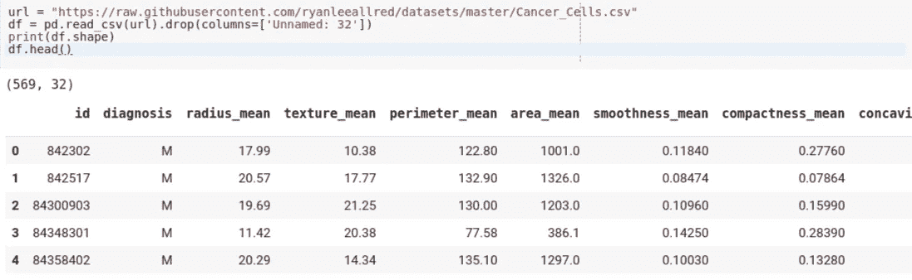
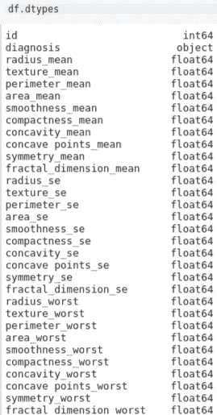
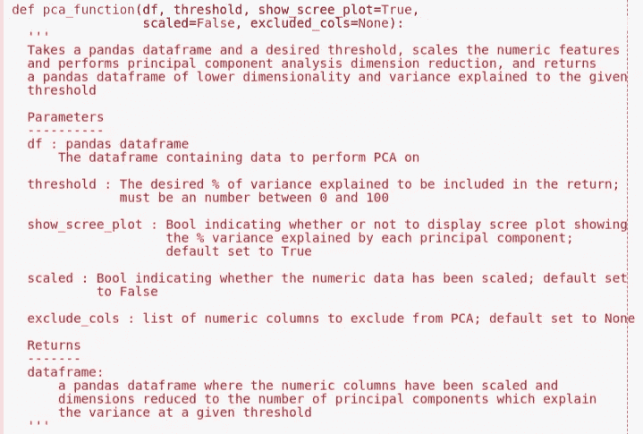
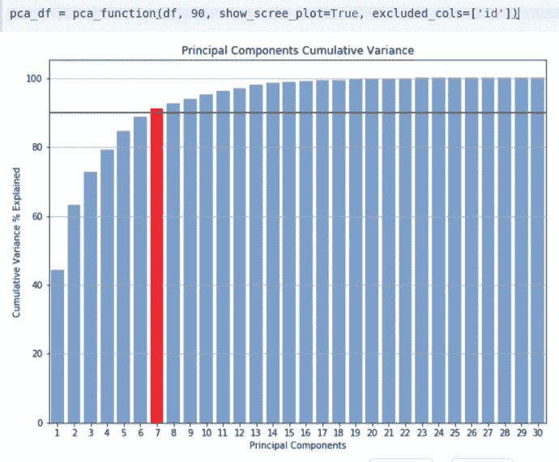
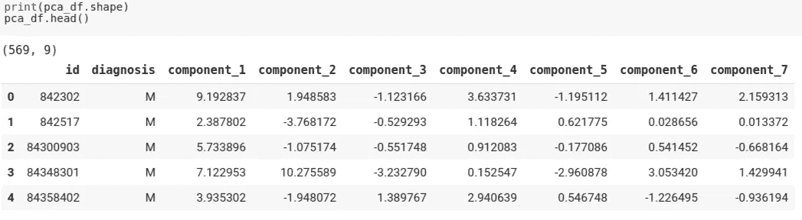

# 用于执行 PCA 的简单按钮功能(带奖金屏幕图)

> 原文：<https://medium.datadriveninvestor.com/easy-button-function-for-performing-pca-w-bonus-scree-plot-be8de1fe1ff2?source=collection_archive---------3----------------------->

我创建了一个函数，我发现这个函数对于用 python 在熊猫数据帧上执行主成分分析非常有用。利用来自 [Kaggle](https://www.kaggle.com/uciml/breast-cancer-wisconsin-data) 的乳腺癌数据，我制作了一个示例 Google Colab 笔记本，演示该功能的实际应用。

首先，我们将癌症数据从 csv 文件读入 pandas 数据帧，并检查数据和前 5 行的形状:

569 rows and 32 columns-

正如您在左侧显示特性数据类型的图中所看到的，唯一不是数字的特性是目标变量“诊断”。然而，通常我们想要建模的数据包含各种数据类型:数字、对象/类别、布尔等。我想创建一个快速简单的函数，它获取混合数据类型的整个数据帧，对数字特征执行主成分分析，从而降低数据帧的维数，并返回其他特征完整的数据帧。让我们来看看函数的 docstring:

如您所见，默认情况下，该函数将接受数据帧，缩放尚未缩放的数字列(使用 sklearn StandardScaler)，显示一个 scree 图，演示解释达到给定阈值的方差百分比所需的组件数量，并执行 PCA 以降低数据维数。如果您有任何想要从 PCA 中排除的数字列，它们应该作为“excluded_cols”参数在列表中传递，并且它们将被原封不动地返回。

 [## 成为数据科学家所需的 8 项技能——数据驱动型投资者

### 数字吓不倒你？没有什么比一张漂亮的 excel 表更令人满意的了？你会说几种语言…

www.datadriveninvestor.com](https://www.datadriveninvestor.com/2019/02/07/8-skills-you-need-to-become-a-data-scientist/) 

在这个特定的例子中，我们将把“id”列作为一个被排除的列传入，因为对这个任意标识符特性进行缩放和执行 PCA 没有任何意义。“诊断”功能将被自动忽略，并原封不动地返回，因为它不是数字。

现在让我们以癌症数据帧为例调用这个函数。我们将使用 90%的方差作为“阈值”，将“show_scree_plot”设置为 True，排除“id”功能，并将结果分配给一个名为 pca_df 的新变量:

如您所见，该函数显示了 scree 图，突出显示了数据在给定阈值下减少到的主成分数。我们现在可以检查新数据帧的前 5 行，看看返回了什么:

不错！30 个数字特征已经减少到 7 个，并且“id”和“诊断”特征保持不变。虽然对于这种小规模的数据集，这不会对任何机器学习或预测模型产生任何重大改进，但如果您正在处理更大的数据集，此函数可能会派上用场。

如果你认为你可能也会发现这个函数很有用，这里有一个到笔记本的[链接，你可以随意复制并粘贴函数代码供自己使用。](https://github.com/Nolanole/Misc/blob/master/pca_scree/PCA_%2B_Scree_Chart_Function_Notebook.ipynb)