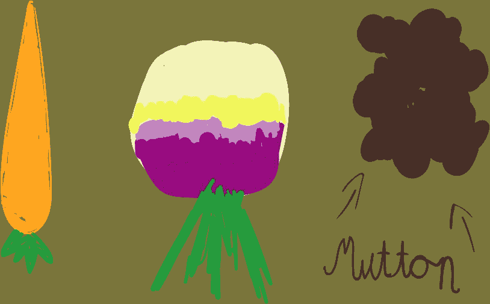
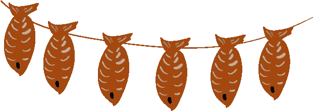
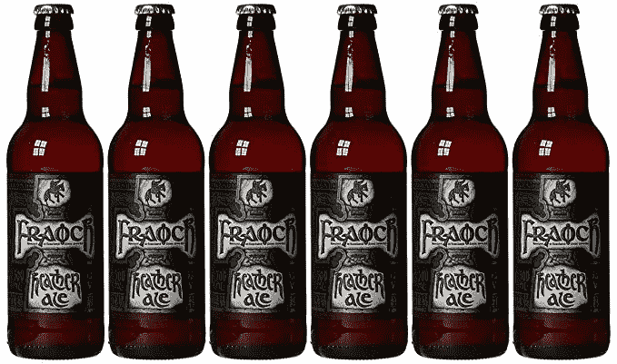

# 像中世纪的苏格兰农民一样吃饭:今日菜单

> 原文：<https://medium.datadriveninvestor.com/eat-like-a-medieval-scottish-peasant-un-menu-du-jour-4c656c55d584?source=collection_archive---------1----------------------->

## 当像我们这样的人回想起苏格兰有时肮脏、通常野蛮的中世纪过去时，我们通常不会考虑当时人们在吃什么。

在 10 世纪的日子里，一个犯错的领导人会被一把生锈的叉子直接开膛破肚。自那时以来，情况发生了很大变化；我们解决政治分歧的方法就是一个例子。我们的饮食是另一回事。当像我们这样的人回想起苏格兰有时肮脏、通常野蛮的中世纪过去时，我们通常不会考虑当时人们在吃什么。

团购网站 Groupon 的一项调查显示，苏格兰人最喜欢的食物是传统的周日烤肉。然而，我们所理解的烤肉是从 16 世纪末开始才有可能的，当时土豆是由西班牙船只从新殖民的南美航行到欧洲的。

这一点，再加上食用牛肉和羊肉对那些没有皇室血统的人来说过于昂贵，意味着至少在文艺复兴晚期之前，普通人不会在苏格兰吃烤肉大餐。那么，我们吃了什么？以下是如何为自己和家人制作真正经典的中世纪苏格兰套餐的指南。

# 圣母院

在法国，饭前喝一杯酒——通常是含酒精的——是一种传统，可以增进友谊和食欲。在苏格兰，最明显的选择是威士忌。但我们在这里谈论的是 10 世纪，威士忌是另一种现代主食，当苏格兰民族在福斯河以北蓬勃发展成为 9 世纪的阿尔巴王国时，它还不存在。苏格兰关于威士忌的第一份书面记录是在 1495 年，当时詹姆斯四世国王命令修士约翰·科尔制作 1500 瓶这种酒。人们只能想象 10 世纪时用餐伙伴是如何开始用餐的。

# 主菜

## 浓汤

浓汤是一种简单的汤或炖菜，由蔬菜和偶尔的肉末制成。它在中世纪很受欢迎，因为它只使用苏格兰本地的蔬菜，你可以在屋外种植。如今，浓汤仍然被视为令人满意的食物，尽管主要是纯素食者。

收集，或者让你的后代从菜地里为你收集:5 个胡萝卜，5 个欧洲防风草，2 个大洋葱，一个芜菁，一棵卷心菜和一小篮蚕豆或扁豆。在你最大的锅里，在火上，用一点动物脂肪炒洋葱。然后切碎并加入每种配料，然后将所有材料浸入淡水中煮沸 30 分钟——或者更长时间，如果你想要更稠、更炖的结果。虽然盐和胡椒对于像你这样的普通农民来说太贵了，但你可能想加入一些百里香或茴香——两种原产于英国的草本植物——来调味。

# 拉普兰校长

## 熏鱼配炸羽衣甘蓝和野蒜

羊杂碎是一种美味、营养的肉类布丁，是用少数民族丢弃的羊的一部分(在美国，是 ban)制成的，直到 15 世纪才出现在苏格兰的餐桌上。人们认为羊杂起源于需要。很久以前，迁徙中的人们会用羊胃做成的袋子带一些燕麦。在中世纪晚期，人们开始向这种袋子中加入内脏，不久，他们意识到可以将内脏与燕麦和香料混合，制成美味的糊状物，然后装入胃壁并煮沸。

维京人在 8 世纪带着心中的谋杀和肚子里的熏鱼来到这里。他们斯堪的纳维亚人的胃口极大地推动了苏格兰渔业的发展，沿海地区的居民也开始享用这一战利品。直到今天，熏鱼在苏格兰仍然很受欢迎。

所以。让你的老乡帮你准备一个吸烟盒。你需要一个坚固的基座来放置木片(苹果、樱桃或桤木可以提供最好的味道)，还需要几段木头放在火上，这样你的鱼就可以挂在上面了。你将需要更多的木头或袋子放在建筑物的顶部，以防止烟雾飘散。

鱼越肥，它从烟熏中吸收的味道就越多。所以，三文鱼或鲈鱼是理想的选择。然而，黑线鳕也可以工作。把鱼晾干一夜，然后用绳子把它们成对系起来。把它们挂在棍子上，盖上盖子，等 2-3 个小时，你就有了。

好好利用这些时间，采摘一些甘蓝，搜寻一些野生大蒜。在火上煮羽衣甘蓝，然后和野生大蒜一起炒，作为熏鱼的绝佳配菜。

# 乐甜品

## 克兰纳昌

虽然克兰纳昌已经存在了令人惊讶的长时间，但我们不能肯定它是否是在 10 世纪被发明的。但很可能是这样的。所有的配料——燕麦、覆盆子、蜂蜜和奶油——在不同程度上都是我们当时饮食的一部分。当然，燕麦过去和现在都被用来做粥，但不需要天才就能意识到它们是很好的烤面包。在苏格兰，蜂蜜被用作甜味剂的历史远比糖长。奶油稍微少见一些；牛主要用于食用肉类，而不是制作乳制品。原产于英国的覆盆子准备在每年六月采摘；使克兰纳昌成为理想的春季奢侈品。

在火上烤燕麦一分钟左右。搅拌奶油，直到它变得很稠，与新鲜的覆盆子混合，将燕麦撒在上面，淋上一些蜂蜜。

# Le digestif

## 希瑟麦芽酒

在中世纪的苏格兰，像威士忌或白兰地这样的烈酒可能已经很少了，但希瑟啤酒却没有。据阿洛亚唯一一家仍在商业化生产石南啤酒的酿酒厂威廉姆斯兄弟称，石南啤酒自 4000 年前就在苏格兰酿造了。即使在今天，在野外也很容易找到主要成分:石南，生长在英国各地；蓍草，常见于路边；还有啤酒花——稍微罕见一点——有时作为攀缘植物自然出现。混合麦芽、某种酵母，也许还有一点蜂蜜，使用正确的设备，你可以在一两周内拥有你自己的石南麦芽酒，就像 1000 年前维京人在苏格兰喝的一样。

[*【怪异西班牙】*](https://weirdspain.substack.com/) *是一份时事通讯，面向那些想更深入了解他们的第二故乡及其人民的移民，以及世界各地想更多了解这个神奇国家正在发生什么以及为什么会发生的西班牙爱好者。* [*在这里订阅，在你的收件箱里收到这些文章。*](https://weirdspain.substack.com/subscribe)