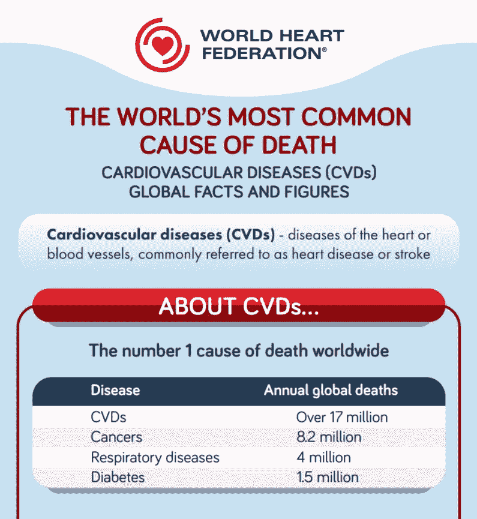
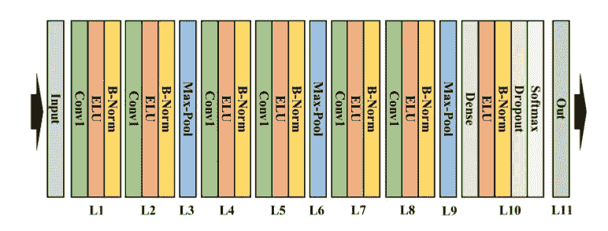
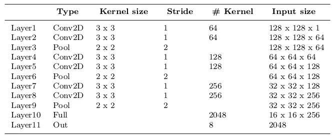
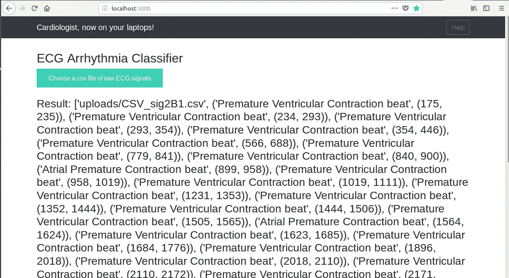

# 基于二维卷积神经网络的心电图心律失常分类

> 原文：<https://medium.datadriveninvestor.com/ecg-arrhythmia-classification-using-a-2-d-convolutional-neural-network-33aa586bad67?source=collection_archive---------0----------------------->

根据世界卫生组织(世卫组织)的数据，心血管疾病是当今的头号死亡原因。2017 年，全世界有超过 1770 万人死于心血管疾病，约占所有死亡人数的 31%，其中超过 75%的死亡发生在中低收入国家。心律不齐是 CVD 的一种典型类型，指的是正常心律的任何不规则变化。有几种类型的心律失常，包括心房纤维性颤动、早搏、心室纤维性颤动和心动过速。虽然单次心律失常心跳可能不会对生命产生严重影响，但连续心律失常心跳可能会导致致命情况。例如，延长的室性早搏(PVCs)搏动偶尔会转变为室性心动过速(VT)或心室纤维性颤动(VF)搏动，这可立即导致心力衰竭。因此，定期监测心律以管理和预防心血管疾病是非常重要的。心电图(ECG)是一种非侵入式医疗工具，可以显示心脏的节律和状态。因此，从 ECG 信号中自动检测不规则心律是心脏病学领域中的重要任务。

在这篇文章中，我实现了这篇论文[https://arxiv.org/pdf/1804.06812.pdf](https://arxiv.org/pdf/1804.06812.pdf)，其中我们使用深度二维 CNN 和灰度 ECG 图像将 ECG 分为七类，一类是正常的，另外六类是不同类型的心律失常。通过将一维 ECG 信号转换成二维 ECG 图像，不再需要噪声过滤和特征提取。这很重要，因为在噪声过滤和特征提取中会忽略一些 ECG 搏动。此外，可以通过增加 ECG 图像来扩大训练数据，这导致更高的分类精度。数据扩充很难应用于一维信号，因为一维心电信号的失真会降低分类器的性能。然而，用不同的裁剪方法扩充二维 ECG 图像有助于 CNN 模型用单个 ECG 图像的不同视点进行训练。使用 ECG 图像作为 ECG 心律失常分类的输入数据在鲁棒性方面也是有益的。

# 获取数据

我已经使用了[麻省理工学院-BIH 心律失常数据库](https://www.physionet.org/physiobank/database/mitdb/)进行 CNN 模型的训练和测试，正如论文中提到的。麻省理工学院-BIH 心律失常数据库包含 48 个半小时的双通道动态心电图记录摘录，这些记录来自 BIH 心律失常实验室在 1975 年至 1979 年间研究的 47 名受试者。每个记录有三个文件:1。注释文件 2。信号文件 3。头文件。

在这个实现中，我使用了 lead2 信号。下面代码片段中的 **get_records()** 函数创建数据集中所有记录的列表。 **beat_annotations()** 函数查找属于特定类别的节拍的索引(在下面的代码中，我找到了正常节拍的索引)。**分段()**函数用于对每个类别的节拍进行分段。

# 方法

Step by step representation of the methods followed

由于 CNN 模型将二维图像作为输入数据来处理，因此在 ECG 数据预处理步骤期间，ECG 信号被转换成 ECG 图像。利用这些获得的 ECG 图像，在 CNN 分类器步骤中执行七种 ECG 类型的分类。七类为:
房性早搏、正常、左束支传导阻滞、起搏搏动、室性早搏、右束支传导阻滞和室性逸搏。

我通过绘制每个心电搏动，将心电信号转换为心电图像。我首先使用 Python 的 [Biosppy](http://biosppy.readthedocs.io/en/stable/) 模块检测心电图信号中的 R 峰。一旦找到 R 峰，为了分割一次心跳，我取当前 R 峰和最后 R 峰，取两者之间距离的一半，并将这些信号包括在当前心跳中。同样，我在下一拍也这样做。

Segmenting ECG signals

为了将这些分段信号转换成图像，我使用了 [Matplotlib](https://matplotlib.org/) 和 [OpenCV](https://opencv.org/) 。因为在 ECG 信号中，颜色并不重要，所以我将它们转换为灰度图像。

Converting segmented ECG signals to images

Segmented ECG beats of each class

**数据扩充**

数据扩充意味着增加数据点的数量。就图像而言，这可能意味着增加数据集中的图像数量。我们可以通过增加和平衡输入数据来实现高特异性和高灵敏度。我用九种不同的裁剪方法增强了六种 ECG 心律失常搏动(PVC、PAB、RBB、LBB、APC、VEB):左上、中上、右上、左中、中上、中右、左下、中下和右下。每种裁剪方法都会产生三种尺寸的 ECG 图像，即 96 x 96。然后，这些增强的图像被调整到 128 x 128 的原始尺寸。

Cropping Images for augmenting data

# CNN 模型的架构

CNN 模型的架构与本文中使用的架构相同:[https://arxiv.org/pdf/1804.06812.pdf](https://arxiv.org/pdf/1804.06812.pdf)。使用了 11 层模型。模型的主要结构与 VGGNet 非常相似。CNN 模型对所有层使用 Xavier 初始化。对于激活函数，他们使用了指数线性单位(ELU ),而不是在 VGGNet 中使用的 ReLU。

Architecture of the CNN model

Keras implementation of the Model

# 确认

为了验证，我已经使用了 skLearn 的 train_test_split 来划分训练集和测试集。训练集中有 352295 幅图像，测试集中有 44041 幅图像。该模型在给定的测试集上取得了 99.31 的准确率。

# 部署模型

多亏了这个 [Github repo](https://github.com/mtobeiyf/keras-flask-deploy-webapp) ，我已经在我的本地服务器上部署了这个模型。在这个 web 应用程序中，我们可以选择分段的 ECG 心跳或原始 ECG 信号的 CSV 文件，以获得相应的输出。这里有一些应用程序的截图。

Choose a CSV file of ECG signals

选择 CSV 文件并点击预测后，对于每个分段的心跳，我们会得到它所属的类别以及样本范围。例如，在从样本号 175 到样本号 235 的第一次搏动中，输出是室性早搏。

**参考文献**

1.  [https://arxiv.org/pdf/1804.06812.pdf](https://arxiv.org/pdf/1804.06812.pdf)
2.  [https://github.com/mtobeiyf/keras-flask-deploy-webapp](https://github.com/mtobeiyf/keras-flask-deploy-webapp)
3.  [https://www.physionet.org/physiobank/database/mitdb/](https://www.physionet.org/physiobank/database/mitdb/)

## [*链接到 Github 库*](https://github.com/ankur219/ECG-Arrhythmia-classification)

*感谢阅读。如果你喜欢，请鼓掌。*