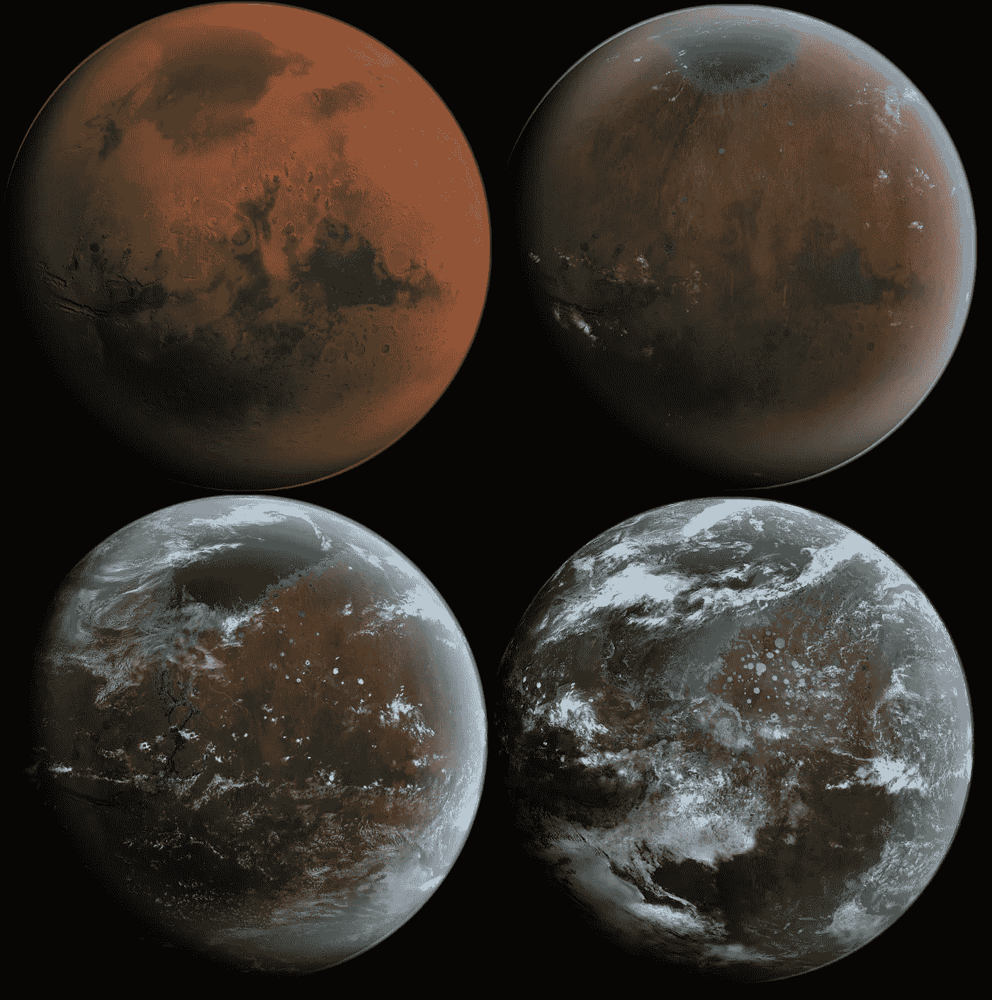

# 生态社区、技术和进化

> 原文：<https://medium.datadriveninvestor.com/eco-community-technology-and-evolution-f8670eca8015?source=collection_archive---------20----------------------->

随着世界的变化，随着资本主义展现其真实面目，随着气候周期的动摇和转变，我们需要专注于两件事。

## 第一:技术。

## 第二:*社区*。

[(source)](https://en.wikipedia.org/wiki/Terraforming#/media/File:MarsTransitionV.jpg)

**作为一名作家和思想家，我一直着迷于未来的可能性**——尤其是那些设法破坏我目前生活的世界的预期规范的可能性。每当人们告诉我“事情就是这样”时，我发现自己毛发倒竖，反问一句“为什么？”

鉴于当今世界的现状，我们显然需要一个巨大的范式转变；进入一个不同的时代，在那里，面对不断的质疑和对增长的坚定承诺，“事情就是这样”这句话不再有意义。

> 我上面提到的两点，技术和社区，是这个新时代的重要支柱。

**在美国，我们的社会和公民结构并不是为社区而优化的。从 60 年代开始，就有很多运动试图设想一种更好的共同生活方式，这些运动主要是由理想主义、宗教或两者的混合推动的。其中大部分都保持在一个令人绝望的小规模，变得不正常，或者干脆彻底失败。规模太小，实用性太窄，大多数这样的项目只不过是概念作品。我们需要的是生活模式的转变，这种转变试图通过我们所能使用的最实际和最有效的手段，在我们的社会中进行我们所需要的变革。**

这就是技术发挥作用的地方。随着新制造技术的兴起和社会建设与发展的聪明想法的扩散，我们正在达到这样一个点，即有可能创建一个可持续的社区——并且在不投入大量体力和脑力劳动的情况下做到这一点，否则会使人筋疲力尽。什么是生态友好的，什么是对社区的舒适和可持续发展有效和实用的，这两者之间的界限比人类历史上任何时候都要窄。

> 人类本质上是群居动物。帮助建设社区是我们人类与生俱来的天性；我们是互联互通的建设者；团结的守护者。正是通过我们与人类同胞的联系，我们从黑夜中找到了慰藉；正是在友谊的怀抱中，我们从自己孤独的生活中获得了更深刻的意义。

为了抵御我们周围世界出现的问题，为了成长为最好的自己，作为一个物种，我们需要重新设想我们如何形成社区。这不仅仅是另一个时代的嬉皮士梦，这是我们人类进化的重要一步。