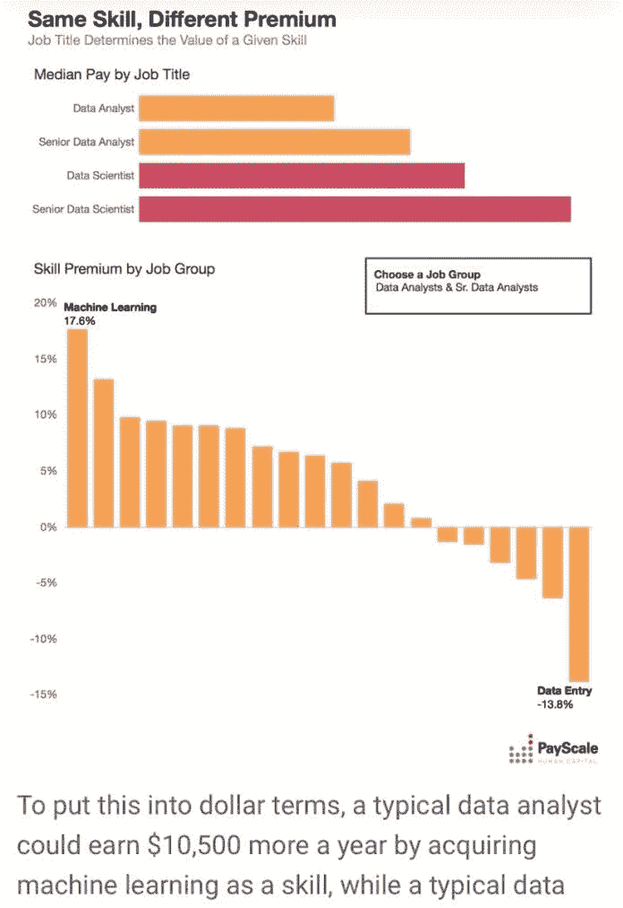

# 经济租金——超越天赋和技能的有影响力的转换

> 原文：<https://medium.datadriveninvestor.com/economic-rent-the-influential-switch-in-excess-of-talent-and-skill-3cf884954a64?source=collection_archive---------3----------------------->

Economy

好家伙！我们做了一天的工作！他们为工作竭尽全力！”——1941 年至 1945 年间特勤局国内行动处的口号。

职业在人类生活中起着至关重要的作用。毫无疑问，对其他灵长类动物来说也是如此，只是在他们的情况下，这种差异不被称为“职业”。技能和天赋这两个词足以描述他们的工作量。对于一个有工作的人来说，通过使用一生中学习和积累的技能来提供舒适的生活。在一个有组织的捆绑中积累技能，目的是促进个人在一个群体中的认可，如职业、专业或子专业；人类可以通过在一个被称为“头衔”的新术语下构建和美化他们来创造就业名单——像加德纳、木匠、医生、父母、律师、工程师等等。

有些工作满足于货币补偿的方式；其他人通过本能的满足和改善生活本身和所爱的人获得报酬。每个人都必须利用他们给定的精神和身体资源来完成给定的职业要求或任务。因此，必须保持就业，志愿者，或独立部分作为一个企业。人们需要与每种职业相关的各种技能或能力。有些可能包含在给定的名称下，但往往不是！在现实世界中，重要的是为一个特定的头衔所承担的特定职业描述的技能，甚至一个人可能比头衔更擅长一种或多种技能。反过来也是正确的，因为一个人可能被认为在特定的标题下熟练地完成了特定的任务，但却无法让接受者满意，或者赚的钱超过了该工作在经济上、个人上或社会上所必需的。为了方便起见——每一份工作描述都带有最低水平的技能。为了成功，我们需要在被认定为合格之前保持这种资质。收集和利用技能的方式取决于一个能力等级，称为天赋。“从理论上来说，能力是质量的决定性因素，因此一个人在特定时间所能完成的东西的价值也是如此。一个特工逻辑上会倾向于沉思。因此，大修的价值应该至少与其交付给[客户](https://www.datadriveninvestor.com/glossary/client/)或顾客的创造性成比例，并且必须提供所需的专业知识。但是反面就不一样了！

# 微观经济学概念

除了供给和需求的微观经济学概念之外，在一个给定的市场中决定服务面值的经济框架还包含了现存体系中的其他因素。这些因素总是会人为地影响通过各种途径传递的任何技能的价值。假设供给和需求相同，在竞争市场中，特定商品或其他交易项目(包括劳动力或流动金融资产)的单位价格将会变化，直到它稳定在一个点，在这个点上，服务或产品的数量在当前需求价值下将等于在现有价格下的供应数量，这有助于价格和数量交易的经济平衡。

在 21 世纪的世界里，供给和需求的顺序经常被操纵，而不管个人有多有天赋和技能。这让我们想到了这样一个概念:偿还精心挑选的、持有某个头衔超过其真实面值的人群；也称为经济租金。在这个切片中；我想详细说明技能的价值和报酬。

# 职业和就业市场

对于负责任的人来说，就业是不可或缺的，因为我们的生活依赖于就业才能兴旺发达，社会才能繁荣昌盛。除非身体或精神受到限制，否则这份职业将成为一种在社会中交换技能的方式，以获得我们个人无法获得的服务或产品。从更大的意义上来说，我们获得的技巧越多，我们就越有优势，因此，如果给定合适的环境，如果我们使可交付产品变得简洁并使客户最满意，那么有人要求我们服务的可能性将是巨大的。技能使我们具有竞争力，天赋赋予每个人独一无二的灵魂。我们都有独特的灵活性，这种个性可以在拥有相同技能的人中得到欣赏。奇点让我们变得有竞争力，而雄心则帮助我们每次都能带来更好的结果。因此，质量的诞生是在一个竞争的环境中。换句话说，质量是一个人向顾客提供服务或产品的方式的决定因素，这样他们就会欣赏它与其他人提供的产品相类似的独特性。如前所述；令人遗憾的是，价值并不总是适应前所未有的结果。今天，一个人技能的价值在一定程度上是社会政治影响的副产品。随着社会向组织严密的系统发展，法律的形成掌握在团体手中，这些团体联合起来保护市场，并使他们的愿景和使命合法化，以更高的财政收益换取类似的稀缺技能。在某些情况下，我们不能忽视那些为低质量作品获得报酬的人。今天，社会、组织和联合通过创造他们自己的技能领域而存在。因此，以这样或那样的方式形成了明显垄断的环境，通过这种环境，他们可以限制公民被允许学习，僭取特定技能，并利用精通的技能提供服务。今天的组织已经掌握了提高职业基本工资的技巧。这是通过精心设计一个供需柔顺的虚拟环境来实现的；这种接触会解码成谁应该因什么而赚更多！

# 质量和工作之间的差距

显然，工作的质量和数量与一个人应该挣多少钱之间的差距是很大的。或许；一个普通内科医生通过其指定的技能涵盖了比皮肤科医生更多的知识基础和工作时间。或者；普通外科医生可能比眼科医生花费更多的工作量和时间。然而，内科医生和普通外科医生的报酬普遍较低，更不“有利可图”。基于同样的理由，那些拥有“有利可图的专业头衔和技能组合”的人认为，更高的薪酬一定与作为副专业人员致力于教育的年数有关。反驳的争吵会是:获得一项技能的高成本本身就带有垄断性，因为这是一个单独讨论的话题。另外，一些工程和法律专业花在学校的时间更少，学费也更低；却比就业市场上任何医生的收入都高。

[**相关文章:千年对冲史，下篇**](https://www.datadriveninvestor.com/2019/11/28/thousand-years-of-hedging-history-part-2/)

主要问题是劳动报酬——多少；为什么在什么基础上，还有系统的逻辑？！—这是我们在思考实际问题之前需要回答的问题。

虽然答案可能令人担忧，但历史事实指向自我放纵驱动的垄断，以及那些害怕竞争和个人统治价值清晰的人对有技能和有才华的人的经济主权的控制。

不久前发表在 PayScale 上的一篇文章描述了强化的薪酬体系对工作的影响，以及技能溢价的概念。根据问题来源“技能溢价”,也被称为“技能溢价”,是指当一个人分享相同的头衔但没有相同的成就时，他的薪酬与另一个人相比的差异。其目的是概述一个事实，即并非所有的技能都需要奖金。此外，每种技能在不同情况下的价值会因工作的不同而不同。技能获取的类型分为:“假定的”或完成一项任务所必需的技能，公司从给出的标题中自动假定潜在客户具有这些技能；“必要的”(专业的)或必须具备的技能，以便候选人通过工作，但不能被假定；

“有用的”技能不是必需的，但有助于高效地完成工作，甚至在其他方面做得更好；“不相关的”技能对于给定的工作来说是不必要的，并且不会提高所申请工作的效率或执行力。为了进一步说明，该出版物的作者举例说明了数据分析师和数据科学家的角色。在通过数据获得[机器学习](https://www.datadriveninvestor.com/glossary/machine-learning/)技能的背景下，分析师可以给他们增加 10，500.00 美元的报酬。[薪级表将](https://www.payscale.com/data/which-skills-are-most-valuable)数据分析师掌握的数据归类为负溢价。(图 1)作者的假设与一些人认为的相反，公司不一定认为员工拥有他们需要的技能，而是通过数据分析的第一规则来证明这一点。他说，相关性并不总是转化为因果关系。反而相关性是技能值的头号木。工资标准认为，技能的价值取决于哪些强度是假定的、必要的、不相关的或对给定职位有用的，以及他们希望在未来获得的职位。

我的理解是，薪级表提供了另一个样本，表明人为的定理和标准过于恰当，这些定理和标准依赖于大量的变量和复杂的理论解释，就像从浑水中钓鱼一样。当然；后来的概念的复杂性令人信服地给一个普通的旁观者留下深刻印象，但实际上，在未能阐述工作质量的情况下，难以描绘其价值。它独特地依赖于一个组织良好的被操纵的理论[供给和需求微观经济学](https://www.investopedia.com/personal-finance/most-valuable-career-skills/)。

超现代的工资评级模型似乎遵循了政府对执照和证书进行多方面控制的基本理念。社团和协会的游说力量和报销控制以及企业招聘垄断在系统内的某些技能组合上造成了真空地带，旨在由选定的前景选择性地占据。

形成劳动力和能力的伪饥荒已经有一段时间了。到目前为止，这是巩固就业市场和劳资关系的副产品。虽然在主流社会中，像工会和协会这样的组织是为了保护那些拥有相同技能和职业的成员不受政府官僚机构的影响而成立的，但即便如此，它们本身就像是系统收获中一堆干草中的另一根针。从历史上看，工会的发展是为了保护其成员的工作权利，保护他们免受不公平的工资待遇；但他们在促进劳动力垄断方面的记录是显而易见的。工会主义并不比任何其他一体化机构更廉洁，因此[人们必须在与经济中所有其他团体](https://medium.com/datadriveninvestor/transformers-a-metaphorical-analysis-of-the-modern-day-corporatism-d2ad19ef768)平等的基础上讨论工会主义，适用于他人的规则也应该适用于工会。很难消除工会已经获得的特权，因为自上而下取消工会是困难的，然而标准实体在宪法上必须改变。它从剥夺工会的人格化和游说能力开始。他们必须被视为一群人，他们通过[合法化的隐性回扣做法](https://fee.org/articles/the-labor-monopoly/)的漏洞，寻求机会操纵就业市场。

# （从）历史的视角

亚当·斯密·FRSA 是 1723 年至 1790 年间的苏格兰经济学家。他是公认的道德哲学家和政治经济学的先驱，是苏格兰启蒙运动的关键人物。还有，被称为“经济学之父”的人曾经说过——《国富论》是现代经济学学科的先驱。在他的职业生涯中，他通过阐述理性的利己主义和竞争如何导致经济繁荣，发展了劳动分工的概念。史密斯有一个著名的观点，街头搬运工和哲学家之间的区别是劳动分工的结果。

David Joselin 在 2014 年 1 月发表了一篇题为“打破医疗行业的垄断”的文章。在他的笔记中，他假设“一个垄断者，通过保持市场经常库存不足，通过从不完全供应有效需求，以大大高于自然价格的价格出售他们的商品，并提高他们的报酬，无论是工资还是利润，大大高于他们的自然价格。”

亚当·斯密也在 1776 年写道，他指的是公司和学科法规，比如脑海中的皇家医师学院。他将英国政府置于公共和私人卫生部门关键部分的垄断控制中心。国家计划的后果是造成灾难性的后果，在全国造成假医生短缺，对移民医生和本国医生移民的期望很低。据作者称，六十年的国家垄断产生了更少的医生、全科医生、太缺乏经验的医生、比其他国家更差的临床结果，以及对大量外国医学毕业生的需求。

垄断的历史很古老，可以追溯到 20 世纪 50 年代的英国。作为分支；"垄断委员会"最初于 1949 年 1 月 1 日根据一些委员会关于限制性商业活动特定案例的建议而设立。1956 年至 1973 年期间，委员会以竞争垄断委员会、垄断和限制性惯例委员会、垄断和兼并委员会等名称注册和运作。1999 年，该机构被解散，此后完全在竞争委员会下运作，原因不明，从其词汇中省略了垄断一词。

[**相关文章:加拿大城市卡尔加里推出自己的数字货币**](https://www.datadriveninvestor.com/2018/12/14/canadian-city-of-calgary-launches-its-own-digital-currency/)

1967 年 1 月，英国贸易委员会要求垄断委员会报告影响专业服务的限制性惯例，这在当时似乎是英国医院围产期感染和妊娠并发症增加的原因。在此之前，委员会一直在调查一些商业组织中的贸易垄断和限制，因此，考虑专业前景的先决条件造成了一些不为人知的小故障，增加了其意图的模糊性。《泰晤士报》杂志宣布，这一典故的核心在于早期议会中工党后座议员(即英国议会(MP)成员或不担任政府职务且不是反对党前座发言人的立法者)的一场小型竞选活动。“在当时，人们认为当权的保守派不会指出任何更大的理由来解释对个人利益的限制和对病人帮助的限制之间的差异。但委员会本身显然对其调查领域感到困惑，并决定将证据的详细摘要限于不少于 130 个机构提供的证据。

# 人为通胀力量和医疗垄断

[2010 年 2 月 23 日，星期二，经济平等的基础](https://fee.org/articles/health-care-and-radical-monopoly/)揭示了现代医疗垄断，将其描述为仅仅是“人为通胀力量”的衍生物。在这些权力中，最关键的是在[支付](https://www.datadriveninvestor.com/glossary/payment/)动态中起激励作用的权力，以及医疗保健组织的权力，这些权力促使医生、医院和其他医疗保健机构更多地关注收入和收益，而不是满足患者的需求！这种经济方案是向该系统提供一种诱因，并诱导提供更多的服务，而不管护理质量如何。因此，推测，推动医疗保健支出无限高。因此，提供服务的医生控制了使用医疗资源的大部分决策。当然，解决这一特殊问题的一个办法是增强医患关系，最好是加上预聘或直接支付。这仅仅是曾经被称为“住宿实践”的个性化护理模式的实质。从那以后，后来的模式受到了包括纽约在内的一些州的保险公司根据“无执照保险单法案”的挑战。

突出的挑战之一是 AMG 医疗集团的约翰·穆尼在 2009 年引入了一种更新的住宿实践。立即；受到“纽约保险部”的质疑；因为 AMG 是一种固定费率的计划，并且不会对“计划外程序”收取更多费用，所以它会被视为一种未经许可的保险单。看起来纽约州确实是在以“保护公众”的名义，强迫现代旅馆从业者收取更高的费用，从而让医疗和保险卡特尔高兴。

# 英国国民健康服务体系

[来自英国的另一个叙述](https://nhsreality.wordpress.com/2014/06/23/economic--and-competition-in-healthcare-a-uk-perspective/)关注“经济租金”的概念，以及如何将这一概念应用于由大型公共服务垄断机构(包括国民医疗服务体系)主导的英国医疗体系，以及这一社会项目如何在英国医疗体系的提供中削弱竞争并为公平机会制造障碍。从技术上讲，经济租金是人们的收入与他们为保持目前的使用状态而付出的劳动、资本、土地(或任何其他生产投入)的报酬之间的差额。根据作者的观点，在一个竞争激烈的自由倡议中，经济租金是不存在的，但是——寻找可能是或可能不是非法的——会导致形成卡特尔，并以牺牲竞争对手和客户为代价游说制定有利于实体的法规。NHS 似乎正在施加自己的“经济租金”,该条款允许通过工会进行游说，并通过 NICE(国家卫生保健研究所)和 SIGN(苏格兰校际指导网络)等机构施加监管标准。

[美国医学协会(AMA)](https://medium.com/datadriveninvestor/medical-societies-and-their-flop-of-a-century-old-quest-2734c9c90f72) 与美国的其他联合组织一起，在过去已经通过对国会的直接游说，组织了他们对经济租金的适应，通过对即将到来的医生过剩进行虚假配给来限制具有特定技能的医生。因此，他们获得了说服国会为医疗程序法规制定价格的特权，这将创造一个高度受控的环境，规定一个程序应该如何支付；哪种技能和速度。今天的 AMA 声称该国正面临医生的严重短缺。在现实主义中，两个前传播者都是不明智的。

# 便利和工作

当谈到工作和报酬时，我们经常可以体验到隐藏的人类贪吃，通过控制他或她的野心造成的损失。我们经常会听到有人使用“少劳多得”或“少劳多得”这样的短语更聪明地工作，而不是更努力；但说实话，除非存在某种形式的经济租金，否则除了有技能的人根据纯粹透明的供求关系，即所提供服务的质量驱动价值，来构建薪酬之外，别无选择。就危险和责任而言；人们还必须认识到，每项工作都有其特有的风险和责任，而且每种风险都伴随着一系列的随机性。因此，那些有技能和才能的人能够利用他们的先天禀赋克服责任和复杂性，并使自己从竞争对手中脱颖而出，从而确保交付成果的更高质量和价值。

捷径、贪婪和消极态度是历史上发展出一套支配他人的计划的人们的共同特征。个体自我内部开始的安排，通过作为安全港的整合而发展和传播。

[**相关文章:关于加密货币的好与坏**](https://www.datadriveninvestor.com/2019/05/01/the-good-and-the-ugly-about-cryptocurrencies/)

每一项技能都是有价值的，也是需要的。是创造力简化了家务。铺路就像切除胆囊一样文雅，如果不是复杂的话。反之亦然。仅仅拥有正确的技能来完成正确的任务，以满足服务接受者的需求是最重要的。今天，多余的欺骗性口号，如某些工作是奢侈的，认证是为了确保公众健康和安全，社会的作用是保护工人和专业人士。这种愿景是贪婪驱动的，并被设想用第三方援助将一个群体从属于另一个群体。

# 控制是一个神奇的词。

为了建立高收入与可交付物的比例关系，包括政府在内的组织已经使用了各种工具和策略来操纵商业市场。政府干预对于劳动力的连续波动至关重要。[许可、认证甚至再认证](https://link.medium.com/AKPZUbuW30)在历史上一直被用来剥削谁能做什么，谁不能做给定的任务。与每个人都有机会吸收技能、不带偏见地申请的接受型就业市场相反，封闭型就业市场受到严格监管，其中一些被指定给正式当选的一等公民，他们符合适当的激进标签标准。

要在今天的劳工动荡中取得成功，首先必须会玩垄断的游戏；然后一个技能其次。身份、头衔、执照、学位和从属关系构成了一个重要角色。工会主义——或的概念；“如果你不跟我们在一起；那么你一定反对我们”毫无疑问适用于今天的职业市场。其中之一就是医学实践，它导致了世界上最具垄断性的市场体系之一。因为具有不同技能素质的医生必须遵守医学专业委员会的指示，并接受由 AMA、保险公司和类似实体确定的报酬。

不久前，我写了一篇关于护士从业者请求允许执行一些传统上为医生保留的技能的叙述。意料之中，引起了医疗组织的一系列反弹以及反对这种自上而下的激进改革的争议。通过另一篇[写上去我谈到了整容手术的状态](https://link.medium.com/ZD3aiYlZ30)；美容外科医生和整形外科医生之间围绕医疗领域的健康、虚荣和政治战争是垄断世界中最激烈的冲突之一。两篇文章都从不同的角度描述了经济租金的概念。

# 让我们转一下桌子！

我们不要把重点放在证书和许可下的头衔和捆绑技能上，而是简单地关注人才和技能的交流，这样如何？

为什么不填补技能差距，而不是通过在就业市场上创造另一个差距来缩短差距，以社会因素取代个人质量服务？

能力及其独特的影响者所谓的天赋是个人现象。它们是决定一个人在孤独的时刻能和另一个人表现如何的决定因素。环境和社会因素，包括可信度和受欢迎程度，是如何看待一个人以及在多大程度上对其付出的努力进行补偿的潜在影响因素，但底线是手的能力和客户的满意度。所有其他变量在较低程度上是相关的，因此使特定任务受到第三方倡议的操纵，并从一个人可以向另一个人提供的核心转移以换取公平价值的东西。同样，过度依赖社会激励容易阻碍那些拥有完美天赋的人学习和使用天生技能的机会，同时试图为那些热情较低的人提供同样的学习机会，因为某项特定工作在某种程度上“薪酬等级有利可图”。利润丰厚的薪酬工作类型偶尔会随着专制授权团体、组织、协会、协会或董事会的要求而变化。

相关文章:分解与基层对医疗保健问题的态度:行政特权的一瞥

# 平衡解决方案

解决方案很有挑战性。因为它涉及到人类生存最重要的必需品之一；在工作和谋生！一个没有工作和基本经济支持的人将无法专注于改革，否则他或她必须忍受。因此，带着得到他们应得的东西的希望，工人们求助于政府、组织、工会，它们首先将他们置于不公平的境地。因此，[典型的灵魂受制于通过治理伙伴关系模式合法回扣运行的整合](https://link.medium.com/a256sZHA40)。尽管如此，解决方案还是在基层。像大多数其他解决方案一样，每个人的个性在于他们知道什么以及他们如何分享他们的知识。公民必须将自己的信息掌握在自己手中，并在相互之间使用，而不受第三方的影响，无论是政府、工会还是社会团体。

自上而下的方法会一次又一次地失败。它将在就业市场上制造真空地带，只让指定的人受益。是的。你的技术可能比我好，但对于给定的任务，在给定的时间交付给给定的客户。也不是因为腐败和贪污助长的官僚召唤所赋予的头衔或技能。

每个人都应该在自由的就业市场中找到自己的位置。在同样的基础上，一个人和所有人都必须能够竞争，分享，并能够将他们的知识相互转让以换取回报。

建立教育、工作、技能和才能展示的自由市场机会对公平收入至关重要；并负责服务交付。

政府的工作必须主要是确保在没有法律偏见的情况下公平地获得技能、创造力和才能的自由贸易。行政部门必须凭借其逐字逐句的立场禁止各种垄断和回扣(不是用于未细分客户转介的描述性原则)。

政府必须惩罚由一群不诚实的人引导的非人类实体，而不是为普通公民挡住道路。总的来说，“民有、民享”是最强有力的，但在腐败者手中却被削弱了。

*原载于 2019 年 11 月 10 日*[*【https://www.datadriveninvestor.com】*](https://www.datadriveninvestor.com/2019/11/10/economic-rent-the-influential-switch-in-excess-of-talent-and-skill/)*。*

 [## 斯塔克法则，与医生法令的公正性相矛盾的企业避风港

### 贿赂及其形式化版本；根据目前的定义，回扣行为无疑是最…

medium.com](https://medium.com/datadriveninvestor/starks-law-corporate-safe-harbor-in-contradiction-of-impartiality-to-physician-decree-f572890707eb)