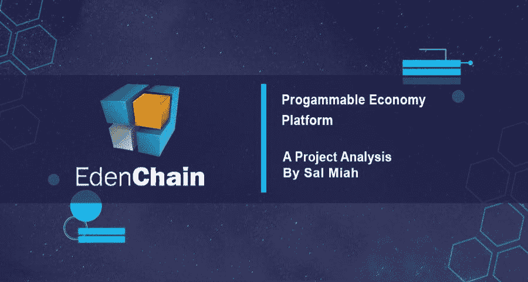
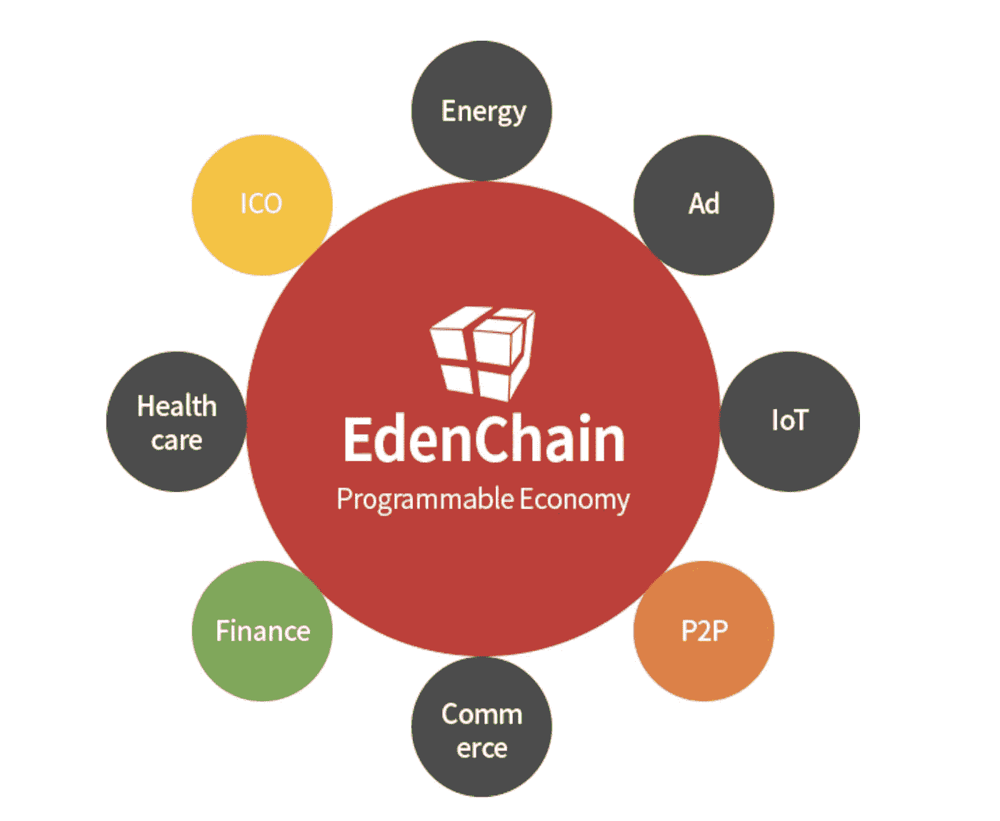
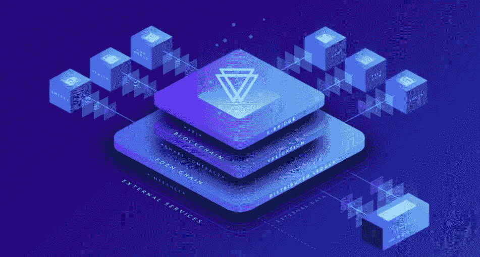
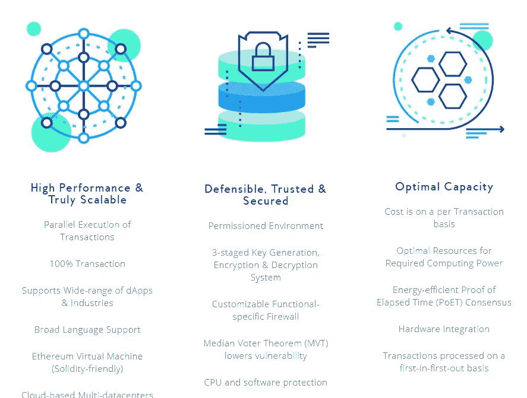
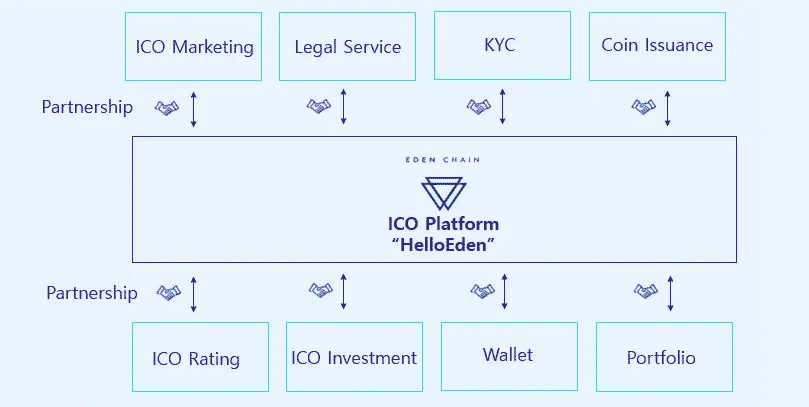

# Eden chain——为什么可编程经济会改变社会交易

> 原文：<https://medium.datadriveninvestor.com/edenchain-wants-to-place-value-on-all-assets-b0e072a8200a?source=collection_archive---------1----------------------->

[Source](https://medium.com/@salmanmiah)

> 赋予个人权力意味着赋予国家权力。快速的经济增长和快速的社会变革最有利于增强权能。

denChain 正在设计一种新的经济秩序，在这种秩序中，有形资产和无形资产通过其创新平台，通过这些价值的符号化而被整合在一起。智能合同被用于整合这两类价值，创造了所谓的**可编程经济，**这个术语表明了技术对经济的影响。区块链是这种经济的来源，因为它的方面和功能使这个平台设定的程序成为可能。多年来，区块链理工大学的优化一直是许多项目的焦点，因为分散化所承载的目标是由部分技术领域推动的。EdenChain 的区块链通过本文将讨论的前沿措施解决了性能交付差和安全性一般的问题。

这个新经济阶段的目标是通过消除不必要的中介来信任产品和服务的创造者和消费者，直到 P2P 互动成为经济中的常态。EdenChain 的计划将通过创造者和消费者之间更个人化的互动创造的创新来见证新经济的出现。它还将见证目前集中在最终消费者和创新者之间的财富再分配。中间商对经济的垄断将不复存在，一旦他们集中的财富被分配，这将允许更多的人繁荣发展👪。

# **将科技融入经济**

在这个历史时刻，任何企业的相关性在于他们如何利用技术来优化他们的功能。企业适应技术越快，生存的可能性就越大。技术不仅是一个很好的优化业务，但它也是一个伟大的方式来改善产品和服务。目前，正在启动区块链项目，以帮助经济和世界市场适应各个部门的现有威胁。

区块链的部分优势在于能够对财产进行令牌化，无论是物理财产还是虚拟财产。利用这一功能有望改善经济服务和解决方案，这就是为什么 Eden 正在创建一个平台，让创意者和创新者利用符号化来推动世界经济的发展。

在这一点上，新兴技术也在世界上发挥着至关重要的作用。物联网等创新让创意者和创新者的思维远远超出了他们的研究范围，在这个过程中提出了独特的解决方案。这些新兴技术，如**物联网**正在创造新的收入来源，从而产生新的经济。 **EdenChain** 计划建立一个平台，让创新者组织他们的创收想法，创造新的经济，维持世界市场。

这个项目也是在智能手机、平板电脑和其他手持便携式设备在超过 20 亿人的手掌上的时候出现的，人工智能技术正在被简化，数据已经成为新的黄金，云服务对于智能设备所有者来说是必不可少的。通过创造创收活动，只需在屏幕上方便地点击几下就可以控制，充满活力和可持续的经济有可能出现并真正繁荣。

Users will now be able to tokenize assets in a convenient way like never before | [Source](https://hacked.com/wp-content/uploads/2018/05/2-1.png)

# **可编程经济**📜

这代表了该项目的宏伟愿景。如前所述，重新安排当前的经济体系以匹配已经暴露在世界面前的技术是至关重要的。对大多数经济体来说，赚钱的概念仍然模糊不清。汽车、黄金和石油等物理属性都有其自身的价值，并有一个确定的价值计算过程。对于追随者或名声等非物质对象，没有真正的方法来确定一个人因其名声而值多少钱，或者他们能影响多少人。

这些新的收入来源是这个项目的目标。这些收入流的符号化将允许该平台的用户赋予他们现实世界的有形资产和无形资产价值。通过将买方直接连接到卖方，这个平台允许双方就买方愿意支付且卖方认为值得他们的产品或服务的价值达成一致🤝。以时间的价值为例。每个人都有自己的时间价值，这取决于他们提供的服务。某些产品需要更多的时间来制作，而其他产品可以很快完成，但这些产品的定价不一定与制作时间成正比。P2P 连接允许每个人陈述他们自己的估价，并就他们对时间或产品的共同估价达成一致。这在一定程度上是 EdenChain 对可编程经济的设想，因为这些服务可以通过各种软件和应用程序获得。

➡️Tokenization 是这一安排的关键。物理和非物理属性都可以使用 EdenChain 平台进行令牌化。

➡️Tokenization 就是用虚拟货币赋予有形和无形资产价值的过程。

➡️The 价值将以 **EDN** 代币的形式给出，代币是在 EdenChain 生态系统中使用的官方货币。

➡️Tokenization 涉及到为财产尤其是知识产权提供**证明等流程。这些财产的所有者必须证明他们是某些知识产权的创造者，或者他们是通过正确的合法渠道获得其资产的所有者。**

资产的所有者，如名声和良好的追随者或影响力，可以使用证明来确认他们对人口的影响。

与财产所有权相关的细节必须存储在安全的数字空间中。将使用智能合同，以确保所有权和其他法律上的必要条件在合同中明确规定。它们将包含资产的特征以及其他细节，例如它们实际上是否可以出售。包含知识产权和其他非实物资产的各种智能合同可以组合起来形成新的资产。这些资产所有者的创新和创造力将决定从 EdenChain 的使用中可能涌现的新资产的类型📰。

令牌化过程可以概括为，将非物理资产编码到智能契约中，然后该契约以令牌的形式持有一定的价值。这是可编程经济的基础。

# 🏋**发动机停止运转**

为 EdenChain 提供动力的整个系统旨在改善效率低下的问题，这种问题一直存在，而且在一些区块链仍然存在。一般的安全和性能只能让区块链达到它的社区，甚至那也是一个延伸。区块链的主流采用要求性能优于集中式系统，同时提供更好的服务。EdenChain 的平台针对的是经济，以及如何改善经济；因此**性能**和**安全性**必须具有较高的标准，并且能够根据对系统的要求进行改进。

对于集中式网络，如每秒处理 **157000** 个请求的脸书，它们可以轻松支持网络上的负载，因为大多数请求要求不高。对于像这样的区块链平台，需要一个能够支持传入请求的传输速率，特别是因为与集中式系统相比，在区块链上完成一个请求需要更多的数据。**比特币**和**以太坊**是伟大平台在扩展方面能力有限的完美例子，这阻碍了它们发挥全部潜力🔐。

现在，EdenChain 通过其系统结构大大改进，交付了一个与同行相比具有 extremley 稳健性能、速度、效率和稳健安全性的有前途的项目。

# **系统架构**

EdenChain 为其平台选择了私有或授权的区块链，因为这样更容易获得更好的性能结果。与公共区块链相比，该选项为系统提供了更多的控制，这是至关重要的，尤其是如果该项目要达到其性能目标。进入这个生态系统需要管理员的许可，这允许创建一个更加安全的平台。那些希望加入该平台的人必须满足的要求允许过滤掉潜在危险的个人加入其生态系统。它的体系结构由三个不同的层组成，每个层都有独特的功能。这三层主要关注区块链协议流程中涉及的数据的**存储、验证和分发**💪🏽。

EdenChain will use three layers for the processing and security of the data | [Source](https://i.imgur.com/g1VuABL.png)

用于分发的**层**单独存储在区块链使用的数据。它还处理在**验证层**中已经同意的数据。一旦在验证层达成一致，可能已经做出的请求将被带到**分布式分类帐层**进行进一步处理。随着交易的增加，存储在分布式分类帐中的数据也在增加。其分类帐随着需要处理的协议成比例增长

验证层是通过使用**以太坊虚拟机(EVM)** 执行和验证请求的协议的地方，以太坊虚拟机运行本项目中使用的智能合同。在这个平台中，EVM 被用来提供对 Eden 智能合约的轻松访问，并且还被用作为此平台创建各种智能合约的垫脚石。在验证层下，事务调度对于平台的性能和特性至关重要。

**桥接层**是 EdenChain 架构的最后一层，为链上和链下存储提供数据共享解决方案。在这个生态系统中，这两种存储类型之间共享的数据需要如此安全。这个生态系统上托管的节点既有链上的也有链下的，因此需要在这些方之间共享数据。基于**椭圆曲线密码的门限密码或 ECC-TC** 加密技术用于这两个系统之间的安全可靠通信🔒。

# **私有区块链的优化**

如前所述，EdenChain 将使用私人区块链。在满足设定的要求后，伊甸园生态系统的成功成员肯定会期待比公共链更好的服务。其中一个需求可能是平台持续可用，很少停机或不停机。考虑到 Eden 将处理涉及货币的协议这一事实，他们的平台需要平稳运行，即使在任何潜在的试图破坏其平台的情况下🤓。

这个生态系统为任何可能影响其运行并进而影响其用户运行的攻击或自然灾害做好了准备。Eden 采用云服务来确保平台始终正常运行。提供的云服务将连接世界各地的数据中心，允许数据中心到数据中心的配置。它还运行一个具有多数据中心模式的 **Eden 系统**，该系统使用一个全局 DNS 和一个负载平衡器，即使在受到攻击时也能为平台提供舒适的操作。

# **逝去时间的证明(诗人)** ⌚️

这是 POS 和 POW 机制的更合理的替代方案。一个区块链平台只有当它的一致性算法有足够高的质量时才能一样快。所采用的**诗人**机制在区块链的参与节点中选择一个领导者，为所选择的领导者提供块生成的机会。与其他共识机制相比，这种选择是随机进行的，几乎不消耗能量。出于安全考虑，PoET 在 SGX 的一个飞地**实现，同时也是为了让随机选择过程顺利进行。在选择过程中，SGX 飞地中的 CPU 命令用于确定等待时间最短的节点，该节点紧接在作为随机数的指数分布之后，然后被选为领导者。**

As the website states ‘The Engine Behind the Most Dynamic Enterprise Infrastructure’ | [Source](https://edenchain.io/)

# **性能升级**

在 Eden 的生态系统中，性能就是一切。Eden 结合了两项强大的创新来提高其平台的整体性能和可扩展性。**名称空间**与 **Merkle 树**结合🌳来提供一个真正可扩展的平台。名称空间允许 Eden 中的可伸缩性。围绕名称空间构建的执行系统使得同时处理并行协议成为可能。这确保了来自多个来源的协议处理需求都可以得到处理，而不必为了满足它们的需求而对它们进行排队。当 Merkle 和 Namespace 结合在一起时，会产生强大的性能和可伸缩性。

# **安全升级**

除了筛选进入生态系统的入口，Eden 还使用 E-Bridge 层来加强其平台的安全性。当智能合同与外部系统连接时，E-Bridge 允许从不同来源检索数据。在收集之后，对这些数据进行加密。中间选民定理(MVT)用于确保玩家之间的信任，并抵御网络攻击者或黑客的可能攻击。更好的安全性让社区成员在使用平台交易他们的各种资产时更有信心。

# **创造更美好的未来**🌝

EdenChain 宣称自己是为具有前瞻性思维的企业提供解决方案。它围绕可伸缩性和性能构建了自己的平台，深知它的成功将吸引大量用户。交易的并行执行，广泛的语言支持，包括目前最流行的智能合约语言 **solidity** ，以及基于云的多数据中心都是这个复杂平台的一部分，因为它们对于可能托管在 Eden 中的多个企业的成功至关重要。

随着大量用户群的预测，还需要一个安全的平台。用户希望知道他们的资产是安全的，无论平台正在经历什么。伊甸园的生态系统是可靠的，可防御的，可信的和安全的。其许可架构、3 阶段密钥生成、加密和解密系统、媒体投票定理以及对软件和 CPU 的保护，使 EdenChain 拥有✅.计划中最安全、最值得信赖的系统之一

在效率和环境方面，伊甸园忠于它的名字。其节能的诗人共识机制和计算能力的优化使其成为世界也在设想的绿色经济的支持者。

在这个生态系统中的交易成本也可能低于当前的集中式结构。它的 P2P 连接使得更好的交易更容易达成，因为在这个平台上不会使用任何中介。虚拟货币的使用也降低了通过伊甸园交易时的摩擦成本。与银行和其他中央系统相比，EDN 提供了一种更便宜的交易方式，交易费用更低，而不是在银行为账户之间的交易支付额外费用。

EdenChain 也是万能的。它的平台可以被任何企业使用。从医疗保健应用到能源、金融和商业，一旦该项目充分发挥潜力，世界经济将受益匪浅。通过 EdenChain 的创新，新兴经济体的前景也使这个平台颇具吸引力。

HelloEden will have a full-service ICO platform, providing many of the most important functionalities | [Source](https://hacked.com/wp-content/uploads/2018/05/4.png)

根据这些陈述的事实，Eden 检查了未来问题的所有方框，这些问题既能解决眼前的问题，又能提供改变世界的解决方案。伊甸园体验将通过 HelloEden 首先在韩国市场感受到。这将作为一个基准，显示通过 EdenChain 可以实现什么。EdenChain 是一个伟大的项目，很可能是世界可能需要的经济发展🤘。

*关于这个伟大项目的更多信息，请* [*阅读以下由*](https://hackernoon.com/edenchain-a-3rd-generation-blockchain-platform-for-the-programmable-economy-34d61a69d1b)*[*LindaCrypto*](https://medium.com/u/f06e918d0829?source=post_page-----b0e072a8200a--------------------------------)*[*或*](https://medium.com/@cultcrypto/solving-the-blockchain-scalability-and-security-issue-with-blockchain-3-0-5bbc05bda2bc)*[*crypto 对决*](https://medium.com/u/b29062a2f4ae?source=post_page-----b0e072a8200a--------------------------------) *撰写的文章。****

*****免责声明:*** *请仅将此信息作为我的* ***自己的*** *意见，在任何情况下都不应视为财务建议。做任何决定之前，请记住****【DYOR】****。***

**♂️你好，我叫萨尔。*如果你觉得这篇文章很有用，并且想看我的其他作品，请一定要鼓掌并在 medium 上关注我！😎***