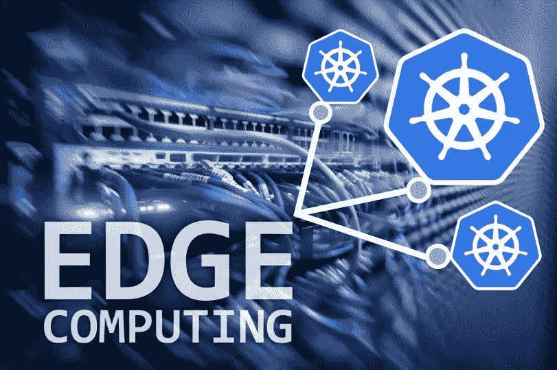

# 边缘计算:挑战和机遇

> 原文：<https://medium.datadriveninvestor.com/edge-computing-challenges-and-opportunities-9f2dddbda49e?source=collection_archive---------2----------------------->

本文由 [Roopak Parikh](https://platform9.com/blog/author/rparikhplatform9-net/) 合著。

=================

边缘计算时代终于到来了。数字和移动技术的快速发展使得边缘计算变得越来越普遍，对于各行各业的企业成功也变得越来越重要。

# 什么是边缘计算:

边缘计算本质上是将内存和计算从传统数据中心中分离出来，使它们尽可能靠近需要它们的位置，通常是以手持或本地设备、装置、销售点或分布在不同位置的物理单元的形式。

 [## 生活在边缘——数据驱动的投资者

### 为边缘和混合计算而重新设计的旧思想这是一种数据抓取！感觉每个行业的每个人…

www.datadriveninvestor.com](https://www.datadriveninvestor.com/2019/03/22/living-life-on-the-edge/) 

边缘对于不同的行业有不同的含义。例如，对于汽车行业，这可能意味着智能汽车或技术人员和服务中心使用的手持设备的计算能力越来越重要。对于零售业来说，这可能意味着销售点系统可以提供新的计算能力，以及在店面向顾客提供新的体验。即使在快餐业，福乐鸡快餐店也分享了它在每家餐厅运行基于容器的应用程序的边缘设备。

与现场本地设备交互最密切的边缘应用每季度都变得越来越复杂和智能。对于终端消费者和企业来说，边缘计算有很多机会和前景。这些应用程序可以为客户提供无缝的个性化体验，帮助改进业务流程，等等。

让我们首先来看看边缘计算的一些关键的有前途的用例。然后，我们将讨论边缘计算面临的挑战，以及企业领导者围绕支持智能边缘应该自问的一些关键问题。

# 五个关键边缘使用案例:

1.  现场和工业物联网-各种传感器和其他垂直领域的现场设备，如制造、运输、电力，是边缘计算的主要候选对象。这些设备可以是 HVAC 系统、电表、飞机引擎、石油钻塔、零售扫描仪、风力涡轮机、联网汽车、供应链中的 RFIDs、机器人、AR 等等。这些应用程序通常从边缘设备收集数据，并针对不同的业务用例进行分析，包括安全管理、预测性维护、性能或使用情况跟踪、需求预测等。
2.  智能城市和建筑——全球许多城市都在争夺智能城市的标签。物联网设备将使市民在这样的城市生活更容易。这里的使用案例包括市政当局提供更快的城市服务(设备维修)、交通管理(减少交通堵塞)、公共安全和绿色能源供应
3.  零售和酒店业的客户体验—收集和分析客户情绪数据和社交媒体数据，以改善客户体验。这里的数据是由信息亭或销售点(POS)系统或终端捕获的。
4.  互联车辆—例如，用于导航或影响汽车保险动态定价、预测所需维护等的远程信息处理数据。
5.  面部和图像识别—在零售、银行和娱乐等垂直行业中作为识别客户和减少欺诈的一种方式。

# 边缘代表了独特的计算挑战

边缘计算与传统数据中心环境有很大不同，原因如下:

1.  计算和硬件限制:从技术计算空间的角度来看，许多边缘环境都受到限制。例如，在嵌入式设备的情况下，您不能像在全面的数据中心那样安装那么多硬件。
2.  可访问性和操作限制:通常，边缘应用程序在部署人力 IT 资源来管理它们时会造成后勤困难，并且不允许高运营商成本。公司不可能有专门的管理员来监控和服务每一个边缘位置。例如，分布在数千英里之外的风力涡轮机、位于油井或矿区深处的传感器、百货商店每个收银台前的每个支付处理设备，或者位于人们私人领域的恒温器。由于距离、设备体积、地理可及性和其他成本/投资回报考虑因素，这些运营商限制要求边缘应用不仅在计算占用空间上非常低，而且在技术 IT 开销上也非常低。从安装和持续运行的角度来看，它们必须是“即插即用”的。
3.  远程管理:在许多环境中，没有熟练的人员来定期部署和管理解决方案。不熟练的操作员可能需要执行简单的即插即用部署。这包括提供安全的 edge 应用程序更新、出现问题时的调试能力以及额外设备的部署。边缘应用需要高度复杂，并且应该能够提供一系列功能:在失去连接的情况下的数据缓存、过滤、分析相关数据的原始数据流处理、基于事件的应用的消息代理、设备管理、容错等。节省受限网络的带宽成本也是另一个重要的考虑因素。
4.  连接性:技术提供商处理各种延迟和抖动问题的能力也很关键。
5.  [支持气隙部署](https://platform9.com/blog/introducing-klusterkit-an-open-source-toolkit-to-simplify-kubernetes-deployments-on-premise-air-gapped-environments/) —能够在计算受限的位置管理远程气隙设备，而无需求助于手动干预，这是边缘计算的一项关键需求。中央云的高延迟会导致延迟，并干扰应用程序的工作。这也意味着源自数据中心网络“正常运行模式”的假设在边缘环境中通常不成立。
6.  安全性是一个基本考虑因素。这包括从数据中心到边缘的安全通信，确保静态和动态数据的隐私性—匿名化存储在边缘的敏感客户数据。其他安全要求包括在中央数据中心和边缘设备之间建立相互信任，在发生攻击时发现和阻止恶意设备的能力，以及通过 WAN 的安全通信。
7.  跨边缘部署目标和传统数据中心的统一架构和发布流程。这是一个重大挑战，因为许多边缘应用程序还需要跨其他环境或数据中心部署，从而创建了一个复杂且几乎无法管理的代码库、管道、部署流程和运营实践矩阵。这些架构孤岛与数据和流程孤岛一样，都是技术债务的原因。

# 通过智能边缘实现数字化转型

鉴于上述挑战，以下是技术领导者在发布边缘应用时应该问自己的一些关键问题:

1.  在互联世界中，我们如何影响客户体验？什么样的生态系统伙伴关系有利于特定的使用案例？例如，如果你是零售商，实时客户流量如何影响动态促销以推动销售？你能与银行或互补垂直市场的玩家合作来赢得客户吗？
2.  新的 edge 体验将如何与现有渠道和流程整合，以提高客户参与度？根据上面的例子，我们能否根据顾客之前的购买情况向他们推荐其他产品？
3.  如何使用 Edge insights 扩展现有的业务流程？回到我们的零售例子，流行商品如何影响“准时”生产、采购和供应链工作流程？这些可以用新数据来补充吗？
4.  什么是使企业能够实现这些功能的合适的体系结构堆栈？从云、数据和中间件设计的角度来看，这是什么情况？我们需要在边缘上运行虚拟机和容器的组合吗？
5.  这对于跨技术堆栈和各种利益相关方实现自助服务意味着什么？业务转型应该是自主能力吗？它不应该成为瓶颈。例如，某些较繁忙的商店能否在不需要长时间手动配置的情况下即时获得更多计算能力？
6.  我们如何做到这一点，同时消除构建、运营和管理云的大部分繁重工作？简而言之，我们的 IT 如何避免成为“云看门人”？
7.  这些边缘系统如何不断学习和改进？部署在配送中心的机器人或无人机可以学习如何组装盒子并将其存放在正确的区域吗？能否部署一个数学模型，使机器人能够理解平均补货时间、错误率、业务流程的准确性等指标。
8.  跨边缘设备收集的数据如何帮助减少不必要的库存、损坏和其他质量问题？
9.  从计算云的角度来看，关键要求是支持低延迟、高度的工作负载并行性和容错能力。

请继续关注本系列的下一篇文章，我们将看到随着容器的出现，这个边缘是如何被重新激活的(提示:Kubernetes 在这里扮演了一个巨大的角色！)，并回顾实现边缘应用所需的一些架构和设计最佳实践。快速体验一下——查看这个围绕 [3 个 Kubernetes 用例录制的网络研讨会:云原生应用、混合云、在边缘](https://platform9.com/resource/kubernetes-use-cases-cloud-native-apps-hybrid-clouds-at-the-edge/)

本文最初出现在[物联网议程](https://internetofthingsagenda.techtarget.com/blog/IoT-Agenda/Edge-computing-challenges-and-opportunities)