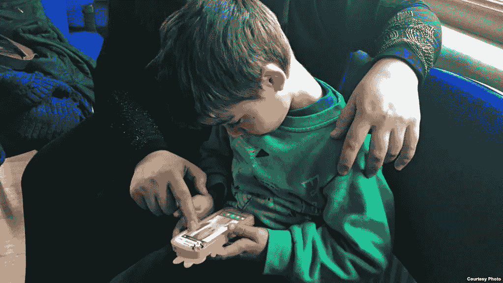
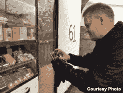
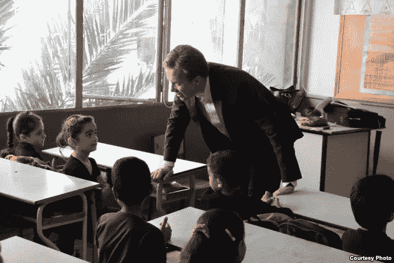
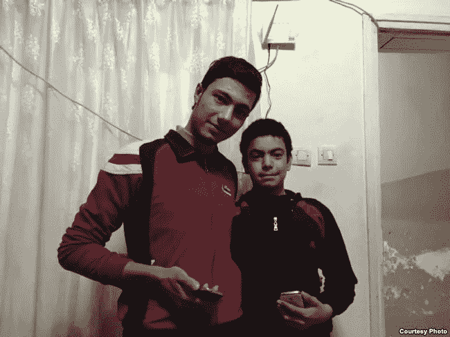

# EduApp4Syria: app 践行科技行业的信条“让生活更美好”

> 原文：<https://medium.datadriveninvestor.com/eduapp4syria-app-lives-up-to-tech-sectors-credo-to-make-life-better-a392d99de086?source=collection_archive---------34----------------------->

**Mohammed, age 5, uses his mother’s smartphone to play games earlier this year. Before his family fled Aleppo, his grandfather was killed. (photo courtesy Liv Marte Nordhaug)**

这些数字令人震惊——以至于在叙利亚经历了五年的战争后，人们的思维变得模糊。

根据叙利亚政策研究中心的估计，死亡人数从 25 万到超过 47 万不等。

2014 年，联合国宣布停止追踪遇难者，称由于战争的复杂性和混乱，无法再准确确认死亡人数。

就像几乎每一场战争一样，妇女和儿童是叙利亚最容易遭受破坏的群体。

考虑以下数据点:由于战争，超过 400 万[叙利亚儿童](https://www.hrw.org/news/2015/11/08/turkey-400000-syrian-children-not-school)没有上学。

参加 [EduApp4Syria](https://norad.no/eduapp4syria) ，这是一项由挪威、美国和一小群非政府组织联合举办的 170 万美元的比赛，旨在利用智能手机的广泛使用，让流离失所的叙利亚人继续学习。

这是一个简单的想法:使用基于游戏的学习来帮助那些教育停滞不前的孩子——叙利亚境内的流离失所者或难民。

**Dr. Alf Inge Wang. (courtesy of Liv Marte Nordhaug)**

“我们去了土耳其靠近叙利亚边境的加济安泰普，与许多叙利亚家庭谈论了这个项目，”Afl Inge Wang 博士说，他是竞赛的领导者。

“在我们参观的一个家庭中，整个家庭住在一个房间里，最小的女儿，大约 12 岁，从来没有学会阅读。

但她经常在她哥哥的智能手机上玩游戏，”王补充说，他是挪威科技大学基于游戏学习的教授，也是游戏平台 [Kahoot 的共同发明人！](https://getkahoot.com/)

“几乎所有叙利亚家庭都倾向于拥有智能手机，”挪威外交部长 borge Brende 在给本报记者的一封电子邮件中说。

“我们希望利用这一点，使有吸引力的和激励性的识字学习游戏成为可能。”

Norwegian Foreign Minister Børge Brende visiting a school in Beirut, Lebanon, where Syrian children attend classes in the afternoon on May 30, 2014\. (photo credit by Frode Øverland)

战争创伤会使学习更加困难，对记忆、注意力和其他更微妙的认知障碍产生负面影响。

那么，一款智能手机游戏如何发挥作用呢？

“基于游戏的学习可能是一种有效的形式，”挪威发展合作机构的高级顾问丽芙·玛特·克里斯蒂安森·诺德豪格说，该机构支持这项比赛。

诺德豪格说，数字游戏中的声音和动画刺激大脑。“根据学习者的水平调整挑战的能力”是另一个因素，此外还有“通过身临其境的叙事和有趣的游戏来参与和激励的能力。”

这些应用都是阿拉伯语的，可以在苹果和安卓智能手机上运行。

几年前，美国副国务卿安东尼·j·布林肯在斯坦福大学发表讲话时说:“我们需要扩大我们知道已经奏效的现有努力，如扩大非正规教育中心的范围，或向叙利亚教师提供津贴，这些教师可以帮助满足对训练有素和有才华的教师的巨大需求。”

“我们继续需要改变游戏规则的新想法，比如移动教室、播客上的额外课程或虚拟学校。”

王正在寻找孩子们可以联系的应用程序，他告诉网络开发者不要低估他们的智慧。

**Syrian refugees Ahmet, 19, and his 15 year-old brother Muhammet pose with their smartphones earlier this year in the apartment they share with their family in Gaziantep, Turkey.**

“如果标准的学习方法被装扮成游戏，孩子们会很快发现这一点，”他说。

“这就像喂他们巧克力裹西兰花一样。所以我们想要真正的游戏，有很好的游戏机制和叙事，可以帮助孩子们学习如何阅读，并提供一些心理社会支持。”​

*   ***作者注:我的故事是*** [***原载于 2016 年 VOANews.com***](https://www.plagscan.com/doc?122219428)***。鉴于来自硅谷的所有坏消息，我认为这可能会提醒我们科技的优势。***