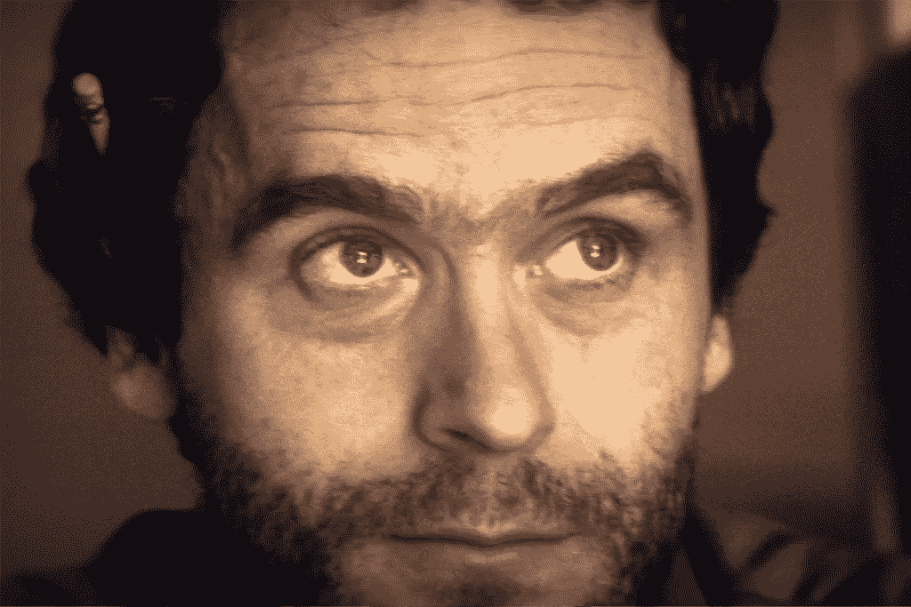
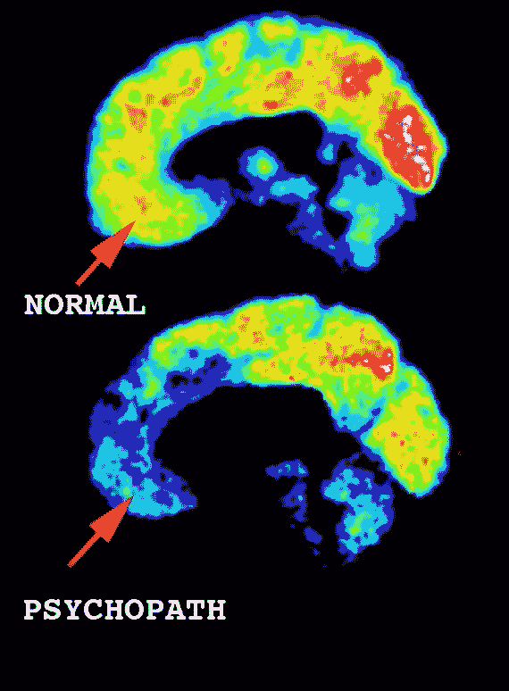
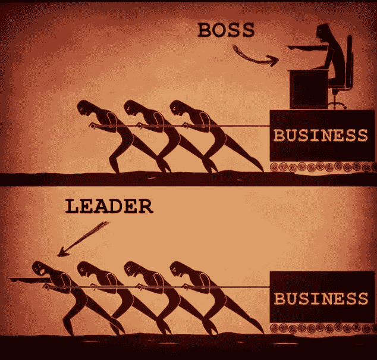

# 青少年的教育和再教育:发展青少年感到内疚和羞耻的能力的极端重要性。

> 原文：<https://medium.datadriveninvestor.com/education-and-re-education-in-youth-the-extreme-importance-of-developing-the-capacity-to-feel-737082158750?source=collection_archive---------4----------------------->

葡萄牙语

> *内疚？我们用这种机制来控制人们。这是一种错觉。这是一种社会控制机制，非常不健康。它会对我们的身体造成可怕的伤害。有更好的方法来控制我们的行为，而不是非常规的使用罪恶感。*

*——泰德·邦迪，连载黑仔。*

Netflix images: Ted Bundy

几个月后，网飞发行了一部关于泰德·邦迪生活的纪录片。他是美国最著名的连环杀手之一。众所周知，他性侵并杀害了 36 人(已核实)，但据推测这一数字要大得多(50-100)。

 [## 教科书行业如何最终被颠覆，并将继续改变|数据驱动…

### 就此而言，教科书产业在美国乃至全世界都有着悠久的历史。事实上，他们已经…

www.datadriveninvestor.com](https://www.datadriveninvestor.com/2018/09/25/how-the-textbook-industry-has-finally-been-disrupted-and-will-continue-to-change/) 

你一定想知道，泰德·邦迪的一生和他的大脑与我们分享了什么对我们年轻人的形成和教育极其重要的东西？

青春期是人类生活中一个非常活跃的时期，以身体的一系列不断变化为标志，以寻求成年生活的成熟。大脑发育也不例外，最近的研究强调了羞耻和内疚的重要性。

> 像 Ted 这样的心理变态的大脑经历与正常人非常不同的社会关系，包括无法感受同理心和情感，这已经不是什么新鲜事了[1]:

*上图显示了正常人和精神病患者在社交环境中活跃的大脑区域。精神病患者激活的负责社会环境的额叶区域比正常人少。趋向黄色/红色的亮度越大，大脑越活跃。趋向蓝/黑的蓝色微光越大，激活越少。*

对特德的一个非常清楚的描述是他没有负罪感。对他来说，当他被评判时，一切都是智力挑战和笑话，而不是被指责的可能性。在《网飞》的特别版中，它揭示了对泰德大脑中的化学物质进行的分析，并表明了脑瘤的可能性，这种脑瘤可能会阻断并影响负责移情和内疚的大脑通路。

> 你有没有想过内疚和羞耻是否是人类生存的必要条件？原因会是什么？

最近一项 15-25 岁的研究[2]表明，青少年时期对他人观点的关注会导致更多频率和强度的与内疚和羞耻等情感相关的体验。

尽管罪恶感和羞耻感看似相似，但在大脑中却发生了不同的过程。

羞耻感对年轻人神经发育中杏仁核的健康形成起着至关重要的作用。大脑的这个区域是边缘系统(更古老、更本能的进化区域)的一部分，涉及性和攻击行为。它在青春期受羞耻感影响而量身定制的发展，可以帮助青少年在整个成年期出于社会关系的考虑，对本能情绪的控制和厌恶。

在大脑中，内疚与后悔和自责的经历有关，这两种感觉都会激活移情途径[2]，从而有助于思考、投射和担心“他人”的能力，反映出良好的同情行为和健康的社会关系，如朋友、激情、爱和专业精神[3]。

内疚导致决策中对社会情绪后果的预期和后悔实验，这一过程对理解他们的行为如何产生影响具有社会意义。这也反映在积极的行为中，例如，内疚与更强的领导能力有关:

> 容易产生负罪感的人比那些不容易产生负罪感的人工作更努力，表现更好，而且被认为是更有能力的领导者。[4]

但是要小心！没有什么是千奇百怪的，一切过度都是不好的。过度的内疚和羞愧可能会导致青少年更容易患精神疾病，如抑郁症、精神分裂症、躁郁症和焦虑症。

> 然而，重要的是要记住，即使是不好的感觉，如内疚和羞耻，对培养一个更懂道德和社会共存的公民也是很重要的。

**所以要警惕青少年，如果他们需要重新融入社会，他们有机会接受教育或再教育，以某种非侵入性的方式(虚拟游戏、讲故事或不伤害自我的积极教育)，你感到内疚和羞耻的能力。**

发育不良会导致社会情绪问题，在极端反社会的情况下，可能会出现情绪不佳、认知能力差、智商低、注意力问题、自控能力差和抑郁风险[2]。

**参考文献**

[1]精神病患者的心智:心理变态的杀手；菲奥娜·盖伊；谋杀心理学；犯罪旅行者；2018.

[2]青春期和成年早期的内疚和羞耻倾向的神经发育相关性；萨拉·惠特尔等人:发展认知神经科学；2016.

[3]内疚倾向与道德品质；塔亚·r·科恩等人；心理科学的当前方向；2012.

[4]为你的研究辩护:充满负罪感的人成就伟大的领导者；弗朗西斯·弗林；哈佛商业评论，2011 年。

[发表在大脑支持神经科学上的博客](https://www.brainlatam.com/blog/education-and-re-education-in-youth-the-extreme-importance-of-developing-the-capacity-to-feel-guilt-and-shame-in-adolescence.-346)