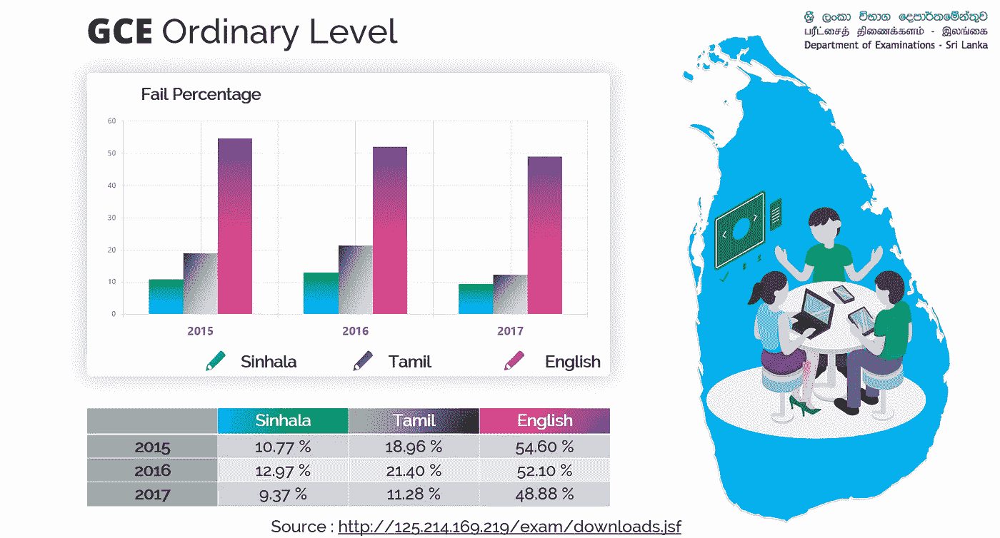
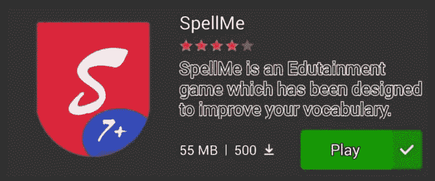

# 一个寓教于乐的游戏 SpellMe…

> 原文：<https://medium.datadriveninvestor.com/edutainment-game-spell-me-66fb21fb1b80?source=collection_archive---------7----------------------->

去年年底(2018 年)我们团队 ***Codezillas*** 在某对话游戏商店成功发布了一款游戏。这场比赛给了我们很多经验，在这里我要说的是我们为什么选择这场比赛和这场比赛的大纲。这是我在 Medium 的第 16 篇文章。

"好的拼写者通常是好的读者和好的演讲者"。因此，我们想创建一个移动游戏应用程序。当我们开始时，首先我们选择了 ***Android studio*** 来开发我们的手机游戏，我们的第一个目标也是 Android 用户。我们开发了一些原型，并向一些用户展示，但用户对用户界面不满意，因为在 Android studio 中，我们无法为游戏创建交互式用户界面。因此，我们选择了 ***Unity 3D*** 来开发这款具有交互界面游戏。

 [## 2019 年移动应用开发之路——数据驱动投资者

### 任何在移动应用程序开发行业工作的人，无论他们是专注于在伦敦开发 iOS 应用程序还是…

www.datadriveninvestor.com](https://www.datadriveninvestor.com/2019/01/15/the-path-of-mobile-app-development-in-2019/) 

我们从斯里兰卡考试部门获得了一些信息，了解到每年有 10%的僧伽罗学生和 15%的泰米尔学生在普通中等教育证书普通水平考试中母语科目不及格。在普通教育证书普通水平考试中，50%的学生英语不及格。因此，我们的目标是 3 岁到 15 岁的学生。这是一个很大的用户范围，所以我们有很多责任来提高通过率。

如果我们正在学习一门新的语言，我们应该记住单词和语法。记忆语言有六种方法。他们是，使用记忆法，使用抽认卡，背诵，视觉笔记，书面和听觉。如果我们是一门语言的初学者，我们会对一些字母感到困惑，比如英语中的“b”，“d”，“p”对初学者来说是困惑的。

我们进步的第一步是与字母互动。如果用户清除了学习字母中的所有级别，则他可以转到学习单词的步骤，或者他可以直接转到学习单词的步骤。每一步都是独立的，所以用户可以选择任何他想要的步骤。我们的步骤是学习字母，学习单词，学习单词，学习语法，学习简洁和清晰。我们将把这个想法扩展到外语，包括自然语言处理。

下载

访问 Google Play →下载对话游戏应用程序→打开 SpellMe

> “创新是一个消防站。让我们来一场新的革命”。

***感谢您阅读至此。如果你喜欢这篇文章，请分享、评论并发表👏几次(最多 50 次)。。。也许会对某个人有帮助。***

***关注我的***[***Twitter***](https://twitter.com/TheSabesan)***和 Medium 如果你将来对这些更深入、更翔实的文章感兴趣的话！***