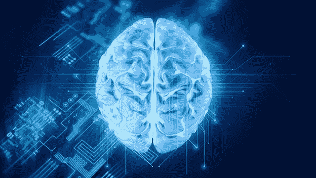
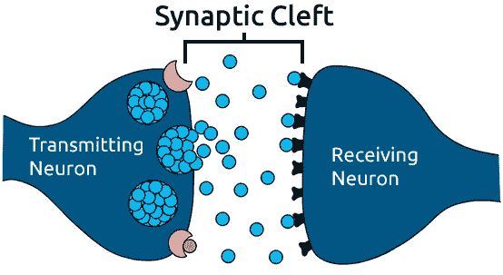
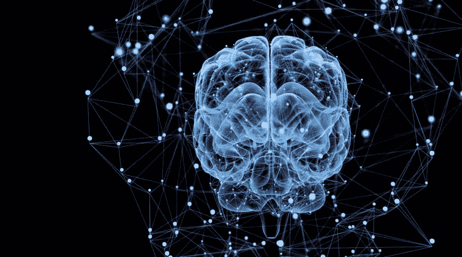
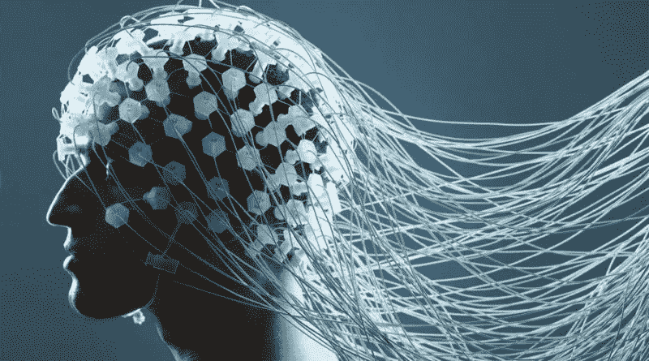
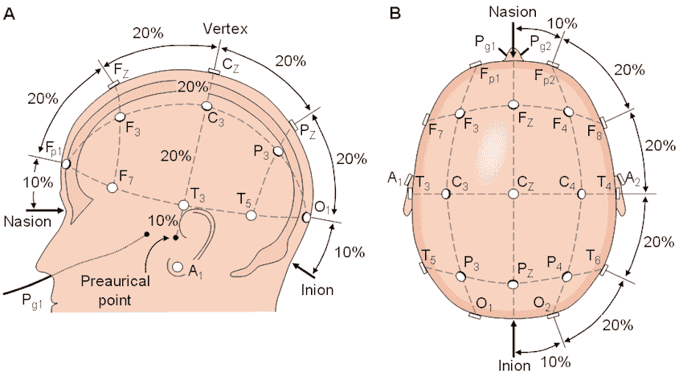
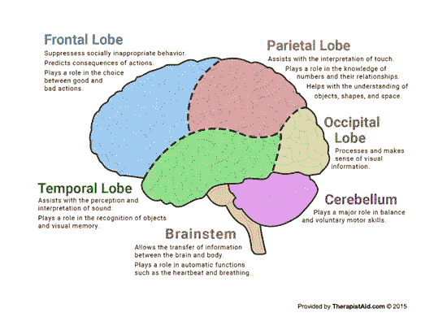

# 脑电图把脑电波放在每个人的手中

> 原文：<https://medium.datadriveninvestor.com/eegs-put-brainwaves-in-the-hands-of-everyone-3227e450741f?source=collection_archive---------11----------------------->

自 1924 年首次探测到阿尔法波以来，脑机接口领域已经取得了长足的进步。从那以后，我们发现了许多测量大脑活动的新方法。科学家们已经在核磁共振成像、功能磁共振成像和核磁共振成像中观察了大脑。然而，最容易进入我们大脑的方法之一是脑电图(EEG)。

## 神经元通信

我们通过神经从大脑发出电信号来控制我们的身体。我们的神经不断接收电信号，并根据输入的强度决定是否传递该信号。如果它决定这样做，就会产生一个**动作电位**。神经元触发并传递信号。

The presynaptic neuron releases neurotransmitter into the synaptic cleft

神经元通过称为**突触**的结构相互交流。突触是神经元足够靠近以在彼此之间传递化学信号的区域。神经元之间的区域被称为突触间隙。这个区域极其微小。给你一个概念，裂缝不到 40 纳米宽，而人类的头发大约是 80，000 纳米。

## 我们的神经使用化学物质来交流

当神经元进行交流时，传递信号的神经元被称为*突触前神经元*，与之对话的神经元被称为*突触后神经元*。突触前神经元在称为囊泡的小囊中含有称为神经递质的化学物质。当突触前神经元触发动作电位时，囊泡将它们的神经递质释放到突触间隙中。神经递质然后与突触后神经元上的受体结合。这些化学物质或者增加或者减少突触后神经元触发动作电位的变化。然后，突触间隙中的神经递质要么扩散，通过称为再摄取的过程再循环回到突触前神经元，要么被酶分解并送回神经元，以产生更多的神经递质。

## 脑电图测量我们大脑周围的电场

在神经元之间的交流中，神经元的突触活动产生称为突触后电位的电脉冲。单个神经元的活动无法在不与该神经元直接接触的情况下进行测量，但当多组神经元一起放电时，它们的联合突触后电位会产生一个电场，其强度足以从我们的头皮上检测到。这使得脑电图能够以非回避的方式检测大脑活动。

## 我们头脑中的地震

你可以把我们的大脑想象成产生地震活动的地球，可以用地震仪测量。类似地，我们的大脑产生可以用脑电图测量的电活动，而不是地震活动。

脑电图由放置在我们头皮上的电极组成，用于测量我们大脑产生的电场变化，以了解大脑活动。电极通常附在帽上，以允许每次使用时电极都对齐。它们看起来有点像浴帽，上面有一堆电线。电活动以伏特为单位进行测量，然后被数字化并传送到放大器。

## 脑电图与其他方法

脑电图的主要优点之一是它们提供了极好的时间分辨率。简而言之，这意味着脑电图可以以非常快的速度获得读数，从而提供实时数据，而不像磁共振成像等其他方法需要更长的时间才能获得读数。

脑电图唯一的缺点是，因为他们测量电场，他们不能精确地缩小信号的来源。因此，它们的空间分辨率很低。他们只能检测到*组*神经元何时一起放电，这意味着利用这些信息做出准确预测更加困难。然而，使用更多的电极有助于提高空间分辨率。你可以使用 5 到 500 个电极。不幸的是，你使用的电极越多，设置就越贵，设置读数的时间就越长。

## 10–20 电极系统是国际公认的

10–20 系统被创建来覆盖大脑的所有皮层区域。这是一个国际公认的系统，全世界都在使用。系统中电极的放置基于头部的三个点:

1.  **鼻根:**前额和鼻子之间的点，在两眼之间
2.  **伊尼翁:**后脑勺颅骨最低点。如果你感觉到你的后脑勺，那就是肿块
3.  **耳穴前:**这些穴有两个。它们位于你的鬓角附近，耳道旁边

10–20 系统如此命名是因为电极放置在前面提到的 3 个界标之间的 10%、20%、20%、20%、20%然后 10%的测量位置。下图会给你一个更好的想法。

The 10–20 electrode placement system

## 每个电极的字母和数字给出了关键信息

每个电极标签上的数字告诉你它位于大脑的哪一边。如果数字是奇数，它在大脑的左侧，如果数字是偶数，它在右侧。

标签上的字母说明了电极位于大脑的哪个部分:

**Fp -正面-极坐标**

负责战略过程和回忆记忆。

**F -额叶**

用于一些运动功能，形成记忆和个性，以及说话和语言产生。

**T -颞叶**

让听觉变得有意义，帮助我们理解言语。

**C -中央**

这实际上并不是大脑的一部分，而是用来作为命名电极特定位置的参考。

**P -顶叶**

处理关于味觉、温度和触觉的感官信息。

**O -枕叶**

用来处理来自眼睛的视觉信息。

**阿耳**

这只是简单的耳垂。

## 分类不同的脑电图频率

你可以看看你从脑电图得到的数据，根据频率把它们分成不同的波形。这些波有助于洞察大脑的活动过程。

**θ(4–7 赫兹)——**与大脑高级处理有关。当你在做困难的任务时，这些波动会更明显

**阿尔法波(7-12 赫兹)——**这些波与平静和放松状态有关。它们也与注意力相关。

**贝塔波(12-30 赫兹)——**贝塔波与运动的计划和思考有关。

**伽玛(> 30 Hz，一般为 40hz)——**与快速动眼期有关，并专注聚焦。

脑电图是一种便携、快速、相对便宜的测量脑电波的方法。它们已经在世界各地被用来解决问题。脑电图已经允许残疾人控制轮椅和移动屏幕上的光标。他们还通过测量人们对各种广告和视频的情绪反应，为媒体行业提供了见解。脑电图甚至在游戏中被用来控制游戏中的物体！我们刚刚触及了它们使用的表面，我迫不及待地想看看它们如何在未来颠覆技术世界。

# 原帖:

 [## Mayank Jain - EEGs 把脑电波放在每个人的手中

### 自 1924 年首次探测到阿尔法波以来，脑机接口领域已经取得了长足的进步。从那以后…

mayankjain.ca](https://mayankjain.ca/blog-posts/1) 

# **感谢阅读！如果你喜欢这篇文章:**

*   留下一些掌声👏
*   在 [Medium](https://medium.com/@mayankj2112) 上关注我，在 [LinkedIn](https://www.linkedin.com/in/mayankj2112/) 上与我联系，了解我的最新工作进展！
*   订阅我的时事通讯，跟随我的旅程！：

 [## 注册我的每月更新！

### 注册以跟上我每月的进度，包括项目、会议、文章等等...

www.subscribepage.com](https://www.subscribepage.com/mayank)