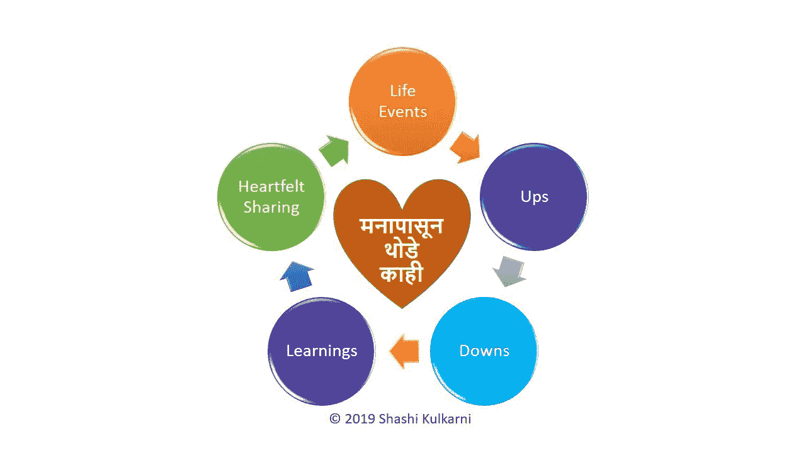

# 来自周五晚上好莱坞和宝莱坞电影的八个秘密领导特质

> 原文：<https://medium.datadriveninvestor.com/eight-secret-leadership-traits-from-friday-night-hollywood-and-bollywood-movies-987110560987?source=collection_archive---------7----------------------->

## 电影中的领导技巧

## 最好的电影能在最初几分钟内吸引你的注意力，然后永远不要让它转移。

Photo by [Shlag](https://unsplash.com/@shlagance?utm_source=unsplash&utm_medium=referral&utm_content=creditCopyText) on [Unsplash](https://unsplash.com/s/photos/bollywood?utm_source=unsplash&utm_medium=referral&utm_content=creditCopyText)

所有伟大的电影都没有什么共同点。所有重要的计划或项目也是如此。更重要的是，伟大的电影和伟大的项目之间有如此多的相似之处。

其中一些是成功的，因为主角承担了他们自己的责任，而大多数是伟大的团队工作的结果，由伟大的导演推动。即使是超级英雄(或女英雄)电影也是伟大团队合作的结果，他们一起创造了伟大的体验。

# 1.抓地力

最好的电影能在最初几分钟内吸引你的注意力，然后就再也不让它转移了。电影一开始，其他一切都变得模糊了——就像你周围的光线一样。

你会立刻忘记你的紧张、挑战和挣扎。你被带进了一个完全不同的世界，在那里你的全部注意力都在程序上，你迫不及待地想看到接下来会发生什么。电影导演能够通过构成电影的各个方面来实现这一点。

领导者应该能够从这些主管那里学习如何让整个团队参与到任何项目中——从项目一开始，然后能够保持这种参与，直到项目结束。

# 2.角色和团队合作

伟大电影的另一个方面是处处可见的优秀团队合作。每一个角色都被赋予了重要性，有时间去恰当地介绍他们，这样他们从一开始就被记住了。

*无论多小，但每个人都扮演着意义重大、令人难忘的角色，每个人都尽了最大努力。这包括我们可以在屏幕上看到的可见角色，也包括其他不可见的角色——比如编剧、音乐总监、编辑、舞蹈指导、服装设计师等等。*

 [## 想知道领导是谁？请他决定。数据驱动的投资者

### 一个有效的领导者能为组织提供的最有价值的东西之一是决策能力…

www.datadriveninvestor.com](https://www.datadriveninvestor.com/2019/01/25/want-to-know-who-the-leader-is-ask-him-to-decide/) 

领导者应该为他们在项目中的角色选择合适的团队成员，了解他们适合这些角色的能力，然后将他们介绍给每个人——反过来，他们从一开始就了解这一点——留下第一印象，然后在整个过程中不断保持这一印象。

显然，有一个关键的前端团队正在与顾客/客户互动。但是有一个更大的团队在幕后工作，并且仍然让他们的影响可见——工程师、设计师、程序员、测试员、计划员、生产线员工等等。组织内部和外部的许多部门都可能参与其中，并为项目的可交付性而紧密合作。

Photo by [Georgia Vagim](https://unsplash.com/@georgiavagim?utm_source=unsplash&utm_medium=referral&utm_content=creditCopyText) on [Unsplash](https://unsplash.com/s/photos/popcorn?utm_source=unsplash&utm_medium=referral&utm_content=creditCopyText)

# 3.债券

T *何人物之间的纽带很强。有情感的依附，有高峰和低谷、利益和冲突的过山车时刻，但这种纽带如此强大，以至于他们一起朝着最终目标努力，而不会分心。*

领导者、项目或项目经理有责任确保不同团队成员之间建立良好的关系——不管他们是在同一个地方还是在不同的地方。会有冲突，但这些应该由领导/经理通过介入和整理差异并带来凝聚力来解决。

# 4.领导在场

真正的领袖无论在银幕上是可见的还是不可见的，总是在每时每刻都能感受到。

项目领导/经理必须时刻牢记这一点。无论他是在团队面前行动，在会议中，甚至当他因为任何正当的原因不在时，团队应该有这样的感觉，她/他总是在他们身边，当需要时，会跳出来。

# 5.曲折的过程

他在不知从哪里冒出来的情节中一波三折，以及这些情节是如何被角色们处理并最终胜出的。

总会有计划——不管是 A 计划还是 B 计划——但是现实会迫使我们偏离计划，然后不得不通过重新调整一切来重新制定计划，以专注于目标，并使事情回到正轨。

某些情况是无法预见的，但当它们发生时，领导者需要想出正确的策略来克服这种情况，不要忘记团队中的每个人都可以想出这个绝妙的主意。

© 2019 Shashi Kulkarni. All rights reserved.

# 6.约会

这里是持续的约定——没有时间去想别的事情或感到无聊。

领导的责任是不断提供有关项目进展或偏差的更新，并确保所有负责任的、负责任的、咨询过的、知情的团队成员(通常称为“RACI”)以及所有指导委员会成员和所有利益相关者获得有关项目各方面的最新信息。

# 7.乐趣

这里有足够多轻松的时刻来缓和气氛。

应该庆祝项目的里程碑，这有助于建立联系，并在回到项目工作中时增加一些热情。即使在正常的几周里，截止日期、障碍、分歧、冲突都会增加压力，因此定期开展一些团队活动是至关重要的。

# 8.影响

电影结束后，这种影响会持续很久，让你希望再次等待同一个团队的下一部电影。一些演员/玩家可能会改变或者可能会有完全不同的角色来表演或扮演。

当项目成功结束时，所有参与者的影响和反应应该是他们真正有兴趣一起工作于下一个项目/下一个挑战，并且每个人都可以有不同的强化角色来利用所获得的经验。

2019 沙希·库尔卡尼。保留所有权利。

*关于作者:*

*Shashi Kulkarni 是一位脚踏实地的 IT 领导者，在企业 IT 和 IT 咨询公司方面拥有丰富的经验。他领导过多地点、多文化的全球 IT 团队。他在建立高效的业务参与模型和 IT 治理模型，同时与业务领导和高管建立信任和可靠性方面有着良好的记录。目前，他还专注于网络安全方面，并帮助建立安全的 IT。*

沙希认为生活是一系列瞬间的集合。其中大部分是在生活的过山车中度过的，积累了宝贵的经验，然后还有一些是在分享学到的教训或想法/想法。沙希通过写博客文章来做到这一点，这可能会在职业道路上的某个时间点上帮助某人，或者只是照亮一天中的几个时刻。

**© 2019 Shashi Kulkarni. All rights reserved.**