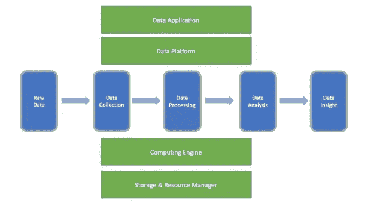
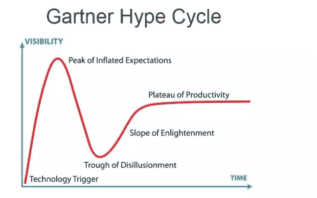
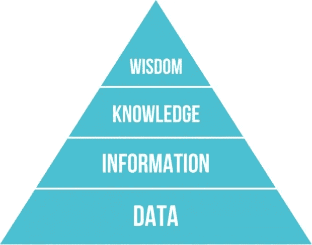

# 关于大数据你应该知道的八件事

> 原文：<https://medium.datadriveninvestor.com/eight-things-you-should-know-about-big-data-a7dcbc08301a?source=collection_archive---------8----------------------->

> 作为阿里巴巴集团的高级技术专家，我已经和数据打交道 11 年了。本人从事过[*Apache Hadoop*](https://hadoop.apache.org/?spm=a2c41.13622773.0.0)*[*Pig*](https://pig.apache.org/?spm=a2c41.13622773.0.0)*[*Tez*](https://tez.apache.org/?spm=a2c41.13622773.0.0)*[*Spark*](https://spark.apache.org/?spm=a2c41.13622773.0.0)*[*Livy*](https://livy.apache.org/?spm=a2c41.13622773.0.0)*等大数据框架的开发，开发过几个我在这方面的努力包括为 ETL 编写 MapReduce 作业，为特别查询使用 Hive，以及为数据可视化修改 Tableaus。因此，我想从我的经验和知识出发，谈谈大数据的现状以及我所看到的一些未来趋势。*****

*首先，在我们取得进展之前，我们需要弄清楚“大数据”到底是什么。大数据这个概念已经有 10 多年了，但是一直没有一个准确的定义，也许是不需要的。数据工程师从技术和系统角度看待大数据，而数据分析师从产品角度看待大数据。*

* [## 为什么数据将改变投资管理|数据驱动的投资者

### 有人称之为“新石油”虽然它与黑金没有什么相似之处，但它的不断商品化…

www.datadriveninvestor.com](https://www.datadriveninvestor.com/2019/01/25/why-data-will-transform-investment-management/) 

但是，在我看来，大数据不能被概括为单一的技术或产品，而是包含了一个围绕数据的全面、复杂的学科。我主要从两个方面看待大数据:数据管道(下图的横轴)和技术栈(下图的纵轴)。

社交媒体一直专注于强调，甚至是耸人听闻大数据中的“大”。我不认为这真的说明了大数据实际上是什么，我也不太喜欢“大数据”这个术语我更喜欢说“数据”，因为大数据的本质就在于“数据”的概念和应用。

弄清楚什么是大数据之后，我们必须看看大数据在成熟度曲线上的位置。回顾过去的技术发展，每种新兴技术都有自己的生命周期，其典型特征是下图所示的技术成熟度曲线。

人们往往在一项新兴技术诞生之初就对其持乐观态度，对这项技术给社会带来的巨大变化抱有很高的期望。结果，该技术以相当快的速度获得普及，但随后达到一个高峰，此时人们开始意识到这种新技术并不像最初设想的那样具有革命性，并且他们的兴趣减弱。在这之后，大家对这项技术的想法便陷入了幻灭的低谷。但是，经过一段时间后，人们开始了解该技术如何为他们带来好处，并开始以富有成效的方式应用该技术，该技术获得了主流采用。

# 历史上大数据的两个阶段

在经历了膨胀的预期和幻灭的低谷之后，大数据现在正处于稳步发展的阶段。我们可以从 Google Trends 上的大数据曲线来验证这一点。大数据在 2009 年左右开始吸引所有人的注意力，在 2015 年左右达到顶峰，然后注意力慢慢下降。当然，这条曲线并不完全符合前面的技术成熟度曲线。但是你可以想象这和这个数据所代表的东西有关系。也就是说，人们可以想象和假设，实际技术曲线的向下移动可能会导致谷歌和其他搜索引擎对该技术的搜索增加。

来源:谷歌分析

现在，我想分享一下我对大数据未来趋势的看法。

# 大数据仍有很大的改变空间

如前所述，大数据已经经历了膨胀的期望的顶峰和幻灭的低谷，现在正稳步向前发展并在主流中使用。在对大数据的未来发展做出以下预测时，我很有信心做出这样的结论:

> *来自上游系统的数据流将继续增长，特别是由于物联网技术的发展和成熟以及 5G 技术即将推出。在不久的将来，数据量将继续成倍增长，这是大数据持续发展的主要驱动力。*

未来下游数据消费还有很大潜力。尽管大数据不再像人工智能、机器学习和区块链那样被广泛讨论，而且在未来也不会受到太多关注，但大数据将继续在技术领域发挥重要甚至是根本性的作用。公平地说，只要有数据，大数据就永远不会过时。我想，在大多数人的有生之年，我们会见证大数据的不断发展。

# 如何让实时数据可用性变得更加主流

过去大数据最大的挑战是数据量。这就是为什么每个人都称之为“大数据”然而，经过几年的努力，并在行业内将大数据应用付诸实践，我们已经克服了这个障碍。在未来几年，更大的挑战将是数据速度和实时可用性。大数据的实时可用性是指实现端到端的实时数据管道，而不是简单地实时传输或处理数据。一路上的任何延迟都会影响整个系统的实时性能。接下来，大数据实时可用性面临的挑战可以总结为以下几个方面:

*   需要快速获取和传输数据
*   快速处理数据的需要
*   对数据实时可视化的需求
*   需要在线机器学习模型来实时更新旧模型

像[阿帕奇卡夫卡](https://kafka.apache.org/)和[弗林克](https://flink.apache.org/)这样的流媒体引擎为实时计算奠定了坚实的技术基础。我认为，无论是实时数据可视化还是在线机器学习模型，未来都会出现更多好的产品。当大数据的实时可用性达到更有用的水平时，数据消费端将产生更有价值的数据，实现更高效的闭环数据管理，同时也促进整个数据管道的良性发展。

# 将大数据迁移到云中并不容易

在我看来，大多数行业 IT 基础架构最终迁移到云是不可避免的，无论是公共云、私有云还是混合云。这部分是因为不可能将所有大数据设施部署到公共云，因为每个企业的业务范围不同，对数据安全的要求也不同。然而，我敢肯定，迁移到云将是未来的潮流。目前，各大云服务提供商提供各种大数据产品来满足各种用户需求，包括面向 PAAS 的 EMR 系统和面向 SAAS 的数据可视化产品。

大数据基础架构向云的迁移也会对大数据技术和产品产生影响。大数据世界中的框架和产品将转向云原生，我们预计将会看到以下趋势:

*   计算和存储的分离。我们知道每个公共云都有自己的分布式存储。例如，AWS S3 就是这种情况。S3 可以在某些情况下以更低的成本取代流行的 [Hadoop 分布式文件系统](https://hadoop.apache.org/docs/r1.2.1/hdfs_design.html) (HDFS)。S3 的物理存储不在 AWS 的 [EC2](https://aws.amazon.com/ec2/) 上。对于 EC2 来说，S3 是一个远程存储位置。因此，如果你想在 AWS 上开发大数据应用程序，并且你的数据存储在 S3，你需要使用一个将计算和存储分开的云原生框架。
*   为容器编排拥抱 Kubernetes。与 Kubernetes 的整合将不可避免。Kubernetes 已经成为云环境中容器资源调度的标准。
*   更有弹性。
*   与云上的其他产品和服务更紧密地集成。

# 大数据产品的端到端集成

在我看来，我们将看到的另一件事是大数据产品的端到端集成。端到端集成是指提供端到端解决方案，而不是简单地将几个不同的大数据产品组件堆叠在一起。Hadoop 等大数据产品因其陡峭的学习曲线和高昂的定制开发成本而受到批评。因此，端到端集成旨在解决这一问题。用户需要的不是 Hadoop、Spark、Flink 等技术，而是基于这些技术能够解决具体业务问题的产品。Cloudera 的 [Edge to AI](https://www.cloudera.com/about/news-and-blogs/edge-to-ai.html) 的做法是我非常赞同的。大数据的价值不在于原始数据本身，而在于从这些数据中提取的信息和知识，以及这些信息和知识如何对业务产生影响。下图显示了知识层级，有时也称为 [DIKW 金字塔](https://en.wikipedia.org/wiki/DIKW_pyramid)。我们需要让数据能够看到它的价值，爬上这座金字塔的砖块。

来源:维基百科

大数据技术旨在持续处理和提炼原始数据。当您升到金字塔的下一层时，数据量会变小，但对业务的影响会变大。要从数据中提取智慧，数据必须经过一条长长的数据管道。没有一个完整的系统来保证整个管道的高效运行，就很难保证能从数据中提取出有价值的见解。因此，大数据产品的端到端整合将是未来的另一大趋势。

# 向下游数据消费和应用终端的转移

前一段我讲了大数据向端到端融合发展。那么，这条长长的数据管道目前处于什么状态，未来我们又能期待什么呢？

据我所知，未来大数据技术的创新和发展将转向下游的数据消费和应用终端。十多年来，大数据的发展一直集中在什么是大数据的底层框架上。Hadoop 是第一个在开源社区获得巨大关注的大数据框架，随后是流行的计算引擎 [Apche Spark](https://spark.apache.org/) 和 [Flink](https://flink.apache.org/) ，消息中间件 [Kafka](https://kafka.apache.org/) ，以及资源调度器 [Kubernetes](https://kubernetes.io/) 。各个细分领域都涌现出了一系列优秀的产品。简而言之，底层框架为大数据处理奠定了基础。下一步是使用这些技术为企业提供能够提供更好的用户体验并能解决实际业务问题的产品。换句话说，未来大数据研究的重点将从底层框架转向上层应用。以前的大数据创新面向 IAAS 和 PAAS，而未来我们将看到更多面向 SAAS 的大数据产品和创新。

这一趋势从一些国际公司最近的收购中显而易见。

1.  2019 年 6 月 7 日，谷歌宣布以 26 亿美元收购大数据分析公司 [Looker](https://looker.com/) ，并将 Looker 纳入谷歌云平台。
2.  2019 年 6 月 10 日， [Salesforce](https://www.salesforce.com/) 宣布计划以价值 157 亿美元的全股票交易收购 [Tableau](https://www.tableau.com/) 。通过此次收购，Salesforce 旨在巩固其在数据可视化和其他工具方面的努力，这些工具可以解释大多数公司掌握的海量数据。
3.  2019 年 9 月初，Cloudera 宣布已同意收购 [Arcadia Data](https://www.arcadiadata.com/) ，这是一家提供云原生人工智能商业智能和实时分析的供应商。

面向终端用户的大数据产品将是大数据领域公司未来的重点。我相信这一领域未来的创新也将围绕这些产品展开。未来五年，至少会出现一家像 Looker 这样的公司，但很难再出现另一个像 Spark 这样的计算引擎。

# 技术将得到巩固，应用将得到发展

对于任何研究过大数据的人来说，他们都会惊讶于他们必须在大数据世界中处理的海量信息和知识，尤其是当涉及到所有底层技术时。经过多年的竞争，许多卓越的产品脱颖而出，而其他一些产品则慢慢凋零。例如，Spark 引擎显然已经成为大数据处理的市场领导者。遗留系统使用传统的 MapReduce 模型，新的 MapReduce 应用程序不太可能进一步开发。Flink 目前是流处理领域中无与伦比的低延迟选项，而最初的 Storm 系统正在逐步淘汰。类似地，Kafka 已经发展成为消息中间件领域事实上的标准。未来，底层大数据生态系统中几乎不会有任何新技术和框架。相反，在每个细分市场，最强的技术将生存下来，变得更加成熟，并在市场中站稳脚跟。在上层应用或者端到端集成方面会有更多的创新。那就是，我相信未来我们会见证更多上层大数据应用的创新和发展，比如某个垂直领域的 BI 和 AI 产品以及大数据应用。

# 开源和闭源技术将共享这个空间

大数据世界不仅充斥着知名的开源产品，如 Hadoop、Spark 和 Flink，还有许多优秀的闭源产品，如 AWS Redshift 和阿里云 MaxCompute。尽管这些产品不像开源产品那样受开发人员的欢迎，但它们仍然被广泛接受。开源并不是唯一的标准，因为企业在选择一个大数据产品时要考虑各种因素，比如产品是否稳定安全，商业公司是否支持，能否与现有系统集成。闭源产品倾向于适应这些类型的企业级需求。

近年来，开源产品在公有云的推动下受到了很大的影响。公有云厂商让用户免费享受开源项目的成果。它们夺走了这些开源产品背后的商业公司的大部分市场份额。因此，许多这样的商业公司已经开始改变策略，有些甚至修改了开源产品许可证。然而，公共云提供商将这些商业公司挤出市场的可能性很小。把他们挤出去，就相当于把开源产品最大的技术创新者和开源产品本身挤出去了。我相信开源社区和公共云提供商最终会取得平衡。开源仍将是实现更好的开发者体验的最佳方式，而一些一流的闭源产品也将占据一定的市场份额。

# 结论

最后，我想总结一下本文的几个要点:

1.  大数据已经经历了膨胀的预期的顶峰和幻灭的低谷，现在正处于稳步发展的阶段。
2.  大数据将继续发展。
3.  对实时数据可用性的要求将变得更加突出。
4.  大数据基础架构向云的迁移可能会势不可挡。
5.  将实施大数据产品的端到端集成。
6.  大数据研究的重点将转移到下游数据消费和应用终端。
7.  底层技术将得到巩固，上层应用将得到全面开发。
8.  开源和闭源技术都将在大数据领域占有一席之地。

# 关于作者

张剑锋是高级技术专家，也是 [Apache](https://www.apache.org/?spm=a2c41.13622773.0.0) 会员、 [Apache Pig](https://pig.apache.org/?spm=a2c41.13622773.0.0) 委员。作为 Hortonworks 的前雇员，剑锋目前担任阿里巴巴计算平台部门的高级技术专家，以及 [Apache Tez](https://tez.apache.org/?spm=a2c41.13622773.0.0) 、 [Livy](http://livy.incubator.apache.org/?spm=a2c41.13622773.0.0) 和 [Zeppelin](https://zeppelin.apache.org/?spm=a2c41.13622773.0.0) 开源项目的项目管理顾问。他很久以前就开始从事大数据和开源社区的工作，希望为开源社区的大数据和数据科学领域做出贡献。

# 原始资料

 [## 关于大数据你应该知道的八件事

### zjffdu 年 10 月 24 日 1，767 作为阿里巴巴集团的高级技术专家，我已经和数据打交道 11 年了…

www.alibabacloud.com](https://www.alibabacloud.com/blog/eight-things-you-should-know-about-big-data_595468?spm=a2c41.13622773.0.0)*