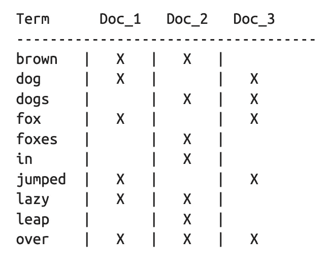
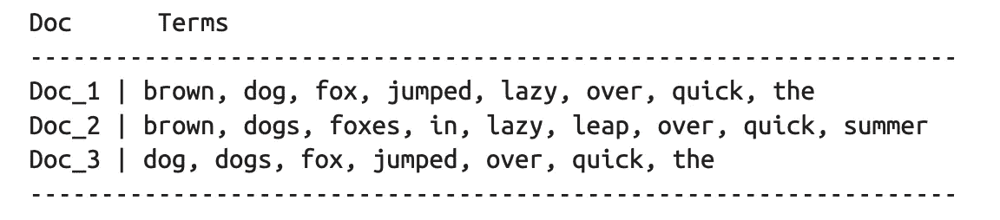

# 弹性搜索:里面是什么？！

> 原文：<https://medium.datadriveninvestor.com/elastic-search-what-is-inside-5d61f1a681df?source=collection_archive---------2----------------------->

我们中的许多人可能都从事过弹性搜索，但是我们知道它的内部工作原理吗？！弹性搜索实际上是如何存储数据来为我们提供实时分析的呢？是什么数据结构和算法赋予了他们力量？！所以，深呼吸..是时候打开这个黑匣子了。如果你有兴趣看同样的视频，请查看下面的链接。

## 这个博客包含什么内容？

因为内容太大太复杂，所以把这个话题分成两个博客。这个博客将主要涵盖弹性搜索使用的**主要数据结构**。在下一篇博客中，我将介绍让弹性搜索成为今天这个样子的**主要算法**。

# ***我们开始吧……***

让我们从基础开始。大家可能都知道，***倒排索引是弹性搜索*** 的主要数据结构。用外行的术语来说，每当保存一个文档时，都会在所有术语和文档之间创建一个映射。这种数据结构是搜索引擎的核心，使查找成为可能。如果你没有意识到这一点，你可以谷歌一下，有成千上万篇关于这个的文章。现在，一旦基础工作完成，让我们深入到更有趣的部分😀

文档(主要)是包含许多字段的 JSON 结构。 ***每个 json 字段都有单独的倒排索引数据结构。*** 所以，字段数量越多，系统中存在的倒排索引数量就越多。是的，你猜对了，这就是为什么有 1000 个索引字段的限制。

> 倒排索引是完成工作的主要数据结构！

有些人有误解，认为倒排索引只是单词和文档 id 的映射。但是，它还包含更多的信息，如术语在文档中出现的次数、文档的长度等..这最终有助于定义文档的相关性并因此定义分数。

下一个概念是目前最重要的概念。 ***倒排索引是不可变的。*** 是的，你没听错！但是，为什么会这样呢？！因为没有更新就意味着没有缓存失效。此外，没有突变意味着没有为避免竞争情况而锁定数据库，这意味着更快的数据库。但是，如果倒排索引是不可变的，我们如何添加更多的数据呢🤔？答案是，每次保存文档时，我们都会创建一个新的倒排索引。但是，那会非常昂贵，对吗？！

> 你听说过分段吗？！

因此，弹性搜索将文档缓冲一段时间，然后为所有这些文档创建一个倒排索引。 ***这个“倒排索引”叫做段，这个“有时”叫做刷新时间。*** 这种刷新时间通常是 1 秒。由于每个文档都需要最少的刷新时间来建立索引，这就是为什么弹性搜索被称为 ***近实时分析*** *。*上述优化可能会为我们节省一些成本，但同样，它是可扩展的吗？！

每个倒排索引磁盘同步占用相当多的资源。由于这个瓶颈，弹性搜索无法支持数十亿份文档。嗯..那么他们是怎么解决的呢？！是的，缓存——救世主。不要直接在磁盘中同步，先给它添加一个缓存，然后一次性刷新缓存。**这个时间叫做冲水时间。但是，如果我的弹性搜索失败了呢？我的缓存数据会去哪里？！我会永远失去他们吗？！可能是的..但是，弹性搜索也有一个解决方案..！！等待和阅读..**

解决方法是..**运输日志**..每当在文件缓存中插入一个段时，所有的操作都会被记录在一个轻量级文件中。因此，如果系统中途停止，可以用这个 translog 文件重新创建数据。

这就是弹性搜索为我们管理倒排索引的方式..但是，还有一个数据结构，没有它，弹性搜索就无法工作..

# 想..想..！！

答案是… **字段数据**..如果我们想知道哪些术语出现在哪些文档中呢？！通过倒排索引，这将是非常耗时的权利？！所以，这就是为什么反向映射也被称为字段数据。这再次被保存在存储器中。同样，它是否具有可扩展性？！。***所以，弹性搜索把它和 doc-values 一样保存在磁盘里。*** 这种数据结构是聚合、排序等背后的引擎。

> Doc 值是在文档索引时构建的磁盘上的数据结构，它使得聚合和排序成为可能。

数据结构博客到此为止。将在下一篇博客中讨论算法部分。我试图保持它的简洁，只添加了我从各种来源收集的难以找到的知识。如果事情发生了变化，或者你有不同的想法，或者你想增加更多的知识，请随时联系我。我总是乐于学习新事物。