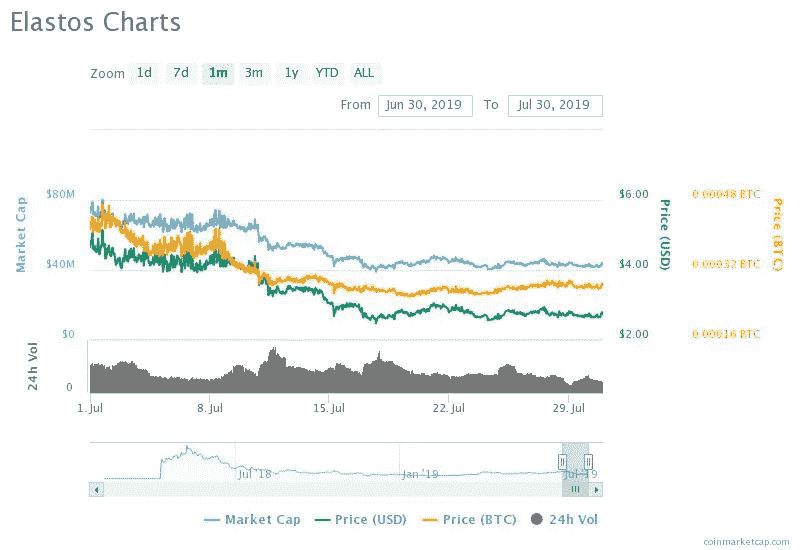

# 和欣 2019 年价格预测:ELA 的价格会飙升至 4 美元还是跌破 2 美元？

> 原文：<https://medium.datadriveninvestor.com/elastos-price-prediction-2019-will-price-of-ela-surge-to-4-or-drop-below-2-9c623663d77a?source=collection_archive---------4----------------------->

*免责声明:文章所表达的观点和看法仅属于作者，不一定反映 DDI 的立场。这篇文章无意成为投资建议。我们建议您通过多种渠道进行自己的独立研究*

加密货币市场经历了起起落落。多头和空头正试图超越对方。加密货币价值的不确定性是存在的，货币价值的动力也不清楚。比特币、 [*以太坊*](https://www.thecoinrepublic.com/ethereum-price-analysis-ethereum-bulls-ready-to-make-significant-growth-against-bitcoin/) 、Ripple、比特币现金、Tether、Cardano、Chainlink 等货币价格在多头和空头之间波动。

另一方面，100 排名以下的货币也是跌宕起伏。货币排名 102 日本内容令牌(JCT)是最大的输家，因为它遭受了-26.73%的损失，交易价值为 0.17247 美元。其他货币如 Project Pai、Nebulas、Populous 和 Elastos 的价值也有所提高。这里我们将分析 109 定位(在 23:33 UTC)加密货币 Elastos (ELA)并找到 [*elastos 硬币价格预测。*](https://www.thecoinrepublic.com/tag/vechain-thor-price-forecast/)

 [## Azbit 旨在连接传统金融和加密货币|数据驱动的投资者

### Azbit 是下一个提供交易平台的加密项目，该平台提供保证金和算法交易。一样多…

www.datadriveninvestor.com](https://www.datadriveninvestor.com/2019/03/20/azbit-aims-to-connect-traditional-finance-and-cryptocurrency/) 

**Elastos(ELA)的现状:**目前，该货币的交易价格为 2.76 美元，在世界协调时 23:35，该货币升值 2.34%。该货币的市值为 43，535，005 美元，24 小时交易量为 4，436，092 美元。ELA 的流通供应量为 15，774，704 ELA，货币供应量为 34，725，614 ELA。和欣投资回报率为-93.73%。

**Elastos 分析:**目前，该货币的价值看涨，走势良好。如果我们谈论 Elastos 的每周分析，货币达到 3.02 美元的价值，市值为 47，642，066 美元，24 小时交易量为 7，522，209 美元，在 7 月 21 日星期日 15:34 UTC，但后来价值下降。另一方面，在周一 09:34 UTC，货币再次达到 3.00 美元的价值。该货币随后下跌，第二天在 2.7 美元至 2.9 美元之间徘徊。

7 月 24 日，货币价值进一步下降到 2.6 美元，在 UTC 时间 1:34，货币设法回到 2.72 美元左右，但随后货币下跌了 2%。第二天，货币再次获得了多头的势头，在 17:34 时交易值为 2.85 美元，市值为 44，905，255 美元。

7 月 27 日星期六，货币再次获得牛市，货币价值达到 2.92 美元左右，市值为 46，109，502 美元，24 小时交易量为 6，466，717 美元。货币再次下跌，此后其价值在 2.6 美元至 2.8 美元之间。报道 Elastos 最知名的新闻源是 [*Elastos Reddit。*](https://www.thecoinrepublic.com/tag/elastos-reddit/)

[***Elastos 价格预测 2019***](https://www.thecoinrepublic.com/elastos-ela-price-prediction-will-elausd-price-surge-to-5-or-fall-to-2/) **:** 如果我们看到货币的走势图，目前货币走好，价值看涨。如果货币价值的看涨势头持续下去，那么它肯定会越过 3.0 美元的主要阻力，并可能在今年年底达到 5.0 美元或 6.0 美元的价值。