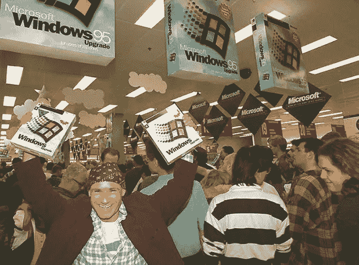
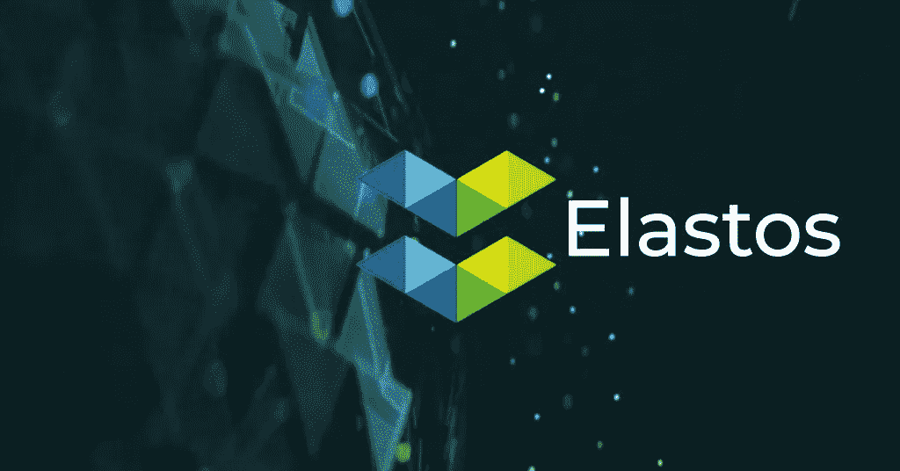
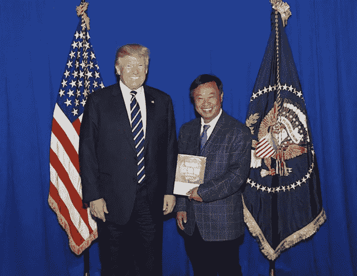
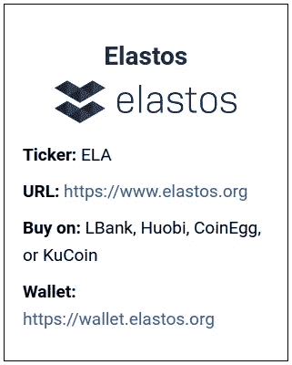

# 和欣:驱动新价值互联网的终极操作系统

> 原文：<https://medium.datadriveninvestor.com/elastos-the-ultimate-operating-system-powering-the-new-internet-of-value-b606781a0d50?source=collection_archive---------1----------------------->

## 第一个使用互联网作为基础层并在其上构建自己的安全基础设施的网络操作系统

华盛顿雷德蒙微软总部的气氛非常愉快。

比尔·盖茨、史蒂夫·鲍尔默和一群书呆子随着滚石乐队笨拙地跳舞的视频已经成为一个经典的互联网迷因。

这是微软的巅峰。

那天 Windows 95 的盛大发布会让操作系统闻名于世。它让微软成为一个家喻户晓的名字。

 [## 正在改变行业的 5 个真实世界区块链应用|数据驱动的投资者

### 除非你一直生活在岩石下，否则我相信你现在已经听说过区块链了。而区块链…

www.datadriveninvestor.com](https://www.datadriveninvestor.com/2019/02/13/5-real-world-blockchain-applications/) 

> 比尔·盖茨的演讲在全球 43 个城市同时进行现场直播，这是 1995 年的一项重大技术成就。

7 万多人通过卫星观看了现场直播。

一个巨大的 Windows 95 标志被投射到纽约市的帝国大厦上。

Windows 95 上市的第一天，人们在电脑商店外排起了长队购买——这比苹果发布 iPhone 实现同样的壮举早了十多年。

*Thousands of people lined up to get their hands on Windows 95 when it launched. Source:* [*Mashable*](https://mashable.com/2015/08/24/windows-95-launch/#g4XAIFWA3iqI)

今天，微软产品被 192 个国家的 19 亿人使用。1995 年的那场晚会真正拉开了这一切的序幕。

事实上，Windows 操作系统是多年来使比尔·盖茨成为这个星球上最富有的人的主要原因……无数早期的微软员工成了千万富翁……而早期的微软投资者成了大富翁。

你可以在下面的图表中看到这最后一点。如果你在 1995 年 1 月向微软投资 1000 美元，你今天会有 47685 美元。

现在，我们正处在操作系统进化的另一个阶段的尖端…这一次，在区块链上。

> 普通人可能不知道区块链和操作系统是如何工作的。但他们知道自己想要什么:一个没有审查、支付限制和病毒的诚实的互联网。

我将在本月的杂志中向您介绍的公司就是为了实现这一目标而成立的。

**这是你成为区块链生态系统的微软视窗早期投资者的机会。**

事实上，正如你将会看到的，我们将追随一位曾积极参与 Windows 创造的人的脚步。

所以，让我们开始吧，从这一切背后的人开始…

# 介绍区块链的比尔·盖茨

20 世纪 90 年代初，在微软的幕后，一个中国人与比尔·盖茨并肩工作，开发最终成为 Windows 的核心模块。

他的名字是**陈蓉**，或者我喜欢叫他:**区块链的比尔盖茨。**

*Rong Chen, the Bill Gates of Blockchain. Source:* [*Elastos on Medium*](https://medium.com/elastos/exclusive-interview-with-rong-chen-of-elastos-77b769c01eed)

正如我们今天所知，陈蓉是互联网的先驱之一——甚至在他加入微软之前。

> 例如，在 1987 年，他利用卫星帮助建立了一个美国超级计算机网络。这个超级计算机网络尝试在一台个人电脑上显示多个窗口……这导致了网络浏览器的诞生。

陈蓉于 1992 年在 T2 加入微软。他在那里花了八年时间开发 Windows 操作系统。

几年之内，Windows 95 成为市场上最受欢迎的操作系统。事实上，这是大多数千禧一代以上的人记忆中的第一个操作系统。

## 什么是操作系统？

您可能不知道，但是您经常依赖于操作系统(OS)。

> 简而言之，它是任何电脑、智能手机或智能设备的基础软件组件。
> 
> 它是与硬件“对话”的部分，并创建所有其他应用程序运行的环境。

再加上像 ***【网景】******互联网* *探索者******Windows 95*这样的新型图形浏览器，引发了互联网的爆炸**。

现在，陈蓉正致力于互联网的下一次发展。

# 挑战互联网有缺陷的架构

离开微软后，陈蓉回到中国，构建他对下一代操作系统的愿景。

你看，他对网络不满意。令他困扰的是，我们仍然在使用从 20 世纪 70 年代开始就存在根本缺陷的互联网架构。

作为一个 ***区块链*** 的读者，你可能理解陈蓉的沮丧。毕竟，我们在这里的重点是找到解决传统系统(包括互联网)局限性的区块链项目。

当前互联网最大的问题之一就是数据集中。

> 大公司拥有你的数据，并将其存储在大型服务器群中，黑客不断攻击这些服务器群，并经常成功窃取和利用这些数据。

例如，你可能还记得 **Equifax 数据泄露**。

**Equifax** 是美国三大信用报告公司之一，2017 年，其网络的一次黑客攻击暴露了**1.455 亿客户的个人信息**。

这些信息包括 ***社会安全号码******地址******信用卡号码*** …甚至 ***税务识别号码*** 。

这只是一个例子。**仅在 2018 年，美国就有超过*1200 起*数据泄露事件，超过*4.465 亿条记录*被曝光。**

但是传统网络的问题并没有就此结束。用户自己也必须防御无数的病毒、恶意软件和网络钓鱼攻击。

数字内容的盗版在互联网上非常猖獗——无论是电影、书籍还是音乐。

然后是可访问性的问题…

YouTube、亚马逊、脸书和 Twitter 等大型在线平台严重操纵信息获取并审查用户。

> 事实上，许多国家的互联网服务提供商和政府会过滤网络流量，甚至阻止对整个互联网的访问。中国的“防火长城”只是我想到的一个突出的例子。

重要的是，这远远超出了你浏览网页的能力……或者阻止人们窥探你的电子邮件。

随着 ***自动驾驶汽车*** 和 ***物联网*** 、**这种有缺陷的互联网安全架构甚至会变得危及生命。**

简而言之，今天的互联网不适合安全关键型应用，如自动驾驶汽车，在这种情况下，你的生活取决于网络的安全性。

这不再仅仅是技术问题。我们生活中的很多时间都是以这样或那样的形式在网上度过的。这些问题影响着整个人类社会。

区块链创造了一个安全的交易环境，但互联网的其他部分仍然容易受到攻击、审查和盗版。

这就是今天的英雄计划的由来。

它为每个人和任何类型的应用程序创建了一个安全的网络。它催生了我们所说的价值互联网——在这里，想法、内容和数字资产可以自由、安全地交易。

# 驱动新价值互联网的终极操作系统

价值互联网仍处于起步阶段，但它最终将变得如此巨大，令人难以捉摸。而**和欣(ELA)** 有潜力攫取可观的市场份额。

> 这是因为 Elastos 是第一个使用互联网作为基础层并在其上建立自己的安全基础设施的网络操作系统。任何其他区块链或应用程序只是直接使用互联网。

换句话说，和欣操作系统创造了一个完全安全的在线环境。**所有网络流量都通过其位于互联网顶部的通用点对点运营商网络进行路由。**

和欣操作系统完全独立于当前的互联网，将区块链的所有优势扩展到整个网络，并可完全扩展到数十亿用户。

让我们仔细看看为什么这是革命性的…从一点互联网历史开始…

# 数字内容的全球自由市场

Windows 95 的流行随着基础信息互联网 Web 1.0 的增长而爆发。

然后是 Web 2.0，指的是社交媒体的增长。

我们现在正处于去中心化网络的早期发展阶段，也被称为 Web3。

**Elastos 是为下一步网络发展定制的操作系统。**

这种新的网络操作系统为数字世界带来了全球性的私有经济…一种智能经济，在这种经济中，用户不仅可以完全控制自己的身份和数据，还可以控制自己的数字内容。

**比特币通过使用区块链让数字货币变得稀缺，首次解决了这个问题。**

**以类似的方式，Elastos 将网络上的一切都变成了可以安全交易的稀缺数字资产。**

举个例子，如果你通过和欣购买了一本电子书，你可以在读完之后卖给别人。

> 对于电子书、音乐、视频文件或任何其他数字内容，这在目前是不可能的。但它适用于像和欣这样的精明经济体，因为你的数字拷贝是独一无二的。

它是这样工作的。

假设一个作者决定出版 10，000 本他的新作的电子书。这 10，000 份拷贝是和欣智能网上独一无二的数字资产。它们可以自由买卖，为数字商品创造了一个类似于现实世界的自由市场。

就像你只能出售你拥有的那本书一样，通过 Elastos，你只能出售你拥有的电子版。你不能随意分发无限数量的拷贝——只有拥有版权的人才可以。

这只是一个例子。

电影制作人可以通过众筹为一个项目筹集资金，每个投资者都可以获得项目的代币。每当有人观看电影时，一份智能合同将按比例分配费用给投资者。

独立游戏开发商也可以直接向玩家销售游戏，而不必通过昂贵的中间商。他们甚至可以出售限量版游戏。

私有数字经济有无数的使用案例。

简而言之，和欣操作系统保证了一个安全的全球网络，没有审查、病毒和黑客，任何人或任何智能设备都可以与任何人自由交易。

它为创作者和消费者都创造了经济机会，这刺激了更多的人使用和欣。这创造了一个积极的反馈循环和经济增长…当然，这对早期投资者来说是好事。

让我们仔细看看使这成为可能的技术。

# 项目基础

再来看看**技术**、**团队**、 **Tockenomics、**、**牵引**之**、*弹力*、**等关键点。

## 技术

如你所知，区块链技术在不断发展。

比特币是第一代区块链，基本上只是一个值得信赖的账本。

以太坊是区块链的第二代。它为区块链增加了基本的计算能力。由于这一点，运行在以太坊上的简单分散应用程序可以使用一台虚拟计算机来运行名为智能合同的基本程序。

正如我以前多次说过的，第三代区块链(比如。Zilliqa (ZIL)、QuarkChain (QKC)和 RChain (RHOC))显著改善了比特币和以太坊的速度和计算限制。

但是 Elastos 甚至超越了第三代区块链。

**它是一个全网络操作系统。**

> 这意味着它可以在电脑、智能手机、游戏机、电视、AR/VR 耳机、互联网路由器和几乎任何其他智能设备上运行。

程序员不限于基本的智能合约编程语言。他们可以使用几种传统的、完整的语言。简而言之，这意味着他们可以编写复杂的程序，充分利用运行 Elastos 的硬件的所有功能。

> 换句话说，和欣操作系统比基本的区块链更加复杂，能够实现更加复杂的应用和商业模式。

如果你想知道这到底是什么意思，你马上就会明白我的意思。

正如您即将看到的，有三个关键因素使 Elastos 优于传统的区块链…

# 和欣操作系统的三大支柱

和欣生态系统是一个真正私有的、无边界的数字经济。

它由三个基本构件组成，共同构成了完整的网络操作系统。

1.  **Elastos Runtime** 让操作系统在任何设备上工作，并提供规则。
2.  **Elastos 区块链**处理身份并赋予网络信任和价值交换机制。
3.  并且 **Elastos 载体**提供安全的网络。

我称这些为“三大支柱”让我们更详细地看一下这些构造块。

## 支柱 1 — Elastos 运行时

Elastos 运行时是一个轻量级的虚拟操作系统。它是 Elastos 网络上所有应用程序运行的基础计算层。

> 它可以在几乎任何连接到互联网的设备上安装和运行。不管是 Windows 还是苹果电脑，或者 iPhone 还是 Android 设备。

和欣操作系统看起来像任何其他应用程序。例如，你可以从苹果的应用商店或安卓的谷歌 Play 商店下载。

然后，Elastos 应用程序成为您进入 Elastos 生态系统的门户。

每当你打开 Elastos 应用程序，你可能首先看到的是一个主屏幕，上面有所有以前下载的应用程序。还会有一个去中心化应用的应用商店。

本质上，用户体验将类似于你已经熟悉的东西。这一点很重要，因为它让普通用户很容易采用 Elastos。

> 另一个重要的概念是，运行时阻止应用程序直接连接到互联网。所有的联系都通过和欣思自己的网络。

这是关键，因为它使网络环境完全免受黑客、恶意软件和病毒的攻击。

它还允许开发人员专注于创建高质量的分散式应用程序。他们不需要担心任何网络方面的问题，因为他们完全由 Elastos 操作系统负责。

## 将和欣连接到互联网和区块链生态系统

Elastos 网络上的开发人员使用一种叫做软件开发工具包(SDK)的东西。

SDK 基本上是一套工具，使开发人员可以轻松地将 Elastos 的功能集成到现有的应用程序和其他平台中。

换句话说，像 Android、iOS 或 Windows 应用这样的非和欣应用，都可以通过和欣 SDK 接入和欣生态系统。例如，用户可以将非和欣应用程序的数据存储在和欣云存储中。

现有的智能合约虚拟机，如以太坊和 NEO，可以移植到 Elastos 运行时。通过这种方式，以太坊应用可以直接在 Elastos 上运行，而不是在缓慢拥挤的以太坊区块链上运行。

这一特性使和欣能在各种不同的区块链之间实现真正的互操作性，并使和欣能与整个区块链生态系统紧密集成。

接下来，让我们看看和欣思的区块链。

## 支柱 2 —和欣区块链

Elastos 区块链是使整个网络操作系统不可信和不可变的元素，它保证了所有的交互。

它是这样工作的…

Elastos 使用一个主区块链和多个侧链。

这意味着主区块链非常轻和快速，因为它只有两个责任:

1.  **管理用户和设备的身份。**
2.  **管理侧链。**

基于 Elastos 构建的每个应用程序都可以创建一个单独的侧链，可以轻松定制，因此可以针对不同的用途进行优化。

这种双重设计是另一个关键概念。它允许 Elastos 轻松扩展到几乎无限数量的设备和用户。

另一件需要理解的重要事情是:在和欣思上，应用程序并不直接位于区块链上。

一个拥有数十亿用户的网络不可能发展到全球规模。这是传统区块链的局限性之一。

在传统的区块链项目中，每个人都在区块链上使用相同的基本虚拟计算机。

这是区块链技术不能应用于更大的互联网的主要原因。例如，在区块链上播放高清电影是不可能的。

和欣科技意识到了这个痛点。

这就是为什么有了 Elastos 操作系统，每个人都可以充分利用自己设备的计算能力。

在智能合约上运行的任何其他必须在区块链上运行的东西都将在一个唯一的侧链上，仅用于该应用程序。

简而言之，这是一种分层设计，对于实现真正的全球网络和无限延伸非常有意义。

# 和欣科技的区块链是如何工作的

你可以在下图中看到 Elastos 的分层设计是如何工作的。中间是 Elastos 的主链。就像我之前说的，区块链所做的就是管理身份和侧链。

主链之外是侧链，我在上面描述过。还有一种叫做朋友链的东西——换句话说，另一个区块链。

如下图所示，Elastos 的设计允许其他区块链连接到其主区块链，反之亦然。这样，区块链其他地区的用户可以使用“和欣”区块链的服务，而“和欣”用户可以使用其他区块链的服务。

*Elastos blockchain design: A main chain with unlimited sidechains and interoperability with other blockchains, or friendchains. Source:*[*GitHub*](https://github.com/elastos/Elastos/wiki/Elastos-Blockchain-Architecture)

主要的区块链 Elastos 使用一种称为比特币“合并开采”的过程。合并采矿允许一个矿工同时开采多个区块链。

这不需要花费任何额外的矿业资源，并且给了和欣思与比特币一样强的安全性。

反过来，侧链可以利用主链的计算能力来确保自身的安全性。但是侧链也可以使用完全不同的共识机制，如果这对在该侧链上运行的应用程序更有意义的话。

这为和欣提供了强大的安全性和极大的灵活性。这也是一个非常有弹性的设计，因为每个侧链可以独立于主链进行修改和升级。

“和欣”区块链还有最后一个关键要素——一种叫做分散式入侵检测系统(d IDs)的东西…

## 分散 ID:数据所有权的曙光

和欣正在构建一个去中心化的数字经济，其中每个设备、个人、网站和数字资产都有一个由和欣区块链分配给它的唯一的 DID。

简单来说，这解决了数字资产的所有权问题。

其工作方式是每个资产都有一个与当前所有者的 DID 相关联的 DID。

每当有人试图访问文件时，Elastos Runtime 都会验证 Elastos 区块链上的 DID 记录，并检查此人或设备是否拥有访问权限或所有权。

这完全消除了所有的盗版。但是对于用户来说，一切都保持不变。

例如，如果你通过 Elastos 网络购买了一部电影，你可以在手机、电视或电脑上观看。这是因为 Elastos Runtime 可以在任何设备上运行，网络会自动检查你是否拥有该内容的所有权。

与你通过亚马逊 Prime 或 iTunes 等传统互联网服务获取的数字内容不同，Elastos 有一个额外的好处:它的网络是安全的，不受审查，而且费用不高。

这就把我们带到了最后一个支柱——Elastos 的载体……

## 3 号支柱— Elastos 托架

和欣电信是一个完全分散的点对点网络。运营商负责 Elastos 网络上应用程序和设备之间的所有网络流量。

这类似于你可能熟悉的文件共享程序 BitTorrent。

就像在 BitTorrent 上一样，在 Elastos 网络上没有中央服务器。因为所有连接都是直接对等的，所以网络也是无限可扩展的。

任何网络连接都需要 DID，我前面提到过。这些分散式 id 由区块链和欣思发布。

简而言之，DID 防止对 Elastos 网络的任何攻击，并使其 100%安全。

所有流量也完全加密。没有中央权威，就没有审查和干涉。

由于没有中央权威，Elastos 生态系统将由其用户驱动。

和欣生态系统上的每个用户都是我们所说的和欣网络中的一个“节点”。作为一个节点，您可以选择贡献带宽、处理能力和存储空间。贡献者将获得“ELA”的奖励。

现在你对 Elastos 的工作原理有了更好的了解，让我们来看看它背后的团队。

# 组

我已经向你们介绍了区块链的比尔·盖茨**陈蓉**。

在加入微软之前，他于 1982 年毕业于中国著名的清华大学计算机科学与技术系。然后他来到美国，在伊利诺伊大学学习了七年的操作系统。

自 1984 年以来，他一直从事操作系统方面的工作。他是提出 Elastos 想法的梦想家。

韩风是和欣科技的联合创始人之一，和陈蓉一样，他也毕业于清华大学。

*Elastos cofounder Feng Han with Donald Trump. Source:* [*Asia Crypto Today*](https://www.asiacryptotoday.com/elastos-co-founder-responded-to-accusation-from-new-york-supreme-court/)

韩风是中国著名的投资者。他有一个庞大的网络，并在 Elastos 首次公开募股(ICO)期间帮助引入了关键投资者，稍后我会告诉你更多信息。

他在应用物理方面也有很强的学术背景，他在麻省理工学院(MIT)成立了区块链研究中心。此外，他还是全球最大的电信设备制造商华为的区块链顾问。

韩的主要工作是业务发展和战略合作伙伴关系。

张凯龙正在为和欣建立开发者社区。他在软件开发领域工作了 24 年，并参与了几家初创公司。

凯文在中国工作了 10 年，在美国和加拿大工作了 14 年。他在硅谷工作，能说流利的英语和普通话。他是弥合东西方文化鸿沟的绝佳人选。

Elastos 拥有一个由 100 多名工程师和许多合格的管理人员组成的大型团队，负责监督使用 Elastos 技术的不同开发团队。

在这里，我不会花太多时间来描述许多不同的团队成员。只说团队有资质，人脉广，和欣思有很多人力资源可以快速推进就够了。

此外，Elastos 还拥有多名区块链行业最高级别的顾问。

其中包括全球最大的加密货币采矿设备制造商的联合创始人吴，以及市值排名前 15 位的加密货币公司 NEO 的创始人达等。

# 令牌组学

ELA 币是依拉斯托斯生态系统的本地货币。

它被用于许多方面，包括文件存储…申请费…以及发行音乐、视频和电子书等令牌化的数字内容。

ELA 代币被用于 Elastos 网络的日常交易，这一事实创造了对它们的自然需求，这对投资者来说是个好消息。

ELA 代币目前的交易价格为 2.75 美元，流通中的代币略多于 1500 万枚。这使我们的市值约为 4130 万美元。

然而，很有可能 Elastos 的资金价值远远超过该项目的总市值。换句话说，它被严重低估了。

这方面的第一个迹象是，Elastos 在去年 1 月的一次 ICO 中筹集了 9410 万美元。

第二，2013 年，和欣科技从富士康科技集团获得了 2 亿元人民币(2980 万美元)的研发赞助。

富士康是世界上最大的电子产品代工制造商。它为苹果、索尼、英特尔、微软、戴尔、谷歌、思科、摩托罗拉、亚马逊、诺基亚、华为和许多其他公司生产产品。]

与 Elastos 每年的支出相比…

和欣刚刚发布了一份经审计的财务报表，详细说明了 2018 年的支出。

费用是用比特币和 ELA 支付的，所以很难说等值的美元是多少。我们也不知道 Elastos 基金会财政部的确切资产组合。但是粗略的“信封背面”计算得出每年的花费在 1000 万美元左右。

考虑到以上因素，我相信这个项目有足够几年的花费。这告诉我们，它可以凭借其庞大的团队积极地开发和发展项目。

当然，这种增长将有利于令牌持有者。Elastos 还有一个优势，它的代币供应量相对较小，因此随着更多用户的加入，价格会迅速上涨。

# 牵引力

自一年多前发布 ICO 以来，Elastos 团队取得了良好的进展。

主区块链已经上线，有来自超过 84 个国家的超过 100 万个和欣思运营商节点。

相比之下，比特币有 10，200 个节点，以太坊有 8，700 个节点。

在任何给定的时刻，都有超过 300，000 个 Elastos 节点在线。记住，那是 30 万用户。考虑到如今只有大约 0.3%的世界人口参与加密货币，这还算不错。

你可以在这里看到 Elastos 的直播网络统计[。](http://peerjet.net/)

除了庞大的用户群，Elastos 还有几个重要的合作伙伴。

我前面提到了尼奥的大和的吴。他们既是早期投资者，也是顾问。

和欣科技还与比特大陆达成协议——正如我提到的，该公司是全球最大的加密货币开采设备制造商——将哈希功能从比特币开采转移到和欣科技。

Elastos 也有一些其他的合作伙伴。

其中之一是与《财富》全球 100 强企业、中国最大的汽车制造商上汽集团的合作。SAIC 正在使用 Elastos 的技术开发智能汽车的自动驾驶功能。

这对和欣来说是一个巨大的机会，考虑到仅中国的智能汽车市场预计到 2020 年将占所有新车销售的一半，价值数百亿美元。

在 SAIC 之外，和欣正在与阿里巴巴、华为、腾讯和许多规模较小的项目讨论合作事宜。

我在这里说一句，我一般不会太看重大牌的合作关系。不可能说它们有多大意义，会产生多大影响。

然而，像我上面提到的那些领先公司对和欣感兴趣是一个好迹象。这并不是唯一对 Elastos 有利的事情…

你可能听说过很多谈论的 Bakkt 交换。Bakkt 是由纽约证券交易所的所有者洲际交易所(ICE)运营的加密平台。

Bakkt 的重要之处在于，它将是一个机构级的加密交易所。ELA 也是少数几个将在它推出时上市的代币之一。

# 总之

Elastos 有一个良好的开端。但就像我们的“新以太坊”选择一样，这在很大程度上取决于和欣能吸引的应用社区和生态系统的规模。

许多有意义的应用程序将不得不建立在 Elastos 上，以达到逃逸速度…换句话说，它将成为一个主导的生态系统。

价值互联网仍处于起步阶段，但最终它将变得如此巨大，令人难以捉摸。和欣是一个强有力的竞争者，有潜力攫取可观的市场份额。

普通人可能不知道区块链和操作系统是如何工作的，但他们知道自己想要什么:一个没有审查、支付限制和病毒的诚实的互联网。现在的互联网坏了，Elastos 来修复它。

一千倍——将你对和欣的投资增加 1000 倍——将使和欣的市值达到 413 亿美元。

与苹果(8900 亿美元)、微软(8970 亿美元)或脸书(4720 亿美元)等公司相比，这个数字很小。

但在未来三到五年内这是一个现实的可能性，如果 Elastos 智能网络真的起飞，这可能是保守的。

这是一种罕见的能把一千美元变成一百万美元的投机。

这是一个类似于在 20 世纪 80 年代早期投资微软的机会…并从新操作系统的兴起中获利。

事实上，如今的电脑和智能手机比 20 世纪 90 年代(当时 Windows 95 正处于巅峰状态)多得多，全球经济规模也大得多，这一机遇甚至更大。

[**【币安】**](https://www.binance.com/?ref=11155009) **:** 提供移动应用，可能是增长最快的交易所。如果你只需要挑选一个，这是最好的，也是 2019 年的#1。

[**ku coin**](https://www.kucoin.com/?rcode=8uHaHu)**:**最强的交易所之一，还提供手机 app (Android 和 iOS)。他们一直在不断更新他们的移动应用程序，使其成为业界最好的应用程序之一。

[**火币**](https://www.huobi.co/en-us/topic/invited/?invite_code=9apf3) **:** [火币](https://www.huobi.co/en-us/topic/invited/?invite_code=9apf3)是一个数字货币交易所，允许其用户交易超过 244 种加密货币对。他们也有 Android 和 iOS 的移动应用程序。

[**Gate.io:**](https://www.gate.io/signup/1085579) 低帽币最佳兑换之一。他们也有 Android 和 iOS 的移动应用程序。

[**Bittrex:**](https://international.bittrex.com/) 又一个高质量的兑换大量币。 [Bittrex](https://international.bittrex.com/) 是一家总部位于美国的加密货币交易所，为您提供一次交易 190 多种加密货币的选项。

感谢阅读！请随意查看我下面的一些类似的加密货币相关帖子。

*   [如何从科莫多(KMD)获得加密收入](https://medium.com/@rastogimanu461/how-to-earn-crypto-income-from-komodo-kmd-5217fd8bc129)
*   [“锁定”您的 BIX 代币，继续获得您的 BIX 奖励](https://medium.com/@rastogimanu461/lock-your-bix-tokens-today-to-continue-receiving-your-bix-incentive-reward-8ee80f4589ba)
*   [如何从本体中赚取 ONG(ONT)](https://medium.com/@rastogimanu461/how-to-earn-ong-from-ontology-ont-acd92ffdd318)
*   [Zilliqa:进展和更新，2019 年 6 月](https://medium.com/@rastogimanu461/zilliqa-progress-and-update-june-2019-ec09b0c3cc71)

你可以在[媒体](https://medium.com/@rastogimanu461)上关注我更多这样的帖子。