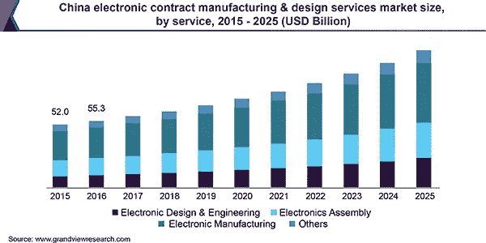

# 到 2025 年，电子合同制造和设计服务市场价值将达到 6580 亿美元

> 原文：<https://medium.datadriveninvestor.com/electronic-contract-manufacturing-design-services-market-34610bef19f0?source=collection_archive---------14----------------------->

根据 Grand View Research，Inc .的一项新研究，全球 [**电子合同制造和设计服务市场**](https://www.grandviewresearch.com/industry-analysis/the-global-electronic-contract-manufacturing-services-market?utm_source=medium&utm_medium=referral&utm_campaign=Gaurav_Aug12_ict_ElectronicContractManufacturingandDesignServices_RD1&utm_content=Content) 的规模预计到 2025 年将达到 6580 亿美元，预测期内的 CAGR 为 7.9%。由于电子产品越来越复杂，原始设备制造商降低成本的压力越来越大，电子行业的竞争非常激烈。此外，产品生命周期的缩短增加了对更好的制造能力和相关服务的需求。为了实现同样的目标，原始设备制造商正在寻求合同制造商的支持，从而在预测期内推动市场。

Electronic Contract Manufacturing & Design Services Market

OEM 与电子制造服务(EMs)公司签订分包合同，并受益于他们在设计、制造和供应链管理方面的专业知识。此外，初始投资的减少和运营效率的提高使原始设备制造商能够专注于他们的核心竞争力。这导致原始设备制造商对电子合同制造和设计服务的需求激增。此外，建立内部制造单位是大多数原始设备制造商面临的主要挑战。因此，外包是一个更好的选择，以跟上日益激烈的竞争。

 [## 2019 年即将改变世界的技术|数据驱动的投资者

### 很难想象一项技术会像去年的区块链一样受到如此多的关注，但是……

www.datadriveninvestor.com](https://www.datadriveninvestor.com/2019/01/17/the-technologies-poised-to-change-the-world-in-2019/) 

由于医疗保健、航空航天和国防、IT 和电信以及汽车等终端行业的需求不断增长，预计该市场将出现显著增长。由于对医疗设备的需求不断增长，医疗保健行业有望实现大幅增长。制造设施对优化资源和技术发展的需求激增，导致最终用途行业越来越多地采用环管系统。

**如需索取该报告的样本或查看其摘要，请点击以下链接:**[**https://www . grandviewresearch . com/industry-analysis/the-global-electronic-contract-manufacturing-services-market**](https://www.grandviewresearch.com/industry-analysis/the-global-electronic-contract-manufacturing-services-market?utm_source=medium&utm_medium=referral&utm_campaign=Gaurav_Aug12_ict_ElectronicContractManufacturingandDesignServices_RD2&utm_content=Content)

**该研究的进一步关键发现表明:**

*   由于对资源优化的需求不断增长以及制造技术的不断发展，预计 2019 年至 2025 年电子合同制造和设计服务市场的 CAGR 将达到 7.9%
*   在服务的基础上，2018 年电子制造板块占据了最大的市场份额。然而，由于原始设备制造商越来越倾向于外包制造和设计服务，电子设计和工程服务预计将在预测期内实现高速增长
*   根据最终用途，IT 和电信部门在 2018 年占据了主要的收入份额。然而，在预测期内，医疗保健、汽车、航空航天和国防等非技术行业预计将出现显著增长，因为这些行业的外包趋势不断上升
*   亚太地区占 2018 年总收入的 40%以上，由于该地区原材料的高可用性和低成本劳动力，预计将在预测期内主导市场
*   鸿海精密工业股份有限公司；伟创力国际有限公司；捷普电路公司；Sanmina 公司；和 Benchmark Electronics，Inc .是 2018 年占据重要份额的一些主要市场参与者。

**查看更多此类报道:** 

****关于大观研究:****

**Grand View Research，Inc .是一家总部位于美国的市场研究和咨询公司，在加利福尼亚州注册，总部位于旧金山。该公司提供联合研究报告、定制研究报告和咨询服务。为了帮助客户做出明智的商业决策，我们提供市场情报研究，确保从技术到化学品、材料和医疗保健等一系列行业的相关和基于事实的研究。**