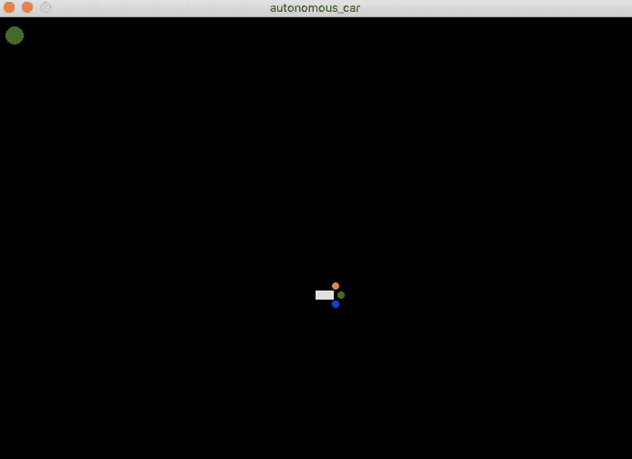

# 强化学习-II

> 原文：<https://medium.datadriveninvestor.com/elixir-e-reinforcement-learning-ii-6e55f7e85cfa?source=collection_archive---------8----------------------->

在项目的[第 1 集](https://medium.com/@marceloreichert/elixir-e-reinforcement-learning-i-3ecd9399d03c)中，我们安装了仙丹和 Scenic。现在我们将使用场景来创建汽车。


The Car

## 环境

Scenic 使用`/lib/scenes`目录来存储场景文件。因此，让我们创建一个新的`environment.ex`文件来创建我们的环境。

```
##lib/scenes/environment.exdefmodule AutonomousCar.Scene.Environment do
  use Scenic.Scene
  require Logger alias Scenic.Graph
  alias Scenic.ViewPort import Scenic.Primitives def init(_arg, opts) do
    ## Initialize environment

    # PID da ViewPort
    viewport = opts[:viewport] # Initialize the graph
    graph = Graph.build(theme: :dark) # Calculate ViewPort width and height
    {:ok, %ViewPort.Status{size: {viewport_width, viewport_height}}} = ViewPort.info(viewport) # Initial car pos
    {pos_x, pos_y} = { trunc(viewport_width / 2), trunc(viewport_height / 2)} state = %{
      viewport: viewport,
      viewport_width: viewport_width,
      viewport_height: viewport_height,
      graph: graph
    } {:ok, state, push: graph} end
end
```

在`init/2`方法中，我们将初始化环境和对象。

[](https://www.datadriveninvestor.com/2019/03/03/editors-pick-5-machine-learning-books/) [## DDI 编辑推荐:5 本让你从新手变成专家的机器学习书籍|数据驱动…

### 机器学习行业的蓬勃发展重新引起了人们对人工智能的兴趣

www.datadriveninvestor.com](https://www.datadriveninvestor.com/2019/03/03/editors-pick-5-machine-learning-books/) 

最初，我们寻找由 Scenic 创建的 ViewPort #PID，并启动了允许我们向 ViewPort 发送图形的`graph`变量。地图`state` 将存储我们环境中物体的状态，比如汽车、道路、障碍物和我们决定添加的任何东西。

我们需要更改设置 default_scene 变量的`config.exs`文件:`{AutonomousCar.Scene.Home}`，并将其更改为新的`environment.ex`文件。配置变量将如下所示:

```
config :autonomous_car, :viewport, %{
  name: :main_viewport,
  size: {700, 600},
  default_scene: {AutonomousCar.Scene.Environment, nil},
  drivers: [
    %{
     module: Scenic.Driver.Glfw,
     name: :glfw,
     opts: [resizeable: false, title: “autonomous_car”]
    }
  ]
}
```

现在运行项目`iex -S mix`，将会有一个黑屏和准备添加新对象的环境。

## 最后，汽车

好了，现在让我们在环境中创建汽车。让我们在`state`内定义一下，我们车的信息。让我们创建地图对象和里面的地图汽车。

```
objects: %{
  car: %{
    dimension: %{ width: 20, height: 10},
    coords: {pos_x, pos_y},
    velocity: {1, 0},
    angle: 0,
    sensor: %{
      left: {0, 0},
      center: {0, 0},
      right: {0, 0}
    }
  }
}
```

请注意，我们的汽车前面将有 3 个传感器来识别障碍，这些信息将被传递给我们的 RL，以定义必须采取的行动来达到目标。我们还将存储角度、速度和当前位置。

一旦设置了汽车信息，我们将在环境中创建它。我们需要为此创建一个新函数，我们称之为`draw_objects`。该函数将负责绘制地图`objects: %{}`中定义的所有对象。

`draw_objects/2`函数将获得图形和我们的对象图。让我们使用`[Enum.reduce](https://hexdocs.pm/elixir/Enum.html#reduce/2)`通过添加到图形来调用每个对象，将结果传递给屏幕上每个对象的`draw_object/3`函数。

```
## lib/scenes/environment.exdefp draw_objects(graph, object_map) do
  Enum.reduce(object_map, graph, fn {object_type, object_data}, graph ->
 draw_object(graph, object_type, object_data)
 end)
enddefp draw_object(graph, :car, data) do
  {sensor_center_x, sensor_center_y} = data.sensor.center
  {sensor_right_x, sensor_right_y} = data.sensor.right
  {sensor_left_x, sensor_left_y} = data.sensor.left %{width: width, height: height} = data.dimension {x, y} = data.coords angle_radians = data.angle |> Vector2.degrees_to_radians new_graph =
    graph
    |> group(fn(g) ->
      g
      |> rect({width, height}, [fill: :white, translate: {x, y}])
      |> circle(4, fill: :red, translate: {x + 22, y - 5}, id: :sensor_left)
      |> circle(4, fill: :green, translate: {x + 28, y + 5}, id: :sensor_center)
      |> circle(4, fill: :blue, translate: {x + 22, y + 15}, id: :sensor_right)
    end, rotate: angle_radians, pin: {x, y}, id: :car)
end
```

我们仍然需要为我们的汽车定义更多的功能。我们将汽车角度存储在`%{objects: %{car: %{angle: 0}}}`范围内，单位为度。但是 Scenic 使用弧度表示角度，所以我们需要一个函数将角度转换成弧度。让我们在`/lib`中创建一个名为`math`的新目录，并在该目录中创建一个新的`vector2.ex`文件。

```
## lib/math/vector2.exdefmodule AutonomousCar.Math.Vector2 do
  import Math def degrees_to_radians(angle) do
    angle * (Math.pi / 180)
  end
end
```

为了导入`Math`，我们需要将它作为一个依赖`{:math, "~> 0.3.0}`包含在`mix.exs`中。

```
## mix.exsdefp deps do
 [
   {:scenic, “~> 0.10”},
   {:scenic_driver_glfw, “~> 0.10”},
   {:math, “~> 0.3.0”},
 ]
 end
```

在控制台中运行`mix deps.get`来更新依赖关系。

好了，现在我们只需要在`environment.ex`文件的开头添加一个别名`alias AutonomousCar.Math.Vector2`，并调用 init / 2 中的`draw_objects/2`函数，传递图形和对象，将其放在 map 状态之后。

```
## lib/scenes/environment.exgraph = draw_objects(graph, state.objects)
```

## 目标

现在我们也可以画出赛车的最终目标，RL 应该关注的地方。让我们在地图`objects`中添加一个名为`goal`的物体和坐标。

```
objects: %{
  car: %{
    dimension: %{ width: 20, height: 10},
    coords: {pos_x, pos_y},
    velocity: {1, 0},
    angle: 0,
    sensor: %{
      left: {0, 0},
      center: {0, 0},
      right: {0, 0}
    }
  }, 
  goal: %{coords: {20,20}}
}
```

让我们也创建一个新的`draw_objects/3`函数来绘制新的目标对象。

```
## lib/scenes/environment.exdefp draw_object(graph, :goal, data) do
 %{coords: coords} = data
 graph
 |> circle(10, fill: :green, translate: coords)
end
```

现在通过运行命令`iex -S mix`，我们有了一辆白色的汽车，3 个传感器和画在屏幕上的绿色目标。



好的，在环境中设计的汽车，我们需要让它移动并且能够控制方向和角度。但那是为了下一集的[。](https://medium.com/@marceloreichert/elixir-and-reinforcement-learning-iii-4e7a18b6dd4f)