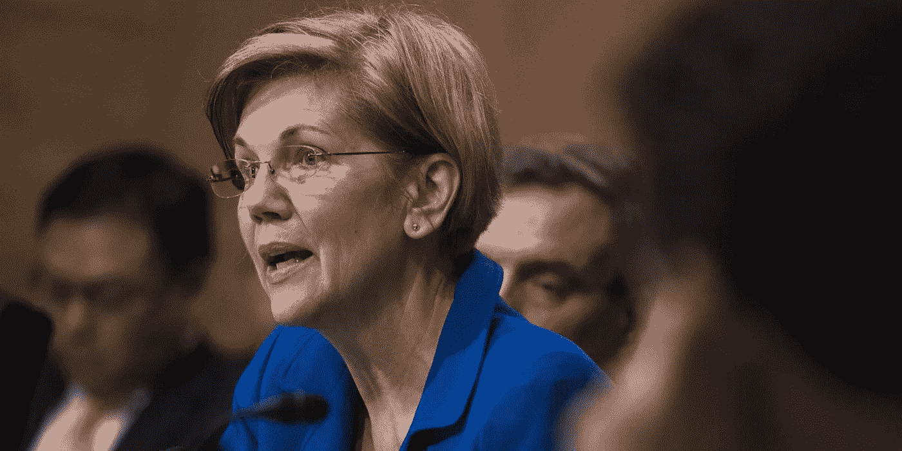

# 伊丽莎白·沃伦、大型科技和美国反垄断法的历史

> 原文：<https://medium.datadriveninvestor.com/elizabeth-warren-antitrust-reform-and-big-tech-305afbdaee0e?source=collection_archive---------8----------------------->

Photo: Tom Williams/CQ Roll Call/AP

上周，民主党总统候选人、马萨诸塞州参议员伊丽莎白·沃伦发布了一项计划，旨在“打破”脸书、谷歌和亚马逊日益增长的垄断。在书中，她认为今天的大型科技公司已经积累了对我们的经济、民主和社会的巨大影响力，它们用这些影响力来消除竞争、扼杀创新和影响决策者。为了解决大型科技公司的权力积累和反竞争行为，沃伦呼吁制定新的立法来监管大型科技平台，并任命联邦监管机构来执行我们的反垄断法，并追溯性地终止反竞争合并。

 [## 大科技很抱歉！-数据驱动型投资者

### 大科技很抱歉。在几十年来很少为任何事情道歉之后，硅谷似乎突然开始道歉了…

www.datadriveninvestor.com](https://www.datadriveninvestor.com/2018/06/17/big-tech-is-sorry/) 

自发布以来，沃伦的计划已成为公众讨论的话题。可以预见的是，科技行业的盟友们认为沃伦的[主张是错误的](https://www.washingtonexaminer.com/opinion/3-reasons-elizabeth-warrens-tech-giant-breakup-plan-is-idiotic)，她的计划将[最终伤害消费者和科技行业](https://www.washingtonpost.com/opinions/2019/03/08/why-break-up-big-tech-will-work-better-warren-campaign-theme-than-an-actual-policy/?utm_term=.252044ae9346)。在学术界和法律界，沃伦的计划得到了褒贬不一的评价。纽约大学法学院贸易法规教授 Elane Fox 对沃伦的想法表示赞赏；然而，她也警告说，由于我们的法院对反垄断法的保守解释，他们可能不容易实施。另一方面，哥伦比亚大学教授兼反垄断学者 Tim Wu 支持沃伦关于追溯撤销有问题的合并的呼吁。

沃伦的计划并不完美；然而，她呼吁加强对大型科技公司的审查是正确的。多年来，大型科技公司通过违反我国竞争法精神的策略积聚了权力和利润。是时候让这些公司为他们的行为承担真正的后果了。

# 美国反托拉斯法的历史

1890 年，国会通过了《谢尔曼反托拉斯法》,以解决托拉斯带来的问题，其中包括消除竞争、排除在贸易和商业之外、价格高、生产有限、财富分配不均以及其他形式的明显的经济压迫。《谢尔曼法案》采用了普通法的语言，而不是起草专门针对托拉斯的法律。为此，该法第 1 节禁止"限制几个州之间或与外国之间的贸易或商业的任何合同、信托或其他形式的联合或共谋。"同时，该法第 2 节规定,"垄断或试图垄断，或与任何其他人联合或共谋垄断贸易或商业的任何部分"是非法的。"

根据 [Wayne Collins](https://ir.lawnet.fordham.edu/flr/vol81/iss5/7/) 和 [Barak Orbach](https://poseidon01.ssrn.com/delivery.php?ID=158006120027099093065117127119097023022073004041071075072105109101110065002122075099004009106006041043008020122088080004120121027034008006040080019022025001124072073016004070110091000101124080004088001003086068116112022065099081066113082029070021074&EXT=pdf) 的说法,《谢尔曼法案》的制定者使用普通法术语有两个原因:首先，它使联邦法院能够将保护公平贸易竞争的普通法原则应用于反竞争商业活动。其次，普通法程序授权联邦法院调整反垄断判例，以适应我们对经济学的理解以及新兴商业实践的变化。

随着时间的推移，我们对反垄断法的理解发生了重大变化。从 19 世纪 90 年代到 19 世纪 60 年代，最高法院不断承认保护竞争是反托拉斯法的最终目标。然而，在 20 世纪 60 年代和 70 年代，由于 [Robert Bork 对反垄断法的批评，这一想法失去了主流支持](https://poseidon01.ssrn.com/delivery.php?ID=696117021029087084115114102084123092003022059077010067123121073126081081018090011124055045059003055045042126118014023005127098061052089087080013090095007029002007052011024125100112097024103103099119088001071094094029066014091111109003119031115083114&EXT=pdf)。在**反垄断悖论、*他的最著名的反垄断法理学批判、博克驳斥了反垄断法中竞争的效用。相反，他认为《谢尔曼法案》的立法历史“显示了促进消费者福利的明确而排他的政策意图。”对博克来说，消费者福利意味着分配效率；然而，这个短语的通俗含义仅仅是指购买者从商品和服务的消费中获得的利益。*

*没过多久，博克的想法就传到了最高法院。1979 年，在 Reiter 诉 Sonotone 一案中，联邦政府提交了一份法庭之友辩护状，称“谢尔曼法案的主要目的是保护消费者。”为了支持他们的立场，政府精心挑选了国会记录中关于消费者和价格的引用。最终，最高法院采纳了政府的主张，宣布“国会将《谢尔曼法案》设计成一个‘消费者福利处方’。"*

# *大型科技和当前的反垄断框架*

*自从最高法院在 Reiter 案中做出裁决以来，美国竞争法的目标一直是促进“消费者福利”然而，我们目前的“消费者福利”方法并不能充分解决大技术带来的独特问题。*

*大型科技公司通过各种反竞争行为，包括收购现有或潜在的竞争对手，一直保持着对竞争对手的优势。这方面最好的例子是脸书收购 Instagram，这加强了脸书对社交媒体的控制。如果没有 Instagram，脸书控制了大约 42%的社交媒体网络市场。有了 Instagram，它的市场份额从 42%跃升至 59%。如果你需要进一步证明脸书的主导地位，只需看看周三脸书-Instagram-Whatsapp 服务中断后引发的混乱和喧嚣。此外，亚马逊控制了大约 50%的电子商务市场，并收购了该领域的几个竞争对手，包括 Zappos 和 Diapers.com。*

*大型科技公司也通过在其平台上削弱竞争对手来维持自己的地位和权力。近年来，谷歌被指控偏袒自己的搜索结果，并删除竞争对手的内容，包括 Yelp 和猫途鹰。据报道，当这些公司投诉时，谷歌威胁要将它们从搜索结果中完全删除。*

*亚马逊长期以来一直使用无情的掠夺性定价策略来消除竞争。亚马逊通过降价销售纸质书和电子书来主导图书市场。同样，亚马逊通过降低婴儿护理产品的价格削弱了 Diapers.com，实际上迫使该公司向亚马逊出售产品。此外，该公司通过制造自己版本的受欢迎和有利可图的产品，并以较低的价格提供这些产品，在市场上削弱了第三方卖家。和谷歌一样，亚马逊也被指责偏爱自己的产品，而不是第三方产品。*

*多年来，亚马逊、谷歌和脸书在很大程度上避开了联邦监管机构的约束，因为消费者从这些商品和服务中获得了直接利益，包括低价和更高的效率。换句话说，尽管这些公司有反竞争行为，但它们能够满足消费者福利标准。*

*总而言之，大型科技公司能够避免反垄断审查，同时通过反竞争策略积聚巨大的权力和财富，这显然表明需要进行法律改革。幸运的是，我们的反垄断法允许法院调整当前的框架。*

**注:用来分析脸书在社交媒体市场的统治地位的市场份额计算是我自己的。我非常乐意根据要求提供有关我的计算的进一步信息。**