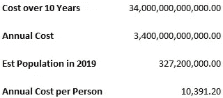
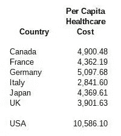

# 伊丽莎白·沃伦无法回答“全民医保”是否会导致中产阶级增税

> 原文：<https://medium.datadriveninvestor.com/elizabeth-warren-cant-answer-whether-medicare-for-all-will-cause-middle-class-tax-increases-718a9cb25edc?source=collection_archive---------9----------------------->

沃伦参议员不回答这个问题的事实证明她是诚实的，应该成为我们的总统。

Photo by [Priscilla Gyamfi](https://unsplash.com/@priscillag?utm_source=medium&utm_medium=referral) on [Unsplash](https://unsplash.com?utm_source=medium&utm_medium=referral)

早在 2004-2005 年，我就知道了参议员沃伦。我是消费者破产律师。她是哈佛大学的破产教授。全国消费者破产律师协会(NACBA)和全国消费者权益倡导者协会(NACA)正在与伊丽莎白·沃伦合作，反对 2005 年的《破产滥用预防和消费者保护法》(BAPCPA)。BAPCPA 的问题是，尽管该法案的名称如此，但法案的作者(贷款人的说客)忘记将任何消费者保护措施纳入法案。

在与消费者债务人打交道多年后，人们不禁意识到该体系对中产阶级和穷人的不利程度。在从事这一领域的工作之前，我曾是一名共和党人。伊丽莎白·沃伦曾是共和党人。站在对抗肆无忌惮的贷款人的第一线，看看到底发生了什么，几乎任何一个共和党人都会变成进步的民主党人。虽然我仍未完全与民主党结盟，但我肯定不是共和党人。在大多数问题上，我绝对是一个进步人士，尤其是在经济问题上。

 [## 保护主义、政治和经济动荡|数据驱动的投资者

### 美国股市昨日出现 400 多点的大幅反转，为未来的事情发出了警告信号。市场…

www.datadriveninvestor.com](https://www.datadriveninvestor.com/2018/06/28/protectionism-politics-economic-turmoil/) 

在继续之前，我要指出，我与参议员沃伦的竞选活动没有任何关系，当然也不能代表参议员发言。我对这个故事的推测是基于我对沃伦参议员立场的分析。

当被问及是否会增加中产阶级的税收时，参议员沃伦总是说“全民医保”会降低成本。虽然我不能代表参议员发言，但我想我可以解释一下她为什么采取这种立场。沃伦参议员是个诚实的人。她不想重蹈奥巴马总统的覆辙，他说，“你可以留住你的医生。”我认为她不会说她没有把握的话。如果她不能通过财富税，也不能提高高收入者的边际税率，中产阶级的税收可能会增加。中产阶级的税收是否会增加并不重要。如果一个中产阶级的人看到他们的税收每年增加 2，500.00 美元，但他们的医疗保险费用每年减少 5，000.00 美元，中产阶级纳税人会很高兴。假设的纳税人每年节省 2，500.00 美元的事实对纳税人来说是最重要的。你能想象如果参议员沃伦说，“中产阶级的税收将会增加吗？”她会没完没了地说她的计划会增加中产阶级的税收。这些原话忽略了这样一个事实，即中产阶级将从成本节约中获得更多的钱。

不管“全民医保”是如何支付的，它都将是中产阶级纳税人的净成本节约。“全民医保”将降低医疗成本，因为所有医疗费用都由单一支付者支付。这相当于只有一个客户的企业。如果一个企业只有一个顾客，那么这个企业将不得不在价格上满足顾客的需求，否则就会倒闭。当然，另一方面是，如果客户要求的价格太低，企业将不得不付钱为客户工作。在这种情况下，企业宁愿停业。事实是，双方将达成令买卖双方都满意的协议价格。我们现在拥有的系统，允许卖方获得荒谬的利润(以买方/患者为代价)。政府为公众利益而工作，因此对“全民医保”的实施有着强烈的兴趣。

最近，联邦基金和城市研究所报告称，最昂贵的“全民医保”将在十年内耗资 34 万亿美元。参见城市研究所网站上的[这篇报道](https://www.urban.org/research/publication/incremental-comprehensive-health-reform-how-various-reform-options-compare-coverage-and-costs)。我不知道城市研究所，但我熟悉联邦基金，我相信他们的数字。这听起来太多了，对吗？如果你不看数字，甚至不看研究总结，这听起来只是很多。为了更好地了解这些数字，请参见下表。

因此，十年后，我们的人均医疗保健费用将达到 10，391.20 美元。这个增长率做出了错误的假设，即未来十年人口不会增长。人口将会增加，因此，10，391.20 美元这个数字很高。超过 10，000.00 美元是一大笔钱，对吗？答案是，对大多数国家来说，这是一大笔钱，但对美国来说不是！请参见下表:

这表明，未来 10 年个人支付的 34 万亿美元将少于我们现在支付的金额。这些计算没有考虑到单一支付者体系所带来的议价能力的节省。看看这些国家的人均支出与我们美国人的人均支出相比是多少。英国和意大利的社会主义制度比加拿大更强。日本的系统很难与其他系统相比。法国和德国使用两级全民医疗体系。

我更喜欢从英国的完全社会主义制度开始。英国的系统与加拿大的系统非常不同。在加拿大，政府支付大部分医疗费用。在加拿大，医护人员不是政府雇员。在英国，几乎所有的医疗保健专业人员都为政府工作。在 10-20 年内，当美国的医疗保健文化从我们现在的“贪婪文化”过渡到“同情文化”时，我希望看到一种远离英国式体系的变化。在“全民医疗保险”的基础上，我更希望美国向法国和/或德国类型的系统发展。大约 30 年后，美国将拥有世界上最好的医疗体系，而不是发达经济体中最差的体系。我们也将为每个人支付不到一半的费用。

参议员沃伦无法诚实地回答“全民医保”是否会导致中产阶级税收增加的问题，因为她不知道她为“全民医保”买单的税收提案是否会通过。她可以诚实地回答这样一个问题:根据我上面给出的数字，在‘全民医保’体系下，中产阶级纳税人的总体成本会更低。为什么会有人认为所有这些其他国家的人均收入都比美国低得多，而美国却不能？人们是否认为这些国家提供的医疗保健较少？数据并不一致，因为这些其他国家都比美国提供更好的医疗保健。见我的故事，*其他国家的社会化医疗指南和美国医疗保健系统的比较*了解更多关于美国人更好的医疗保健。我在这个故事的底部添加了一个链接。这篇报道讨论了其他国家的“等待时间”等问题。

我喜欢伊丽莎白·沃伦有很多原因。我不同意她的每一个立场，但我比任何其他候选人都更同意她。此外，我认为她有“性格”，因为她多年来一直在争取消费者。我相信她不会回答“全民医保”是否会增加中产阶级税收的问题，但这将降低成本，这是对她诚实的证明。显然，她更希望对高收入/高财富纳税人征税，但如果不实施这些税收，可能必须增加中产阶级的税收。再说一次，即使提高税收，中产阶级仍会有净储蓄。

人们必须记住，如果参议员沃伦成为总统，她仍将不得不与国会打交道。她不会成为独裁者，也没有人希望她成为独裁者。美国有一个三权分立的制度，沃伦参议员知道这一点。我毫不怀疑“全民医保”将是她的标志性议题——它将排在所有问题之前。然后，税收计划将被制定。“全民医保”将是一场可能耗尽她任期的斗争。希望它能像奥巴马医改那样很快通过，这样她就可以利用她的授权来解决税收问题。

 [## 其他国家公费医疗指南及与美国医疗保健的比较…

### 下一轮民主党总统候选人辩论将于周二晚上开始，“医疗保健”将是一个关键话题。

medium.com](https://medium.com/swlh/a-guide-to-socialized-medicine-in-other-countries-and-a-comparison-to-the-american-healthcare-f9450804c3ed)