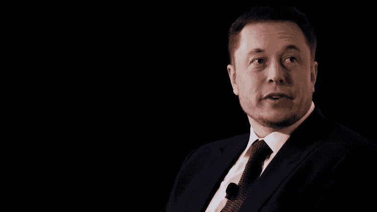

# 埃隆:不要改变——我的速战速决

> 原文：<https://medium.datadriveninvestor.com/elon-dont-change-my-quick-take-f0fda4feb287?source=collection_archive---------24----------------------->

# 埃隆·马斯克的乔·罗根播客之后的头条新闻被荒谬地误导了。就像，冒犯性的错误。

我是说，我明白。一位上市公司首席执行官进行非常规的长篇播客是罕见的。一个公众 CEO 去做一个非常规的长篇播客，带着他的喷火器，喝着威士忌，抽着钝器，这是……这从来没有发生过。

但是伙计们，是埃隆·马斯克。除非美国证券交易委员会(SEC)的规定，或许还有物理定律，否则没人敢和埃隆作对。我的看法是:如果华尔街的交易员真的听完了这个 2 小时 45 分钟的播客，他们会让 Telsa 的股票飙升。

播客强调了我们很少从公司领导那里得到的东西:真诚的观点。我们需要公共 CEO 们更关心创新、创造力和制造令人敬畏的产品，而不是关注利润率、利润和 90 天的目标。想想有多少创新因为公司每 90 天关心一次股价而受阻。想想吧。数百年来——我们应该走得更远。

除了参与《乔·罗根的世界》的头条新闻，埃隆还强调了制造真正令人敬畏的产品的重要性。他提到，没有多少(如果有的话)产品让我们感到兴奋，鼓舞人心。

他和他的工程师们甚至在新款特斯拉汽车上设计了秘密的“模式”，其中一种模式可以让汽车随着西伯利亚交响乐团起舞。他提到他们如何设计新的控制屏幕来玩旧的 Artari 游戏，这样你就可以在汽车自动驾驶时玩视频游戏。

他谈到了电动汽车的科学，以及它如何使电动汽车比汽油发动机更安全。如果人们没有开特斯拉，他们会怎么死。

在特斯拉演讲后，他广泛地提到了刑事司法系统，以及他是如何坚定地相信法官和正义的——当然有坏人存在，但绝大多数人都做了真正令人尊敬的工作。他谈到了空中旅行和传统飞机的重新设计&提到的话题包括:气候变化和需要改变什么，人工智能(赞成和反对)，政治官员对监管的影响，社交媒体以及它如何扭曲我们对他人的看法，等等。

罗根向他强调他是多么与众不同。“你知道你就像一个外星人，你有很多人没有的能力，对吗？”埃隆没有确切证实这一点，但他提到当他还是个孩子时，他害怕被“带走”，因为他与同龄人太不一样了(暗示《哈利·波特》中的汤姆·里德尔，当他在孤儿院被描绘时，他告诉邓布利多“我可以让坏事发生在对我不好的人身上”lol)。

对于一个公众 CEO 来说，参与到我们的文化和社会中来，这是一件积极的事情——我们需要更多。我们需要拥抱这样的人——而不是让他们遵循荒谬的华尔街标准——我们需要创新者，我们需要创造者，而不仅仅是那些创造“股东价值”的人

对媒体、卖空者、怀疑者——埃隆和他这样的人正在改变世界——不要因为他们与众不同而讨厌他们——当然也不要因为你不了解他们而讨厌他们。他们不按你的规则行事，也永远不会。

-nf