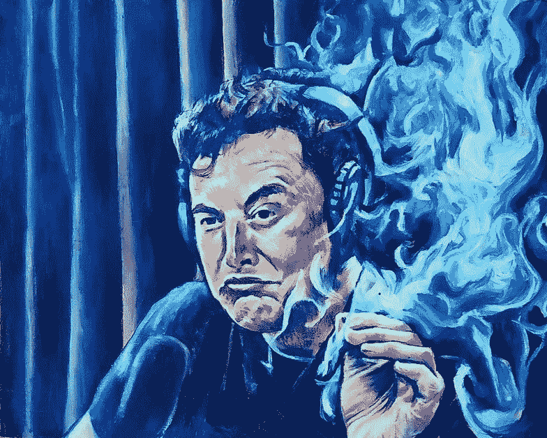

# 埃隆·马斯克:打造能带来快乐的产品

> 原文：<https://medium.datadriveninvestor.com/elon-musk-build-products-that-bring-joy-835143e13552?source=collection_archive---------19----------------------->

source: seamuswray Instagram [https://www.instagram.com/p/BntZqHyn6oX](https://www.instagram.com/p/BntZqHyn6oX/?utm_source=ig_web_button_share_sheet)

如果你看看埃隆·马斯克对乔·罗根长达两个半小时的史诗般采访的结果，你会认为他们所做的一切就是抽烟喝酒。虽然谈话的范围从人工智能到苏格兰威士忌，但还是有一些强有力的见解。

当乔问及埃隆开创的广泛业务以及将这些业务联系在一起的原因时，他说了类似这样的话:“我只想打造产品，让未来比过去更好”。

虽然这与我在博客文章“[如何成为下一个埃隆·马斯克](https://hellofuture.co/you-could-be-elon-musk/)”中对埃隆的评价相差不远，但他也在此之后说了一些真正打动我的话。当提到他的“喷火器”时，他反复说“不是喷火器”和“这是一种没有人应该买的坏产品”，他说:

“我喜欢制造能带来快乐的产品。这种情况很少。”他伤感地说。

他接着描述了特斯拉编程中的一个复活节彩蛋，它让汽车跳舞并演奏“来自西伯利亚交响乐团的冬季 T4 巫师”。

the original

起初，我想为什么不呢，这辆车本身有两个马达，可能还有四个独立的轮子，通过合适的软件，你可以让它像长洲未来一样在溜冰场上滑行。虽然真正的舞蹈比我想象的要简单得多，但仍然很有趣。

我们花了太多的时间来设想新产品和服务，以提高我们的底线，简单地解决客户的问题，而没有进一步取悦客户或帮助他们获得竞争优势。我们花在产品和服务上的时间太少了，或者仅仅是为了娱乐而创造。

埃隆经常这么做。他不仅设想和制造酷的新的前瞻性产品，而且乐在其中。我们需要把有趣和简单的快乐带回我们的生活。

试试这个:不要把你的下一次构思会议的重点放在建立更多的利润或解决现有的问题上，而是把注意力放在乐趣上。你如何给顾客的生活带来更多快乐？你能想象出什么样的产品可以做到这一点？对埃隆来说，他们是帽子、T2、喷火器和 T4 砖块。你能做些什么来给你的产品或顾客体验带来乐趣？

如果你从事金融服务，你如何让“买单”变得有趣？也许把它变成一个电子游戏，当钞票向你扑来时，你可以像 Galaga 一样“消灭”它们。

如果你从事零售业，你如何让购买卫生纸变得有趣？也许可以发起一场“TP 竞赛”，让你的顾客可以争分夺秒，如果他们能在一定时间内从起跑线到达商店的卫生纸位置并返回，就可以赢得一包免费卫生纸。为了安全，你甚至可以封锁这条路线。人们会想知道发生了什么，然后当他们看到人们手里拿着一包 Charmin 在拐角处狂奔向终点线。

如果你正在开发应用程序，那就多做一点，加入一些有趣、游戏化的元素，甚至是一点点“荒谬的接触”，让你的客户开怀大笑。就像这样:许多基于聊天的界面现在提供了“自动回复”提示，我几乎 100%确定他们添加了至少一个“通配符”来搞笑。有一天，我儿子正在处理一些东西，把它们放在外面一棵树旁，树上有一个“免费”的标志。他在 Skype 聊天上被问到，“如果把它放在树附近，我们还能去掉什么”，其中一个自动回复选项是“你的灵魂”。

我不知道这是一个人类程序员还是人工智能(这很奇怪)，但这很有趣。

埃隆完全正确:我们需要制造更多能带来快乐的产品。

加入我们的想法，我们也许能让这个世界变得更快乐。

— -

图片来源: [seamuswray instagram](https://www.instagram.com/p/BntZqHyn6oX/)